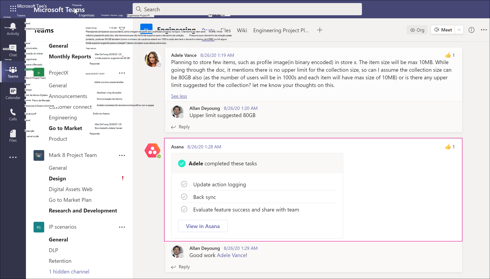

# <a name="conduct-an-ediscovery-investigation-of-content-in-microsoft-teams"></a>Conduzir uma investigação de Descoberta Eletrônica de conteúdo no Microsoft Teams

Grandes empresas geralmente são expostas a processos legais de alta penalidade que exigem o envio de todas as Informações Armazenadas Eletronicamente (ESI). O conteúdo do Microsoft Teams pode ser pesquisado e usado durante investigações de Descoberta Eletrônica.

## <a name="overview"></a>Visão geral

Todos os chats do Microsoft Teams 1:1 ou em grupo são diários nas caixas de correio dos respectivos usuários. Todas as mensagens de canal padrão são registradas no diário na caixa de correio do grupo que representa a equipe. Os arquivos carregados em canais padrão são abordados na funcionalidade de Descoberta Eletrônica do SharePoint Online e OneDrive for Business.

A Descoberta Eletrônica de mensagens e arquivos em [canais privados](private-channels.md) funciona de maneira diferente dos canais padrão. Para saber mais, confira [a Descoberta Eletrônica de canais privados](#ediscovery-of-private-and-shared-channels).

Nem todo o conteúdo do Teams é Descoberta Eletrônica. A tabela a seguir mostra os tipos de conteúdo que você pode pesquisar usando as ferramentas de Descoberta Eletrônica da Microsoft:

|**Tipo de conteúdo**|**Anotações**|
|:---------------|:--------|
|Gravações de áudio||
|Conteúdo do cartão|Consulte [Pesquisar conteúdo de cartão](#search-for-card-content) para obter mais informações.|
|Links de chat||
|Mensagens de chat|Isso inclui conteúdo em canais padrão do Teams, chats 1:1, chats em grupo 1:N e chats com participantes do usuário convidado.|
|Snippets de código||
|Mensagens editadas|Se o usuário estiver em espera, as versões anteriores das mensagens editadas também serão preservadas.|
|Emojis, GIFs e adesivos||
|Imagens embutidas||
|Componentes de loop|O conteúdo em um componente de loop é salvo em um arquivo .fluid armazenado na conta OneDrive for Business do usuário que envia o componente de loop. Isso significa que você precisa incluir o OneDrive como uma fonte de dados ao pesquisar conteúdo em componentes de loop.|
|Conversas de mensagens instantâneas de reunião||
|Metadados<sup>de reunião 1</sup>||
|Nome do canal||
|Citações|O conteúdo entre aspas é pesquisável. No entanto, os resultados da pesquisa não indicam que o conteúdo foi citado.|
|Reações (como likes, hearts e outras reações)|Há suporte para reações para todos os clientes comerciais após 1º de junho de 2022. As reações antes dessa data não estão disponíveis para a Descoberta Eletrônica. O suporte à nuvem do governo está planejado. Não há suporte legal para reações.|
|Assunto||
|Tabelas||
|Clipe de Vídeo do Teams (TVC)|Pesquise TVC com a palavra-chave "Video-Clip" e "salve como" um arquivo .mp4 para cada anexo TVC clicando com o botão direito do mouse na visualização (a pesquisa por palavra-chave estará disponível em outubro de 2022). Os dados do TVC são detectáveis em conjuntos de revisão de [Descoberta Eletrônica](/microsoft-365/compliance/add-data-to-review-set).

<sup>1</sup> Os metadados de reunião (e chamada) incluem o seguinte:

- Hora de início e término da reunião e duração
- Ingressar na reunião e deixar eventos para cada participante
- Junções/chamadas VOIP
- Junções anônimas
- Junções de usuário federado
- Junções de usuário convidado

Aqui está um exemplo de uma conversa de chat entre os participantes durante uma reunião.


Aqui está um exemplo da cópia de conformidade da mesma conversa de chat exibida em uma ferramenta de Descoberta Eletrônica.


Aqui está um exemplo dos metadados da reunião.


Para obter mais informações sobre como conduzir uma investigação de Descoberta Eletrônica, consulte [Introdução à Descoberta Eletrônica (Standard)](/microsoft-365/compliance/get-started-core-ediscovery).

Os dados do Microsoft Teams aparecerão como mensagens instantâneas ou conversas na saída de exportação da Descoberta Eletrônica do Excel. Você pode abrir o arquivo `.pst` no Outlook para exibir essas mensagens depois de exportá-las.

Ao exibir o arquivo .pst para a equipe, todas as conversas estão localizadas na pasta Chat da Equipe em Histórico da Conversa. O título da mensagem contém o nome da equipe e o nome do canal. Por exemplo, a imagem abaixo mostra uma mensagem de Bob que mensagem do canal padrão do Project 7 da equipe de Especificações de Fabricação.


Os chats privados na caixa de correio de um usuário são armazenados na pasta Chat de Equipe em Histórico de Conversas.

## <a name="ediscovery-of-private-and-shared-channels"></a>Descoberta Eletrônica de canais privados e compartilhados

Cópias de conformidade de mensagens em canais privados e compartilhados são enviadas para caixas de correio diferentes, dependendo do tipo de canal. Isso significa que você precisa pesquisar diferentes locais de caixa de correio com base no tipo de canal do qual um usuário é membro.

- **Canais privados**. As cópias de conformidade são enviadas para a caixa de correio de todos os membros dos membros do canal privado. Isso significa que você precisa pesquisar a caixa de correio do usuário ao pesquisar conteúdo em mensagens de canal privado.

- **Canais compartilhados**. Cópias de conformidade são enviadas para uma caixa de correio do sistema associada à equipe pai. Como o Teams não dá suporte a uma pesquisa de Descoberta Eletrônica de uma única caixa de correio do sistema para um canal compartilhado, você precisa pesquisar a caixa de correio da equipe pai (selecionando o nome da caixa de correio da equipe) ao pesquisar conteúdo de mensagem em canais compartilhados.

Cada canal privado e compartilhado tem seu próprio site do SharePoint separado do site de equipe pai. Isso significa que os arquivos em canais privados e compartilhados são armazenados em seu próprio site e gerenciados independentemente da equipe pai. Isso significa que você deve identificar e pesquisar o site específico associado a um canal ao pesquisar conteúdo em arquivos e anexos de mensagem de canal.

Use as seções a seguir para ajudar a identificar o canal privado ou compartilhado a ser incluído em sua pesquisa de Descoberta Eletrônica.

### <a name="identifying-the-members-of-a-private-channel"></a>Identificando os membros de um canal privado

Use o procedimento nesta seção para identificar membros de um canal privado para que você possa usar ferramentas de Descoberta Eletrônica para pesquisar conteúdo na caixa de correio do membro em mensagens de canal privado.

Antes de executar essas etapas, verifique se você tem a [versão mais recente do módulo PowerShell do Teams](teams-powershell-overview.md) instalada.

1. Execute o comando a seguir para obter a ID do grupo da equipe que contém os canais compartilhados que você deseja pesquisar.

   ```powershell
   Get-Team -DisplayName <display name of the the parent team>
   ```

   > [!TIP]
   > Execute o cmdlet **Get-Team** sem parâmetros para exibir uma lista de todos os Teams em sua organização. A lista contém a ID do grupo e DisplayName para cada equipe.

2. Execute o comando a seguir para obter uma lista de canais privados na equipe pai. Use a ID do grupo para a equipe que você obteve na etapa 1.

   ```PowerShell
    Get-TeamChannel -GroupId <parent team GroupId> -MembershipType Private
   ```

3. Execute o comando a seguir para obter uma lista de proprietários e membros de canal privado para um canal privado específico.

   ```PowerShell
    Get-TeamChannelUser -GroupId <parent team GroupId> -DisplayName "Partner Shared Channel"
   ```

4. Inclua as caixas de correio de proprietários e membros de um canal privado como parte de sua consulta de pesquisa de Descoberta Eletrônica na Descoberta Eletrônica [(Standard)](/microsoft-365/compliance/search-for-content-in-core-ediscovery) ou ao identificar e coletar conteúdo custodiante na Descoberta [Eletrônica (Premium)](/microsoft-365/compliance/add-custodians-to-case).

### <a name="identifying-the-sharepoint-site-for-private-and-shared-channels"></a>Identificando o site do SharePoint para canais privados e compartilhados

Conforme explicado anteriormente, os arquivos compartilhados em canais privados e compartilhados (e arquivos anexados a mensagens de canal) são armazenados no conjunto de sites associado ao canal. Use o procedimento nesta seção para identificar a URL do site associado a um canal privado ou compartilhado específico. Em seguida, você pode usar as ferramentas de Descoberta Eletrônica para pesquisar conteúdo no site.

Antes de executar essas etapas, [instale o Shell de Gerenciamento do SharePoint Online e conecte-se ao SharePoint Online](/powershell/sharepoint/sharepoint-online/connect-sharepoint-online).

1. Opcionalmente, execute o seguinte para obter uma lista de todos os conjuntos de sites do SharePoint associados a canais compartilhados na equipe pai.

   ```PowerShell
    Get-SPOSite
   ```

   > [!TIP]
   > A convenção de nomenclatura da URL para um site associado a canais privados e compartilhados é `[SharePoint domain]/sites/[Name of parent team]-[Name of private or shared channel]`. Por exemplo, a URL do canal compartilhado chamado "Colaboração de Parceiros", que está localizada na equipe pai da "Equipe de Engenheiros" na organização contoso é `https://contoso.sharepoint.com/sites/EngineeringTeam-PartnerCollaboration`.

2. Execute os comandos do PowerShell a seguir para exibir a URL de todos os sites do SharePoint associados aos canais privados e compartilhados em sua organização. A saída do script também inclui a ID de grupo da equipe pai, que você precisa executar os comandos na etapa 3.

    ```PowerShell
    $sites = Get-SPOSite -Template "TEAMCHANNEL#1"
    foreach ($site in $sites) {$x= Get-SPOSite -Identity $site.url -Detail; $x.relatedgroupID; $x.url}
    ```

   > [!NOTE]
   > Sites do SharePoint para canais privados criados antes de 28 de junho de 2021 usam `"TEAMCHANNEL#0"` o valor para a ID de modelo personalizado. Para exibir canais privados criados após essa data, use o valor `"TEAMCHANNEL#1"` ao executar os dois scripts anteriores. Os canais compartilhados usam apenas o valor de `"TEAMCHANNEL#1"`.

3. Para cada equipe pai, execute os seguintes comandos do PowerShell para identificar os sites de canal privado e compartilhado, `$groupID` onde está a ID do grupo da equipe pai.

    ```PowerShell
    $sites = Get-SPOSite -Template "TEAMCHANNEL#1"
    $groupID = "<group ID of parent team)"
    foreach ($site in $sites) {$x= Get-SpoSite -Identity $site.url -Detail; if ($x.RelatedGroupId -eq $groupID) {$x.RelatedGroupId;$x.url}}
    ```

4. Inclua o site associado a um canal privado ou compartilhado como parte de sua consulta de pesquisa de Descoberta Eletrônica na Descoberta Eletrônica [(Standard)](/microsoft-365/compliance/search-for-content-in-core-ediscovery) ou ao identificar e coletar conteúdo custodiante na Descoberta [Eletrônica (Premium)](/microsoft-365/compliance/add-custodians-to-case).

## <a name="search-for-content-for-guest-users"></a>Pesquisar conteúdo para usuários convidados

Você pode usar ferramentas de Descoberta Eletrônica para pesquisar conteúdo do Teams relacionado a usuários convidados em sua organização. O conteúdo de chat do Teams associado a um usuário convidado é preservado em um local de armazenamento baseado em nuvem e pode ser pesquisado para usar a Descoberta Eletrônica. Isso inclui a pesquisa de conteúdo em conversas de chat 1:1 e 1:N em que um usuário convidado é um participante com outros usuários em sua organização. Você também pode pesquisar mensagens de canal privado nas quais um usuário convidado é um participante e pesquisar conteúdo em conversas de chat de convidado *:* convidado em que os únicos participantes são usuários convidados.

Para pesquisar conteúdo para usuários convidados:

1. Conecte-se Azure AD PowerShell. Para obter instruções, consulte a seção "Conectar-se ao PowerShell do Azure Active Directory" em [Conectar-se ao Microsoft 365 com o PowerShell](/microsoft-365/enterprise/connect-to-microsoft-365-powershell#connect-with-the-azure-active-directory-powershell-for-graph-module). Conclua as Etapas 1 e 2 no artigo anterior.

2. Depois de se conectar com êxito ao Azure AD PowerShell, execute o comando a seguir para exibir o nome UPN para todos os usuários convidados em sua organização. Você precisa usar o UPN do usuário convidado ao criar a pesquisa na etapa 4.

   ```powershell
   Get-AzureADUser -Filter "userType eq 'Guest'" -All $true | FL UserPrincipalName
   ```

   > [!TIP]
   > Em vez de exibir uma lista de nomes de entidade de usuário na tela do computador, você pode redirecionar a saída do comando para um arquivo de texto. Você pode fazer isso acrescentando `> filename.txt` ao comando anterior. O arquivo de texto com os nomes de entidade de segurança do usuário será salvo na pasta atual.

3. Em outra janela Windows PowerShell, conecte-se ao PowerShell do Centro de Conformidade & Segurança. Para obter instruções, consulte [Conectar-se ao PowerShell do Centro de Conformidade & Segurança](/powershell/exchange/connect-to-scc-powershell). Você pode se conectar com ou sem usar a autenticação multifator.

4. Crie uma pesquisa de conteúdo que pesquise todo o conteúdo (como mensagens de chat e mensagens de email) em que o usuário convidado especificado era um participante executando o comando a seguir.

   ```powershell
   New-ComplianceSearch <search name> -ExchangeLocation <guest user UPN>  -AllowNotFoundExchangeLocationsEnabled $true -IncludeUserAppContent $true
   ```

   Por exemplo, para pesquisar o conteúdo associado à usuário convidada Sara Davis, execute o comando a seguir.

   ```powershell
   New-ComplianceSearch "Sara Davis Guest User" -ExchangeLocation "sara.davis_hotmail.com#EXT#@contoso.onmicrosoft.com" -AllowNotFoundExchangeLocationsEnabled $true -IncludeUserAppContent $true
   ```

    Para obter mais informações sobre como usar o PowerShell para criar pesquisas de conteúdo, consulte [New-ComplianceSearch](/powershell/module/exchange/new-compliancesearch).

5. Execute o seguinte comando para iniciar a pesquisa de conteúdo que você criou na etapa 4:

   ```powershell
   Start-ComplianceSearch <search name>
   ```

6. Vá para e [https://compliance.microsoft.com](https://compliance.microsoft.com) clique em **Mostrar toda a pesquisa** > **de conteúdo**.

7. Na lista de pesquisas, selecione a pesquisa que você criou na etapa 4 para exibir a página de submenu.

8. Na página do submenu, você pode fazer o seguinte:

   - Clique **em Exibir resultados** para exibir os resultados da pesquisa e visualizar o conteúdo.

   - Ao lado do **campo Consulta** , clique **em Editar** para editar e execute a pesquisa novamente. Por exemplo, você pode adicionar uma consulta de pesquisa para restringir os resultados.

   - Clique **em Exportar resultados** para exportar e baixar os resultados da pesquisa.

## <a name="search-for-card-content"></a>Pesquisar conteúdo do cartão

O conteúdo do cartão gerado por aplicativos em canais do Teams, chats 1:1 e chats 1xN é armazenado em caixas de correio e pode ser pesquisado. Um *cartão* é um contêiner de interface do usuário para partes curtas de conteúdo. Os cartões podem ter várias propriedades e anexos e podem incluir botões que podem disparar ações de cartão. Para obter mais informações, consulte [Cartões](/microsoftteams/platform/task-modules-and-cards/what-are-cards)

Assim como outros conteúdos do Teams, o local em que o conteúdo do cartão é armazenado é baseado no local em que o cartão foi usado. O conteúdo dos cartões usados em um canal do Teams é armazenado na caixa de correio do grupo do Teams. O conteúdo do cartão para chats 1:1 e 1xN é armazenado nas caixas de correio dos participantes do chat.

Para pesquisar conteúdo de cartão, você pode usar as condições `kind:microsoftteams` de `itemclass:IPM.SkypeTeams.Message` pesquisa. Ao revisar os resultados da pesquisa, o conteúdo do cartão gerado por bots em um canal do Teams tem a propriedade de email `<appname>@teams.microsoft.com`Remetente **/** Autor como , `appname` onde está o nome do aplicativo que gerou o conteúdo do cartão. Se o conteúdo do cartão foi gerado por um usuário, o valor de **Remetente/** Autor identifica o usuário.

Ao exibir o conteúdo do cartão nos resultados da pesquisa de conteúdo, o conteúdo aparece como um anexo para a mensagem. O anexo é nomeado `appname.html`, onde `appname` está o nome do aplicativo que gerou o conteúdo do cartão. As capturas de tela a seguir mostram como o conteúdo do cartão (para um aplicativo chamado Asana) aparece no Teams e nos resultados de uma pesquisa.

### <a name="card-content-in-teams"></a>Conteúdo do cartão no Teams



### <a name="card-content-in-search-results"></a>Conteúdo do cartão nos resultados da pesquisa


> [!NOTE]
> Para exibir imagens do conteúdo do cartão nos resultados da pesquisa no momento (como as marcas de seleção na captura de tela anterior), você precisa estar conectado ao Teams ( <https://teams.microsoft.com>em) em uma guia diferente na mesma sessão do navegador usada para exibir os resultados da pesquisa. Caso contrário, os espaços reservados de imagem serão exibidos.

## <a name="ediscovery-in-federated-and-non-federated-environments"></a>Descoberta Eletrônica em ambientes federados e não federados

Os administradores podem usar a Descoberta Eletrônica para pesquisar conteúdo em mensagens de chat em uma reunião do Teams em ambientes federados (chamados de acesso *externo) e* não federados (chamados de acesso de *convidado) com* base nas seguintes restrições:

- **Federado**: em uma reunião do Teams com usuários de sua organização e usuários de uma organização externa (que têm acesso externo em sua organização), os administradores em ambas as organizações podem pesquisar conteúdo em mensagens de chat da reunião.

- **Não federado**: em uma reunião do Teams com usuários de sua organização e usuários convidados, somente os administradores da organização que hospedam a reunião do Teams podem pesquisar conteúdo em mensagens de chat da reunião.

## <a name="related-topics"></a>Tópicos relacionados

- [Soluções de Descoberta Eletrônica do Microsoft 365](/microsoft-365/compliance/ediscovery)
- [Introdução à Descoberta Eletrônica (Standard)](/microsoft-365/compliance/get-started-core-ediscovery)
- [Fluxo de trabalho do Teams na Descoberta Eletrônica (Premium)](/microsoft-365/compliance/teams-workflow-in-advanced-ediscovery)
- [Visão Geral do PowerShell do Teams](teams-powershell-overview.md)
