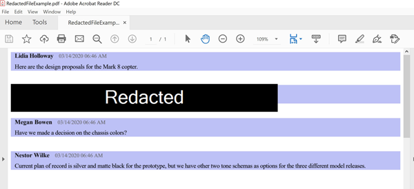

# <a name="conduct-an-ediscovery-investigation-of-content-in-microsoft-teams"></a><span data-ttu-id="c8efb-103">Conduzir uma investigação de Descoberta Eletrônica de conteúdo no Microsoft Teams</span><span class="sxs-lookup"><span data-stu-id="c8efb-103">Conduct an eDiscovery investigation of content in Microsoft Teams</span></span>

<span data-ttu-id="c8efb-104">Grandes Empresas geralmente são expostas a processos legais de alta exigência que exigem o envio de todas as Informações Armazenadas Eletronicamente (ESI).</span><span class="sxs-lookup"><span data-stu-id="c8efb-104">Large Enterprises are often exposed to high penalty legal proceedings that demand submission of all Electronically Stored Information (ESI).</span></span> <span data-ttu-id="c8efb-105">O conteúdo do Microsoft Teams pode ser pesquisado e usado durante investigações de Descobertas Eletivas.</span><span class="sxs-lookup"><span data-stu-id="c8efb-105">Microsoft Teams content can be searched and used during eDiscovery investigations.</span></span>

## <a name="overview"></a><span data-ttu-id="c8efb-106">Visão Geral</span><span class="sxs-lookup"><span data-stu-id="c8efb-106">Overview</span></span>

<span data-ttu-id="c8efb-107">Todos os chats do Microsoft Teams 1:1 ou em grupo são publicados nas caixas de correio dos respectivos usuários.</span><span class="sxs-lookup"><span data-stu-id="c8efb-107">All Microsoft Teams 1:1 or group chats are journaled through to the respective users' mailboxes.</span></span> <span data-ttu-id="c8efb-108">Todas as mensagens de canal padrão são contadas na caixa de correio do grupo que representa a equipe.</span><span class="sxs-lookup"><span data-stu-id="c8efb-108">All standard channel messages are journaled through to the group mailbox representing the team.</span></span> <span data-ttu-id="c8efb-109">Os arquivos carregados em canais padrão são cobertos pela funcionalidade de Descoberta Online do SharePoint Online e do OneDrive for Business.</span><span class="sxs-lookup"><span data-stu-id="c8efb-109">Files uploaded in standard channels are covered under the eDiscovery functionality for SharePoint Online and OneDrive for Business.</span></span>

<span data-ttu-id="c8efb-110">A Descoberta EDiscover de mensagens e arquivos em [canais privados](private-channels.md) funciona de forma diferente dos canais padrão.</span><span class="sxs-lookup"><span data-stu-id="c8efb-110">eDiscovery of messages and files in [private channels](private-channels.md) works differently than in standard channels.</span></span> <span data-ttu-id="c8efb-111">Para saber mais, confira [a Descoberta Ediscovery de canais privados.](#ediscovery-of-private-channels)</span><span class="sxs-lookup"><span data-stu-id="c8efb-111">To learn more, see [eDiscovery of private channels](#ediscovery-of-private-channels).</span></span>

<span data-ttu-id="c8efb-112">Nem todo o conteúdo do Teams é descoberta por email.</span><span class="sxs-lookup"><span data-stu-id="c8efb-112">Not all Teams content is eDiscoverable.</span></span> <span data-ttu-id="c8efb-113">A tabela a seguir mostra os tipos de conteúdo que você pode pesquisar usando as ferramentas de Descoberta Online da Microsoft:</span><span class="sxs-lookup"><span data-stu-id="c8efb-113">The following table shows the content types that you can search for using Microsoft eDiscovery tools:</span></span>

| <span data-ttu-id="c8efb-114">Tipo de conteúdo</span><span class="sxs-lookup"><span data-stu-id="c8efb-114">Content type</span></span> | <span data-ttu-id="c8efb-115">Descobertas EDiscoverable</span><span class="sxs-lookup"><span data-stu-id="c8efb-115">eDiscoverable</span></span> | <span data-ttu-id="c8efb-116">Observações</span><span class="sxs-lookup"><span data-stu-id="c8efb-116">Notes</span></span> |
|:--- | :--- |:--- |
|<span data-ttu-id="c8efb-117">Gravações de áudio</span><span class="sxs-lookup"><span data-stu-id="c8efb-117">Audio recordings</span></span> | <span data-ttu-id="c8efb-118">Não</span><span class="sxs-lookup"><span data-stu-id="c8efb-118">No</span></span> | |
|<span data-ttu-id="c8efb-119">Conteúdo do cartão</span><span class="sxs-lookup"><span data-stu-id="c8efb-119">Card content</span></span>|<span data-ttu-id="c8efb-120">Sim</span><span class="sxs-lookup"><span data-stu-id="c8efb-120">Yes</span></span>|<span data-ttu-id="c8efb-121">Consulte [Pesquisar conteúdo de cartão](#search-for-card-content) para obter mais informações.</span><span class="sxs-lookup"><span data-stu-id="c8efb-121">See [Search for card content](#search-for-card-content) for more information.</span></span>|
|<span data-ttu-id="c8efb-122">Links de chat</span><span class="sxs-lookup"><span data-stu-id="c8efb-122">Chat links</span></span> | <span data-ttu-id="c8efb-123">Sim</span><span class="sxs-lookup"><span data-stu-id="c8efb-123">Yes</span></span> | |
|<span data-ttu-id="c8efb-124">Mensagens de chat</span><span class="sxs-lookup"><span data-stu-id="c8efb-124">Chat messages</span></span> | <span data-ttu-id="c8efb-125">Sim</span><span class="sxs-lookup"><span data-stu-id="c8efb-125">Yes</span></span> |<span data-ttu-id="c8efb-126">Isso inclui conteúdo em canais do Teams, chats 1:1, chats em grupo 1:N e chats com participantes do usuário convidado.</span><span class="sxs-lookup"><span data-stu-id="c8efb-126">This includes content in Teams channels, 1:1 chats, 1:N group chats, and chats with guest user participants.</span></span>  |
|<span data-ttu-id="c8efb-127">Trechos de código</span><span class="sxs-lookup"><span data-stu-id="c8efb-127">Code snippets</span></span> | <span data-ttu-id="c8efb-128">Não</span><span class="sxs-lookup"><span data-stu-id="c8efb-128">No</span></span> | |
|<span data-ttu-id="c8efb-129">Mensagens editadas</span><span class="sxs-lookup"><span data-stu-id="c8efb-129">Edited messages</span></span> | <span data-ttu-id="c8efb-130">Sim</span><span class="sxs-lookup"><span data-stu-id="c8efb-130">Yes</span></span> | <span data-ttu-id="c8efb-131">Se o usuário estiver em responsabilidade, as versões anteriores das mensagens editadas também serão preservadas.</span><span class="sxs-lookup"><span data-stu-id="c8efb-131">If the user is on hold, previous versions of edited messages are also preserved.</span></span> |
|<span data-ttu-id="c8efb-132">Emojis, GIFs e adesivos</span><span class="sxs-lookup"><span data-stu-id="c8efb-132">Emojis, GIFs, and stickers</span></span> | <span data-ttu-id="c8efb-133">Sim</span><span class="sxs-lookup"><span data-stu-id="c8efb-133">Yes</span></span> | |
|<span data-ttu-id="c8efb-134">Imagens em linha</span><span class="sxs-lookup"><span data-stu-id="c8efb-134">Inline images</span></span> | <span data-ttu-id="c8efb-135">Sim</span><span class="sxs-lookup"><span data-stu-id="c8efb-135">Yes</span></span> | |
|<span data-ttu-id="c8efb-136">Conversas de IM de reunião</span><span class="sxs-lookup"><span data-stu-id="c8efb-136">Meeting IM conversations</span></span> | <span data-ttu-id="c8efb-137">Sim</span><span class="sxs-lookup"><span data-stu-id="c8efb-137">Yes</span></span> | |
|<span data-ttu-id="c8efb-138">Metadados<sup>de reunião 1</sup></span><span class="sxs-lookup"><span data-stu-id="c8efb-138">Meeting metadata<sup>1</sup></span></span> | <span data-ttu-id="c8efb-139">Sim</span><span class="sxs-lookup"><span data-stu-id="c8efb-139">Yes</span></span> |  |
|<span data-ttu-id="c8efb-140">Nome do canal</span><span class="sxs-lookup"><span data-stu-id="c8efb-140">Name of channel</span></span> | <span data-ttu-id="c8efb-141">Não</span><span class="sxs-lookup"><span data-stu-id="c8efb-141">No</span></span> | |
|<span data-ttu-id="c8efb-142">Mensagens de canal privado</span><span class="sxs-lookup"><span data-stu-id="c8efb-142">Private channel messages</span></span> | <span data-ttu-id="c8efb-143">Sim</span><span class="sxs-lookup"><span data-stu-id="c8efb-143">Yes</span></span> | |
|<span data-ttu-id="c8efb-144">Citações</span><span class="sxs-lookup"><span data-stu-id="c8efb-144">Quotes</span></span> | <span data-ttu-id="c8efb-145">Sim</span><span class="sxs-lookup"><span data-stu-id="c8efb-145">Yes</span></span> | <span data-ttu-id="c8efb-146">O conteúdo entre aspas é pesquisável.</span><span class="sxs-lookup"><span data-stu-id="c8efb-146">Quoted content is searchable.</span></span> <span data-ttu-id="c8efb-147">No entanto, os resultados da pesquisa não indicam que o conteúdo foi citado.</span><span class="sxs-lookup"><span data-stu-id="c8efb-147">However, search results don't indicate that the content was quoted.</span></span> |
|<span data-ttu-id="c8efb-148">Reações (como curtidas, corações e outras reações)</span><span class="sxs-lookup"><span data-stu-id="c8efb-148">Reactions (such as likes, hearts, and other reactions)</span></span> | <span data-ttu-id="c8efb-149">Não</span><span class="sxs-lookup"><span data-stu-id="c8efb-149">No</span></span> | |
|<span data-ttu-id="c8efb-150">Assunto</span><span class="sxs-lookup"><span data-stu-id="c8efb-150">Subject</span></span> | <span data-ttu-id="c8efb-151">Sim</span><span class="sxs-lookup"><span data-stu-id="c8efb-151">Yes</span></span> | |
|<span data-ttu-id="c8efb-152">Tabelas</span><span class="sxs-lookup"><span data-stu-id="c8efb-152">Tables</span></span> | <span data-ttu-id="c8efb-153">Sim</span><span class="sxs-lookup"><span data-stu-id="c8efb-153">Yes</span></span> | |
|||

<span data-ttu-id="c8efb-154"><sup>1</sup> Metadados de reunião (e chamada) incluem o seguinte:</span><span class="sxs-lookup"><span data-stu-id="c8efb-154"><sup>1</sup> Meeting (and call) metadata includes the following:</span></span>

- <span data-ttu-id="c8efb-155">Hora e duração do início e do término da reunião</span><span class="sxs-lookup"><span data-stu-id="c8efb-155">Meeting start and end time, and duration</span></span>
- <span data-ttu-id="c8efb-156">Ingressar na reunião e sair de eventos para cada participante</span><span class="sxs-lookup"><span data-stu-id="c8efb-156">Meeting join and leave events for each participant</span></span>
- <span data-ttu-id="c8efb-157">Ingressar/chamadas VOIP</span><span class="sxs-lookup"><span data-stu-id="c8efb-157">VOIP join/calls</span></span>
- <span data-ttu-id="c8efb-158">Ingressar anônimo</span><span class="sxs-lookup"><span data-stu-id="c8efb-158">Anonymous join</span></span>
- <span data-ttu-id="c8efb-159">Junção de usuário federado</span><span class="sxs-lookup"><span data-stu-id="c8efb-159">Federated user join</span></span>
- <span data-ttu-id="c8efb-160">Ingressar do usuário convidado</span><span class="sxs-lookup"><span data-stu-id="c8efb-160">Guest user join</span></span>

  <span data-ttu-id="c8efb-161">A imagem mostra um exemplo de metadados de reunião.</span><span class="sxs-lookup"><span data-stu-id="c8efb-161">The image shows an example of meeting metadata.</span></span>

  > [!div class="mx-imgBorder"]
  > <span data-ttu-id="c8efb-162"></span><span class="sxs-lookup"><span data-stu-id="c8efb-162"></span></span>

<span data-ttu-id="c8efb-163">Veja um exemplo de uma conversa de IM entre os participantes durante a reunião.</span><span class="sxs-lookup"><span data-stu-id="c8efb-163">Here's an example of an IM conversation between participants during the meeting.</span></span>


> [!div class="mx-imgBorder"]
> <span data-ttu-id="c8efb-165"></span><span class="sxs-lookup"><span data-stu-id="c8efb-165"></span></span>

<span data-ttu-id="c8efb-166">Para saber mais sobre como conduzir uma investigação de DescobertaScobrida, consulte Começar a trabalhar com a [Descoberta Interna de Descobertas.](https://docs.microsoft.com/microsoft-365/compliance/get-started-core-ediscovery)</span><span class="sxs-lookup"><span data-stu-id="c8efb-166">For more information about conducting an eDiscovery investigation, see [Get started with Core eDiscovery](https://docs.microsoft.com/microsoft-365/compliance/get-started-core-ediscovery).</span></span>

<span data-ttu-id="c8efb-167">Os dados do Microsoft Teams aparecerão como IM ou Conversas na saída de exportação de Descobertas Telefônicas do Excel.</span><span class="sxs-lookup"><span data-stu-id="c8efb-167">Microsoft Teams data will appear as IM or Conversations in the Excel eDiscovery export output.</span></span> <span data-ttu-id="c8efb-168">Você pode abrir o `.pst` arquivo no Outlook para exibir essas mensagens depois de exportá-las.</span><span class="sxs-lookup"><span data-stu-id="c8efb-168">You can open the `.pst` file in Outlook to view those messages after you export them.</span></span>

<span data-ttu-id="c8efb-169">Ao exibir o arquivo .pst da equipe, todas as conversas são mantidas na pasta Chat da Equipe em Histórico da Conversa.</span><span class="sxs-lookup"><span data-stu-id="c8efb-169">When viewing the .pst file for the team, all conversations are kept in the Team Chat folder under Conversation History.</span></span> <span data-ttu-id="c8efb-170">O título da mensagem contém o nome da equipe e o nome do canal.</span><span class="sxs-lookup"><span data-stu-id="c8efb-170">The title of the message contains the team name and channel name.</span></span> <span data-ttu-id="c8efb-171">Por exemplo, a imagem a seguir mostra uma mensagem de Bob que recebeu uma mensagem do canal padrão do Project 7 da equipe Especificações de Fabricação.</span><span class="sxs-lookup"><span data-stu-id="c8efb-171">For example, the image below shows a message from Bob who messaged the Project 7 standard channel of the Manufacturing Specs team.</span></span>


<span data-ttu-id="c8efb-173">Os chats privados na caixa de correio de um usuário são armazenados na pasta Chat da Equipe em Histórico da Conversa.</span><span class="sxs-lookup"><span data-stu-id="c8efb-173">Private chats in a user's mailbox are stored in the Team Chat folder under Conversation History.</span></span>

## <a name="ediscovery-of-private-channels"></a><span data-ttu-id="c8efb-174">Descoberta EDiscovery de canais privados</span><span class="sxs-lookup"><span data-stu-id="c8efb-174">eDiscovery of private channels</span></span>

<span data-ttu-id="c8efb-175">Os registros das mensagens enviadas em um canal privado são entregues na caixa de correio de todos os membros do canal privado, e não em uma caixa de correio de grupo.</span><span class="sxs-lookup"><span data-stu-id="c8efb-175">Records for messages sent in a private channel are delivered to the mailbox of all private channel members, rather than to a group mailbox.</span></span> <span data-ttu-id="c8efb-176">Os títulos dos registros são formatados para indicar de qual canal privado eles foram enviados.</span><span class="sxs-lookup"><span data-stu-id="c8efb-176">The titles of the records are formatted to indicate which private channel they were sent from.</span></span>

<span data-ttu-id="c8efb-177">Como cada canal privado tem seu próprio site do SharePoint separado do site da equipe pai, os arquivos em um canal privado são gerenciados independentemente da equipe pai.</span><span class="sxs-lookup"><span data-stu-id="c8efb-177">Because each private channel has its own SharePoint site that's separate from the parent team site, files in a private channel are managed independently of the parent team.</span></span>

<span data-ttu-id="c8efb-178">O Teams não dá suporte à pesquisa de Descobertas Online de um único canal dentro de uma equipe, portanto, toda a equipe deve ser pesquisada.</span><span class="sxs-lookup"><span data-stu-id="c8efb-178">Teams doesn't support eDiscovery search of a single channel within a team, so the whole team must be searched.</span></span> <span data-ttu-id="c8efb-179">Para executar uma pesquisa de conteúdo de Descoberta Eletrônico em um canal privado, pesquise na equipe, no conjunto de sites associado ao canal privado (para incluir arquivos) e nas caixas de correio dos membros do canal privado (para incluir mensagens).</span><span class="sxs-lookup"><span data-stu-id="c8efb-179">To perform an eDiscovery search of content in a private channel, search across the team, the site collection associated with the private channel (to include files), and mailboxes of private channel members (to include messages).</span></span>

<span data-ttu-id="c8efb-180">Use as etapas a seguir para identificar arquivos e mensagens em um canal privado para incluir em sua pesquisa de Descobertas Digitais.</span><span class="sxs-lookup"><span data-stu-id="c8efb-180">Use the following steps to identify files and messages in a private channel to include in your eDiscovery search.</span></span>

### <a name="include-private-channel-files-in-an-ediscovery-search"></a><span data-ttu-id="c8efb-181">Incluir arquivos de canal particular em uma pesquisa de Descobertas Digitais</span><span class="sxs-lookup"><span data-stu-id="c8efb-181">Include private channel files in an eDiscovery search</span></span>

<span data-ttu-id="c8efb-182">Antes de executar essas etapas, instale o Shell de Gerenciamento do [SharePoint Online e conecte-se ao SharePoint Online.](https://docs.microsoft.com/powershell/sharepoint/sharepoint-online/connect-sharepoint-online)</span><span class="sxs-lookup"><span data-stu-id="c8efb-182">Before you perform these steps, install the [SharePoint Online Management Shell and connect to  SharePoint Online](https://docs.microsoft.com/powershell/sharepoint/sharepoint-online/connect-sharepoint-online).</span></span>

1. <span data-ttu-id="c8efb-183">Execute o seguinte para obter uma lista de todos os conjunto de sites do SharePoint associados a canais privados na equipe.</span><span class="sxs-lookup"><span data-stu-id="c8efb-183">Run the following to get a list of all SharePoint site collections associated with private channels in the team.</span></span>

    ```PowerShell
    Get-SPOSite
    ```

2. <span data-ttu-id="c8efb-184">Execute o seguinte script do PowerShell para obter uma lista de todas as URLs de conjunto de sites do SharePoint associadas a canais privados na equipe e à ID do grupo de equipe pai.</span><span class="sxs-lookup"><span data-stu-id="c8efb-184">Run the following PowerShell script to get a list of all SharePoint site collection URLs associated with private channels in the team and the parent team group ID.</span></span>

    ```PowerShell
    $sites = get-sposite -template "teamchannel#0"
    foreach ($site in $sites) {$x= get-sposite -identity $site.url -detail; $x.relatedgroupID; $x.url}
    ```

3. <span data-ttu-id="c8efb-185">Para cada ID de equipe ou grupo, execute o seguinte script do PowerShell para identificar todos os sites de canal particular relevantes, onde $groupID é a ID de grupo da equipe.</span><span class="sxs-lookup"><span data-stu-id="c8efb-185">For each team or group ID, run the following PowerShell script to identify all relevant private channel sites, where $groupID is the group ID of the team.</span></span>

    ```PowerShell
    $sites = get-sposite -template "teamchannel#0"
    $groupID = "e8195240-4a70-4830-9106-80193cf717cb"
    foreach ($site in $sites) {$x= Get-SpoSite -Identity $site.url -Detail; if ($x.RelatedGroupId -eq $groupID) {$x.RelatedGroupId;$x.url}}
    ```

### <a name="include-private-channel-messages-in-an-ediscovery-search"></a><span data-ttu-id="c8efb-186">Incluir mensagens de canal privado em uma pesquisa de Descobertas Online</span><span class="sxs-lookup"><span data-stu-id="c8efb-186">Include private channel messages in an eDiscovery search</span></span>

<span data-ttu-id="c8efb-187">Antes de executar essas etapas, certifique-se de ter a versão mais recente do [módulo do Teams PowerShell](teams-powershell-overview.md) instalada.</span><span class="sxs-lookup"><span data-stu-id="c8efb-187">Before you perform these steps, make sure you have the [latest version of the Teams PowerShell module](teams-powershell-overview.md) installed.</span></span>

1. <span data-ttu-id="c8efb-188">Execute o comando a seguir para obter uma lista de canais privados na equipe.</span><span class="sxs-lookup"><span data-stu-id="c8efb-188">Run the following command to get a list of private channels in the team.</span></span>

    ```PowerShell
    Get-TeamChannel -GroupId <GroupID> -MembershipType Private
    ```

2. <span data-ttu-id="c8efb-189">Execute o comando a seguir para obter uma lista de membros de um canal privado.</span><span class="sxs-lookup"><span data-stu-id="c8efb-189">Run the following command to get a list of private channel members.</span></span>

    ```PowerShell
    Get-TeamChannelUser -GroupId <GroupID> -DisplayName "Engineering" -Role Member
    ```

3. <span data-ttu-id="c8efb-190">Inclua as caixas de correio de todos os membros de cada canal privado da equipe como parte da sua consulta de pesquisa [de Descoberta Eletrônico.](https://docs.microsoft.com/microsoft-365/compliance/search-for-content-in-core-ediscovery)</span><span class="sxs-lookup"><span data-stu-id="c8efb-190">Include the mailboxes of all members from each private channel in the team as part of your [eDiscovery search query](https://docs.microsoft.com/microsoft-365/compliance/search-for-content-in-core-ediscovery).</span></span>

## <a name="search-for-content-for-guest-users"></a><span data-ttu-id="c8efb-191">Pesquisar conteúdo para usuários convidados</span><span class="sxs-lookup"><span data-stu-id="c8efb-191">Search for content for guest users</span></span>

<span data-ttu-id="c8efb-192">Você pode usar as ferramentas de Descoberta Online para pesquisar conteúdo do Teams relacionado aos usuários convidados em sua organização.</span><span class="sxs-lookup"><span data-stu-id="c8efb-192">You can use eDiscovery tools to search for Teams content related to guest users in your organization.</span></span> <span data-ttu-id="c8efb-193">O conteúdo de chat do Teams associado a um usuário convidado é preservado em um local de armazenamento baseado em nuvem e pode ser pesquisado para usar a Descoberta Online.</span><span class="sxs-lookup"><span data-stu-id="c8efb-193">Teams chat content that's associated with a guest user is preserved in a cloud-based storage location and can be searched for using eDiscovery.</span></span> <span data-ttu-id="c8efb-194">Isso inclui a pesquisa de conteúdo em conversas de chat 1:1 e 1:N nas quais um usuário convidado é um participante com outros usuários em sua organização.</span><span class="sxs-lookup"><span data-stu-id="c8efb-194">This includes searching for content in 1:1 and 1:N chat conversations in which a guest user is a participant with other users in your organization.</span></span> <span data-ttu-id="c8efb-195">Você também pode pesquisar mensagens de canal privado nas quais um usuário convidado é um participante e pesquisar conteúdo em conversas de chat de *convidado:convidado,* onde os únicos participantes são usuários convidados.</span><span class="sxs-lookup"><span data-stu-id="c8efb-195">You can also search for private channel messages in which a guest user is a participant and search for content in *guest:guest* chat conversations where the only participants are guest users.</span></span>

<span data-ttu-id="c8efb-196">Para pesquisar conteúdo para usuários convidados:</span><span class="sxs-lookup"><span data-stu-id="c8efb-196">To search for content for guest users:</span></span>

1. <span data-ttu-id="c8efb-197">Conecte-se ao PowerShell do Azure AD.</span><span class="sxs-lookup"><span data-stu-id="c8efb-197">Connect to Azure AD PowerShell.</span></span> <span data-ttu-id="c8efb-198">Para obter instruções, consulte a seção "Conectar-se com o PowerShell do Azure Active Directory" em Conectar-se ao [Microsoft 365 com o PowerShell.](https://docs.microsoft.com/microsoft-365/enterprise/connect-to-microsoft-365-powershell#connect-with-the-azure-active-directory-powershell-for-graph-module)</span><span class="sxs-lookup"><span data-stu-id="c8efb-198">For instructions, see the "Connect with the Azure Active Directory PowerShell" section in [Connect to Microsoft 365 with PowerShell](https://docs.microsoft.com/microsoft-365/enterprise/connect-to-microsoft-365-powershell#connect-with-the-azure-active-directory-powershell-for-graph-module).</span></span> <span data-ttu-id="c8efb-199">Certifique-se de concluir a Etapa 1 e a Etapa 2 no tópico anterior.</span><span class="sxs-lookup"><span data-stu-id="c8efb-199">Be sure to complete Step 1 and Step 2 in the previous topic.</span></span>

2. <span data-ttu-id="c8efb-200">Depois de se conectar com êxito ao PowerShell do Azure AD, execute o comando a seguir para exibir o nome principal do usuário (UPN) para todos os usuários convidados em sua organização.</span><span class="sxs-lookup"><span data-stu-id="c8efb-200">After you successfully connect to Azure AD PowerShell, run the following command to display the user principal name (UPN) for all guest users in your organization.</span></span> <span data-ttu-id="c8efb-201">Você precisa usar o UPN do usuário convidado ao criar a pesquisa na etapa 4.</span><span class="sxs-lookup"><span data-stu-id="c8efb-201">You have to use the UPN of the guest user when you create the search in step 4.</span></span>

   ```powershell
   Get-AzureADUser -Filter "userType eq 'Guest'" -All $true | FL UserPrincipalName
   ```

   > [!TIP]
   > <span data-ttu-id="c8efb-202">Em vez de exibir uma lista de nomes de entidades de usuário na tela do computador, você pode redirecionar a saída do comando para um arquivo de texto.</span><span class="sxs-lookup"><span data-stu-id="c8efb-202">Instead of displaying a list of user principal names on the computer screen, you can redirect the output of the command to a text file.</span></span> <span data-ttu-id="c8efb-203">Você pode fazer isso ao fazer isso, dependendo `> filename.txt` do comando anterior.</span><span class="sxs-lookup"><span data-stu-id="c8efb-203">You can do this by appending `> filename.txt` to the previous command.</span></span> <span data-ttu-id="c8efb-204">O arquivo de texto com os nomes principais do usuário será salvo na pasta atual.</span><span class="sxs-lookup"><span data-stu-id="c8efb-204">The text file with the user principal names will be saved to the current folder.</span></span>

3. <span data-ttu-id="c8efb-205">Em outra janela do Windows PowerShell, conecte-se ao PowerShell do Centro de Conformidade & segurança.</span><span class="sxs-lookup"><span data-stu-id="c8efb-205">In a different Windows PowerShell window, connect to Security & Compliance Center PowerShell.</span></span> <span data-ttu-id="c8efb-206">Para obter instruções, consulte [Conectar-se ao PowerShell do Centro](https://docs.microsoft.com/powershell/exchange/connect-to-scc-powershell)de Conformidade & segurança.</span><span class="sxs-lookup"><span data-stu-id="c8efb-206">For instructions, see [Connect to Security & Compliance Center PowerShell](https://docs.microsoft.com/powershell/exchange/connect-to-scc-powershell).</span></span> <span data-ttu-id="c8efb-207">Você pode se conectar com ou sem usar a autenticação multifa factor.</span><span class="sxs-lookup"><span data-stu-id="c8efb-207">You can connect with or without using multi-factor authentication.</span></span>

4. <span data-ttu-id="c8efb-208">Crie uma pesquisa de conteúdo que pesquise todo o conteúdo (como mensagens de chat e mensagens de email) na qual o usuário convidado especificado era um participante executando o comando a seguir.</span><span class="sxs-lookup"><span data-stu-id="c8efb-208">Create a content search that searches for all content (such as chat messages and email messages) in which the specified guest user was a participant by running the following command.</span></span>

   ```powershell
   New-ComplianceSearch <search name> -ExchangeLocation <guest user UPN>  -AllowNotFoundExchangeLocationsEnabled $true -IncludeUserAppContent $true
   ```

   <span data-ttu-id="c8efb-209">Por exemplo, para pesquisar conteúdo associado à usuária convidada Sara Davis, execute o seguinte comando.</span><span class="sxs-lookup"><span data-stu-id="c8efb-209">For example, to search for content associated with the guest user Sara Davis, you would run the following command.</span></span>

   ```powershell
   New-ComplianceSearch "Sara Davis Guest User" -ExchangeLocation "sara.davis_hotmail.com#EXT#@contoso.onmicrosoft.com" -AllowNotFoundExchangeLocationsEnabled $true -IncludeUserAppContent $true
   ```

    <span data-ttu-id="c8efb-210">Para obter mais informações sobre como usar o PowerShell para criar pesquisas de conteúdo, consulte [New-ComplianceSearch.](https://docs.microsoft.com/powershell/module/exchange/new-compliancesearch)</span><span class="sxs-lookup"><span data-stu-id="c8efb-210">For more information about using PowerShell to create content searches, see [New-ComplianceSearch](https://docs.microsoft.com/powershell/module/exchange/new-compliancesearch).</span></span>

5. <span data-ttu-id="c8efb-211">Execute o seguinte comando para iniciar a pesquisa de conteúdo que você criou na etapa 4:</span><span class="sxs-lookup"><span data-stu-id="c8efb-211">Run the following command to start the content search that you created in step 4:</span></span>

   ```powershell
   Start-ComplianceSearch <search name>
   ```

6. <span data-ttu-id="c8efb-212">Vá para [https://compliance.microsoft.com](https://compliance.microsoft.com) e clique em Mostrar toda a **pesquisa**  >  **de Conteúdo.**</span><span class="sxs-lookup"><span data-stu-id="c8efb-212">Go to [https://compliance.microsoft.com](https://compliance.microsoft.com) and then click **Show all** > **Content search**.</span></span>

7. <span data-ttu-id="c8efb-213">Na lista de pesquisas, selecione a pesquisa que você criou na etapa 4 para exibir a página de sobrevoo.</span><span class="sxs-lookup"><span data-stu-id="c8efb-213">In the list of searches, select the search that you created in step 4 to display the flyout page.</span></span>

8. <span data-ttu-id="c8efb-214">Na página de sobrevoo, você pode fazer o seguinte:</span><span class="sxs-lookup"><span data-stu-id="c8efb-214">On the flyout page, you can do the following things:</span></span>

   - <span data-ttu-id="c8efb-215">Clique **em Exibir resultados** para exibir os resultados da pesquisa e visualizar o conteúdo.</span><span class="sxs-lookup"><span data-stu-id="c8efb-215">Click **View results** to view the search results and preview the content.</span></span>

   - <span data-ttu-id="c8efb-216">Ao lado do **campo Consulta,** clique **em Editar** para editar e, em seguida, reprise a pesquisa.</span><span class="sxs-lookup"><span data-stu-id="c8efb-216">Next to the **Query** field, click **Edit** to edit and then rerun the search.</span></span> <span data-ttu-id="c8efb-217">Por exemplo, você pode adicionar uma consulta de pesquisa para restringir os resultados.</span><span class="sxs-lookup"><span data-stu-id="c8efb-217">For example, you can add a search query to narrow the results.</span></span>

   - <span data-ttu-id="c8efb-218">Clique **em Exportar resultados** para exportar e baixar os resultados da pesquisa.</span><span class="sxs-lookup"><span data-stu-id="c8efb-218">Click **Export results** to export and download the search results.</span></span>

## <a name="search-for-card-content"></a><span data-ttu-id="c8efb-219">Pesquisar conteúdo de cartão</span><span class="sxs-lookup"><span data-stu-id="c8efb-219">Search for card content</span></span>

<span data-ttu-id="c8efb-220">O conteúdo do cartão gerado por aplicativos em canais do Teams, chats 1:1 e chats 1xN é armazenado em caixas de correio e pode ser pesquisado.</span><span class="sxs-lookup"><span data-stu-id="c8efb-220">Card content generated by apps in Teams channels, 1:1 chats, and 1xN chats is stored in mailboxes and can be searched.</span></span> <span data-ttu-id="c8efb-221">Um *cartão* é um contêiner da interface do usuário para partes curtas de conteúdo.</span><span class="sxs-lookup"><span data-stu-id="c8efb-221">A *card* is a UI container for short pieces of content.</span></span> <span data-ttu-id="c8efb-222">Os cartões podem ter várias propriedades e anexos e podem incluir botões que podem disparar ações de cartão.</span><span class="sxs-lookup"><span data-stu-id="c8efb-222">Cards can have multiple properties and attachments, and can include buttons that can trigger card actions.</span></span> <span data-ttu-id="c8efb-223">Para obter mais informações, consulte [Cartões](https://docs.microsoft.com/microsoftteams/platform/task-modules-and-cards/what-are-cards)</span><span class="sxs-lookup"><span data-stu-id="c8efb-223">For more information, see [Cards](https://docs.microsoft.com/microsoftteams/platform/task-modules-and-cards/what-are-cards)</span></span>

<span data-ttu-id="c8efb-224">Como outro conteúdo do Teams, onde o conteúdo do cartão é armazenado é baseado no local onde o cartão foi usado.</span><span class="sxs-lookup"><span data-stu-id="c8efb-224">Like other Teams content, where card content is stored is based on where the card was used.</span></span> <span data-ttu-id="c8efb-225">O conteúdo dos cartões usados em um canal do Teams é armazenado na caixa de correio do grupo do Teams.</span><span class="sxs-lookup"><span data-stu-id="c8efb-225">Content for cards used in a Teams channel is stored in the Teams group mailbox.</span></span> <span data-ttu-id="c8efb-226">O conteúdo do cartão para chats 1:1 e 1xN são armazenados nas caixas de correio dos participantes do chat.</span><span class="sxs-lookup"><span data-stu-id="c8efb-226">Card content for 1:1 and 1xN chats are stored in the mailboxes of the chat participants.</span></span>

<span data-ttu-id="c8efb-227">Para pesquisar conteúdo de cartão, você pode usar as `kind:microsoftteams` condições `itemclass:IPM.SkypeTeams.Message` de pesquisa.</span><span class="sxs-lookup"><span data-stu-id="c8efb-227">To search for card content, you can use the `kind:microsoftteams` or `itemclass:IPM.SkypeTeams.Message` search conditions.</span></span> <span data-ttu-id="c8efb-228">Ao revisar os resultados da pesquisa, o conteúdo do cartão gerado por bots em um canal do Teams tem a propriedade de email **Remetente/Autor** como, onde está o nome do aplicativo que gerou o conteúdo `<appname>@teams.microsoft.com` `appname` do cartão.</span><span class="sxs-lookup"><span data-stu-id="c8efb-228">When reviewing search results, card content generated by bots in a Teams channel has the **Sender/Author** email property as `<appname>@teams.microsoft.com`, where `appname` is the name of the app that generated the card content.</span></span> <span data-ttu-id="c8efb-229">Se o conteúdo do cartão foi gerado por um usuário, o valor do **Remetente/Autor** identifica o usuário.</span><span class="sxs-lookup"><span data-stu-id="c8efb-229">If card content was generated by a user, the value of **Sender/Author** identifies the user.</span></span>

<span data-ttu-id="c8efb-230">Ao exibir o conteúdo do cartão nos resultados da pesquisa de conteúdo, o conteúdo aparece como um anexo da mensagem.</span><span class="sxs-lookup"><span data-stu-id="c8efb-230">When viewing card content in Content search results, the content appears as an attachment to the message.</span></span> <span data-ttu-id="c8efb-231">O anexo é `appname.html` nomeado, `appname` onde está o nome do aplicativo que gerou o conteúdo do cartão.</span><span class="sxs-lookup"><span data-stu-id="c8efb-231">The attachment is named `appname.html`, where `appname` is the name of the app that generated the card content.</span></span> <span data-ttu-id="c8efb-232">As capturas de tela a seguir mostram como o conteúdo do cartão (para um aplicativo chamado Asana) aparece no Teams e nos resultados de uma pesquisa.</span><span class="sxs-lookup"><span data-stu-id="c8efb-232">The following screenshots show how card content (for an app named Asana) appears in Teams and in the results of a search.</span></span>

<span data-ttu-id="c8efb-233">**Conteúdo do cartão no Teams**</span><span class="sxs-lookup"><span data-stu-id="c8efb-233">**Card content in Teams**</span></span>


<span data-ttu-id="c8efb-235">**Conteúdo do cartão nos resultados da pesquisa**</span><span class="sxs-lookup"><span data-stu-id="c8efb-235">**Card content in search results**</span></span>
  


> [!NOTE]
> <span data-ttu-id="c8efb-237">Para exibir imagens do conteúdo do cartão nos resultados da pesquisa no momento (como as marcas de seleção na captura de tela anterior), você precisa estar entrar no Teams (em uma guia diferente na mesma sessão do navegador que usa para exibir os resultados da https://teams.microsoft.com) pesquisa.</span><span class="sxs-lookup"><span data-stu-id="c8efb-237">To display images from card content in search results at this time (such as the checkmarks in the previous screenshot), you have to be signed into Teams (at https://teams.microsoft.com) in a different tab in the same browser session that you use to view the search results.</span></span> <span data-ttu-id="c8efb-238">Caso contrário, os espaço reservados para imagens serão exibidos.</span><span class="sxs-lookup"><span data-stu-id="c8efb-238">Otherwise, image placeholders are displayed.</span></span>

## <a name="advanced-ediscovery"></a><span data-ttu-id="c8efb-239">Advanced eDiscovery</span><span class="sxs-lookup"><span data-stu-id="c8efb-239">Advanced eDiscovery</span></span>

<span data-ttu-id="c8efb-240">Alguns conteúdos do Microsoft Teams também podem ser pesquisados e preservados usando o fluxo de trabalho de [Descoberta Eletrônico Avançada.](https://docs.microsoft.com/microsoft-365/compliance/overview-ediscovery-20)</span><span class="sxs-lookup"><span data-stu-id="c8efb-240">Some Microsoft Teams content can also be searched and preserved using the [Advanced eDiscovery workflow](https://docs.microsoft.com/microsoft-365/compliance/overview-ediscovery-20).</span></span> <span data-ttu-id="c8efb-241">Embora a Descoberta Técnica fornece uma variedade de funcionalidades de pesquisa, espera e exportação, a Descoberta Avançada oferece aos administradores de conformidade mais ferramentas para identificar fontes de dados e analisar seu conteúdo.</span><span class="sxs-lookup"><span data-stu-id="c8efb-241">While eDiscovery provides a range of search, hold, and export functionality, Advanced eDiscovery gives compliance administrators more tools to identify data sources and analyze their contents.</span></span>

### <a name="advanced-ediscovery-custodian-workflow-for-teams-content"></a><span data-ttu-id="c8efb-242">Fluxo de trabalho de descobertas de descobertas de dados avançados para conteúdo do Teams</span><span class="sxs-lookup"><span data-stu-id="c8efb-242">Advanced eDiscovery custodian workflow for Teams content</span></span>

<span data-ttu-id="c8efb-243">Os médicos podem ser membros de várias equipes.</span><span class="sxs-lookup"><span data-stu-id="c8efb-243">Custodians might be a member of various teams.</span></span> <span data-ttu-id="c8efb-244">Você pode capturar o conteúdo do Teams que é relevante para esses médicos.</span><span class="sxs-lookup"><span data-stu-id="c8efb-244">You can capture Teams content that is relevant to these custodians.</span></span> <span data-ttu-id="c8efb-245">Para obter instruções sobre o fluxo de trabalho da equipe, consulte Adicionar corsários a um [caso de Descoberta Avançada.](https://docs.microsoft.com/microsoft-365/compliance/add-custodians-to-case)</span><span class="sxs-lookup"><span data-stu-id="c8efb-245">For instructions on the custodian workflow, see [Add custodians to an Advanced eDiscovery case](https://docs.microsoft.com/microsoft-365/compliance/add-custodians-to-case).</span></span>

<span data-ttu-id="c8efb-246">Depois de adicionar um sédário, clique no **botão** Próximo e, em seguida, no **botão** Adicionar.</span><span class="sxs-lookup"><span data-stu-id="c8efb-246">After adding a custodian, click the **Next** button, then the **Add** button.</span></span> <span data-ttu-id="c8efb-247">Em seguida, uma janela é exibida solicitando que você selecione locais adicionais, que mostrarão todas as associações do sédário e os locais de site correspondentes do SharePoint para seus dados.</span><span class="sxs-lookup"><span data-stu-id="c8efb-247">A window then displays that prompts you to select additional locations, which will show you all of the custodian's memberships and the corresponding SharePoint site locations for their data.</span></span> <span data-ttu-id="c8efb-248">Em todas essas fontes de dados e equipes, você pode escolher o conteúdo que deseja usar para a Descoberta E, em seguida, colocar esse usuário e todas as fontes de dados identificadas em espera.</span><span class="sxs-lookup"><span data-stu-id="c8efb-248">From all of these data sources and teams, you can choose the content you want to use for eDiscovery, then place that user and all the data sources that you've identified on hold.</span></span>

<span data-ttu-id="c8efb-249">Você pode selecionar se deve incluir o conteúdo do Exchange, o conteúdo do OneDrive ou ambos.</span><span class="sxs-lookup"><span data-stu-id="c8efb-249">You can select whether to include their Exchange content, their OneDrive content, or both.</span></span> <span data-ttu-id="c8efb-250">O conteúdo do Exchange inclui todo o conteúdo do aplicativo nas caixas de correio do usuário, como seu email, o conteúdo do Teams armazenado em sua caixa de correio e assim por diante.</span><span class="sxs-lookup"><span data-stu-id="c8efb-250">Exchange content includes all of the application content in the user's mailboxes, such as their email, the Teams content that is stored in their mailbox, and so on.</span></span> <span data-ttu-id="c8efb-251">O conteúdo do OneDrive inclui não apenas o conteúdo do usuário, mas também todo o conteúdo do Teams armazenado no OneDrive, como chats 1:1, chats 1:N e arquivos compartilhados em chats.</span><span class="sxs-lookup"><span data-stu-id="c8efb-251">The OneDrive content includes not only the user's content, but also all of the Teams content that is stored in OneDrive, such as 1:1 chats, 1:N chats, and files shared in chats.</span></span>

<span data-ttu-id="c8efb-252">Você também tem a opção de associar qualquer equipe da qual o sédere é membro para que as mensagens de chat do canal e os arquivos aos qual o suário tenha acesso sejam incluídos.</span><span class="sxs-lookup"><span data-stu-id="c8efb-252">You also have the option to associate any team the custodian is a member of so that channel chat messages and files the custodian has access to are included.</span></span> <span data-ttu-id="c8efb-253">Além disso, qualquer outra equipe pode ser associada a um sédiano.</span><span class="sxs-lookup"><span data-stu-id="c8efb-253">Additionally, any other team can be associated with a custodian.</span></span>

> [!NOTE]
> <span data-ttu-id="c8efb-254">A Descoberta EDiscover de mensagens e arquivos em [canais privados](private-channels.md) funciona de forma diferente dos canais padrão.</span><span class="sxs-lookup"><span data-stu-id="c8efb-254">eDiscovery of messages and files in [private channels](private-channels.md) works differently than in standard channels.</span></span> <span data-ttu-id="c8efb-255">Para saber mais, confira [a Descoberta Ediscovery de canais privados.](#ediscovery-of-private-channels)</span><span class="sxs-lookup"><span data-stu-id="c8efb-255">To learn more, see [eDiscovery of private channels](#ediscovery-of-private-channels).</span></span>

### <a name="placing-a-data-source-on-hold"></a><span data-ttu-id="c8efb-256">Colocar uma fonte de dados em espera</span><span class="sxs-lookup"><span data-stu-id="c8efb-256">Placing a data source on hold</span></span>

<span data-ttu-id="c8efb-257">Se não houver um usuário específico para designar como um sédário, você poderá colocar uma fonte de dados inteira em espera.</span><span class="sxs-lookup"><span data-stu-id="c8efb-257">If there is no specific user to designate as a custodian, you can place an entire data source on hold.</span></span> <span data-ttu-id="c8efb-258">Para obter mais informações sobre retém, consulte [Gerenciar retém na Descoberta Avançada.](https://docs.microsoft.com/microsoft-365/compliance/managing-holds)</span><span class="sxs-lookup"><span data-stu-id="c8efb-258">For more information on holds, see [Manage holds in Advanced eDiscovery](https://docs.microsoft.com/microsoft-365/compliance/managing-holds).</span></span>

<span data-ttu-id="c8efb-259">Ao criar uma responsabilidade para o conteúdo do Teams, você pode escolher todos os locais que deseja incluir na sua responsabilidade.</span><span class="sxs-lookup"><span data-stu-id="c8efb-259">When creating a hold for Teams content, you can choose all of the locations you wish to include in your hold.</span></span> <span data-ttu-id="c8efb-260">Mesmo que os usuários estão excluindo ou alterando o conteúdo, a responsabilidade manterá cópias de todas as versões anteriores desse conteúdo.</span><span class="sxs-lookup"><span data-stu-id="c8efb-260">Even if users are deleting or changing content, the hold will maintain copies of all previous versions of that content.</span></span>

<span data-ttu-id="c8efb-261">Você também pode usar uma consulta opcional para definir condições para a avaliação com base em palavras-chave, intervalo de datas, autor e muitos outros critérios.</span><span class="sxs-lookup"><span data-stu-id="c8efb-261">You can also use an optional query to set conditions for the hold based on keywords, date range, author, and many other criteria.</span></span> <span data-ttu-id="c8efb-262">Se você especificar nenhuma palavra-chave, tudo dessa fonte de dados estará sujeito à hold.</span><span class="sxs-lookup"><span data-stu-id="c8efb-262">If you specify no keywords, then everything from that data source will be subject to the hold.</span></span>

### <a name="advanced-ediscovery-searches"></a><span data-ttu-id="c8efb-263">Pesquisas avançadas de Descobertas Avançadas</span><span class="sxs-lookup"><span data-stu-id="c8efb-263">Advanced eDiscovery searches</span></span>

<span data-ttu-id="c8efb-264">O conteúdo do Teams também pode ser pesquisado.</span><span class="sxs-lookup"><span data-stu-id="c8efb-264">Teams content can also be searched.</span></span> <span data-ttu-id="c8efb-265">Para obter mais informações sobre pesquisas, consulte [Coletar dados para um caso na Descoberta Avançada.](https://docs.microsoft.com/microsoft-365/compliance/collecting-data-for-ediscovery)</span><span class="sxs-lookup"><span data-stu-id="c8efb-265">For more information on searches, see [Collect data for a case in Advanced eDiscovery](https://docs.microsoft.com/microsoft-365/compliance/collecting-data-for-ediscovery).</span></span> <span data-ttu-id="c8efb-266">Uma pesquisa retornará uma conversa inteira se até mesmo uma mensagem corresponde à consulta de pesquisa.</span><span class="sxs-lookup"><span data-stu-id="c8efb-266">A search will return an entire conversation if even one message matches the search query.</span></span>

<span data-ttu-id="c8efb-267">Ao criar uma consulta de pesquisa, você pode escolher cornários para que todas as fontes que você já selecionou sejam pesquisadas.</span><span class="sxs-lookup"><span data-stu-id="c8efb-267">When creating a search query, you can choose custodians so that all the sources that you've already selected will be searched.</span></span> <span data-ttu-id="c8efb-268">Você também pode pesquisar fontes não corretivas, como um site do Teams que não está mapeado para um usuário.</span><span class="sxs-lookup"><span data-stu-id="c8efb-268">You can also search non-custodial sources such as a Teams site that is not mapped to a user.</span></span> <span data-ttu-id="c8efb-269">As consultas opcionais também estão disponíveis para restringir sua pesquisa no conteúdo do Teams.</span><span class="sxs-lookup"><span data-stu-id="c8efb-269">Optional queries are also available to narrow your search within the Teams content.</span></span>

<span data-ttu-id="c8efb-270">Depois de criar uma pesquisa e selecionou-a, uma janela será exibida com detalhes adicionais e ações que você pode realizar na pesquisa selecionada.</span><span class="sxs-lookup"><span data-stu-id="c8efb-270">After you've created a search and selected it, a window displays with additional details and actions that you can take on the selected search.</span></span> <span data-ttu-id="c8efb-271">Se você  clicar no botão Estatísticas, poderá exibir estatísticas sobre sua pesquisa, incluindo detalhamentos de acordo com os tipos de local, a fonte original do conteúdo e se o conteúdo está localizado em uma caixa de correio de grupo, na caixa de correio do usuário individual ou em um site do SharePoint.</span><span class="sxs-lookup"><span data-stu-id="c8efb-271">If you click the **Statistics** button, you can view statistics about your search, including breakdowns according to location types, the original source for the content, and whether the content is located in a group mailbox, the individual user mailbox, or a SharePoint site.</span></span> <span data-ttu-id="c8efb-272">Assim, você pode ver um detalhamento de quais fontes estão colaborando com os resultados da pesquisa.</span><span class="sxs-lookup"><span data-stu-id="c8efb-272">Thus, you can see a breakdown of what sources are contributing to your search results.</span></span> <span data-ttu-id="c8efb-273">Também há um **modo de exibição** consultas disponível para que você possa ver quais palavras-chave individuais estão colaborando com seus resultados.</span><span class="sxs-lookup"><span data-stu-id="c8efb-273">There is also a **Queries** view available so you can see which individual keywords are contributing to your results.</span></span>

<span data-ttu-id="c8efb-274">Depois de finalizar sua pesquisa, você pode clicar no botão Adicionar **resultados** para revisar conjunto e adicioná-lo a um conjunto de revisão.</span><span class="sxs-lookup"><span data-stu-id="c8efb-274">After you finalize your search, you can click the **Add results to review set** button and add it to a review set.</span></span> <span data-ttu-id="c8efb-275">Para obter mais informações sobre conjuntos de revisão, consulte Gerenciar conjuntos de revisão no fluxo de trabalho Advanced [EDiscovery and](https://docs.microsoft.com/microsoft-365/compliance/managing-review-sets) [Review Sets](#review-sets-workflow) later in this article.</span><span class="sxs-lookup"><span data-stu-id="c8efb-275">For more information about review sets, see [Manage review sets in Advanced eDiscovery](https://docs.microsoft.com/microsoft-365/compliance/managing-review-sets) and [Review Sets workflow](#review-sets-workflow) later in this article.</span></span>

#### <a name="normal-review-sets-and-conversation-review-sets"></a><span data-ttu-id="c8efb-276">Conjuntos normais de revisão e conjuntos de revisão de conversa</span><span class="sxs-lookup"><span data-stu-id="c8efb-276">Normal review sets and conversation review sets</span></span>

<span data-ttu-id="c8efb-277">Ao adicionar uma pesquisa a um conjunto de revisão, você pode escolher entre um conjunto de revisão normal ou um conjunto de revisão de conversa.</span><span class="sxs-lookup"><span data-stu-id="c8efb-277">When adding a search to a review set, you can choose from a normal review set or a conversation review set.</span></span>

<span data-ttu-id="c8efb-278">Um conjunto de revisão normal é semelhante a uma exportação; ele fornece os arquivos `.msg` individuais para o conteúdo do Teams e apresenta o conteúdo em uma exibição básica.</span><span class="sxs-lookup"><span data-stu-id="c8efb-278">A normal review set is similar to an export; it provides the individual `.msg` files for the Teams content and presents the content in a basic view.</span></span> <span data-ttu-id="c8efb-279">Normalmente, você usaria um conjunto de revisão normal quando planeja usar outras ferramentas de software para reprocessar os arquivos mais tarde.</span><span class="sxs-lookup"><span data-stu-id="c8efb-279">You would typically use a normal review set when you plan to use other software tools to reprocess the files later.</span></span>

<span data-ttu-id="c8efb-280">Um conjunto de revisão de conversa fornece uma exibição mais intuitiva e encadeada das conversas; exibe as mensagens relacionadas juntas na ordem adequada.</span><span class="sxs-lookup"><span data-stu-id="c8efb-280">A conversation review set provides a more intuitive, threaded view of the conversations; it displays related messages together in the proper order.</span></span>

> [!div class="mx-imgBorder"]
> <span data-ttu-id="c8efb-281"></span><span class="sxs-lookup"><span data-stu-id="c8efb-281"></span></span>

<span data-ttu-id="c8efb-282">A funcionalidade, como a redação, está disponível em ambos os tipos de conjuntos de revisão.</span><span class="sxs-lookup"><span data-stu-id="c8efb-282">Functionality such as redaction is available in both types of review sets.</span></span> <span data-ttu-id="c8efb-283">Para obter mais informações sobre conjuntos de revisão, consulte [Revisar conversas na Descoberta Avançada.](https://docs.microsoft.com/microsoft-365/compliance/conversation-review-sets)</span><span class="sxs-lookup"><span data-stu-id="c8efb-283">For more information about review sets, see [Review conversations in advanced eDiscovery](https://docs.microsoft.com/microsoft-365/compliance/conversation-review-sets).</span></span>

#### <a name="collection-options"></a><span data-ttu-id="c8efb-284">Opções de coleção</span><span class="sxs-lookup"><span data-stu-id="c8efb-284">Collection options</span></span>

<span data-ttu-id="c8efb-285">Ao adicionar a um conjunto de revisão, há várias  opções disponíveis como caixas  de seleção na seção Opções de Coleção da janela, incluindo Opções de Recuperação de Conversa e Conversas **do Teams.**</span><span class="sxs-lookup"><span data-stu-id="c8efb-285">When adding to a review set, there are several options available as checkboxes under the **Collection Options** section of the window, including **Conversation Retrieval Options** and **Teams Conversations**.</span></span> <span data-ttu-id="c8efb-286">Se você habilitar essas opções, todas as mensagens individuais do Teams que fazem parte do seu conjunto de revisão também serão mostradas com mensagens adicionais ao redor delas para contexto.</span><span class="sxs-lookup"><span data-stu-id="c8efb-286">If you enable these options, any individual Teams messages that are part of your review set will also be shown with additional messages surrounding them for context.</span></span> <span data-ttu-id="c8efb-287">Por exemplo, se sua consulta for específica e apenas uma mensagem for retornada como resultado, habilenciar essas opções também retornará várias mensagens que antecedem e seguirão a mensagem que corresponderam à sua consulta.</span><span class="sxs-lookup"><span data-stu-id="c8efb-287">For example, if your query is specific and only one message is returned as a result, enabling these options will also return several messages leading up to and following the message that matched your query.</span></span>

<span data-ttu-id="c8efb-288">Muitos critérios lógicos são usados para determinar se mensagens adicionais fornecem contexto para mensagens que corresponderem à sua consulta.</span><span class="sxs-lookup"><span data-stu-id="c8efb-288">Many logical criteria are used to determine whether additional messages provide context to messages that match your query.</span></span> <span data-ttu-id="c8efb-289">Por exemplo, para o conteúdo do Teams, a habilitação dessas opções recuperará a mensagem pai e todas as mensagens filho devido à maneira como as mensagens são encadeadas.</span><span class="sxs-lookup"><span data-stu-id="c8efb-289">For example, for Teams content, enabling these options will retrieve the parent message and all the child messages because of the way the messages are threaded.</span></span>

<span data-ttu-id="c8efb-290">Os carimbos de hora da mensagem também estão marcados.</span><span class="sxs-lookup"><span data-stu-id="c8efb-290">Message time stamps are also checked.</span></span> <span data-ttu-id="c8efb-291">Se uma mensagem corresponde à sua consulta, as mensagens vizinhas que a precedem dentro de um intervalo de 4 horas ou que a seguem dentro de um intervalo de 4 horas são consideradas como parte da conversa e também são incluídas nos resultados.</span><span class="sxs-lookup"><span data-stu-id="c8efb-291">If a message matches your query, neighboring messages that precede it within a span of 4 hours or that follow it within a span of 4 hours are considered to be part of the conversation and are also included in the results.</span></span>

<span data-ttu-id="c8efb-292">Se você tiver certeza sobre quais mensagens contextuais serão retornadas com as corresponde à sua consulta de pesquisa, não será necessário usar essas opções.</span><span class="sxs-lookup"><span data-stu-id="c8efb-292">If you must be certain about which contextual messages will be returned with matches to your search query, you do not need to use these options.</span></span> <span data-ttu-id="c8efb-293">Você pode coletar todo o conteúdo ou ampliar o intervalo de datas da sua pesquisa para que mais mensagens sejam retornadas como resultado da consulta.</span><span class="sxs-lookup"><span data-stu-id="c8efb-293">You can either collect all content, or you can widen the date range of your search so that more messages are returned as a result of your query.</span></span>

### <a name="review-sets-workflow"></a><span data-ttu-id="c8efb-294">Revisar conjuntos de fluxo de trabalho</span><span class="sxs-lookup"><span data-stu-id="c8efb-294">Review sets workflow</span></span>

<span data-ttu-id="c8efb-295">Você pode exibir conjuntos de revisão existentes ou criar novos, clicando na guia **Conjuntos de** Revisão. Para obter mais informações sobre conjuntos de revisão, consulte Gerenciar conjuntos de [revisão na Descoberta Avançada.](https://docs.microsoft.com/microsoft-365/compliance/managing-review-sets)</span><span class="sxs-lookup"><span data-stu-id="c8efb-295">You can view existing review sets or create new ones by clicking the **Review Sets** tab. For more information about review sets, see [Manage review sets in Advanced eDiscovery](https://docs.microsoft.com/microsoft-365/compliance/managing-review-sets).</span></span>

<span data-ttu-id="c8efb-296">Além de documentos, você pode adicionar emails, mensagens do Teams, mensagens do Yammer e outros conteúdos ao seu conjunto de revisão.</span><span class="sxs-lookup"><span data-stu-id="c8efb-296">In addition to documents, you can add emails, Teams messages, Yammer messages, and other content to your review set.</span></span> <span data-ttu-id="c8efb-297">Em um conjunto de revisão, você também pode executar muitas das mesmas operações que pode executar em outros contextos, como pesquisar conteúdo e criar consultas personalizadas.</span><span class="sxs-lookup"><span data-stu-id="c8efb-297">Within a review set, you can also perform many of the same operations that you can perform in other contexts, such as searching content and creating custom queries.</span></span> <span data-ttu-id="c8efb-298">Essas operações se aplicam somente aos itens que foram adicionados ao conjunto de revisão.</span><span class="sxs-lookup"><span data-stu-id="c8efb-298">These operations only apply to items that have been added to the review set.</span></span>

<span data-ttu-id="c8efb-299">O **botão Gerenciar Conjuntos** de Revisão fornece opções adicionais, como análise, relatório de resumo, quantos conjuntos de cargas foram adicionados e assim por diante.</span><span class="sxs-lookup"><span data-stu-id="c8efb-299">The **Manage Review Sets** button provides additional options such as analytics, summary reporting, how many load sets have been added, and so on.</span></span>

<span data-ttu-id="c8efb-300">Para acessar visualizações e gráficos  de seus dados, clique no visualização de perfil de pesquisa de resultados individuais \>  no canto superior direito.</span><span class="sxs-lookup"><span data-stu-id="c8efb-300">To access visualizations and charts of your data, click **Individual results** \> **Search profile view** in the upper right.</span></span> <span data-ttu-id="c8efb-301">Você pode clicar em cunhas nesses gráficos para selecionar interativamente o tipo de conteúdo que deseja consultar.</span><span class="sxs-lookup"><span data-stu-id="c8efb-301">You can click on wedges in these charts to interactively select the type of content you want to query.</span></span> <span data-ttu-id="c8efb-302">Por exemplo, você pode optar por consultar apenas o conteúdo do Teams.</span><span class="sxs-lookup"><span data-stu-id="c8efb-302">For example, you can choose to query only Teams content.</span></span> <span data-ttu-id="c8efb-303">Você também pode salvar essas consultas da mesma forma que salvaria as consultas que escreve manualmente.</span><span class="sxs-lookup"><span data-stu-id="c8efb-303">You can also save these queries just as you would save queries that you write manually.</span></span>

#### <a name="summary-view-text-view-and-annotate-view"></a><span data-ttu-id="c8efb-304">Exibição de resumo, exibição de texto e exibição de anotações</span><span class="sxs-lookup"><span data-stu-id="c8efb-304">Summary view, text view, and annotate view</span></span>

<span data-ttu-id="c8efb-305">Se você clicar em uma conversa do Teams no conjunto de revisão, ela exibirá o exibição **Resumo,** que exibe uma conversa inteira do Teams como uma lista de mensagens com as quais você pode interagir individualmente.</span><span class="sxs-lookup"><span data-stu-id="c8efb-305">If you click on a Teams conversation in the review set, it displays the **Summary view**, which displays an entire Teams conversation as a list of messages that you can interact with individually.</span></span> <span data-ttu-id="c8efb-306">Clique na seta para baixo à direita de uma mensagem para exibir um menu de contexto que permite exibir detalhes da mensagem ou baixar o arquivo `.msg` individual.</span><span class="sxs-lookup"><span data-stu-id="c8efb-306">Click the downward arrow to the right of a message to display a context menu that allows you to view message details or download the individual `.msg` file.</span></span> <span data-ttu-id="c8efb-307">Clicar nos detalhes da mensagem mostrará um resumo dos metadados ou dos metadados completos da mensagem.</span><span class="sxs-lookup"><span data-stu-id="c8efb-307">Clicking message details will show you a summary of metadata or the full metadata of the message.</span></span>

<span data-ttu-id="c8efb-308">Para baixar um PDF, clique no botão de download no canto superior direito do exibição de resumo.</span><span class="sxs-lookup"><span data-stu-id="c8efb-308">To download a PDF, click the download button at the upper right of the summary view.</span></span>

<span data-ttu-id="c8efb-309">Clique na **guia Exibição texto** para exibir uma exibição de texto sem forma do texto extraído da conversa do Teams.</span><span class="sxs-lookup"><span data-stu-id="c8efb-309">Click the **Text view** tab to display a plain text view of the extracted text of the Teams conversation.</span></span> <span data-ttu-id="c8efb-310">Esse conteúdo de texto sem graça é adequado para exportação e você pode facilmente trabalhar com ele usando outras ferramentas de software.</span><span class="sxs-lookup"><span data-stu-id="c8efb-310">This plain text content is suitable for export and you can easily work with it using other software tools.</span></span>

<span data-ttu-id="c8efb-311">Clique na guia **Exibir Anotações** para acessar os recursos de anotação.</span><span class="sxs-lookup"><span data-stu-id="c8efb-311">Click on the **Annotate view** tab to access annotation features.</span></span> <span data-ttu-id="c8efb-312">Essa guia exibe o conteúdo em um formato que se assemelha a uma conversa do Teams, mas também há opções adicionais para edição.</span><span class="sxs-lookup"><span data-stu-id="c8efb-312">This tab displays the content in a format that resembles a Teams conversation, but there are also additional options for editing.</span></span> <span data-ttu-id="c8efb-313">Há uma ferramenta de lápis que você pode usar para fazer anotações, desenhar na mensagem ou fazer rascunhos finos para fins de redação.</span><span class="sxs-lookup"><span data-stu-id="c8efb-313">There is a pencil tool that you can use to make notes, draw on the message, or do fine-grained scratching out for redaction purposes.</span></span> <span data-ttu-id="c8efb-314">Também há uma **ferramenta de redação** de área que você pode usar para desenhar um retângulo que esfareia a área e a marcará como "Redacted".</span><span class="sxs-lookup"><span data-stu-id="c8efb-314">There is also an **Area redaction** tool that you can use to draw a rectangle that blacks out the area and marks it as "Redacted".</span></span>

<span data-ttu-id="c8efb-315">Veja um exemplo de um arquivo reedado para conversas encadeadas entre usuários.</span><span class="sxs-lookup"><span data-stu-id="c8efb-315">Here's an example of a redacted file for threaded conversation between users.</span></span>

> [!div class="mx-imgBorder"]
> <span data-ttu-id="c8efb-316"></span><span class="sxs-lookup"><span data-stu-id="c8efb-316"></span></span>

<span data-ttu-id="c8efb-317">Na parte inferior da guia **Exibir**  Anotações está o botão Marcar documentos, que exibe o painel de marcação.</span><span class="sxs-lookup"><span data-stu-id="c8efb-317">At the bottom of the **Annotate view** tab is the **Tag documents** button, which displays the tagging panel.</span></span> <span data-ttu-id="c8efb-318">Nesse painel, você pode aplicar uma marca a todas as mensagens dentro da conversa do Teams.</span><span class="sxs-lookup"><span data-stu-id="c8efb-318">Within this panel, you can apply a tag to all messages within the Teams conversation.</span></span> <span data-ttu-id="c8efb-319">Você pode rotular uma conversa como responsiva ou não responsiva, privilegiado ou não privilegiado, se ela contém "Itens interessantes", se deve ser incluída na exportação e se precisa de revisão posterior.</span><span class="sxs-lookup"><span data-stu-id="c8efb-319">You can label a conversation as responsive or non-responsive, privileged or not privileged, whether it contains "Interesting items", whether it should be included in export, and whether it needs further review.</span></span> <span data-ttu-id="c8efb-320">Você também pode gerenciar e aplicar outras marcas personalizáveis.</span><span class="sxs-lookup"><span data-stu-id="c8efb-320">You can also manage and apply other customizable tags.</span></span>

#### <a name="action-menu"></a><span data-ttu-id="c8efb-321">Menu ação</span><span class="sxs-lookup"><span data-stu-id="c8efb-321">Action menu</span></span>

<span data-ttu-id="c8efb-322">Na janela de conjuntos de revisão, você pode exportar o conteúdo clicando em **Exportar** \> **Ação.**</span><span class="sxs-lookup"><span data-stu-id="c8efb-322">Within the review sets window, you can export the content by clicking **Action** \> **Export**.</span></span> <span data-ttu-id="c8efb-323">Há muitas opções disponíveis ao exportar.</span><span class="sxs-lookup"><span data-stu-id="c8efb-323">There are many options available when exporting.</span></span>

<span data-ttu-id="c8efb-324">Para exportar um arquivo que contém todos os metadados de todas as mensagens do Teams, clique para marcar a caixa de **seleção** Carregar arquivo.</span><span class="sxs-lookup"><span data-stu-id="c8efb-324">To export a file that contains all the metadata for all Teams messages, click to select the **Load file** checkbox.</span></span> <span data-ttu-id="c8efb-325">Para incluir no arquivo todas as marcas que você aplicou ao conteúdo, clique para marcar a caixa **de** seleção Marcas.</span><span class="sxs-lookup"><span data-stu-id="c8efb-325">To include in your file any tags that you have applied to the content, click to select the **Tags** checkbox.</span></span>

<span data-ttu-id="c8efb-326">Use a **opção Arquivos nativos** para exportar arquivos em seu formato nativo.</span><span class="sxs-lookup"><span data-stu-id="c8efb-326">Use the **Native files** option to export files in their native format.</span></span> <span data-ttu-id="c8efb-327">Você pode optar por exportar uma conversa como um arquivo ou todas as mensagens de chat individuais em seus próprios arquivos separados.</span><span class="sxs-lookup"><span data-stu-id="c8efb-327">You can choose to export a conversation as one file or all individual chat messages in their own separate files.</span></span>

<span data-ttu-id="c8efb-328">A **opção Arquivos de** Texto permite salvar versões de texto sem texto do conteúdo.</span><span class="sxs-lookup"><span data-stu-id="c8efb-328">The **Text files** option allows you to save plain text versions of content.</span></span> <span data-ttu-id="c8efb-329">Para obter mais informações sobre como obter uma exibição de texto sem texto das conversas do Teams no conjunto de revisão, consulte o exibição [Resumo,](#summary-view-text-view-and-annotate-view) o exibição de texto e a exibição de anotações acima.</span><span class="sxs-lookup"><span data-stu-id="c8efb-329">For more information about how to obtain a plain text view of Teams conversations in the review set, see [Summary view, text view, and annotate view](#summary-view-text-view-and-annotate-view) above.</span></span>

<span data-ttu-id="c8efb-330">Se você aplicou redações ao conteúdo conforme descrito na exibição [Resumo,](#summary-view-text-view-and-annotate-view) exibição de texto e seção de exibição de anotações acima, você pode selecionar a opção Substituir nativos redacted por **PDFs convertidos** para substituir os arquivos nativos por cópias convertidas em PDF.</span><span class="sxs-lookup"><span data-stu-id="c8efb-330">If you applied any redactions to the content as described in the [Summary view, text view, and annotate view](#summary-view-text-view-and-annotate-view) section above, you can select the **Replace redacted natives with converted PDFs** option to replace the native files with converted copies in PDF.</span></span>

<span data-ttu-id="c8efb-331">Você pode optar por exportar para um contêiner de armazenamento de blob fornecido pela Microsoft do Azure ou pode fornecer seu próprio contêiner de armazenamento do Azure Blob.</span><span class="sxs-lookup"><span data-stu-id="c8efb-331">You can choose to export to a Microsoft-provided Azure blob storage container or you can provide your own Azure Blob storage container.</span></span>

<span data-ttu-id="c8efb-332">Quando estiver pronto para iniciar o processo de exportação, clique no **botão** Exportar.</span><span class="sxs-lookup"><span data-stu-id="c8efb-332">When you are ready to begin the export process, click the **Export** button.</span></span> <span data-ttu-id="c8efb-333">Confira [Baixar trabalhos de exportação](https://docs.microsoft.com/microsoft-365/compliance/download-export-jobs) para obter mais informações sobre como você pode acessar o contêiner de armazenamento de blob do Azure e baixar o conteúdo exportado após a conclusão da exportação.</span><span class="sxs-lookup"><span data-stu-id="c8efb-333">See [Download export jobs](https://docs.microsoft.com/microsoft-365/compliance/download-export-jobs) for more information about how you can access the Azure blob storage container and download your exported content after export is complete.</span></span>

> [!NOTE]
> <span data-ttu-id="c8efb-334">A exportação pode levar um longo período.</span><span class="sxs-lookup"><span data-stu-id="c8efb-334">Exporting can take an extended period of time.</span></span> <span data-ttu-id="c8efb-335">Para acompanhar o status do processo de exportação, saia da guia Revisão **de** conjuntos e clique na **guia** Exportações.</span><span class="sxs-lookup"><span data-stu-id="c8efb-335">To track the status of the export process, exit the **Review sets** tab and click the **Exports** tab.</span></span>

## <a name="related-topics"></a><span data-ttu-id="c8efb-336">Tópicos relacionados</span><span class="sxs-lookup"><span data-stu-id="c8efb-336">Related topics</span></span>

- [<span data-ttu-id="c8efb-337">Descobertas e Descobertas No Microsoft 365</span><span class="sxs-lookup"><span data-stu-id="c8efb-337">eDiscovery in Microsoft 365</span></span>](https://docs.microsoft.com/microsoft-365/compliance/ediscovery)
- [<span data-ttu-id="c8efb-338">Visão Geral do PowerShell do Teams</span><span class="sxs-lookup"><span data-stu-id="c8efb-338">Teams PowerShell Overview</span></span>](teams-powershell-overview.md)
