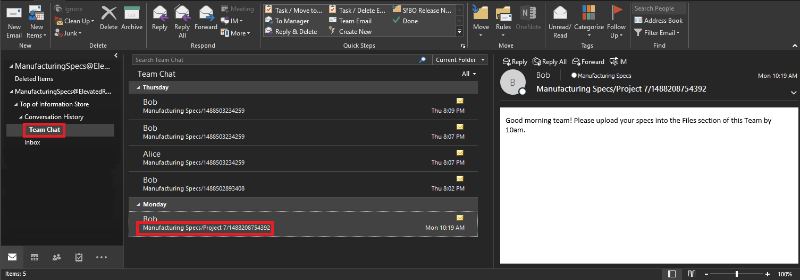

Conduzir uma investigação de Descoberta Eletrônica de conteúdo no Microsoft Teams
============================

As grandes empresas são muitas vezes expostas a processos judiciais com penalidades de alto nível, que exigem o envio de todas as informações armazenadas eletronicamente (ESI).

Todos os bate-papos em grupo ou Teams 1:1 são rastreados para as caixas de correio dos respectivos usuários e todas as mensagens do canal são rastreadas para a caixa de correio do grupo que representa a equipe. Os arquivos carregados são cobertos pela funcionalidade de Descoberta Eletrônica para SharePoint Online e OneDrive for Business.

1.  Para conduzir uma investigação de Descoberta Eletrônica com conteúdo no Microsoft Teams consulte [este link:](https://support.office.com/article/Manage-eDiscovery-cases-in-the-Office-365-Security-Compliance-Center-edea80d6-20a7-40fb-b8c4-5e8c8395f6da?ui=en-US&rs=en-US&ad=US#step1).

2.  Os dados do Microsoft Teams serão exibidos como **IM ou Conversas** na saída em Excel output, ou você pode montar o **.PST** no Outlook.

    a.  Ao montar o .PST para a equipe, observe que todas as conversas serão mantidas na pasta Bate-papo em Equipe no Histórico de Conversas. O título da mensagem corresponde à Equipe a ao Canal. Ao analisar a imagem abaixo, você pode ver essa mensagem que Bob enviou ao canal Projeto 7 da equipe de Especificações de Fabricação.

3.  Para ver bate-papos privados na Caixa de Correio de um usuário, eles também estão localizados dentro da pasta Bate-papo em Equipe no Histórico de Conversas.
