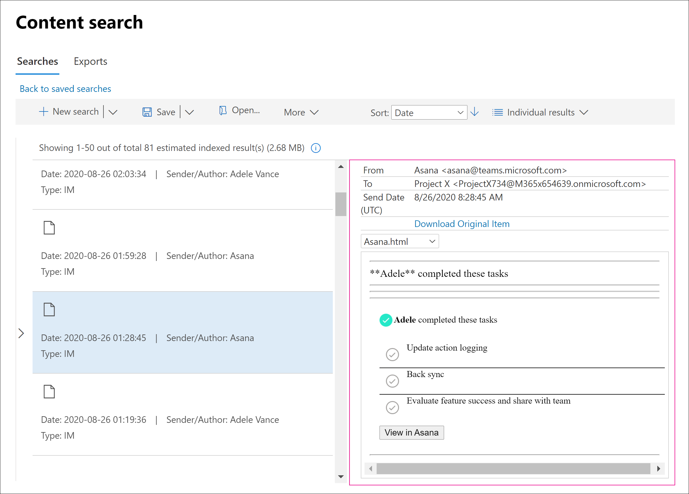

# <a name="conduct-an-ediscovery-investigation-of-content-in-microsoft-teams"></a>Conduzir uma investigação de Descoberta Eletrônica de conteúdo no Microsoft Teams

As grandes empresas geralmente são expostas a processos legais de alta penalidade que exigem o envio de todas as Informações Armazenadas Eletronicamente (ESI). O conteúdo do Microsoft Teams pode ser pesquisado e usado durante investigações de Descoberta e Descoberta.

## <a name="overview"></a>Visão Geral

Todos os chats do Microsoft Teams 1:1 ou de grupo são publicados no diário nas caixas de correio dos respectivos usuários. Todas as mensagens de canal padrão são enviadas para a caixa de correio do grupo que representa a equipe. Os arquivos carregados em canais padrão são abordados na funcionalidade de Descoberta Virtual do SharePoint Online e do OneDrive for Business.

A descoberta de mensagens e arquivos em [canais](private-channels.md) privados funciona de maneira diferente dos canais padrão. Para saber mais, consulte [eDiscovery of private channels](#ediscovery-of-private-channels).

Nem todo o conteúdo do Teams é eDiscoverable. A tabela a seguir mostra os tipos de conteúdo que você pode pesquisar usando ferramentas de Descoberta Online da Microsoft:

| Tipo de conteúdo | Descoberta eDiscoverable | Observações |
|:--- | :--- |:--- |
|Gravações de áudio | Não | |
|Conteúdo do cartão|Sim|Consulte [Pesquisar conteúdo de cartão](#search-for-card-content) para obter mais informações.|
|Links de chat | Sim | |
|Mensagens de chat | Sim |Isso inclui conteúdo em canais do Teams, chats 1:1, chats em grupo 1:N e chats com participantes do usuário convidado.  |
|Trechos de código | Não | |
|Mensagens editadas | Sim | Se o usuário estiver em espera, versões anteriores de mensagens editadas também serão preservadas. |
|Emojis, GIFs e adesivos | Sim | |
|Imagens em linha | Sim | |
|Conversas de IM de Reunião | Sim | |
|Metadados<sup>de reunião 1</sup> | Sim |  |
|Nome do canal | Não | |
|Mensagens de canal privado | Sim | |
|Aspas | Sim | O conteúdo cotado é pesquisável. No entanto, os resultados da pesquisa não indicam que o conteúdo foi citado. |
|Reações (como likes, hearts e outras reações) | Não | |
|Assunto | Sim | |
|Tabelas | Sim | |
|Notificações de feed | Não | |
|||

<sup>1</sup> Os metadados de reunião (e de chamada) incluem o seguinte:

- Hora de início e término da reunião e duração
- Eventos de participação e saída de reunião para cada participante
- Junção/chamadas VOIP
- Junção anônima
- Junção de usuário federado
- Participação do usuário convidado

  A imagem mostra um exemplo de metadados de reunião.

  > [!div class="mx-imgBorder"]
  > 

Veja um exemplo de uma conversa de IM entre participantes durante a reunião.


> [!div class="mx-imgBorder"]
> 

Para obter mais informações sobre como conduzir uma investigação de Descoberta eDiscovery, consulte [Get started with Core eDiscovery](/microsoft-365/compliance/get-started-core-ediscovery).

Os dados do Microsoft Teams serão exibidos como IM ou Conversas na saída de exportação de Descoberta Eletrônico do Excel. Você pode abrir o `.pst` arquivo no Outlook para exibir essas mensagens depois de exportá-las.

Ao exibir o arquivo .pst para a equipe, todas as conversas são mantidas na pasta Chat de Equipe em Histórico de Conversas. O título da mensagem contém o nome da equipe e o nome do canal. Por exemplo, a imagem abaixo mostra uma mensagem de Bob que postou uma mensagem no canal padrão do Project 7 da equipe de Especificações de Manufatura.


Chats privados na caixa de correio de um usuário são armazenados na pasta Chat de Equipe em Histórico de Conversas.

## <a name="ediscovery-of-private-channels"></a>Descoberta eDiscover de canais privados

Os registros das mensagens enviadas em um canal privado são entregues na caixa de correio de todos os membros do canal privado, e não em uma caixa de correio de grupo. Os títulos dos registros são formatados para indicar de qual canal privado eles foram enviados.

Como cada canal privado tem seu próprio site do SharePoint separado do site de equipe pai, os arquivos em um canal privado são gerenciados independentemente da equipe pai.

O Teams não dá suporte à pesquisa de Descoberta Online de um único canal dentro de uma equipe, portanto, toda a equipe deve ser pesquisada. Para executar uma pesquisa de Descoberta Eletrônico de conteúdo em um canal privado, pesquise pela equipe, o conjunto de sites associado ao canal privado (para incluir arquivos) e caixas de correio de membros do canal privado (para incluir mensagens).

Use as etapas a seguir para identificar arquivos e mensagens em um canal privado para incluir em sua pesquisa de Descoberta Online.

### <a name="include-private-channel-files-in-an-ediscovery-search"></a>Incluir arquivos de canal privado em uma pesquisa de Descoberta Online

Antes de executar essas etapas, instale o Shell de Gerenciamento do [SharePoint Online e conecte-se ao SharePoint Online](/powershell/sharepoint/sharepoint-online/connect-sharepoint-online).

1. Execute o seguinte para obter uma lista de todos os conjunto de sites do SharePoint associados a canais privados na equipe.

    ```PowerShell
    Get-SPOSite
    ```

2. Execute o seguinte script do PowerShell para obter uma lista de todas as URLs do conjunto de sites do SharePoint associadas a canais privados na equipe e à ID do grupo de equipe pai.

    ```PowerShell
    $sites = get-sposite -template "teamchannel#0"
    foreach ($site in $sites) {$x= get-sposite -identity $site.url -detail; $x.relatedgroupID; $x.url}
    ```

3. Para cada ID de equipe ou grupo, execute o seguinte script do PowerShell para identificar todos os sites de canal particular relevantes, onde $groupID é a ID de grupo da equipe.

    ```PowerShell
    $sites = get-sposite -template "teamchannel#0"
    $groupID = "e8195240-4a70-4830-9106-80193cf717cb"
    foreach ($site in $sites) {$x= Get-SpoSite -Identity $site.url -Detail; if ($x.RelatedGroupId -eq $groupID) {$x.RelatedGroupId;$x.url}}
    ```

### <a name="include-private-channel-messages-in-an-ediscovery-search"></a>Incluir mensagens de canal privado em uma pesquisa de Descoberta Online

Antes de executar essas etapas, certifique-se de ter a versão mais recente do [módulo do Teams PowerShell](teams-powershell-overview.md) instalada.

1. Execute o seguinte comando para obter uma lista de canais privados na equipe.

    ```PowerShell
    Get-TeamChannel -GroupId <GroupID> -MembershipType Private
    ```

2. Execute o seguinte comando para obter uma lista de membros do canal privado.

    ```PowerShell
    Get-TeamChannelUser -GroupId <GroupID> -DisplayName "Engineering" -Role Member
    ```

3. Inclua as caixas de correio de todos os membros de cada canal privado na equipe como parte de sua consulta de pesquisa de Descoberta [Eletrônico.](/microsoft-365/compliance/search-for-content-in-core-ediscovery)

## <a name="search-for-content-for-guest-users"></a>Pesquisar conteúdo para usuários convidados

Você pode usar as ferramentas de Descoberta Online para pesquisar conteúdo do Teams relacionado aos usuários convidados em sua organização. O conteúdo de chat do Teams associado a um usuário convidado é preservado em um local de armazenamento baseado em nuvem e pode ser pesquisado para usar a Descoberta Virtual. Isso inclui a pesquisa de conteúdo em conversas de chat 1:1 e 1:N nas quais um usuário convidado é um participante com outros usuários em sua organização. Você também pode pesquisar mensagens de canal privado nas quais um usuário convidado é um participante e pesquisar conteúdo em conversas de chat de *convidado:convidado,* onde os únicos participantes são usuários convidados.

Para pesquisar conteúdo para usuários convidados:

1. Conecte-se ao PowerShell do Azure AD. Para obter instruções, consulte a seção "Conectar-se ao PowerShell do Azure Active Directory" em Conectar-se ao [Microsoft 365 com o PowerShell](/microsoft-365/enterprise/connect-to-microsoft-365-powershell#connect-with-the-azure-active-directory-powershell-for-graph-module). Certifique-se de concluir a Etapa 1 e a Etapa 2 no tópico anterior.

2. Depois de se conectar com êxito ao Azure AD PowerShell, execute o seguinte comando para exibir o nome principal do usuário (UPN) para todos os usuários convidados em sua organização. Você precisa usar o UPN do usuário convidado ao criar a pesquisa na etapa 4.

   ```powershell
   Get-AzureADUser -Filter "userType eq 'Guest'" -All $true | FL UserPrincipalName
   ```

   > [!TIP]
   > Em vez de exibir uma lista de nomes principais do usuário na tela do computador, você pode redirecionar a saída do comando para um arquivo de texto. Você pode fazer isso de acordo `> filename.txt` com o comando anterior. O arquivo de texto com os nomes principais do usuário será salvo na pasta atual.

3. Em uma janela Windows PowerShell, conecte-se ao Centro de Conformidade e Segurança & PowerShell. Para obter instruções, [consulte Connect to Security & Compliance Center PowerShell](/powershell/exchange/connect-to-scc-powershell). Você pode se conectar ou sem usar a autenticação multifa factor.

4. Crie uma pesquisa de conteúdo que pesquise todo o conteúdo (como mensagens de chat e mensagens de email) na qual o usuário convidado especificado era um participante executando o comando a seguir.

   ```powershell
   New-ComplianceSearch <search name> -ExchangeLocation <guest user UPN>  -AllowNotFoundExchangeLocationsEnabled $true -IncludeUserAppContent $true
   ```

   Por exemplo, para pesquisar conteúdo associado à usuária convidada Sara Davis, execute o seguinte comando.

   ```powershell
   New-ComplianceSearch "Sara Davis Guest User" -ExchangeLocation "sara.davis_hotmail.com#EXT#@contoso.onmicrosoft.com" -AllowNotFoundExchangeLocationsEnabled $true -IncludeUserAppContent $true
   ```

    Para obter mais informações sobre como usar o PowerShell para criar pesquisas de conteúdo, consulte [New-ComplianceSearch](/powershell/module/exchange/new-compliancesearch).

5. Execute o seguinte comando para iniciar a pesquisa de conteúdo criada na etapa 4:

   ```powershell
   Start-ComplianceSearch <search name>
   ```

6. Vá até [https://compliance.microsoft.com](https://compliance.microsoft.com) e clique em Mostrar toda a **pesquisa**  >  **de conteúdo.**

7. Na lista de pesquisas, selecione a pesquisa que você criou na etapa 4 para exibir a página de sobrevoo.

8. Na página de sobrevoo, você pode fazer as seguintes coisas:

   - Clique **em Exibir resultados** para exibir os resultados da pesquisa e visualizar o conteúdo.

   - Ao lado do **campo Consulta,** clique em **Editar** para editar e, em seguida, reprise a pesquisa. Por exemplo, você pode adicionar uma consulta de pesquisa para restringir os resultados.

   - Clique **em Exportar resultados** para exportar e baixar os resultados da pesquisa.

## <a name="search-for-card-content"></a>Pesquisar conteúdo de cartão

O conteúdo do cartão gerado por aplicativos em canais do Teams, chats 1:1 e chats 1xN é armazenado em caixas de correio e pode ser pesquisado. Um *cartão* é um contêiner de interface do usuário para partes curtas de conteúdo. Os cartões podem ter várias propriedades e anexos e podem incluir botões que podem disparar ações de cartão. Para obter mais informações, consulte [Cards](/microsoftteams/platform/task-modules-and-cards/what-are-cards)

Como outros conteúdos do Teams, onde o conteúdo do cartão é armazenado é baseado em onde o cartão foi usado. O conteúdo dos cartões usados em um canal do Teams é armazenado na caixa de correio do grupo do Teams. O conteúdo do cartão para chats 1:1 e 1xN são armazenados nas caixas de correio dos participantes do chat.

Para pesquisar o conteúdo do cartão, você pode usar as `kind:microsoftteams` condições de `itemclass:IPM.SkypeTeams.Message` pesquisa ou. Ao analisar os resultados da pesquisa, o conteúdo do cartão gerado por bots em um canal do Teams tem a propriedade de email **Remetente/Autor** como , onde é o nome do aplicativo que gerou o conteúdo `<appname>@teams.microsoft.com` `appname` do cartão. Se o conteúdo do cartão foi gerado por um usuário, o valor de **Remetente/Autor** identifica o usuário.

Ao exibir o conteúdo do cartão nos resultados da pesquisa de conteúdo, o conteúdo aparece como um anexo à mensagem. O anexo é chamado `appname.html` , onde é o nome do aplicativo que gerou o conteúdo do `appname` cartão. As capturas de tela a seguir mostram como o conteúdo do cartão (para um aplicativo chamado Asana) aparece no Teams e nos resultados de uma pesquisa.

**Conteúdo de cartão no Teams**


**Conteúdo do cartão nos resultados da pesquisa**
  


> [!NOTE]
> Para exibir imagens do conteúdo do cartão nos resultados da pesquisa neste momento (como as marcas de seleção na captura de tela anterior), você precisa estar entrando no Teams (em uma guia diferente na mesma sessão do navegador que você usa para exibir os resultados da https://teams.microsoft.com) pesquisa. Caso contrário, os espaço reservados de imagem serão exibidos.

## <a name="advanced-ediscovery"></a>Advanced eDiscovery

Alguns conteúdos do Microsoft Teams também podem ser pesquisados e preservados usando o fluxo de [trabalho de Descoberta Eletrônico Avançada.](/microsoft-365/compliance/overview-ediscovery-20) Embora a Descoberta eDiscovery fornece uma variedade de funcionalidades de pesquisa, espera e exportação, a Descoberta Avançada fornece aos administradores de conformidade mais ferramentas para identificar fontes de dados e analisar seus conteúdos.

### <a name="advanced-ediscovery-custodian-workflow-for-teams-content"></a>Fluxo de trabalho custodiado de Descoberta Eletrônico Avançado para conteúdo do Teams

Os custodiantes podem ser membros de várias equipes. Você pode capturar conteúdo do Teams relevante para esses custodiantes. Para obter instruções sobre o fluxo de trabalho de custodiante, consulte [Add custodians to an Advanced eDiscovery case](/microsoft-365/compliance/add-custodians-to-case).

Depois de adicionar um custodiante, clique no **botão Próximo** e, em seguida, no **botão Adicionar.** Em seguida, uma janela exibe que solicita que você selecione locais adicionais, o que mostrará todas as associações do custodiante e os locais de site correspondentes do SharePoint para seus dados. Em todas essas fontes de dados e equipes, você pode escolher o conteúdo que deseja usar para a Descoberta e, em seguida, colocar esse usuário e todas as fontes de dados identificadas em espera.

Você pode selecionar se deve incluir o conteúdo do Exchange, o conteúdo do OneDrive ou ambos. O conteúdo do Exchange inclui todo o conteúdo do aplicativo nas caixas de correio do usuário, como seus emails, o conteúdo do Teams armazenado em sua caixa de correio e assim por diante. O conteúdo do OneDrive inclui não apenas o conteúdo do usuário, mas também todo o conteúdo do Teams armazenado no OneDrive, como chats 1:1, chats 1:N e arquivos compartilhados em chats.

Você também tem a opção de associar qualquer equipe da qual o custodiador seja membro para que as mensagens de chat de canal e os arquivos aos qual o custodiador tenha acesso sejam incluídos. Além disso, qualquer outra equipe pode ser associada a um custodiante.

> [!NOTE]
> A descoberta de mensagens e arquivos em [canais](private-channels.md) privados funciona de maneira diferente dos canais padrão. Para saber mais, consulte [eDiscovery of private channels](#ediscovery-of-private-channels).

### <a name="placing-a-data-source-on-hold"></a>Colocar uma fonte de dados em espera

Se não houver um usuário específico para designar como um custodiante, você poderá colocar uma fonte de dados inteira em espera. Para obter mais informações sobre retém, consulte [Manage holds in Advanced eDiscovery](/microsoft-365/compliance/managing-holds).

Ao criar uma responsabilidade para o conteúdo do Teams, você pode escolher todos os locais que deseja incluir na sua responsabilidade. Mesmo que os usuários estão excluindo ou alterando o conteúdo, a responsabilidade manterá cópias de todas as versões anteriores desse conteúdo.

Você também pode usar uma consulta opcional para definir condições de espera com base em palavras-chave, intervalo de datas, autor e muitos outros critérios. Se você não especificar palavras-chave, tudo dessa fonte de dados estará sujeito à ressarção.

### <a name="advanced-ediscovery-searches"></a>Pesquisas avançadas de Descoberta Desdiscovery

O conteúdo do Teams também pode ser pesquisado. Para obter mais informações sobre pesquisas, consulte [Coletar dados para um caso em Descoberta Avançada de EDiscovery](/microsoft-365/compliance/collecting-data-for-ediscovery). Uma pesquisa retornará uma conversa inteira se até mesmo uma mensagem corresponde à consulta de pesquisa.

Ao criar uma consulta de pesquisa, você pode escolher os custodiantes para que todas as fontes que você já selecionou sejam pesquisadas. Você também pode pesquisar fontes não custodiais, como um site do Teams que não é mapeado para um usuário. As consultas opcionais também estão disponíveis para restringir sua pesquisa no conteúdo do Teams.

Depois de criar uma pesquisa e selecionou-a, uma janela será exibida com detalhes e ações adicionais que você pode realizar na pesquisa selecionada. Se você clicar no botão **Estatísticas,** poderá exibir estatísticas sobre sua pesquisa, incluindo quebras de acordo com os tipos de local, a fonte original do conteúdo e se o conteúdo está localizado em uma caixa de correio de grupo, na caixa de correio de usuário individual ou em um site do SharePoint. Assim, você pode ver uma divisão de quais fontes estão contribuindo para seus resultados de pesquisa. Há também um **modo de exibição** Consultas disponível para que você possa ver quais palavras-chave individuais estão contribuindo para seus resultados.

Depois de finalizar sua pesquisa, você pode clicar no botão **Adicionar resultados** para revisar o conjunto e adicioná-lo a um conjunto de revisão. Para obter mais informações sobre conjuntos de revisão, consulte [Manage review sets in Advanced eDiscovery](/microsoft-365/compliance/managing-review-sets) and Review Sets [workflow](#review-sets-workflow) later in this article.

#### <a name="normal-review-sets-and-conversation-review-sets"></a>Conjuntos de revisão normais e conjuntos de revisão de conversa

Ao adicionar uma pesquisa a um conjunto de revisão, você pode escolher entre um conjunto de revisão normal ou um conjunto de revisão de conversa.

Um conjunto de revisão normal é semelhante a uma exportação; fornece os arquivos `.msg` individuais para o conteúdo do Teams e apresenta o conteúdo em uma exibição básica. Normalmente, você usaria um conjunto de revisão normal quando planeja usar outras ferramentas de software para reprocessar os arquivos mais tarde.

Um conjunto de revisão de conversa fornece uma exibição mais intuitiva e encadeada das conversas; ele exibe mensagens relacionadas em conjunto na ordem adequada.

> [!div class="mx-imgBorder"]
> 

Funcionalidades como redação estão disponíveis em ambos os tipos de conjuntos de revisão. Para obter mais informações sobre conjuntos de revisão, consulte [Review conversations in advanced eDiscovery](/microsoft-365/compliance/conversation-review-sets).

#### <a name="collection-options"></a>Opções de coleção

Ao adicionar a um conjunto de revisão, há várias  opções disponíveis como caixas de seleção na seção Opções de Coleção da janela, incluindo Opções de **Recuperação** de Conversa e Conversas **do Teams.** Se você habilitar essas opções, todas as mensagens individuais do Teams que fazem parte do conjunto de revisão também serão mostradas com mensagens adicionais ao redor delas para contexto. Por exemplo, se sua consulta for específica e apenas uma mensagem for retornada como resultado, habilbilização dessas opções também retornará várias mensagens que antecedem e seguirão a mensagem que corresponderam à consulta.

Muitos critérios lógicos são usados para determinar se mensagens adicionais fornecem contexto para mensagens que corresponderem à consulta. Por exemplo, para o conteúdo do Teams, a habilitação dessas opções recuperará a mensagem pai e todas as mensagens filho devido à maneira como as mensagens são encadeadas.

Carimbos de hora da mensagem também são verificados. Se uma mensagem corresponde à sua consulta, as mensagens vizinhas que a precedem dentro de um intervalo de 4 horas ou que a seguem dentro de um intervalo de 4 horas são consideradas como parte da conversa e também são incluídas nos resultados.

Se você precisar ter certeza sobre quais mensagens contextuais serão retornadas com as corresponde à consulta de pesquisa, não é necessário usar essas opções. Você pode coletar todo o conteúdo ou ampliar o intervalo de datas da pesquisa para que mais mensagens sejam retornadas como resultado da consulta.

### <a name="review-sets-workflow"></a>Revisão define fluxo de trabalho

Você pode exibir conjuntos de revisão existentes ou criar novos clicando na guia **Conjuntos de** Revisão. Para obter mais informações sobre conjuntos de revisão, consulte [Manage review sets in Advanced eDiscovery](/microsoft-365/compliance/managing-review-sets).

Além de documentos, você pode adicionar emails, mensagens do Teams, mensagens do Yammer e outros conteúdos ao conjunto de revisão. Em um conjunto de revisão, você também pode executar muitas das mesmas operações que você pode executar em outros contextos, como pesquisar conteúdo e criar consultas personalizadas. Essas operações só se aplicam a itens que foram adicionados ao conjunto de revisão.

O **botão Gerenciar Conjuntos de Revisão** fornece opções adicionais, como análise, relatório de resumo, quantos conjuntos de carga foram adicionados e assim por diante.

Para acessar visualizações e gráficos de seus dados, clique em **Resultados individuais** Exibição de perfil de pesquisa \>  no canto superior direito. Você pode clicar em cunhas nesses gráficos para selecionar interativamente o tipo de conteúdo que deseja consultar. Por exemplo, você pode optar por consultar somente conteúdo do Teams. Você também pode salvar essas consultas da mesma forma que salvaria consultas que você escreve manualmente.

#### <a name="summary-view-text-view-and-annotate-view"></a>Exibição de resumo, exibição de texto e exibição de anotações

Se você clicar em uma conversa do Teams no conjunto de revisão, ela exibirá o exibição Resumo **,** que exibe uma conversa inteira do Teams como uma lista de mensagens com as quais você pode interagir individualmente. Clique na seta para baixo à direita de uma mensagem para exibir um menu de contexto que permite exibir detalhes da mensagem ou baixar o arquivo `.msg` individual. Clicar em detalhes da mensagem mostrará um resumo dos metadados ou dos metadados completos da mensagem.

Para baixar um PDF, clique no botão baixar no canto superior direito do exibição de resumo.

Clique na **guia Exibição texto** para exibir uma exibição de texto simples do texto extraído da conversa do Teams. Esse conteúdo de texto simples é adequado para exportação e você pode facilmente trabalhar com ele usando outras ferramentas de software.

Clique na guia **Exibir anotações** para acessar recursos de anotação. Essa guia exibe o conteúdo em um formato que se parece com uma conversa do Teams, mas também há opções adicionais para edição. Há uma ferramenta de lápis que você pode usar para fazer anotações, desenhar na mensagem ou fazer um rascunho fino para fins de redação. Também há uma **ferramenta de redação** de área que você pode usar para desenhar um retângulo que esbalha a área e a marca como "Redacted".

Aqui está um exemplo de um arquivo redacted para conversa encadeada entre usuários.

> [!div class="mx-imgBorder"]
> 

Na parte inferior da guia **Exibir Anotações** está o botão **Marcar** documentos, que exibe o painel de marcação. Neste painel, você pode aplicar uma marca a todas as mensagens dentro da conversa do Teams. Você pode rotular uma conversa como responsiva ou não responsiva, privilegiada ou não privilegiada, se ela contém "Itens interessantes", se ela deve ser incluída na exportação e se ela precisa de revisão posterior. Você também pode gerenciar e aplicar outras marcas personalizáveis.

#### <a name="action-menu"></a>Menu Ação

Na janela conjuntos de revisão, você pode exportar o conteúdo clicando em **Exportar** \> **Ação**. Há muitas opções disponíveis ao exportar.

Para exportar um arquivo que contém todos os metadados para todas as mensagens do Teams, clique para selecionar a caixa de seleção **Carregar arquivo.** Para incluir no arquivo todas as marcas que você aplicou ao conteúdo, clique para selecionar a caixa de seleção **Marcas.**

Use a **opção Arquivos nativos** para exportar arquivos em seu formato nativo. Você pode optar por exportar uma conversa como um arquivo ou todas as mensagens de chat individuais em seus próprios arquivos separados.

A **opção Arquivos de texto** permite salvar versões de texto sem texto do conteúdo. Para obter mais informações sobre como obter uma exibição de texto simples das conversas do Teams no conjunto de revisão, consulte [Resumo, exibição](#summary-view-text-view-and-annotate-view) de texto e exibição de anotações acima.

Se você aplicou quaisquer redações ao conteúdo conforme descrito na seção [Resumo,](#summary-view-text-view-and-annotate-view) exibição de texto e exibição de anotações acima, você pode selecionar a opção Substituir nativos **redacted** por PDFs convertidos para substituir os arquivos nativos por cópias convertidas em PDF.

Você pode optar por exportar para um contêiner de armazenamento de blob fornecido pela Microsoft do Azure ou pode fornecer seu próprio contêiner de armazenamento do Azure Blob.

Quando estiver pronto para iniciar o processo de exportação, clique no **botão Exportar.** Confira [Baixar trabalhos de exportação](/microsoft-365/compliance/download-export-jobs) para obter mais informações sobre como você pode acessar o contêiner de armazenamento de blob do Azure e baixar o conteúdo exportado após a conclusão da exportação.

> [!NOTE]
> A exportação pode levar um longo período de tempo. Para acompanhar o status do processo de exportação, saia da guia **Revisar conjuntos** e clique na **guia Exportações.**

## <a name="related-topics"></a>Tópicos relacionados

- [Descoberta eDiscovery no Microsoft 365](/microsoft-365/compliance/ediscovery)
- [Visão Geral do PowerShell do Teams](teams-powershell-overview.md)