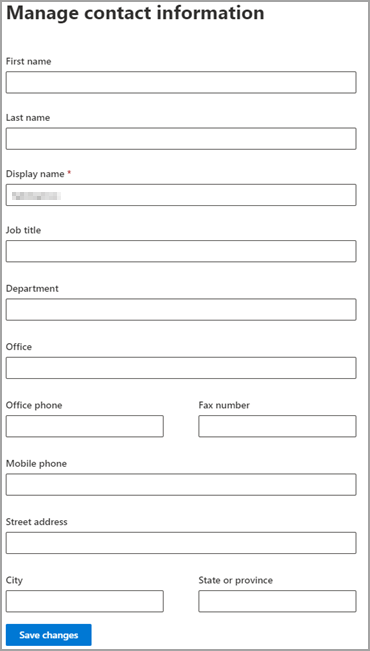

# Editar informações de convidados

Você pode editar informações de convidados do Centro de administração do Microsoft 365 ou do portal Azure Active Directory.

## Usuários convidados no Microsoft 365 administrador

1. Para editar as informações de convidados no [Centro de administração do Microsoft 365](https://admin.microsoft.com), selecione **Usuários**  >  **Convidados Usuários**.

   

2. Selecione um usuário de **Usuários convidados**.

3. Em informações de usuário convidado, selecione **Gerenciar informações de contato**.

   

4. Edite todos os campos que você escolher, exceto para **Nome** de exibição em Gerenciar informações **de contato** e selecione Salvar **alterações**.

   

Você também pode editar o convidado do portal [Azure Active Directory .](https://aad.portal.azure.com/#blade/Microsoft_AAD_IAM/UsersManagementMenuBlade/MsGraphUsers)
