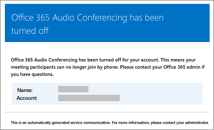

# <a name="emails-sent-to-users-when-their-settings-change-in-microsoft-teams"></a>E-mails enviados para os usuários quando suas configurações são alteradas no Microsoft Teams

Os emails serão enviados automaticamente aos usuários [habilitados para Audioconferência](set-up-audio-conferencing-in-teams.md) usando a Microsoft como provedor de audioconferência.

Por padrão, há quatro tipos de email que serão enviados aos usuários que estão habilitados para Audioconferência. No entanto, se você quiser limitar o número de emails enviados aos usuários, poderá desativá-lo. A Audioconferência no Microsoft 365 ou Office 365 enviará email para o email dos usuários quando:

- **Uma licença de Audioconferência é atribuída a eles ou quando você está alterando o provedor de audioconferência para a Microsoft.**

     Esse email inclui a ID de conferência, o número de telefone de conferência padrão para as reuniões, o PIN de audioconferência para o usuário e as instruções e o link para usar a Ferramenta de Atualização de Reunião do Teams usada para atualizar reuniões existentes para o usuário. Consulte [Atribuir licenças de complemento do Microsoft Teams](./teams-add-on-licensing/microsoft-teams-add-on-licensing.md).

    > [!NOTE]
    > [!OBSERVAçãO] Se a sua organização estiver habilitada para IDs de conferência dinâmicas, todas as reuniões de um usuário agendadas terão IDs de conferência exclusivas. Confira a [exibição e redefina uma ID de conferência atribuída a um usuário no artigo do Microsoft Teams](see-change-and-reset-a-conference-id-assigned-to-a-user-in-teams.md) para obter mais informações.

    Aqui está um exemplo desse email:

     

    Para saber mais sobre licenciamento, confira o licenciamento [de complemento do Microsoft Teams](./teams-add-on-licensing/microsoft-teams-add-on-licensing.md).

- **A ID de conferência ou número de telefone de conferência padrão de um usuário for alterado.**

    Este email contém a ID da conferência, o número de telefone de conferência padrão e as instruções e o link para usar a Ferramenta de Atualização de Reunião do Teams usada para atualizar reuniões existentes para o usuário. Mas esse email não inclui o PIN de audioconferência do usuário. Consulte [Redefinir o ID de conferência de um usuário](reset-a-conference-id-for-a-user-in-teams.md).

    Aqui está um exemplo desse email:

     

- **O PIN de audioconferência de um usuário é redefinido.**

    Este email contém o PIN de audioconferência do organizador, a ID de conferência existente e o número de telefone de conferência padrão do usuário. Consulte [Redefinir o PIN de Audioconferência](reset-the-audio-conferencing-pin-in-teams.md).

     Aqui está um exemplo desse email:

     
  
- **A licença de um usuário é removida ou quando o provedor de audioconferência muda da Microsoft para outro provedor ou Nenhum.**

    Isso acontece quando a **licença de Audioconferência** é removida de um usuário ou ao definir o provedor de audioconferência como **Nenhum**.

    Consulte [Atribuir ou remover licenças do Microsoft 365 para empresas](https://support.office.com/article/997596b5-4173-4627-b915-36abac6786dc).

    Aqui está um exemplo desse email:

     

> [!NOTE]
> [!INCLUDE [updating-admin-interfaces](includes/updating-admin-interfaces.md)]

## <a name="make-changes-to-the-email-messages-that-are-sent-to-them"></a>Alterar as mensagens de email enviadas a eles

Você pode fazer alterações no email que é enviado automaticamente aos usuários. Por padrão, o remetente dos emails será do Microsoft 365 ou Office 365, mas você pode alterar o nome de exibição usando Windows PowerShell. Consulte a [referência do PowerShell do Microsoft Teams](/powershell/module/teams/?view=teams-ps) para obter mais informações.

## <a name="what-if-you-dont-want-email-to-be-sent-to-them"></a>E se você não quiser que eles recebam emails?

Ao desativar o envio de emails para os usuários, o email não será enviado mesmo quando o usuário receber uma licença. Nesse caso, a ID de conferência, o número de telefone de conferência padrão e, mais importante, o PIN de audioconferência não serão enviados ao usuário. Quando isso acontecer, você deve informar ao usuário, enviando um email separado ou ligando para eles.

Por padrão, os emails serão enviados aos usuários, mas se você quiser impedir que eles recebam emails para audioconferência, você pode usar o Microsoft Teams ou Windows PowerShell.

### <a name="using-the-microsoft-teams-admin-center"></a>Usando o centro de administração do Microsoft Teams

1. Na navegação à esquerda, vá para **Reuniões** > **Pontes de conferência**.

2. Na parte superior da página **Pontes de** Conferência, clique em **Configurações de Ponte**.

3. No painel **configurações do Bridge** , habilite ou desabilite o envio automático de emails aos usuários se as configurações **de discagem mudarem**.

4. Clique em **Salvar**.

> [!Note]
> [!INCLUDE [updating-admin-interfaces](includes/updating-admin-interfaces.md)]

### <a name="using-windows-powershell"></a>Usar o Windows PowerShell

Você também pode usar o módulo PowerShell do Microsoft Teams e executar:

```PowerShell
Set-CsOnlineDialInConferencingTenantSettings -AutomaticallySendEmailsToUsers $true|$false
```

Você pode usar [Set-CsOnlineDialInConferencingTenantSettings](/powershell/module/skype/set-csonlinedialinconferencingtenantsettings) para gerenciar outras configurações para sua organização, incluindo email.

Consulte a [referência do PowerShell do Microsoft Teams](/powershell/module/teams/?view=teams-ps) para obter mais informações.

## <a name="want-to-know-more-about-windows-powershell"></a>Deseja saber mais sobre o Windows PowerShell?

Por padrão, o remetente dos emails será do Microsoft 365 ou Office 365, mas você pode alterar o endereço de email e o nome de exibição usando Windows PowerShell.

O Windows PowerShell gerencia os usuários e o que eles podem ou não fazer. Com Windows PowerShell, você pode gerenciar o Microsoft 365 ou Office 365 usando um único ponto de administração que pode simplificar seu trabalho diário quando você tem várias tarefas a serem executadas. Para começar a trabalhar com o Windows PowerShell, confira estes tópicos:

- [Por que você precisa usar o PowerShell do Office 365](/microsoft-365/enterprise/why-you-need-to-use-microsoft-365-powershell)

- [Melhores maneiras de gerenciar o Office 365 com o Windows PowerShell](/previous-versions//dn568025(v=technet.10))

Para obter mais informações sobre o Windows PowerShell, consulte a [referência do Microsoft Teams PowerShell](/powershell/module/teams/?view=teams-ps) para obter mais informações.

## <a name="related-topics"></a>Tópicos relacionados

[Ativar ou desativar o envio de e-mails quando alterar configurações de audioconferência](enable-or-disable-sending-emails-when-their-settings-change-in-teams.md)

[Enviar um email para um usuário com suas informações de conferência de áudio](send-an-email-to-a-user-with-their-dial-in-information-in-teams.md)
