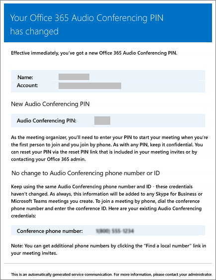

# E-mails enviados para os usuários quando suas configurações são alteradas no Microsoft TeamsEmails sent to users when their settings change in Microsoft Teams

Serão enviados e-mails automaticamente para usuários que estão [habilitados para audioconferência](set-up-audio-conferencing-in-teams.md) e usam a Microsoft como provedor de audioconferência.Emails will be automatically sent to users who are [enabled for Audio Conferencing](set-up-audio-conferencing-in-teams.md) using Microsoft as the audio conferencing provider.

Por padrão, existem quatro tipos de e-mail que são enviados aos usuários habilitados para audioconferência.By default, there are four types of email that will be sent to your users who are enabled for Audio Conferencing. No entanto, se você deseja limitar o número de e-mails enviados aos usuários, é possível desativá-los.However, if you want to limit the number of emails sent to users, you can turn it off. A audioconferência no Office 365 enviará um e-mail para o e-mail de seus usuários quando:Audio Conferencing in Office 365 will send email to your users' email when:

- **Uma licença de Audioconferência PSTN for atribuída a eles ou quando você alterar o provedor de audioconferência para a Microsoft.****An Audio Conferencing license is assigned to them or when you are changing the audio conferencing provider to Microsoft.**

     Esse e-mail inclui o ID de conferência, o número de telefone de conferência padrão para as reuniões, o PIN de audioconferência do usuário, além das instruções e do link para usar a Ferramenta de atualização de reunião do Skype for Business Online usada para atualizar reuniões existentes do usuário.This email includes the conference ID, the default conference phone number for the meetings, the audio conferencing PIN for the user, and the instructions and link to use the Skype for Business Online Meeting Update Tool that is used to update existing meetings for the user. Consulte [as equipes da Microsoft atribuir licenças](assign-teams-licenses.md) ou [Atribuir Microsoft como um provedor de serviços de audioconferência](/SkypeForBusiness/audio-conferencing-in-office-365/assign-microsoft-as-the-audio-conferencing-provider).See [Assign Microsoft Teams licenses](assign-teams-licenses.md) or [Assign Microsoft as the audio conferencing provider](/SkypeForBusiness/audio-conferencing-in-office-365/assign-microsoft-as-the-audio-conferencing-provider).

    > [!NOTE]
    > Se a sua organização estiver habilitada para IDs de conferência dinâmicos, todas as reuniões agendadas de um usuário terão IDs de conferência exclusivos.If your organization has been enabled for dynamic conference IDs, all of a user's meetings that they schedule will have unique conference IDs. Você pode configurar [IDs dinâmicos de audioconferência na sua organização](/skypeforbusiness/audio-conferencing-in-office-365/reset-a-conference-id-for-a-user).You can set up [Audio Conferencing dynamic IDs in your organization](/skypeforbusiness/audio-conferencing-in-office-365/reset-a-conference-id-for-a-user). 

    Aqui está um exemplo desse e-mail:Here is an example of this email:

     

    Para obter mais informações sobre licenciamento, consulte [Licenciamento de complemento de equipes da Microsoft](teams-add-on-licensing/microsoft-teams-add-on-licensing.md).To find out more about licensing, see [Microsoft Teams add-on licensing](teams-add-on-licensing/microsoft-teams-add-on-licensing.md).

- **O ID de conferência ou número de telefone de conferência padrão de um usuário é alterado.****The conference ID or default conference phone number of a user changes.**

    Esse email contém a ID de conferência, o número de conferência padrão, as instruções e links para usar a Ferramenta de atualização de reunião do Skype for Business Online usada para atualizar reuniões existentes do usuário.This email contains the conference ID, default conference phone number, and the instructions and link to use the Skype for Business Online Meeting Update Tool that is used to update existing meetings for the user. Mas esse e-mail não inclui o PIN de audioconferência do usuário.But this email doesn't include the user's audio conferencing PIN. Consulte [Redefinir o ID de conferência de um usuário](reset-a-conference-id-for-a-user-in-teams.md).See [Reset a conference ID for a user](reset-a-conference-id-for-a-user-in-teams.md).

    Aqui está um exemplo desse e-mail:Here is an example of this email:

     

- **O PIN de audioconferência de um usuário é redefinido.****The audio conferencing PIN of a user is reset.**

    Esse e-mail contém o PIN de audioconferência do organizador, o ID de conferência existente e o número de telefone de conferência padrão do usuário.This email contains the organizer's audio conferencing PIN, the existing conference ID, and default conference phone number for the user. Veja [Redefinir o PIN de audioconferência](reset-the-audio-conferencing-pin-in-teams.md).See [Reset the Audio Conferencing PIN](reset-the-audio-conferencing-pin-in-teams.md).
    
     Aqui está um exemplo desse e-mail:Here is an example of this email:
    
     
  
- **A licença do usuário for removida ou quando o provedor de audioconferência é alterado da Microsoft para outro provedor ou Nenhum.****A user's license is removed or when audio conferencing provider changes from Microsoft to other provider or None.**

    Isso ocorre quando a licença de **Audioconferência** é removida de um usuário ou quando o provedor de conferência discada é alterado da Microsoft para um provedor de serviços de audioconferência de terceiros ou é definido como **Nenhum**.This happens when the **Audio Conferencing** license is removed from a user or when changing the audio conferencing provider of a user from Microsoft to a third-party audio conferencing provider or when setting the provider to **None**. Esse e-mail contém as instruções e as informações para o usuário usar a Ferramenta de atualização de reunião do Skype for Business Online para remover informações específicas da audioconferência, como o número de telefone de conferência padrão ou o ID de conferência.This email contains the instructions and information for the user to use the Skype for Business Online Meeting Update Tool to remove audio conferencing specific information, such as the default conference phone number or conference ID.

    Consulte [Atribuir ou remover licenças do Office 365 for business](https://support.office.com/article/997596b5-4173-4627-b915-36abac6786dc).See [Assign or remove licenses for Office 365 for business](https://support.office.com/article/997596b5-4173-4627-b915-36abac6786dc).

    Aqui está um exemplo desse e-mail:Here is an example of this email:

     

> [!NOTE]
> [!INCLUDE [updating-admin-interfaces](includes/updating-admin-interfaces.md)]

## Alterar as mensagens de e-mail enviadas a elesMake changes to the email messages that are sent to them

Você pode fazer alterações para email que será enviado automaticamente aos usuários.You can make changes to the email that is automatically sent to users. Por padrão, o remetente dos e-mails será do Office 365, mas você pode alterar o nome para exibição usando o Windows PowerShell.By default, the sender of the emails will be from Office 365, but you can change the display name using Windows PowerShell. Consulte a [referência do Microsoft Teams PowerShell](https://docs.microsoft.com/powershell/module/teams/?view=teams-ps) para obter mais informações.See the [Microsoft Teams PowerShell reference](https://docs.microsoft.com/powershell/module/teams/?view=teams-ps) for more information.

## E se você não quiser que eles recebam e-mails?What if you don't want email to be sent to them?

Ao desativar o envio de e-mails aos usuários, o e-mail não será enviado mesmo quando o usuário receber uma licença.When you disable sending emails to users, email won't be sent even when a user gets assigned a license. Se esse for o caso, o ID de conferência, o número de telefone de conferência padrão e, mais importante, o PIN de audioconferência não serão enviados para o usuário.In this case, the conference ID, default conferencing phone number, and, more importantly, their audio conferencing PIN won't be sent to the user. Quando isso acontecer, você deverá informar ao usuário, enviando um e-mail separado ou ligando para ele.When this happens, you must tell the user by sending them a separate email or by calling them.

Seus usuários receberão e-mails por padrão, mas, se você deseja evitar que eles recebam e-mails sobre audioconferência, você pode usar o Microsoft Teams ou o Windows PowerShell.By default, emails will be sent to your users, but if you want to prevent them from receiving email for audio conferencing, you can use Microsoft Teams or Windows PowerShell. 

 **usando o Centro de administração de equipes da Microsoft** **Using the Microsoft Teams admin center**

1. Na navegação à esquerda, vá para **Reuniões** > **Pontes de conferência**.In the left navigation, go to **Meetings** > **Conference Bridges**. 

2. No topo da página **Pontes de conferência**, clique em **Configurações da ponte**.At the top of the **Conference Bridges** page, click **Bridge settings**. 

3. No painel **Configurações de ponte**, habilite ou desabilite **Enviar e-mails aos usuários automaticamente de suas configurações de discagem forem alteradas**.In the **Bridge settings** pane, enable or disable **Automatically send emails to users if their dial-in settings change**.

4. Clique em **Salvar**.Click **Save**.

> [!Note]
> [!INCLUDE [updating-admin-interfaces](includes/updating-admin-interfaces.md)]

**Usar o Windows PowerShell****Using Windows PowerShell**

Consulte a [referência do Microsoft Teams PowerShell](https://docs.microsoft.com/powershell/module/teams/?view=teams-ps) para obter mais informações.See the [Microsoft Teams PowerShell reference](https://docs.microsoft.com/powershell/module/teams/?view=teams-ps) for more information.

## Deseja saber mais sobre o Windows PowerShell?Want to know more about Windows PowerShell?

Por padrão, o remetente dos e-mails será o Office 365, mas é possível alterar o endereço de e-mail e o nome exibido com o Windows PowerShell.By default, the sender of the emails will be from Office 365, but you can change the email address and display name using Windows PowerShell. 

O Windows PowerShell gerencia os usuários e o que eles podem ou não fazer. Com o Windows PowerShell, você pode gerenciar o Office 365 usando um ponto único de administração para simplificar seu trabalho diário quando houver várias tarefas a serem feitas. Para começar a usar o Windows PowerShell, consulte estes tópicos:Windows PowerShell is all about managing users and what users are allowed or not allowed to do. With Windows PowerShell, you can manage Office 365 using a single point of administration that can simplify your daily work when you have multiple tasks to do. To get started with Windows PowerShell, see these topics:

  - [Por que você precisa usar o PowerShell do Office 365Why you need to use Office 365 PowerShell](https://go.microsoft.com/fwlink/?LinkId=525041)

  - [Melhores maneiras de gerenciar o Office 365 com o Windows PowerShellBest ways to manage Office 365 with Windows PowerShell](https://go.microsoft.com/fwlink/?LinkId=525142)

Para obter mais informações sobre o Windows PowerShell, consulte a [referência do Microsoft Teams PowerShell](https://docs.microsoft.com/powershell/module/teams/?view=teams-ps) para obter mais informações.For more information about Windows PowerShell, see the [Microsoft Teams PowerShell reference](https://docs.microsoft.com/powershell/module/teams/?view=teams-ps) for more information.

## Tópicos relacionadosRelated topics

[Ativar ou desativar o envio de e-mails quando alterar configurações de AudioconferênciaEnable or disable sending emails when Audio Conferencing settings change](enable-or-disable-sending-emails-when-their-settings-change-in-teams.md)

[Enviar um email para um usuário com suas informações de conferência de áudioSend an email to a user with their Audio Conferencing information](send-an-email-to-a-user-with-their-dial-in-information-in-teams.md)
