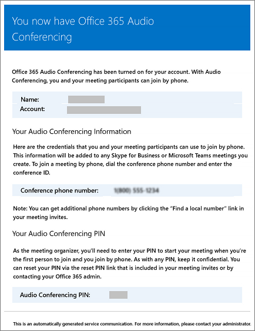

# <a name="enable-or-disable-sending-emails-when-audio-conferencing-settings-change-in-microsoft-teams"></a>Ativar ou desativar o envio de e-mails quando as configurações de audioconferência são alteradas no Microsoft Teams

Os usuários são automaticamente notificados por email quando estão habilitados para Audioconferência. No entanto, pode haver momentos em que você deseja reduzir o número de emails enviados para Microsoft Teams usuários. Nesses casos, você pode desabilitar o envio de emails.
  
Se você desabilitar o envio de emails, os emails de Audioconferência não serão enviados para seus usuários, incluindo emails para quando os usuários estão habilitados ou desabilitados para a audioconferência, quando o PIN é redefinido e quando a ID da conferência e o número de telefone de conferência padrão são trocados.
  
Aqui está um exemplo do email que é enviado aos usuários quando eles estão habilitados para Audioconferência:
  

  
## <a name="when-are-emails-being-sent-to-your-users"></a>Quando os emails são enviados para seus usuários?

- Há vários emails enviados aos usuários em sua organização depois que eles são habilitados para audioconferência:

  - Quando uma **licença de Audioconferência** é atribuída a eles.

  - Quando você redefine manualmente o PIN de audioconferência do usuário.

  - Quando você redefine manualmente o ID de conferência do usuário.

  - Quando a **licença de Audioconferência** é removida delas.

  - Quando o provedor de audioconferência de um usuário é alterado da Microsoft para outro provedor ou **Nenhum**.

  - Quando o provedor de audioconferência de um usuário é alterado para a Microsoft.

## <a name="enable-or-disable-email-from-being-sent-to-users"></a>Habilitar ou desabilitar o envio de emails aos usuários

Você pode usar Microsoft Teams ou Windows PowerShell para habilitar ou desabilitar emails enviados aos usuários.

### <a name="using-the-microsoft-teams-admin-center"></a>Usando o centro de administração do Microsoft Teams

1. Na navegação à esquerda, vá para **Reuniões** > **Pontes de conferência**.

2. Na parte superior da página **Pontes de Conferência,** clique em **Configurações de ponte.**

3. No painel **Configurações de** ponte, habilita ou desabilita Enviar emails automaticamente aos usuários se suas configurações de **discagem mudarem**.

4. Clique em **Salvar**.

> [!Note]
> [!INCLUDE [updating-admin-interfaces](includes/updating-admin-interfaces.md)]

### <a name="using-windows-powershell"></a>Usar o Windows PowerShell

Você também pode usar o módulo Microsoft Teams PowerShell e executar:

```PowerShell
Set-CsOnlineDialInConferencingTenantSettings -AutomaticallySendEmailsToUsers $true|$false
```

Você pode usar [o Set-CsOnlineDialInConferencingTenantSettings](/powershell/module/skype/set-csonlinedialinconferencingtenantsettings) para gerenciar outras configurações para sua organização, incluindo email.

Consulte a [Microsoft Teams referência do PowerShell](/powershell/module/teams/?view=teams-ps) para obter mais informações.

## <a name="want-to-know-more-about-windows-powershell"></a>Deseja saber mais sobre o Windows PowerShell?

O Windows PowerShell gerencia os usuários e o que eles podem ou não fazer. Com Windows PowerShell, você pode gerenciar Microsoft 365 ou Office 365 usando um único ponto de administração que pode simplificar seu trabalho diário quando você tem várias tarefas a fazer. Para começar a trabalhar com o Windows PowerShell, confira estes tópicos:

- [Por que você precisa usar o PowerShell do Office 365](/microsoft-365/enterprise/why-you-need-to-use-microsoft-365-powershell)

- [Melhores maneiras de gerenciar o Office 365 com o Windows PowerShell](/previous-versions//dn568025(v=technet.10))

Para obter mais informações sobre o Windows PowerShell, consulte a [referência do Microsoft Teams PowerShell](/powershell/module/teams/?view=teams-ps) para obter mais informações.

## <a name="related-topics"></a>Tópicos relacionados

[Emails enviados aos usuários quando suas configurações de Audioconferência mudam](emails-sent-to-users-when-their-settings-change-in-teams.md)

[Enviar um email para um usuário com suas informações de audioconferência](send-an-email-to-a-user-with-their-dial-in-information-in-teams.md)
