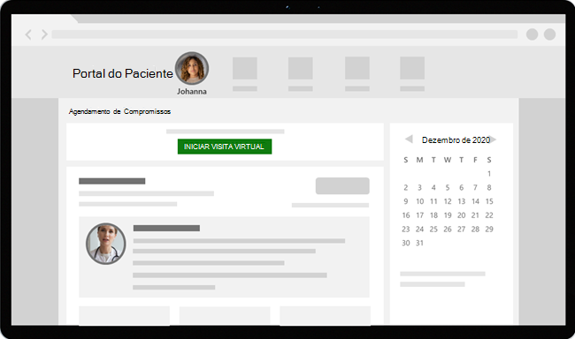

# Compromissos virtuais com o Teams – Integração ao Epic EHR

O Microsoft Teams EHR (Registro Eletrônico de Integridade) facilita o início de uma consulta ou consulta de pacientes virtuais com outro provedor no Microsoft Teams diretamente do sistema Epic EHR. Criado na nuvem Microsoft 365, o Teams permite colaboração e comunicação simples e seguras com ferramentas de chat, vídeo, voz e serviços de saúde em um único hub que dá suporte à conformidade com HIPAA, certificação HITECH e muito mais.

A plataforma de comunicação e colaboração Teams torna mais fácil para os médicos cortarem a confusão de sistemas fragmentados para que possam se concentrar em fornecer o melhor atendimento possível. Com o Teams EHR, você pode:

- Inicie Teams compromissos virtuais do seu sistema Epic EHR com um fluxo de trabalho clínico integrado.
- Permitir que os pacientes ingressem Teams compromissos virtuais de dentro do portal do paciente ou por meio de SMS.
- Suporte a outros cenários, incluindo vários participantes, visitas a grupos e serviços de intérprete.
- Grave os metadados no sistema EHR Teams compromissos virtuais a serem gravados quando os participantes se conectarem, se desconectarem e habilitarem a auditoria automática e a manutenção de registros.
- Exiba relatórios de dados de consumo e informações personalizáveis de Qualidade de Chamadas para compromissos conectados ao EHR.

Este artigo descreve como configurar o conector Teams EHR para integração com a plataforma Epic em sua organização de saúde. Ele também fornece uma visão geral da experiência de Teams de compromissos virtuais do sistema Epic EHR.

## Antes de você começar

Antes de começar, há algumas coisas a fazer para se preparar para a integração.

### Familiarize-se com o processo de integração

Examine as informações a seguir para entender o processo de integração geral.

:::image type="content" source="media/ehr-connector-epic-flow.png" alt-text="Imagem resumindo as etapas no processo de integração geral.":::

||||||
|---------|---------|---------|---------|---------|
|**Ação**: você [solicita acesso ao Teams aplicativo](#request-access-to-the-teams-app).   **Resultado**: autorizamos sua organização para teste.|**Ação**: criamos um certificado de chave pública e privada e os carregamos no Epic.   **Resultado**: a Epic sincroniza o certificado de chave pública.|**Ação**: conclua as etapas de configuração no portal de configuração do conector EHR.   **Resultado**: você recebe registros FDI para a configuração do Epic.| **Ação**: você trabalha com o especialista técnico da Epic para configurar registros FDI na Epic.  **Resultado**: configuração concluída. Pronto para testar.|**Ação**: você conclui o teste em seu ambiente de teste.  **Resultado**: validação completa de fluxos e decisão de migração para produção.|

### Solicitar acesso ao aplicativo Teams aplicativo

Você precisará solicitar acesso ao aplicativo Teams aplicativo.

1. Solicitação para baixar o aplicativo Teams aplicativo no [marketplace epic app Demarmar.](https://apporchard.epic.com/Gallery?id=6153) Isso dispara uma solicitação da Epic para a equipe de conector do Microsoft EHR.
1. Depois de fazer sua solicitação, envie um email  para TeamsForHealthcare@service.microsoft.com com o nome da sua organização, a ID do locatário e o endereço de email do contato técnico da Epic.
1. A equipe de conectores do Microsoft EHR responderá ao seu email com a confirmação da habilitação.

### Examine o guia Epic-Microsoft Teams Integração de Telehealth

Consulte o [Guia de integração de Telessaúde do Epic-Microsoft Teams](https://galaxy.epic.com/Search/GetFile?Url=1!68!100!100100357) com o especialista técnico do seu Epic. Verifique se todos os pré-requisitos foram atendidos.

## Pré-requisitos

- Uma assinatura ativa para Microsoft Cloud for Healthcare ou uma assinatura para Microsoft Teams oferta autônoma do conector EHR (imposta somente ao testar em um ambiente de EHR de produção).
- Versão épica de novembro de 2018 ou posterior.
- Os usuários têm uma licença Microsoft 365 ou Office 365 que inclui Teams reuniões.
- Teams é adotado e usado em sua organização de saúde.
- Seus sistemas atendem a todos os [requisitos de software e navegador](../../hardware-requirements-for-the-teams-app.md) para Teams.

> [!IMPORTANT]
> Conclua as etapas de pré-integração e todos os pré-requisitos sejam atendidos antes de avançar com a integração.

As etapas de integração são executadas pelas seguintes pessoas em sua organização:

- **Microsoft 365 administrador global**: a pessoa principal responsável pela integração. O administrador configura o conector, habilita SMS (se necessário) e adiciona o analista de clientes da Epic que aprovará a configuração.
- **Analista de clientes épico**: uma pessoa em sua organização que tem credenciais de logon na Epic. Eles aprovam as definições de configuração inseridas pelo administrador e fornecem os registros de configuração para a Epic.

O Microsoft 365 administrador e o analista de clientes da Epic podem ser a mesma pessoa.

## Configurar o conector Teams EHR

A configuração do conector requer que você:

- [Iniciar o portal de configuração do conector EHR](#launch-the-ehr-connector-configuration-portal)
- [Inserir informações de configuração](#enter-configuration-information)
- [Habilitar SMS notificações (opcional)](#enable-sms-notifications-optional)
- [Aprovar ou exibir a configuração](#approve-or-view-the-configuration)
- [Análise e conclua a configuração](#review-and-finish-the-configuration)

### Iniciar o portal de configuração do conector EHR

Para começar, o administrador do Microsoft 365 inicia o portal de configuração do conector [EHR](https://ehrconnector.teams.microsoft.com) e entra usando suas Microsoft 365 credenciais.

Seu Microsoft 365 administrador pode configurar uma única organização ou várias organizações para testar a integração. Configure a URL de teste e produção no portal de configuração. Certifique-se de testar a integração do ambiente de teste da Epic antes de passar para a produção.

> [!NOTE]
> O Microsoft 365 administrador e o analista de clientes da Epic devem concluir as etapas de integração no portal de configuração. Para obter as etapas de configuração da Epic, entre em contato com o especialista técnico da Epic atribuído à sua organização.

### Inserir informações de configuração

Em seguida, para configurar a integração, seu Microsoft 365 administrador faz o seguinte:

1. Adiciona uma URL base do FHIR (Fast Health Interoperability Resources) do especialista técnico epic e especifica o ambiente. Configure quantas URLs base do FHIR forem necessárias, dependendo das necessidades da sua organização e dos ambientes que você deseja testar.

    - A URL base do FHIR é um endereço estático que corresponde ao ponto de extremidade da API FHIR do servidor. Um exemplo de URL é `https://lamnahealthcare.org/fihr/auth/connect-ocurprd-oauth/api/FHDST`.

    - Você pode configurar a integração para ambientes de teste e produção. Para a configuração inicial, incentivamos você a configurar o conector de um ambiente de teste antes de passar para a produção.

1. Adiciona o nome de usuário do analista de clientes da Epic que aprovará a configuração em uma etapa posterior.

    :::image type="content" source="media/ehr-connector-epic-configure.png" alt-text="Captura de tela da página Configuração mostrando o aprovador sendo adicionado." lightbox="media/ehr-connector-epic-configure.png":::

### Habilitar SMS notificações (opcional)

> [!NOTE]
> SMS as notificações estão disponíveis apenas no Estados Unidos. Estamos trabalhando para disponibilizar esse recurso em outras regiões em versões futuras do Teams e atualizaremos este artigo quando disponíveis.

Conclua esta etapa se sua organização quiser que a Microsoft gerencie SMS notificações para seus pacientes. Quando você habilita SMS notificações, seus pacientes receberão mensagens de confirmação e lembrete para compromissos agendados.

Para habilitar SMS notificações, o Microsoft 365 administrador do Microsoft 365 faz o seguinte:

1. Na página SMS notificações, marque as duas caixas de seleção de consentimento para:

    - Permita que a Microsoft envie SMS notificações para pacientes em nome de sua organização.
    - Confirme que você garantirá que os participantes consentirem em enviar e receber SMS mensagens.
    
    :::image type="content" source="media/ehr-connector-epic-sms-notifications.png" alt-text="Captura de tela da SMS de notificações, mostrando as caixas de seleção de consentimento e a opção de gerar um número de telefone." lightbox="media/ehr-connector-epic-sms-notifications.png":::

1. Em **Seus números de telefone**, selecione **Gerar um novo número de telefone** para gerar um número de telefone para sua organização. Isso inicia o processo para solicitar e gerar um novo número de telefone. Esse processo pode levar até 2 minutos para ser concluído.

    Depois que o número de telefone é gerado, ele é exibido na tela. Esse número será usado para enviar SMS e lembretes para seus pacientes. O número foi provisionado, mas ainda não está vinculado à URL base do FHIR. Faça isso na próxima etapa.

    :::image type="content" source="media/ehr-connector-epic-phone-number.png" alt-text="Captura de tela mostrando um exemplo do número de telefone gerado." lightbox="media/ehr-connector-epic-phone-number.png":::

    Escolha **Concluído** e, em seguida, **selecione Avançar**.

1. Para vincular o número de telefone a uma URL base do FHIR, em Telefone **na** seção SMS **configuração**, selecione o número. Faça isso para cada URL base do FHIR para a qual você deseja habilitar SMS notificações.

    :::image type="content" source="media/ehr-connector-epic-link-phone-number.png" alt-text="Captura de tela mostrando como vincular um número de telefone a uma URL base do FHIR." lightbox="media/ehr-connector-epic-link-phone-number.png":::

    Se esta for a primeira vez que você está configurando o conector, você verá a URL base do FHIR que foi inserida na etapa anterior. O mesmo número de telefone pode ser vinculado a várias URLs base do FHIR, o que significa que os pacientes receberão SMS notificações do mesmo número de telefone para organizações e/ou departamentos diferentes.

1. Selecione **SMS configuração** ao lado de cada URL base do FHIR para configurar os tipos de SMS para enviar aos pacientes.

    :::image type="content" source="media/ehr-connector-epic-sms-setup.png" alt-text="Captura de tela mostrando SMS configurações." lightbox="media/ehr-connector-epic-sms-setup.png":::

    - **Confirmação SMS**: as notificações são enviadas aos pacientes quando um compromisso é agendado, atualizado ou cancelado no sistema EHR.
    - **Lembrete SMS**: as notificações são enviadas aos pacientes de acordo com o intervalo de tempo especificado e a hora agendada do compromisso.

    Escolha **Salvar**.

1. Selecione **Upload certificado para** carregar um certificado de chave pública. Você deve carregar um certificado .cer codificado em Base64 (somente chave pública) para cada ambiente.

    Um certificado de chave pública é necessário para receber informações de compromisso para enviar SMS notificações. O certificado é necessário para verificar se as informações de entrada são de uma fonte válida.

    Quando o conector é usado para enviar SMS lembretes, o número de telefone do paciente é enviado pela Epic em uma carga HL7v2 quando os compromissos são criados na Epic. Esses números são armazenados para cada compromisso na geografia da sua organização e são mantidos até que o compromisso ocorra. Para saber mais sobre como configurar mensagens HL7v2, consulte o Guia de Integração do [Epic-Microsoft Teams Telehealth](https://galaxy.epic.com/Search/GetFile?Url=1!68!100!100100357).

    Escolha **Avançar**.

> [!NOTE]
> A qualquer momento, seu Microsoft 365 administrador pode atualizar qualquer uma das SMS configurações. Tenha em mente que alterar as configurações pode resultar em uma página de interrupção SMS serviço. Para obter mais informações sobre como exibir SMS relatórios, [consulte Teams de administrador do conector EHR](ehr-admin-reports.md).

### Aprovar ou exibir a configuração

O analista de clientes da Epic em sua organização que foi adicionado como aprovador inicia o portal de configuração do conector [EHR](https://ehrconnector.teams.microsoft.com) e entra usando suas Microsoft 365 credenciais. Após a validação bem-sucedida, o aprovador é solicitado a entrar usando suas credenciais Epic para validar a organização Epic.

> [!Note]
> Se o Microsoft 365 administrador e o analista de clientes da Epic forem a mesma pessoa, você ainda precisará entrar no Epic para validar seu acesso. A entrada do Epic é usada apenas para validar a URL base do FHIR. A Microsoft não armazenará credenciais nem acessará dados de EHR com essa entrada.

:::image type="content" source="media/ehr-connector-epic-login-approve.png" alt-text="Captura de tela da página Aprovar ou Exibir Configuração, mostrando a opção De logon e aprovação." lightbox="media/ehr-connector-epic-login-approve.png":::

Após a entrada bem-sucedida na Epic, o analista de clientes da Epic **deve** aprovar a configuração. Se a configuração não estiver correta, o administrador Microsoft 365 poderá entrar no portal de configuração e alterar as configurações.

:::image type="content" source="media/ehr-connector-epic-approve.png" alt-text="Captura de tela da página Aprovar ou Exibir Configuração, mostrando a opção Aprovar." lightbox="media/ehr-connector-epic-approve.png":::

### Análise e conclua a configuração

Quando as informações de configuração forem aprovadas pelo administrador da Epic, você verá os registros de integração para o paciente e o provedor iniciarem. Os registros de integração incluem:

- Registros de pacientes e provedores
- Registro de SMS direto
- SMS de configuração
- Registro de configuração de teste do dispositivo

O token de contexto para teste de dispositivo pode ser encontrado no registro de integração do paciente. O analista de clientes da Epic deve fornecer esses registros à Epic para concluir a configuração de compromissos virtuais na Epic. Para obter mais informações, consulte o [Guia de Integração Microsoft Teams Epic-Microsoft Teams Telehealth](https://galaxy.epic.com/Search/GetFile?Url=1!68!100!100100357).

> [!Note]  
> A qualquer momento, o Microsoft 365 ou o analista de clientes da Epic pode entrar no portal de configuração para exibir registros de integração e alterar a configuração da organização, conforme necessário.

:::image type="content" source="media/ehr-connector-epic-finish.png" alt-text="Captura de tela da página Examinar e Concluir, mostrando informações de integração." lightbox="media/ehr-connector-epic-finish.png":::

> [!Note]
> O analista de clientes da Epic deve concluir o processo de aprovação para cada URL base FHIR configurada pelo Microsoft 365 administrador.

## Iniciar Teams compromissos virtuais

Depois de concluir as etapas do conector EHR e a configuração da Epic, sua organização estará pronta para dar suporte a compromissos de vídeo com Teams.

### Pré-requisitos de compromissos virtuais

- Seus sistemas devem atender a todos os [requisitos de software e navegador](../../hardware-requirements-for-the-teams-app.md) para Teams.

- Você concluiu a configuração de integração entre a organização Epic e Microsoft 365 organização.

### Experiência do provedor

Os provedores de serviços de saúde de sua organização podem ingressar em compromissos usando Teams aplicativos de provedor Epic (Hyperspace, Haiku, Canto). O botão **Iniciar visita virtual** está incorporado no fluxo do provedor.

  

Principais recursos da experiência do provedor:

- Os provedores podem ingressar em compromissos usando navegadores com suporte ou o Teams aplicativo.

- Os provedores devem fazer uma entrada única com sua conta Microsoft 365 ao ingressar em um compromisso pela primeira vez.

- Após a entrada única, o provedor é levado diretamente para o compromisso virtual em Teams. (O provedor deve estar conectado ao Teams).

- Os provedores podem ver atualizações em tempo real dos participantes que se conectam e se desconectam para um determinado compromisso. Os provedores podem ver quando o paciente está conectado a uma consulta.

> [!NOTE]
> Todas as informações inseridas no chat de reunião necessárias para fins de continuidade ou retenção de registros médicos devem ser baixadas, copiadas e anotadas pelo provedor de serviços de saúde. O chat não constitui um registro médico legal ou um conjunto de registros designado. As mensagens do chat são armazenadas com base nas configurações criadas pelo Microsoft Teams administrador.

### Experiência do paciente

O conector dá suporte a pacientes que ingressam em compromissos por meio de um link SMS mensagem de texto, MyChart Web e celular. No momento do compromisso, os pacientes podem iniciar o compromisso no MyChart usando o botão Iniciar visita **virtual** ou tocando no link na mensagem SMS texto.

  

Características principais da experiência do paciente:

- Os pacientes podem ingressar em compromissos de navegadores da Web modernos na área de trabalho e em dispositivos móveis sem precisar [instalar o Teams aplicativo](../browser-join.md).
- Os pacientes podem testar o hardware e a conexão do dispositivo antes de ingressar em um compromisso.

    :::image type="content" source="media/ehr-admin-epic-device-test.png" alt-text="Imagens de um dispositivo móvel, mostrando os recursos de teste do dispositivo." lightbox="media/ehr-admin-epic-device-test.png":::
  
    Recursos de teste de dispositivo:

  - Os pacientes podem testar o alto-falante, o microfone, a câmera e a conexão.
  - Os pacientes podem concluir uma chamada de teste para validar totalmente sua configuração.
  - Os resultados do teste de dispositivo podem ser enviados de volta para o sistema EHR.

- Os pacientes podem ingressar em compromissos com um único clique e nenhuma outra conta ou entrada é necessária.

- Os pacientes não precisam criar uma conta da Microsoft ou entrar para iniciar um compromisso.

- Os pacientes são colocados em um lobby até que o provedor ingresse e os admita.

- Os pacientes podem testar o vídeo e o microfone no lobby antes de ingressar na consulta.

> [!Note]
> Epic, MyChart, Haiku e Canto são marcas comerciais da Epic Systems Corporation.

## Obter informações sobre o uso de compromissos virtuais

O [relatório de uso de](../../teams-analytics-and-reports/virtual-visits-usage-report.md) Visitas Virtuais no centro de administração Microsoft Teams oferece aos administradores uma visão geral Teams atividade de compromissos virtuais em sua organização. O relatório mostra análises detalhadas para compromissos virtuais, incluindo Teams reuniões integradas ao EHR realizadas do sistema EHR.

Você pode exibir as principais métricas, como o tempo de espera do lobby e a duração do compromisso. Use essas informações para obter informações sobre tendências de uso para ajudá-lo a otimizar compromissos virtuais para fornecer melhores resultados de negócios.

### Privacidade e localização de dados

Teams integração com sistemas EHR otimiza a quantidade de dados usados e armazenados durante fluxos de integração e compromisso virtual. A solução segue os princípios e diretrizes gerais de privacidade e gerenciamento de dados do Teams, descritos em Privacidade do Teams.

O Teams EHR não armazena nem transfere dados pessoais identificáveis ou quaisquer registros de saúde de pacientes ou provedores de serviços de saúde do sistema EHR. Os únicos dados armazenados pelo conector EHR são a ID exclusiva do usuário EHR, que é usada durante a configuração da reunião do Teams.

A ID exclusiva do usuário EHR é armazenada em uma das três regiões geográficas descritas em [Onde seus dados de cliente Microsoft 365 são armazenados](/microsoft-365/enterprise/o365-data-locations). Todos os chats, gravações e outros dados compartilhados Teams por participantes da reunião são armazenados de acordo com as políticas de armazenamento existentes. Para saber mais sobre a localização dos dados Teams, consulte [Local dos dados Teams](../../location-of-data-in-teams.md).

## Artigos relacionados

- [Teams de uso de Visitas Virtuais](../../teams-analytics-and-reports/virtual-visits-usage-report.md)
- [Teams de administração do conector EHR](ehr-admin-reports.md)
- [Introdução com o Teams para organizações de saúde](teams-in-hc.md)
