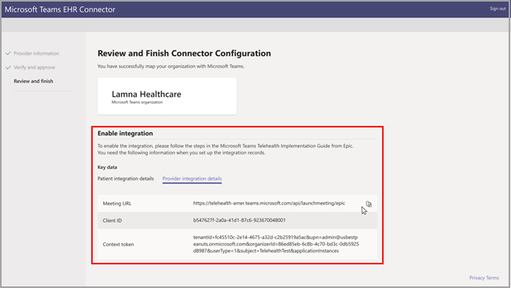

# Visitas virtuais com o Teams-integração ao EHR

O conector do Microsoft Teams Electronic Health Record (EHR) facilita para os clínicos iniciarem uma visita ou consultoria do paciente virtual com outro provedor no Teams diretamente do sistema EHR. Baseado na nuvem do Microsoft 365, o Microsoft Teams permite colaboração simples e segura e comunicação com as ferramentas de chat, vídeo, voz e saúde em um único Hub compatível com a HIPAA, a certificação de alta tecnologia e muito mais.

A plataforma de comunicação e colaboração de equipes torna mais fácil para os clínicos reduzirem o truncamento dos sistemas fragmentados para que possam perder tempo oferecendo o melhor cuidado possível. O conector EHR (Microsoft Teams Electronic Health Record) pode:

- Inicie visitas virtuais do teams de provedores e portais de pacientes.

- Escreva novamente em metadados do EHR em eventos de conexão e desconexão para habilitar a auditoria automática e a manutenção de registros.

- Integre-se a fluxos de trabalho clínicos e de pacientes existentes, permitindo que eles usem o Microsoft Teams.

  Assista ao vídeo sobre como gerenciar visitas virtuais no portal EHR.

> [!VIDEO https://www.microsoft.com/videoplayer/embed/RE4HAtn]

## Antes de você começar

Você precisará certificar-se de ter os seguintes pré-requisitos antes de integrar o conector EHR:

- Assinatura ativa para o Microsoft Cloud para assistência médica ou assinatura para a oferta autônoma do Microsoft Teams EHR Connector.

- Os usuários devem ter uma licença do Microsoft 365 ou do Office 365 apropriada que inclua reuniões do Microsoft Teams.

- O Microsoft Teams deve ser adotado e usado dentro da organização.

- As organizações devem ter a versão testamento de novembro de 2018 ou posterior.

- Seus sistemas devem atender todos os [pré-requisitos do software e do navegador](https://docs.microsoft.com/microsoftteams/hardware-requirements-for-the-teams-app).

Você também precisará de informações das seguintes pessoas em sua organização:

- Administrador do Microsoft 365

- Administrador do testamento

> [!Note]
> Solicite ao seu administrador do testamento que forneça o guia de integração de teleintegridade do teams Epic-Microsoft disponível no testamento Marketplace.

## Configuração do conector

A instalação do conector exige que você:

- [Iniciar o portal de configuração do conector EHR](ehr-admin.md#launch-the-ehr-connector-configuration-portal)
- [Configurar informações da organização do provedor](ehr-admin.md#configure-provider-organization-information)
- [Verificar e aprovar a configuração](ehr-admin.md#verify-and-approve-the-configuration)
- [Revisar e concluir a configuração](ehr-admin.md#review-and-finish-the-configuration)

### [Iniciar o portal de configuração do conector EHR](#launch-the-ehr-connector-configuration-portal)

Configurar sua organização de assistência médica para iniciar visitas virtuais com o Microsoft Teams inicia iniciando o portal de configuração do conector EHR. Use a URL de teste para configurar o conector para o ambiente de teste do testamento. Use a URL de produção quando estiver pronto para habilitar o ambiente de produção do testamento.
  
- Ambiente de teste [https://ehrconnector-ppe.teams.microsoft.com](https://ehrconnector-ppe.teams.microsoft.com)
- Ambiente de produção [https://ehrconnector.teams.microsoft.com](https://ehrconnector.teams.microsoft.com)

O administrador do Microsoft 365 e o administrador do testamento da sua organização devem completar as etapas de integração e informações no portal de configuração. Para ver as etapas de configuração do testamento, entre em contato com o recurso do testamento atribuído à sua organização.

### [Configurar informações da organização do provedor](#configure-provider-organization-information)

Esta etapa deve ser concluída pelo administrador do Microsoft 365. O administrador do Microsoft 365 deve iniciar o portal de configuração do conector e entrar com as credenciais da Microsoft para iniciar o processo de configuração.

Para concluir esta etapa, o administrador do Microsoft 365 deve receber uma URL base válida de recursos de interoperabilidade de integridade rápida (FHIR) do seu administrador do Microsoft 365 e o nome de usuário do administrador do testamento, que aprovará a configuração. O administrador do Microsoft 365 deve iniciar a página de configuração do conector e entrar com as credenciais da Microsoft para iniciar o processo de configuração.

- A URL base FHIR é um endereço estático correspondente ao seu servidor de ponto de extremidade de API do FHIR. Um exemplo de URL é [https://lamnahealthcare.org/fihr/auth/connect-ocurprd-oauth/api/FHDST](https://lamnahealthcare.org/fihr/auth/connect-ocurprd-oauth/api/FHDST) .

- Nome do aprovador de configuração é o nome do administrador do sistema do testamento que será responsável por aprovar a configuração.

  

### [Verificar e aprovar a configuração](#verify-and-approve-the-configuration)

O administrador do testamento da sua organização de assistência médica que foi adicionado como Aprovador agora deve usar a mesma URL do conector EHR da etapa anterior para entrar usando as credenciais do Microsoft 365. Após a validação bem-sucedida, o aprovador será solicitado a entrar usando suas credenciais do testamento para validar a organização do testamento.

> [!Note]
> O administrador do Microsoft 365 e o administrador do testamento em suas organizações podem ser a mesma pessoa. Nesse caso, adicione seu próprio nome de usuário como Aprovador na primeira etapa. Você ainda precisa entrar no testamento para validar seu acesso. O testamento entrar é usado apenas para validar a URL base do FHIR. A Microsoft não irá armazenar credenciais nem acessar dados do EHR com esta entrada.

  

Após uma testamento de entrada bem-sucedida, o administrador do testamento **deve** aprovar a configuração. Se a configuração não estiver correta, o administrador do Microsoft 365 terá a capacidade de modificar as configurações originais entrando no portal do conector do EHR da Microsoft novamente.

### [Revisar e concluir a configuração](#review-and-finish-the-configuration)

Quando as informações de configuração forem aprovadas pelo administrador do testamento, você será apresentado aos registros de integração do lançamento de pacientes e fornecedores. Esses registros são necessários para concluir a configuração de visita virtual no testamento. Para obter mais detalhes, consulte o guia de integração do Epic-Microsoft Teams telehealth.

> [!Note]  
> A qualquer momento, o administrador do Microsoft 365 ou testamento pode entrar no portal de configuração para ver os registros de integração e modificar a configuração da organização, se necessário.

## Iniciar visitas virtuais ao Teams

Depois de concluir as etapas do conector EHR e a configuração do testamento, sua organização está pronta para dar suporte a visitas com vídeo com o Microsoft Teams.

### Pré-requisitos de visita virtual

- Seus sistemas devem atender todos os [pré-requisitos do software e do navegador](https://docs.microsoft.com/microsoftteams/hardware-requirements-for-the-teams-app).

- A organização de assistência médica deve ter concluído a configuração entre a organização do testamento e a organização do Microsoft 365.

### Experiência do provedor

Provedores de assistência médica da sua organização também podem ingressar em visitas virtuais ao Microsoft Teams de seus aplicativos de provedor de Testamento (hiperespacial, Haiku, canto). O botão **Iniciar visita virtual** é inserido no fluxo do provedor.

Principais recursos da experiência do provedor:

- Provedores podem ingressar em visitas virtuais usando navegadores com suporte ou o aplicativo Microsoft Teams.

- Os provedores devem fazer uma única entrada com a conta do Microsoft 365 ao ingressar em uma visita virtual pela primeira vez.

- Após o logon único, o provedor será levado diretamente ao compromisso virtual no Microsoft Teams. (O provedor deve estar conectado ao Microsoft Teams).

- O provedor pode ver atualizações em tempo real dos participantes se conectam e se desconectam de um determinado compromisso. O provedor pode ver quando o paciente está conectado a uma visita virtual.

  

### Experiência do paciente

O conector dá suporte a pacientes que ingressam em visitas virtuais por meio de myChart Web e Mobile. No momento do compromisso, os pacientes podem iniciar uma visita virtual em mycharting usando o botão **Iniciar visita virtual** .

Principais recursos da experiência do paciente:

- Os pacientes podem ingressar em visitas virtuais de navegadores modernos na área de trabalho e dispositivos móveis sem a instalação do aplicativo.

- Os pacientes podem ingressar em visitas virtuais com um único clique, e não há nenhuma conta adicional ou uma assinatura necessária.

- Não é necessário ter pacientes para criar uma conta da Microsoft ou entrar para iniciar uma visita virtual.

- Os pacientes serão colocados em um lobby até que o provedor de assistência médica ingresse no compromisso e os inscreva para a visita virtual.

- O teste do vídeo e do microfone está disponível no lobby antes de ingressar na visita virtual.

  

> [!Note]
> Testamento, myChart, Haiku e canto são marcas comerciais da testamento Systems Corporation.

### Privacidade e localização de dados

A integração de equipes em sistemas EHR otimiza a quantidade de dados que estão sendo usados e armazenados durante os fluxos de visita e de integração virtual. A solução segue os princípios e as diretrizes gerais de privacidade e gerenciamento de dados da equipe descritos na privacidade da equipe.

O conector EHR do Microsoft Teams não armazena nem transfere nenhum dado pessoal identificável ou quaisquer registros de integridade de pacientes ou provedores de assistência médica do sistema EHR. Os únicos dados armazenados pelo conector EHR é a ID exclusiva do usuário do EHR, que é usada durante a configuração da reunião do teams. A ID exclusiva do usuário do EHR é armazenada em uma das três regiões geográficas descritas no [local onde os seus dados do cliente do Microsoft 365 estão armazenados](https://docs.microsoft.com/microsoft-365/enterprise/o365-data-locations?view=o365-worldwide#data-center-geographies) . Todas as mensagens de chat, gravações e outros dados inseridos no Teams pelos participantes da reunião são armazenados de acordo com as políticas de armazenamento existentes. Se você quiser saber mais sobre o local dos dados no Microsoft Teams, acesse [locais de dados no Teams](https://docs.microsoft.com/microsoftteams/location-of-data-in-teams).
