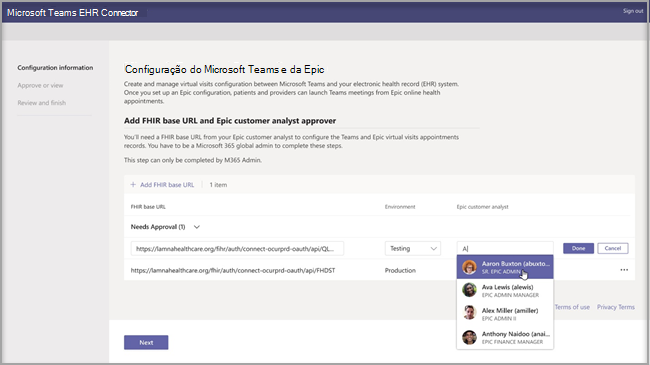
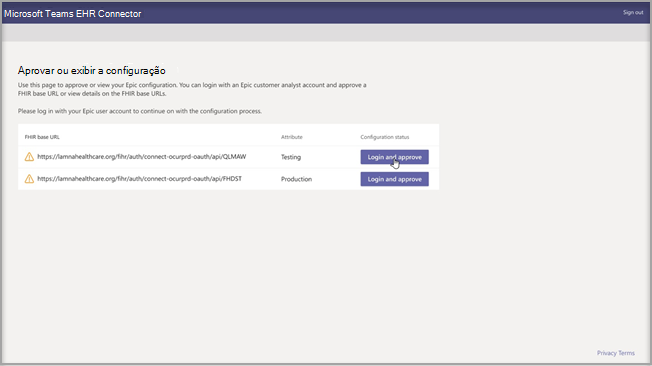
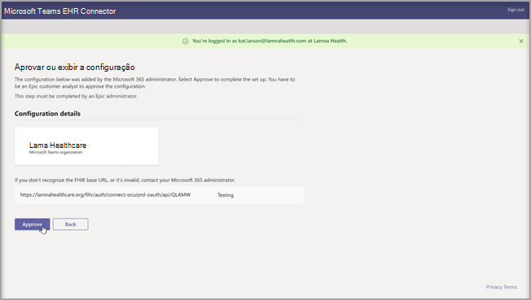
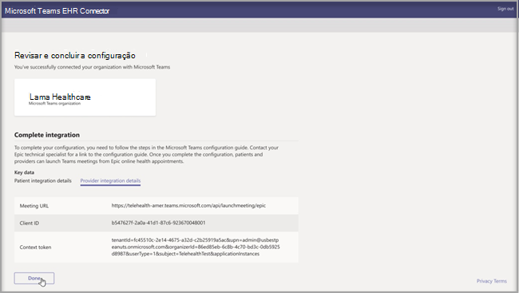
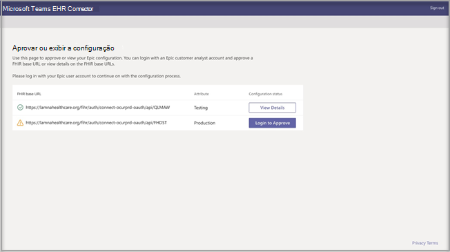

# Visitas virtuais com o Teams - Integração com EHR

Microsoft Teams O conector EHR (Registro De Saúde Eletrônico) facilita a entrada de uma visita de paciente virtual ou consulta com outro provedor em Teams diretamente do sistema EHR. Construído na nuvem Microsoft 365, o Microsoft Teams permite colaboração e comunicação simples e seguras com ferramentas de chat, vídeo, voz e saúde em um único hub que oferece suporte à conformidade com HIPAA, certificação HITECH e muito mais.
A plataforma de comunicação e colaboração do Teams torna mais fácil para os médicos eliminarem a desordem de sistemas fragmentados para que possam dedicar tempo fornecendo o melhor atendimento possível. Microsoft Teams O conector EHR (Registro eletrônico de saúde) pode:

- Iniciar Teams visitas virtuais do sistema EHR do provedor com um fluxo de trabalho médico integrado.
- Permitir que os pacientes participem Teams visitas virtuais de dentro do portal do paciente.
- Escreva metadados de volta ao sistema EHR Teams as visitas virtuais para gravar quando os participantes se conectarem e se desconectarem e habilitarem a auditoria automática e a manutenção de registros.

  Assista ao vídeo de Como gerenciar visitas virtuais no portal EHR.

> [!VIDEO https://www.microsoft.com/videoplayer/embed/RE4HAtn]

## Antes de você começar

Você precisará certificar-se de que possui os seguintes pré-requisitos antes de integrar o conector EHR:

- Acesso para usar o aplicativo Microsoft Teams no [mercado App Orchard da Epic](https://apporchard.epic.com/Gallery?id=6153).

- Assinatura ativa para Microsoft Cloud para Serviços de Saúde ou assinatura para Microsoft Teams oferta autônoma do conector EHR (imposta somente durante o teste de produção).

- Os usuários devem ter uma licença apropriada do Microsoft 365 ou Office 365 que inclua reuniões do Microsoft Teams.

- O Microsoft Teams deve ser adotado e usado dentro da organização.

- As organizações devem ter a versão Epic de novembro de 2018 ou posterior.

- Seus sistemas devem atender a todos os [pré-requisitos de software e navegador ](../../hardware-requirements-for-the-teams-app.md).

Você também precisará de informações das seguintes pessoas em sua organização:

- Administrador do Microsoft 365

- Analista de clientes Epic

> [!Note]
> Consulte o [Guia de integração de Telessaúde do Epic-Microsoft Teams](https://galaxy.epic.com/Search/GetFile?Url=1!68!100!100100357) com o especialista técnico do seu Epic. Certifique-se de que todos os pré-requisitos foram concluídos. 

## Configuração do conector

A configuração do conector requer que você:

- [Iniciar o portal de configuração do conector EHR](ehr-admin.md#launch-the-ehr-connector-configuration-portal)
- [Informações de configuração](ehr-admin.md#configuration-information)
- [Aprovar ou visualizar a configuração](ehr-admin.md#approve-or-view-configuration)
- [Análise e conclua a configuração](ehr-admin.md#review-and-finish-the-configuration)

### [Iniciar o portal de configuração do conector EHR](#launch-the-ehr-connector-configuration-portal)

Configurar sua organização de saúde para iniciar visitas virtuais com Microsoft Teams inicia iniciando o portal de configuração do conector EHR. Você configura uma única ou várias organizações para testar a integração. Configure a URL de teste e produção no portal de configuração. Teste a integração do ambiente de teste da Epic antes de passar para a produção.
  
- URL de configuração do conector EHR: [ https://ehrconnector.teams.microsoft.com ](https://ehrconnector.teams.microsoft.com)

O administrador do Microsoft 365 e o analista de clientes da Epic de sua organização devem concluir as etapas de informação e integração no portal de configuração. Para as etapas de configuração da Epic, entre em contato com o recurso especialista técnico da Epic atribuído à sua organização.

### [Informações de configuração](#configuration-information)

Esta etapa deve ser concluída pelo **administrador do Microsoft 365**. O administrador do Microsoft 365 deve iniciar o portal de configuração do conector e entrar com a conta da Microsoft para iniciar o processo de configuração.

Para concluir esta etapa, o administrador do Microsoft 365 deve receber uma URL base válida de Recursos de Interoperabilidade de Integridade Rápida (FHIR) de seu especialista técnico da Epic e o nome de usuário do analista de cliente da Epic que aprovará a configuração. O administrador do Microsoft 365 deve iniciar a página de configuração do conector e entrar com a conta da Microsoft para iniciar o processo de configuração.

- O URL base FHIR é um endereço estático correspondente ao ponto de extremidade da API FHIR do servidor. Um exemplo de URL é `https://lamnahealthcare.org/fihr/auth/connect-ocurprd-oauth/api/FHDST`.

- O nome do aprovador da configuração é o nome do analista do cliente Epic que será responsável por aprovar a configuração na próxima etapa. O analista de clientes da Epic é uma pessoa em sua organização com acesso de entrada ao Epic.

  

### [Aprovar ou exibir a configuração](#approve-or-view-configuration)

O analista de clientes épico para sua organização de saúde que foi adicionado como aprovador agora deve usar a mesma URL do conector EHR da etapa anterior para entrar usando suas credenciais Microsoft 365 de segurança. Após a validação, o aprovador será solicitado a entrar usando suas credenciais da Epic para validar a organização da Epic.

> [!Note]
> O administrador do Microsoft 365 e o analista de clientes da Epic em sua organização podem ser a mesma pessoa. Nesse caso, adicione seu próprio nome de usuário como aprovador. Você ainda precisará entrar no Epic para validar seu acesso. A entrada da Epic é usada apenas para validar seu URL base FHIR. A Microsoft não armazenará credenciais ou acessará dados EHR com esta entrada.

  

Após uma entrada com êxito da Epic, o analista de cliente da Epic **deve** aprovar a configuração. Se a configuração não estiver correta, o administrador do Microsoft 365 poderá modificar as configurações originais entrando novamente no portal do conector EHR da Microsoft. 

### [Análise e conclua a configuração](#review-and-finish-the-configuration)

Quando as informações de configuração forem aprovadas pelo administrador da Epic, você verá os registros de integração para o paciente e o provedor iniciarem. Esses registros são necessários para concluir a configuração da visita virtual no Epic. Consulte o guia Epic-Microsoft Teams Telessaúde Integration para obter mais detalhes.

> [!Note]  
> A qualquer momento, o analista do cliente Microsoft 365 ou Epic pode entrar no portal de configuração para visualizar os registros de integração e modificar a configuração da organização, se necessário.

> [!Note]
> O processo de aprovação deve ser concluído pelo analista de cliente da Epic para cada URL FHIR configurado pelo administrador da Microsoft antes.

## Visitas virtuais do Teams de lançamento

Depois de concluir as etapas do conector EHR e a configuração épica, sua organização está pronta para dar suporte a visitas de vídeo com Microsoft Teams.

### Pré-requisitos da visita virtual

- Seus sistemas devem atender a todos os [pré-requisitos de software e navegador ](../../hardware-requirements-for-the-teams-app.md).

- A organização de deve ter concluído a configuração entre a organização Epic e a organização Microsoft 365.

### Experiência do provedor

Os provedores de saúde da sua organização também podem participar de visitas virtuais com o Microsoft Teams de seus aplicativos de provedor da Epic (Hyperspace, Haiku, Canto). O botão **Iniciar visita virtual** está incorporado no fluxo do provedor.

Principais recursos da experiência do provedor:

- Os provedores podem ingressar em visitas virtuais usando navegadores compatíveis ou o aplicativo Microsoft Teams.

- Os provedores devem fazer uma entrada única com sua conta do Microsoft 365 ao ingressar em uma visita virtual pela primeira vez.

- Após o logon único, o provedor será levado diretamente para o compromisso virtual no Microsoft Teams. (O provedor deve estar conectado ao Microsoft Teams).

- O provedor pode ver atualizações em tempo real dos participantes que se conectam e desconectam para um determinado compromisso. O provedor pode ver quando o paciente está conectado a uma visita virtual.

  

### Experiência do paciente

O conector oferece suporte a pacientes que ingressam em visitas virtuais por meio do MyChart web e móvel. No momento da consulta, os pacientes podem iniciar uma visita virtual no MyChart usando o botão **Iniciar visita virtual**.

Características principais da experiência do paciente:

- Os pacientes podem participar de visitas virtuais de navegadores da Web modernos na área de trabalho e [em dispositivos móveis sem a instalação do aplicativo.](../mobile-browser-join.md)

- Os pacientes podem participar de visitas virtuais com um único clique e não há outra conta ou entrada necessária.

- Os pacientes não são obrigados a criar uma conta Microsoft ou entrar para iniciar uma visita virtual.

- Os pacientes serão colocados em um saguão até que o profissional de saúde participe da consulta e os admita para a visita virtual.

- O teste do vídeo e do microfone está disponível no saguão antes de entrar na visita virtual.

  

> [!Note]
> Epic, MyChart, Haiku e Canto são marcas comerciais da Epic Systems Corporation.

### Privacidade e localização de dados

A integração do Teams em sistemas EHR otimiza a quantidade de dados que estão sendo usados ​​e armazenados durante a integração e os fluxos de visita virtual. A solução segue os princípios e diretrizes gerais de privacidade e gerenciamento de dados do Teams, descritos em Privacidade do Teams.

O conector EHR do Microsoft Teams não armazena nem transfere quaisquer dados pessoais identificáveis ​​ou registros de saúde de pacientes ou prestadores de serviços de saúde do sistema EHR. Os únicos dados armazenados pelo conector EHR são a ID exclusiva do usuário EHR, que é usada durante a configuração da reunião do Teams. A ID exclusiva do usuário EHR é armazenada em uma das três regiões geográficas descritas em [Onde seus dados de cliente Microsoft 365 são armazenados](/microsoft-365/enterprise/o365-data-locations). Todos os chats, gravações e outros dados inseridos nas equipes pelos participantes da reunião são armazenados de acordo com as políticas de armazenamento existentes. Se você quiser saber mais informações sobre a localização dos dados no Microsoft Teams, visite [ Locais dos dados no Teams ](../../location-of-data-in-teams.md).

## Tópicos relacionados

[Teams virtuais](ehr-admin-reports.md)