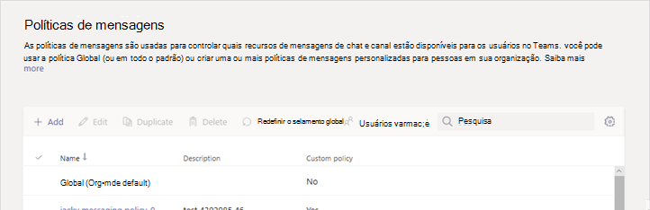

# Introdução às Mensagens Seguras para Organizações de SaúdeGet started with Secure Messaging for Healthcare organizations

As políticas de mensagens são usadas para controlar quais recursos de mensagens de chat e de canal estão disponíveis para os usuários do Microsoft Teams e fazem parte da implantação geral de mensagens seguras para organizações de assistência médica, como hospitais, clínicas ou consultórios do doutor, onde a transmissão de mensagens cruciais e funciona em tempo hábil é fundamental, como se conhece quando mensagens cruciais são lidas.Messaging policies are used to control which chat and channel messaging features are available to users in Microsoft Teams, and are part of the overall deployment of Secure Messaging for Healthcare organizations like Hospitals, clinics, or doctor's offices, where having a message picked up and acted upon in a timely manner is crucial, as is knowing when crucial messages are read.

Você pode usar a política global (padrão para toda a organização) ou criar uma ou mais políticas de mensagens personalizadas para as pessoas em sua organização.You can use the global (Org-wide default) policy or create one or more custom messaging policies for people in your organization. Os usuários da sua organização terão automaticamente a política global, a menos que você crie e atribua uma política personalizada.Users in your organization will automatically get the global policy unless you create and assign a custom policy. Depois de criar uma política personalizada, atribua a ela um usuário ou grupos de usuários em sua organização.After you create a custom policy, assign it a user or groups of users in your organization. Por exemplo, você pode optar por permitir que apenas determinadas funções de trabalho usem esses recursos (talvez apenas os médicos e os recursos humanos) e outros trabalhadores (como o janitorial ou a cozinha cozinha) para obter um conjunto mais limitado de recursos.For example, you may choose to only allow certain job roles to use these features (perhaps doctors and nurses only) and other workers (like the janitorial or kitchen staff) to get a more limited set of features. Decida por si mesmo o que precisa da sua organização, as orientações aqui são no máximo uma sugestão.Decide for yourself what needs your organization has, the guidance here is at most a suggestion.

As políticas podem ser facilmente gerenciadas no [centro de administração do Microsoft Teams](https://admin.teams.microsoft.com) , fazendo logon com credenciais de administrador e escolhendo **políticas de mensagens** no painel de navegação à esquerda.Policies can be easily managed in the [Microsoft Teams admin center](https://admin.teams.microsoft.com) by logging in with administrator credentials and choosing **Messaging policies** in the left navigation pane.

 

Para editar a política de mensagens padrão existente para sua organização, clique em **global (padrão para toda**a organização) e faça as alterações.To edit the existing default Messaging policy for your organization, click **Global (Org-wide default)**, and then make your changes. Para criar uma nova política de mensagens personalizada, clique em **Adicionar** e, em seguida, selecione as configurações.To create a new custom messaging policy, click **Add** and then select your settings. Escolha **Salvar** quando terminar.Choose **Save** when you are done.

As configurações a seguir são de interesse especial para aplicativos de saúde e devem ser consideradas ao criar uma política personalizada usada no campo assistência médica:The following settings are of special interest for Healthcare applications, and should be considered when designing a custom policy used in the Healthcare field:

## Confirmações de leituraRead receipts

Confirmações de leitura permite que o remetente de uma mensagem de chat saiba quando a mensagem foi lida pelo destinatário no 1:1 e chats em grupo 20 pessoas ou menos.Read receipts allows the sender of a chat message to know when their message was read by the recipient in 1:1 and group chats 20 people or less. Use esta configuração para especificar se as confirmações de leitura são controladas pelo usuário, ativadas para todos ou desativadas para todos.Use this setting to specify whether read receipts are user controlled, on for everyone, or off for everyone. As confirmações de leitura de mensagens são importantes em organizações de assistência médica porque elas se removem de forma indeterminada sobre se uma mensagem foi lida.Message read receipts are important in Healthcare organizations because they remove uncertainly about whether a message was read.

Para aplicativos de saúde, escolha o **usuário controlado** ou **ativado para todos**.For Healthcare applications, choose either **User controlled** or **On for everyone**. Lembre-se de que, ao usar a configuração **ativado para todos** , a única maneira de definir confirmações para o locatário inteiro é ter apenas uma política de mensagens para todo o locatário (a política padrão denominada "global (padrão para toda a organização)") ou para que todas as políticas de mensagens no locatário usem as mesmas configurações para recibos.Be aware that when using the **On for everyone** setting, the only way to set receipts for the whole  tenant is either to have only one messaging policy for the whole tenant (the default policy named "Global (Org-wide Default)") or to have all messaging policies in the tenant use the same settings for receipts. O recurso de confirmações de leitura é mais eficaz quando o recurso está habilitado como **Ativado para todos**.The read receipts feature is most effective when the feature is enabled to **On for everyone**.

*Exemplo de uso sem confirmações de leitura:* Jakob Roth, um paciente de alto risco, é admitido para o hospital.*Usage example without read receipts:* Jakob Roth, a high risk patient, is admitted to the hospital.Sófia Krause é um enfermeira que trabalha como parte da equipe inter-disciplinara (IDT) de funcionários médicos, incluindo especialistas diferentes, é atribuído como o principal coordenador responsável por este paciente.  Sofia Krause is a nurse working as part of the inter-disciplinary team (IDT) of medical workers, including different specialists, is assigned as the primary care coordinator in charge of this patient.  Sófia envia emails e outras mensagens de chat para um grupo de perenção e médicos que usam uma variedade de clientes e aplicativos de mensagens e, muitas vezes, não recebem resposta nem indica se uma mensagem foi lida pelos membros da equipe.Sofia sends emails and other instant messages to a groups of nurses and doctors who use a variety of messaging clients and apps, and often gets no response or indication whether a message was read by team members. Devido a processos de comunicação tangled, o medicação de Jakob é aplicado indevido e seu hospital permanecerá estendido.Due to tangled communication processes, Jakob's medication is misapplied and his hospital stay is extended.

*Exemplo de uso com confirmações de leitura:* Jakob Roth, um paciente de alto risco, é admitido para o hospital.*Usage example with read receipts:* Jakob Roth, a high risk patient, is admitted to the hospital.Sófia Krause é um enfermeira que trabalha como parte da equipe inter-disciplinara (IDT) de funcionários médicos, incluindo especialistas diferentes, é atribuído como o principal coordenador responsável por este paciente.  Sofia Krause is a nurse working as part of the inter-disciplinary team (IDT) of medical workers, including different specialists, is assigned as the primary care coordinator in charge of this patient.  Sófia inicia um chat em grupo com um conjunto de médicos e outros repacientes que trabalharão com o paciente para coordenar o cuidado e iniciar uma triagem de emergência.Sofia starts a group chat with a set of doctors and other nurses who will be working with the patient to coordinate care and starts an emergency triage.As hojes e médicos se comunicam e colaboram com o plano de atendimento do paciente em todo o processo de coordenação de atendimento.  The nurses and doctors communicate and collaborate over the patient's care plan throughout the care coordination process.  Mensagens importantes e urgentes são enviadas pelo 1:1 e conversas de chat em grupo.Important and urgent messages are sent through 1:1 and group chat conversations. Sófia usa a funcionalidade de confirmações de leitura para determinar se as mensagens enviadas solicitando suporte são entregues e lidas pelos médicos ou às mensagens de destino.Sofia uses the read receipts functionality to determine if messages sent requesting support are delivered and read by the targeted physicians or nurses. Os resultados do paciente de Jakob são praticamente ótimos, e ele fica mais cedo, porque a equipe de cuidado comunica-se tranqüilamente.Jakob's patient outcomes are near-optimal and he goes home sooner because his care team communicates smoothly.

## Enviar mensagens urgentes usando as notificações de prioridadeSend urgent messages using priority notifications

Um usuário pode marcar uma mensagem como *urgente* ao enviar mensagens de chat para outros usuários.A user can mark a message as *urgent* when sending chat messages to other users. Esse recurso ajuda a equipe do hospital a enviar uma outra pessoa quando um incidente crítico exige sua atenção.This feature helps hospital staff alert one another when a critical incident requires their attention. Ao contrário *das mensagens comuns comuns, as* [notificações de prioridade](https://support.microsoft.com/en-us/office/mark-a-message-as-important-or-urgent-in-teams-ea99d5b6-1317-4550-8d75-86ff14cd4462) notificam os usuários a cada dois minutos por até 20 minutos ou até que a mensagem seja retirada e lida pelo destinatário, maximizando a probabilidade de que a mensagem seja acionada de forma oportuna.Unlike regular *important* messages, [priority notifications](https://support.microsoft.com/en-us/office/mark-a-message-as-important-or-urgent-in-teams-ea99d5b6-1317-4550-8d75-86ff14cd4462) notify users every two minutes for up to 20 minutes or until the message is picked up and read by the recipient, maximizing the likelihood that the message is acted upon in a timely manner.

Um administrador pode habilitar ou desabilitar a capacidade dos usuários atribuídos a essa política para enviar notificações de prioridade.An admin can enable or disable the ability for users assigned this policy to send priority notifications. Este recurso está ativado por padrão.This feature is on by default. O destinatário da mensagem de prioridade talvez não tenha a mesma política de mensagens e não terá a opção de desabilitar as mensagens de prioridade de recebimento.The recipient of the priority message might not have the same messaging policy, and will not have an option to disable receiving priority messages. Para aplicativos de assistência médica, recomendamos habilitar o recurso para pelo menos alguns usuários, mas você precisará determinar quais deles.For Healthcare applications, we recommend enabling the feature for at least some users, but you'll need to determine which ones.

*Exemplo de uso:* Sófia Krause é readmitting um paciente de alto risco, Jakob Roth.*Usage example:* Sofia Krause is readmitting a high-risk patient, Jakob Roth. Manuela Carstens, um médico, é o principal médico para este paciente.Manuela Carstens, a physician, is the primary care doctor for this patient.  Sófia envia uma mensagem para Manuela usando uma notificação de prioridade solicitando ajuda imediata com a triagem de Jakob.Sofia sends a message to Manuela using a priority notification asking for immediate help with triage of Jakob.  O telefone da Manuela recebe a mensagem, mas Manuela não sente a vibração do telefone e não responde.Manuela's phone receives the message but Manuela didn't feel the phone vibration and does not reply. O Microsoft Teams notifica o Manuela e continuará a renotificá-lo persistentemente até que ele leia a mensagem.Teams re-notifies Manuela and will continue to persistently re-notify until she reads the message. Se as confirmações de leitura também estiverem habilitadas, as Sófia podem estar cientes de que a mensagem foi lida por Manuela, mesmo antes de Manuela decidir como responder.If read receipts are also enabled, Sofia can be aware that the message was read by Manuela, even before Manuela decides how to respond.

## Tópicos relacionadosRelated topics

- [Gerenciar políticas de mensagens no TeamsManage messaging policies in Teams](../../messaging-policies-in-teams.md)
- [Introdução ao Teams para Organizações de SaúdeGet started with Teams for Healthcare organizations](teams-in-hc.md)
