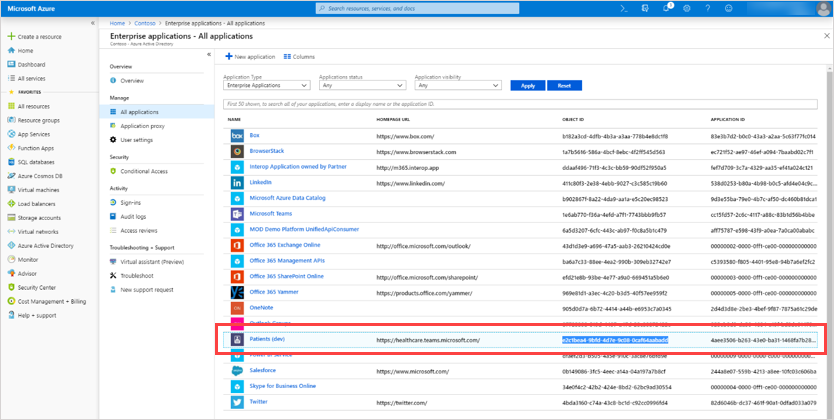

# Conecte o aplicativo de pacientes à API do Azure para FHIRConnect the Patients app to Azure API for FHIR

> [!NOTE]
> A partir de 30 de outubro de 2020, o aplicativo Pacientes será retirado e substituído pelo [aplicativo de Listas](https://support.microsoft.com/office/get-started-with-lists-in-teams-c971e46b-b36c-491b-9c35-efeddd0297db) no Teams.Effective October 30, 2020, the Patients app has been retired and replaced by the [Lists app](https://support.microsoft.com/office/get-started-with-lists-in-teams-c971e46b-b36c-491b-9c35-efeddd0297db) in Teams. Os dados do aplicativo Pacientes são armazenados na caixa de correio do grupo do Office 365 que apoia a equipe.Patients app data is stored in the group mailbox of the Office 365 group that backs the team. Todos os dados associados ao aplicativo Pacientes são mantidos neste grupo, mas não podem mais ser acessados por meio da interface do usuário.All data associated with the Patients app is retained in this group but can no longer be accessed through the user interface. Os usuários podem criar suas listas usando o [aplicativo Listas](https://support.microsoft.com/office/get-started-with-lists-in-teams-c971e46b-b36c-491b-9c35-efeddd0297db).Users can re-create their lists using the [Lists app](https://support.microsoft.com/office/get-started-with-lists-in-teams-c971e46b-b36c-491b-9c35-efeddd0297db).
>
>Com o Lists, as equipes de atendimento em sua organização de saúde podem criar listas de pacientes para cenários que variam desde reuniões gerais com a equipe de atendimento até o monitoramento geral dos pacientes.With Lists, care teams in your healthcare organization can create patient lists for scenarios ranging from rounds and interdisciplinary team meetings to general patient monitoring. Confira o modelo Pacientes no Lists para começar.Check out the Patients template in Lists to get started. Para saber mais sobre como gerenciar o aplicativo Lists em sua organização, consulte [Gerenciar o aplicativo Lists](../../manage-lists-app.md).To learn more about how to manage the Lists app in your organization, see [Manage the Lists app](../../manage-lists-app.md).

Siga estas etapas para permitir que o aplicativo Patients no Microsoft Teams acesse uma API do Azure para instância FHIR.Follow these steps to allow the Patients app in Microsoft Teams access to an Azure API for FHIR instance. Este artigo supõe que você tenha uma [API do Azure para instância FHIR](https://azure.microsoft.com/services/azure-api-for-fhir/) configurada e configurada em seu locatário.This article assumes that you have an [Azure API for FHIR instance](https://azure.microsoft.com/services/azure-api-for-fhir/) set up and configured in your tenant.  Se você ainda não criou uma API do Azure para instância FHIR em seu locatário, consulte Início rápido: Implantar a [API do Azure para FHIR](/azure/healthcare-apis/fhir-paas-portal-quickstart)usando o portal do Azure .If you haven’t yet created an Azure API for FHIR instance in your tenant, see [Quickstart: Deploy Azure API for FHIR using Azure portal](/azure/healthcare-apis/fhir-paas-portal-quickstart).

1. Clique [aqui para](https://login.microsoftonline.com/common/adminConsent?client_id=4aee3506-b263-43e0-ba31-1468fa7b2806) conceder o consentimento do administrador para o aplicativo Pacientes.Click [here](https://login.microsoftonline.com/common/adminConsent?client_id=4aee3506-b263-43e0-ba31-1468fa7b2806) to grant admin consent for the Patients app. Quando solicitado, entre usando suas credenciais de administrador de locatário ou administrador global e clique em **Aceitar** para conceder as permissões necessárias.When prompted, sign in using your tenant admin or global admin credentials, and then click **Accept** to grant the required permissions.

    

    Depois de aceitar, feche a janela.After you accept, close the window. Você verá uma página que pode ter esta aparência.You'll see a page that may look like this. Você pode ignorar a mensagem de erro na página.You can ignore the error message on the page. É inofensivo e indica que o consentimento é concedido.It's harmless and indicates that consent is granted. (Estamos trabalhando em uma página mais fácil de usar para essa URL.(We're working on a more user-friendly page for this URL. Fique atento!)Stay tuned!)

    

2. Entre no [portal do Azure](https://portal.azure.com) com suas credenciais de administrador.Sign in to the [Azure portal](https://portal.azure.com) with your admin credentials.

3. Na navegação à esquerda, selecione **Azure Active Directory** e, em seguida, selecione **Aplicativos Empresariais**.In the left navigation, select **Azure Active Directory**, and then select **Enterprise Applications**.

    Procure uma linha chamada **Patients (dev)** e copie o valor na coluna **ID** do objeto para sua área de transferência.Look for a row named **Patients (dev)**, and then copy the value in the **Object ID** column to your clipboard.

    

4. Vá para a instância de recurso da API do Azure para FHIR à qual você deseja conectar o aplicativo Patients (pesquisando por ele ou navegando por seus recursos) e abra as configurações dessa instância.Go to the Azure API for FHIR resource instance to which you want to connect the Patients app (either by searching for it or by browsing through your resources), and then open the settings for that instance.

    

5. Clique **em Autenticação** e, em seguida, colar a ID do objeto que você copiou na etapa 3 para a caixa **IDs** de objeto Permitido.Click **Authentication**, and then paste the object ID that you copied in step 3 to the **Allowed object IDs** box. Isso permite que o aplicativo Patients acesse o servidor FHIR.This allows the Patients app to access the FHIR server. Depois de colar a ID do objeto, o Azure Active Directory a valida e uma marca de seleção verde aparece ao lado dele.After you paste the object ID, Azure Active Directory validates it, and a green check mark appears next to it.

    

6. Clique em **Salvar**.Click **Save**. Isso reimplanta a instância, que pode levar alguns minutos.This redeploys the instance, which can take a few minutes.

7. Clique **em Visão** Geral e copie a URL do ponto de extremidade de **metadados FHIR.**Click **Overview**, and then copy the URL from **FHIR metadata endpoint**. Remova a marca de metadados para obter a URL do servidor FHIR.Remove the metadata tag to get the FHIR server URL. Por exemplo, `https://test02-teamshealth.azurehealthcareapis.com/` .For example, `https://test02-teamshealth.azurehealthcareapis.com/`.

    

8. No Teams, vá para a instância do aplicativo Pacientes carregada em sua equipe, clique em Configurações **e,** na caixa **Link,** insira a URL do ponto de extremidade do servidor FHIR.In Teams, go to the Patients app instance that's loaded in your team, click **Settings**, and then in the **Link** box, enter the FHIR server endpoint URL. Em seguida, **clique em Conectar** para estabelecer uma conexão e pesquisar e adicionar pacientes à sua lista.Then, click **Connect** to establish a connection and search and add patients to your list.  

    

    Se você receber um erro ao se conectar ao Teams durante esta etapa, envie uma captura de tela detalhada do erro, logs do [Fiddler](https://www.telerik.com/download/fiddler) e qualquer outra etapa de repro em um email com uma linha de assunto de "Solução de problemas de modo de aplicativo de pacientes – emr" para teamsforhealthcare@service.microsoft.com [.](mailto:teamsforhealthcare@service.microsoft.com)If you get an error when connecting to Teams during this step, send a detailed screenshot of the error, logs from [Fiddler](https://www.telerik.com/download/fiddler) and any other repro steps in an email with a subject line of “Patients App – EMR mode troubleshooting” to [teamsforhealthcare@service.microsoft.com](mailto:teamsforhealthcare@service.microsoft.com).

## Tópicos relacionadosRelated topics

- [Visão geral do aplicativo de pacientesPatients app overview](patients-app-overview.md)
- [Integração dos Registros Eletrônicos de Saúde no Microsoft TeamsIntegrating Electronic Healthcare Records into Microsoft Teams](patients-app.md)