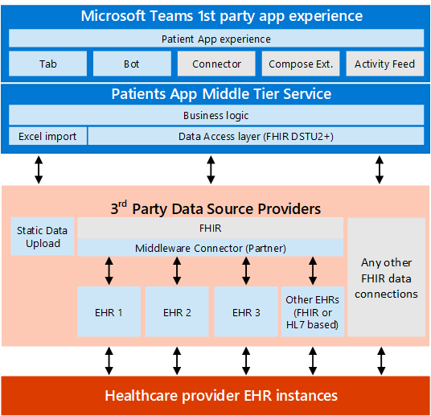

# Integração dos Registros Eletrônicos de Saúde no Microsoft Teams

> [!IMPORTANT]
> **A partir de 30 de outubro de 2020, o aplicativo pacientes será preterido, e os usuários não poderão mais instalá-lo na App Store da equipe. Recomendamos que você comece a usar o [aplicativo listas](https://support.microsoft.com/office/get-started-with-lists-in-teams-c971e46b-b36c-491b-9c35-efeddd0297db) no Microsoft Teams hoje mesmo.**
>
>Os dados do aplicativo pacientes são armazenados na caixa de correio do grupo do grupo do Office 365 que faz a equipe. Quando o aplicativo pacientes é desativado, todos os dados associados a ele serão mantidos nesse grupo, mas não poderão mais ser acessados por meio da interface do usuário. Os usuários atuais podem recriar suas listas usando o [aplicativo listas](https://support.microsoft.com/office/get-started-with-lists-in-teams-c971e46b-b36c-491b-9c35-efeddd0297db).
>
>O [aplicativo listas](https://support.microsoft.com/office/get-started-with-lists-in-teams-c971e46b-b36c-491b-9c35-efeddd0297db) é pré-instalado para todos os usuários do Teams e está disponível como uma guia em cada equipe e canal. Com listas, o cuidado com equipes pode criar listas de pacientes usando o modelo de pacientes incorporado, do zero ou importando dados para o Excel. Para saber mais sobre como gerenciar o aplicativo listas em sua organização, consulte [gerenciar o aplicativo listas](../../manage-lists-app.md).

[!INCLUDE [preview-feature](../../includes/preview-feature.md)]

Este artigo destina-se a um desenvolvedor geral de ti de assistência médica interessado em usar APIs do FHIR sobre um sistema de informações médicas para se conectar ao Microsoft Teams. Isso permitiria cenários de coordenação que correspondam às necessidades de uma organização de assistência médica.

Artigos vinculados documente as especificações de interface FHIR para o aplicativo Microsoft Teams pacientes, e as seções a seguir explicam o que é necessário para configurar um servidor FHIR e se conectar ao aplicativo pacientes em seu ambiente de desenvolvimento ou locatário. Também será preciso estar familiarizado com a documentação do servidor FHIR que você escolheu, que deve ser uma das opções com suporte:
- Datica (por meio da oferta [CMI](https://datica.com/compliant-managed-integration/) )
- Infor Cloverleaf (por meio da [ponte infor FHIR](https://pages.infor.com/hcl-infor-fhir-bridge-brochure.html))
- Redox (por meio do [servidor R ^ FHIR](https://www.redoxengine.com/fhir/))
- Dapasoft (por meio [de Corolar em FHIR](https://www.dapasoft.com/corolar-fhir-server-for-microsoft-teams/))

> [!NOTE]
> Esse processo não inclui etapas que usam o centro de administração do Microsoft Teams ou cmdlets do PowerShell para habilitar recursos. A configuração é realizada completamente no lado do servidor/serviço do FHIR e no cliente do aplicativo pacientes.

Mostrado abaixo é a arquitetura do aplicativo pacientes:

As seções a seguir explicam os requisitos da camada de acesso a dados somente FHIR para o aplicativo pacientes que um servidor FHIR (ou APIs de FHIR habilitadas para o EHR) devem atender para que você possa se integrar ao aplicativo pacientes, incluindo o seguinte:

- Expectativas em relação à autenticação de usuários
- Requisitos técnicos e funcionais da interface de integração
- Expectativas em relação ao desempenho e à confiabilidade
- Expectativas em relação a recursos de FHIR para serem compatíveis com o aplicativo pacientes
- Processo de integração e o modelo de compromisso esperado
- Como começar a usar o FHIR e alguns desafios comuns enfrentados com o aplicativo pacientes
- Requisitos futuros para a próxima iteração do aplicativo pacientes

> [!NOTE]
> Nas seções a seguir, a palavra "parceiro" ou "parceiro de interoperabilidade" é usada para fazer referência a qualquer organização de terceiros que habilite a integração a sistemas EHR para o aplicativo pacientes por meio do FHIR e está implementando um servidor FHIR para corresponder às especificações listadas.

## Requisitos funcionais e técnicos  

### Autenticação  

A autorização em nível de aplicativo sem *suporte para a autorização em nível de usuário* é a maneira mais comum de executar transformações de dados e expor conexões a dados EHR por meio do FHIR, mesmo que o sistema EHR implemente a autorização em nível de usuário. O serviço de interoperabilidade (parceiro) obtém acesso elevado aos dados do EHR e, quando expõe os mesmos dados dos recursos FHIR apropriados, não há contexto de autorização aprovado para o consumidor do serviço de interoperabilidade (o aplicativo pacientes) com o serviço de interoperabilidade ou a plataforma. O aplicativo pacientes não poderá impor a autorização no nível do usuário, mas dá suporte a aplicativos para autenticação de aplicativos entre o aplicativo pacientes e o serviço do parceiro de interoperabilidade.

O aplicativo para o modelo de autenticação do aplicativo está descrito abaixo:

A autenticação do serviço para o serviço deve ser feita por meio do [fluxo de credenciais do cliente](https://www.oauth.com/oauth2-servers/access-tokens/client-credentials/)OAuth 2,0. O serviço de parceiro precisa fornecer o seguinte:

1. O serviço de parceiro permite que o aplicativo pacientes crie uma conta com o parceiro, o que habilita o aplicativo pacientes a gerar e possuir client_id e client_secret, gerenciados por meio de um portal de registro de autenticação no servidor de autenticação do parceiro.
2. O serviço de parceiro pertence ao sistema de autenticação/autorização, que aceita e verifica (autentica) as credenciais de cliente fornecidas e retorna um token de acesso com dica de locatário em escopo, conforme descrito a seguir.
3. Por motivos de segurança ou em caso de uma violação secreta, o aplicativo pacientes pode regenerar o segredo e invalidar ou excluir o antigo segredo (exemplo do mesmo está disponível no portal do Azure – registro do aplicativo AAD).
4. O ponto de extremidade de metadados que hospeda a instrução de conformidade deve ser não autenticado, deve ser acessível sem token de autenticação.
5. O serviço de parceiro fornece o ponto de extremidade do token para que o aplicativo pacientes solicite um token de acesso usando um fluxo de credenciais do cliente. A URL do token de acordo com o servidor de autorização deve fazer parte da instrução FHIR conformidade (funcionalidade) buscada pelos metadados no servidor FHIR como neste exemplo:

* * *
    {"resourceType": "CapabilityStatement",.
        .
        .
        "Rest": [{"Mode": "servidor", "segurança": {"extensão": [{"extensão": [{"URL": "token", "valueUri": " https://login.contoso.com/145f4184-1b0b-41c7-ba24-b3c1291bfda1/oauth2/token "}, {"URL": " https://login.contoso.com/145f4184-1b0b-41c7-ba24-b3c1291bfda1/oauth2/authorize "}], "serviço": ""}], "URL": " http://fhir-registry.smarthealthit.org/StructureDefinition/oauth-uris "}], "serviço": [{"codificação": [{"sistema": " https://hl7.org/fhir/ValueSet/restful-security-service ", "código": "OAuth", "OAuth", "
                .
                .
            } ] }

* * *

Uma solicitação de um token de acesso consiste nos seguintes parâmetros:

* * *

    PUBLICAR/token HTTP/1.1 host: authorization-server.com

    Grant-Type = client_credentials &client_id = xxxxxxxxxx &client_secret = xxxxxxxxxx

* * *

O serviço de parceiro fornece o client_id e o client_secret para aplicativo pacientes, gerenciados por meio de um portal de registro de autenticação no lado do parceiro. O serviço de parceiro fornece o ponto de extremidade para solicitar o token de acesso usando um fluxo de credenciais de cliente. Uma resposta bem-sucedida deve incluir os parâmetros token_type, access_token e expires_in.

### Roteamento: mapeando o locatário do AAD para o ponto de extremidade do provedor

O aplicativo pacientes se conecta a um serviço de parceiro por meio de um único ponto de extremidade. O serviço de parceiro possui um mecanismo e mantém um mecanismo para mapear cada cliente da Microsoft (ID de locatário do AAD) para um provedor de assistência médica (servidor FHIR) com o qual o serviço de parceiro está trabalhando.

O mapeamento do locatário AAD para um ponto de extremidade do provedor usa a ID de locatário (GUID) do AAD. O aplicativo pacientes transmite a ID de locatário em escopo durante a solicitação de um token de acesso para cada solicitação. O serviço de parceiro mantém o mapeamento da ID de locatário para o ponto de extremidade do provedor e redireciona solicitações para um ponto de extremidade do provedor com base na ID do locatário. Para fazer isso, o parceiro aceita a configuração no final (manualmente ou por meio de um portal como parte do integração de organizações de provedores à plataforma de interoperabilidade).

O fluxo de trabalho de autenticação e roteamento é mostrado abaixo:

1. Solicitação de token de acesso do aplicativo enviando:
 
        {   grant_type: client_credentials,
            client_id: xxxxxx, 
            client_secret: xxxxxx,
            scope: {Provider Identifier, Ex: tenant ID}
        }

2. Responda com um token de aplicativo:

        {  access_token: {JWT, with scope: tenant ID},
           expires_in: 156678,
           token_type: "Bearer",
        }

3. Solicitar dados protegidos com token de acesso.
4. Mensagem de autorização: selecione o servidor FHIR apropriado para direcionar a partir da ID de locatário no escopo
5. Envia os dados protegidos do aplicativo do servidor FHIR autorizado após a autenticação com o token do aplicativo.

## Classes

As chamadas e os campos específicos usados pelo aplicativo pacientes são documentados nos artigos a seguir. Selecione a interface aplicável às APIs do FHIR Server/FHIR.

- [Especificação de interface DSTU2](dstu2-interface.md)
- [Especificação de interface STU3](stu3-interface.md)

## Desempenho e confiabilidade

Enquanto o aplicativo pacientes está em visualização particular, não há garantias sobre o desempenho de ponta a ponta. Fatores em desempenho incluem as latências relativas de todos os saltos envolvidos no fluxo de trabalho, começando pelo EHR no ambiente do sistema de integridade, ao parceiro de interoperabilidade e sua infra-estrutura, incluindo o servidor FHIR e entre o aplicativo Office 365 ecossistema e pacientes.

## Comece a usar o FHIR  

Se você não tem experiência com o FHIR e precisa de acesso fácil a um servidor FHIR que você possa expor à interface de integração do EHR do Microsoft Teams, a Microsoft tem um servidor FHIR de código-fonte aberto disponível para todos os desenvolvedores usarem. Consulte o artigo o [que é FHIR Server para Azure](https://docs.microsoft.com/azure/healthcare-apis/overview-open-source-server) para saber mais sobre o servidor de fonte de FHIR aberto disponível na Microsoft e implementá-lo para suas organizações.

Você também pode usar o ambiente do EHR da área restrita do HSPC aberto para criar um EHR que também ofereça suporte a um servidor FHIR aberto e usá-lo para brincar com o aplicativo pacientes. Recomendamos que você leia a [documentação da área restrita do HSPC](https://healthservices.atlassian.net/wiki/spaces/HSPC/pages/64585866/HSPC+Sandbox). Além disso, a área restrita fornece uma maneira fácil, orientada à interface do usuário e fácil de criar, adicionar e editar pacientes, além de oferecer várias amostras para começar. 