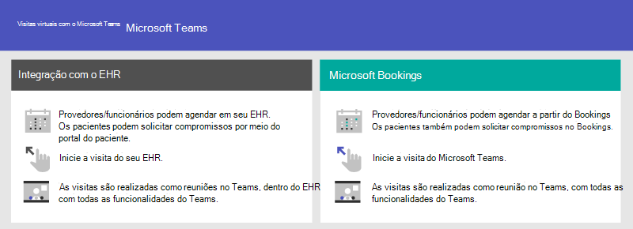
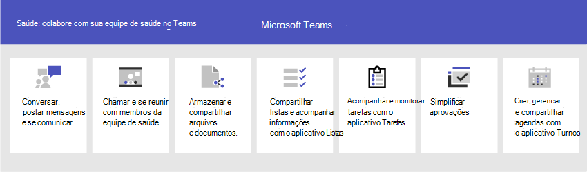

# Começar com o Teams para organizações de saúde

O Microsoft Teams oferece vários recursos de telemedicina úteis para hospitais e outras organizações de saúde. Os recursos do Teams estão em desenvolvimento para ajudar hospitais em:

- Visitas virtuais e integração com o Registro Eletrônico de Saúde (EHR)
- Pacotes de políticas do Teams
- Mensagens seguras
- Modelos do Teams
- Coordenação e colaboração do cuidado

Essa funcionalidade faz parte Microsoft Cloud para Serviços de Saúde. Saiba mais sobre como usar esta solução, que une os recursos do Azure, Dynamics 365 e Microsoft 365 no [Microsoft Cloud for Healthcare](/industry/healthcare).

Assista ao vídeo a seguir para saber mais sobre como usar a coleção de cuidados de saúde para aprimorar a colaboração da equipe de saúde Teams.

> [!VIDEO https://www.microsoft.com/videoplayer/embed/RE4Hqan]

> [!NOTE]
> O conteúdo nesta seção presume que você já implantou o Teams em sua organização. Se você ainda não implantou o Teams, comece lendo [Como implantar o Microsoft Teams](../../deploy-overview.md).

Os cenários a seguir estão disponíveis para organizações de saúde:

| Cenário | Descrição | Requisitos |
| -------- | -------- | -------- |
| [Visitas virtuais com integração do Registro Eletrônico de Saúde (EHR)](#virtual-visits-and-electronic-healthcare-record-ehr-integration) | Agende, gerencie e conduza compromissos virtuais com os pacientes. Esse cenário conecta Teams e a plataforma Cerner ou épico para dar suporte a Visitas Virtuais. | Assinatura ativa para Microsoft Cloud para Serviços de Saúde ou assinatura para Microsoft Teams de conector EHR autônomo.   Os usuários devem ter uma licença Microsoft 365 ou Office 365 que inclua Teams reuniões*.   As organizações devem ter Cerner versão novembro de 2018 ou posterior ou versão épica novembro de 2018 ou posterior.  Detalhes dos [requisitos cerner EHR](ehr-admin-cerner.md#before-you-begin) e [EHR épico](ehr-admin.md#before-you-begin) |
| [Visitas virtuais com o Microsoft Bookings e o aplicativo Bookings](#virtual-visits-and-electronic-healthcare-record-ehr-integration) | Agende, gerencie e conduza compromissos virtuais com os pacientes. Esse cenário depende do Microsoft Bookings para dar suporte a Visitas Virtuais. | O Microsoft Bookings deve ser ativado para a organização.   Todos os usuários do aplicativo Bookings e todos os funcionários que participam das reuniões devem ter uma licença com suporte para o agendamento* de Reunião no Teams.  [Detalhes dos requisitos do Bookings](../../bookings-app-admin.md#prerequisites-to-use-the-bookings-app-in-teams)|
| [Pacotes de políticas do Teams](#teams-policy-packages)| Garanta que os funcionários da saúde, operadores de informações e dispositivos da sala do paciente tenham acesso apropriado à funcionalidade do Teams.| Os usuários devem ter uma licença apropriada*. |
| [Mensagens seguras](#secure-messaging) | Obtenha atenção às mensagens urgentes com mais rapidez e tenha a certeza de que a mensagem foi recebida e lida. | Os usuários devem ter uma licença apropriada*.  |
| [Modelos do Teams](#teams-templates-for-healthcare-organizations) | Crie equipes que incluam um modelo predefinido de configurações, canais e aplicativos instalados previamente para se comunicar e colaborar com uma ala, câmara ou departamento ou entre várias alas, câmaras e departamentos em um hospital. | Os usuários devem ter uma licença apropriada*.  |
| [Coordenação e colaboração do cuidado](#care-coordination-and-collaboration) | Os médicos e funcionários podem colaborar internamente em agendas, documentos, tarefas e muito mais.| Os usuários devem ter uma licença apropriada*. |

*Office 365 A3, A5, E3, E5, F1, F3, Microsoft 365 A3, A5, E3 e E5, Business Standard são suportados. Para obter mais informações sobre licenciamento geral do Teams, consulte [Gerenciar o acesso do usuário ao Teams](../../user-access.md).

## Visitas virtuais e integração com o Registro Eletrônico de Saúde (EHR)

Use a plataforma de reuniões completa Teams agendar, gerenciar e conduzir compromissos virtuais com os pacientes.

- Se sua organização já usa Registros Eletrônicos de Saúde ou EHR, você pode integrar Teams para uma experiência mais perfeita. Teams conector do Registro Eletrônico de Saúde (EHR) torna mais fácil para os médicos iniciarem uma visita de paciente virtual ou consulta com outro provedor em Teams diretamente do sistema EHR. Para saber mais, confira Visitas Virtuais com Teams - Integração ao [Cerner EHR](ehr-admin-cerner.md) e Visitas Virtuais com Teams - Integração [ao EHR Épico](ehr-admin.md).
- Se você não estiver usando um EHR com suporte, poderá usar o Microsoft Bookings e o aplicativo Bookings no Teams. Para saber mais, confira [Visitas Virtuais com Teams e o aplicativo Bookings](../bookings-virtual-visits.md).

## Pacotes de políticas do Teams

Aplique pacotes de política do Teams para definir o que diferentes funções podem fazer no Teams. Por exemplo, especifique políticas para:

- Funcionários da saúde, como enfermeiros registrados, enfermeiros chefe, médicos e assistentes sociais, para que eles tenham acesso total ao chat, chamadas, gerenciamento de turnos e reuniões.
- Os operadores de informações na sua organização de saúde, como equipe de TI, de informática, equipe financeira e responsáveis pela conformidade podem ter acesso total ao chat, chamadas e reuniões.
- Sala dos pacientes, para controlar as configurações dos dispositivos da sala do paciente.

Para saber mais, confira [Pacotes de políticas do Teams para a saúde](../../policy-packages-healthcare.md).

## Mensagens seguras

As mensagens seguras dão suporte a colaboração em equipes de saúde, incluindo vários recursos novos:

- Um remetente pode definir uma prioridade especial para sua mensagem para que o destinatário seja notificado repetidamente até que leia a mensagem.
- Um remetente pode solicitar uma confirmação de leitura para que seja notificado quando a mensagem que ele enviou for lida pelo destinatário da mensagem.

Juntos, esses recursos permitem uma atenção mais rápida a mensagens urgentes e certeza de que a mensagem foi recebida e lida. Novas equipes de saúde que usam esses recursos podem ser criadas para cada paciente que precisar. Esses recursos são baseados na política e podem ser atribuídos a indivíduos ou equipes inteiras.

Para saber mais, confira [Introdução às políticas de Mensagens Seguras para Organizações de Saúde](messaging-policies-hc.md).

Além disso, a capacidade de ter outros locatários federados por organizações de saúde está relacionada às mensagens seguras, permitindo uma comunicação mais avançada entre locatários. (Confira [ Gerenciar o acesso externo (federação) no Microsoft Teams](../../manage-external-access.md)).

## Modelos do Teams para organizações de saúde

Desenvolvemos novos modelos para criar equipes para aplicar a um cenário hospitalar e mais serão apresentados em breve. Isso facilita a criação de equipes que os funcionários da saúde usarão para coordenar o cuidado de pacientes em vários departamentos ou alas. Para saber mais, confira [Introdução aos modelos do Teams para Organizações de Saúde](./healthcare-templates-admin-console.md). O Teams pode ser iniciado para departamentos internos, como cardiologia ou para alas de cuidado, e mais modelos estão em desenvolvimento.

## Coordenação e colaboração do cuidado

Reunir sua equipe de saúde para coordenar o cuidado e colaborar com Teams.

Teams permite que médicos, médicos e outras equipes colaborem com eficiência com recursos de colaboração incluídos no Teams, como:

- Configurar equipes e canais para suas equipes de saúde e operadores de informações. Utilizar os canais com guias como uma forma de estruturar o trabalho, com ajuda adicional de guias em que eles podem fixar fontes de informações.
- Converse, poste mensagens e se comunique. Sua equipe pode ter conversas persistentes sobre diferentes pacientes que precisam de atenção.
- Ligue e reúna-se com membros da equipe de saúde. Configure reuniões individuais ou use reuniões de canal para gerenciar reuniões diárias com os recursos de áudio, vídeo, compartilhamento de tela, gravação e transcrição do Teams.
- Armazene e compartilhe arquivos e documentos. Sua equipe de saúde faz parte de uma única equipe virtualizada que trabalha e colabora com documentos do Office.

Além disso, sua equipe pode usar aplicativos no Teams para:

- Compartilhar listas e acompanhar informações com o aplicativo Listas
- Acompanhar e monitorar tarefas com o aplicativo Tarefas
- Simplificar as aprovações com o aplicativo Aprovações
- Criar, gerenciar e compartilhar agendas com o aplicativo Turnos

### Compartilhar listas e acompanhar informações com o aplicativo Listas

> [!NOTE]
> Em 30 de outubro de 2020, o aplicativo Pacientes foi retirado e substituído pelo [aplicativo Listas](https://support.microsoft.com/office/get-started-with-lists-in-teams-c971e46b-b36c-491b-9c35-efeddd0297db) no Teams. Com o Listas, as equipes de cuidado na sua organização de saúde podem criar listas de pacientes para cenários de rondas e reuniões de equipe interdisciplinar e monitoramento geral de pacientes.

O aplicativo Listas no Microsoft Teams ajuda os usuários da sua organização a controlar informações, organizar o trabalho e gerenciar fluxos de trabalho. O aplicativo é pré-instalado para todos os usuários do Teams e está disponível como uma guia em cada equipe e canal. As listas podem ser criadas do zero, de modelos predefinidos ou importando dados do Excel.

As equipes de saúde podem usar o modelo Pacientes para começar. Elas podem criar listas para acompanhar as necessidades e o status dos pacientes. Os dados existentes de pacientes em planilhas do Excel podem ser trazidos para criar uma lista no Teams. Essas listas podem ser usadas para cenários como rondas e monitoramento de pacientes para coordenar o cuidado.

Por exemplo, uma técnica em enfermagem cria uma lista de pacientes em uma equipe que inclui todos os membros da equipe de saúde. Nas rondas, a equipe de saúde acessa o Teams nos seus dispositivos móveis e atualiza as informações dos pacientes na lista, e todos na equipe podem visualizar para ficar em sincronia. Nas sessões de ronda em que a equipe de saúde se reúne para discutir e avaliar as principais métricas de desempenho de saúde para garantir que um paciente receba alta, essas informações podem ser compartilhadas usando o Teams em uma tela de exibição grande. Os membros da equipe de saúde que não estejam no site podem ingressar remotamente.

Esta é uma lista de exemplo que foi organizada para rondas de pacientes.

:::image type="content" source="../../media/lists-patients-example.png" alt-text="Captura de tela da lista de exemplos para arredondamento de pacientes.":::

Para saber mais, confira [Gerenciar o aplicativo Listas para sua organização no Teams](../../manage-lists-app.md).

### Acompanhar e monitorar tarefas com o aplicativo Tarefas

Utilize o [Tarefas](https://support.microsoft.com/office/use-the-tasks-app-in-teams-e32639f3-2e07-4b62-9a8c-fd706c12c070) no Teams para acompanhar os itens pendentes para toda a sua equipe de saúde. Sua equipe de saúde pode criar, atribuir e agendar tarefas, categorizá-las e atualizar o status a qualquer momento, de qualquer dispositivo executando o Teams. Os profissionais e administradores de TI também podem publicar tarefas para equipes específicas da sua organização. Por exemplo, você pode publicar um conjunto de tarefas para novos protocolos de segurança ou uma nova etapa da saúde para ser usada em um hospital.

Para saber mais, confira [Gerenciar o aplicativo Tasks para sua organização no Microsoft Teams](../../manage-tasks-app.md)

### Simplificar as aprovações com o aplicativo Aprovações

Utilizar [Aprovações](https://support.microsoft.com/office/what-is-approvals-a9a01c95-e0bf-4d20-9ada-f7be3fc283d3) para simplificar todas as suas solicitações e processos com sua equipe. Criar, gerenciar e compartilhar aprovações diretamente do seu hub para trabalho em equipe. Iniciar um fluxo de aprovação do mesmo local que você enviar um chat, em uma conversa de canal ou do próprio aplicativo Aprovações. Basta selecionar um tipo de aprovação, adicionar detalhes, anexar arquivos e escolher aprovadores. Depois que for enviado, os aprovadores são notificados e podem analisar e atuar na solicitação.

Você pode permitir o aplicativo Aprovações na sua organização e adicioná-lo às suas equipes. Para saber mais, confira [Disponibilidade do aplicativo Aprovações do Teams](../../approval-admin.md).

### Criar, gerenciar e compartilhar agendas com a integração do aplicativo Turnos e do Trabalhador na Linha de Frente

O Teams integra-se com o aplicativo Turnos e o Trabalhador de Linha de Frente, que podem ser usados para coordenar os recursos de equipe de turno e muito mais. Por exemplo, no Turnos, os gerentes de enfermagem podem definir e coordenar agendas para a equipe e os enfermeiros podem verificar agendas e alternar turnos. O Teams inclui uma política interna de configuração de aplicativo de Trabalhador na Linha de Frente que você pode atribuir aos trabalhadores na linha de frente em sua organização. Por padrão, a política inclui os aplicativos Atividade, Turnos, Chat e Chamada. Esta política controla o comportamento desses aplicativos, por exemplo, fixando o aplicativo Turnos à barra de aplicativos para que a equipe possa acessá-lo rapidamente.

Para saber mais, confira [Gerenciar o aplicativo Turnos para sua organização no Microsoft Teams](../shifts/manage-the-shifts-app-for-your-organization-in-teams.md).

## Ajudar os funcionários de saúde e operadores de informações a começar a usar o Teams.

Existem muitos recursos disponíveis para ajudar todos os usuários em sua organização a se familiarizarem com o Teams:

- Visite o [centro de adoção do Teams](https://adoption.microsoft.com/microsoft-teams/) para obter conselhos sobre como implantar o Teams se você acabou de iniciar a jornada da sua organização com o Teams, ou para expandir o Teams para mais áreas da sua organização.
- Considere definir [caminhos de aprendizado](https://adoption.microsoft.com/microsoft-365-learning-pathways/) para seus usuários para abordar somente as tarefas que eles precisam fazer.
- Obter ajuda e treinamento para seus usuários sobre como executar tarefas básicas Teams no [site](https://support.microsoft.com/teams) de suporte Teams, incluindo [vídeos de treinamento rápido](https://support.microsoft.com/office/microsoft-teams-video-training-4f108e54-240b-4351-8084-b1089f0d21d7). Este site também possui ajuda e treinamento para os aplicativos do Teams, incluindo [Listas](https://support.microsoft.com/office/get-started-with-lists-in-teams-c971e46b-b36c-491b-9c35-efeddd0297db), [Tarefas](https://support.microsoft.com/office/use-the-tasks-app-in-teams-e32639f3-2e07-4b62-9a8c-fd706c12c070), [Aprovações](https://support.microsoft.com/office/what-is-approvals-a9a01c95-e0bf-4d20-9ada-f7be3fc283d3), [Bookings](https://support.microsoft.com/office/overview-of-the-bookings-app-in-teams-7b8569e1-0c8a-444e-b712-d9968b05110b) e [Turnos](https://support.microsoft.com/office/what-is-shifts-f8efe6e4-ddb3-4d23-b81b-bb812296b821).
