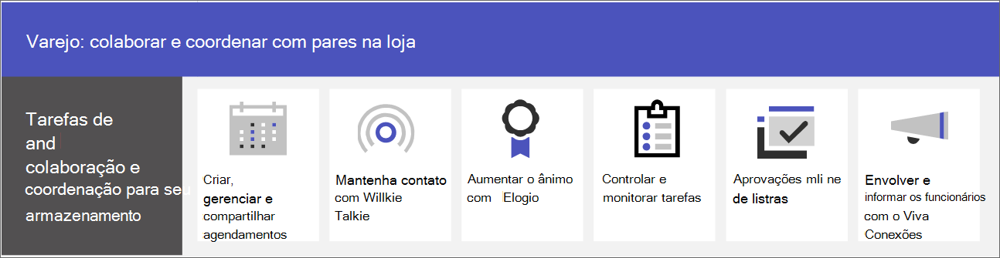

# Colaboração em equipe de varejo

Reúna os associados e o gerenciamento na loja para se comunicar, colaborar e simplificar as operações com o Microsoft Teams. Ajude seus associados a se [conectarem à sua organização com o Viva Connections](#connect-information-from-across-the-organization-with-viva-connections) e a habilitar a comunicação entre os armazenamentos e a sede com [comunidades Yammer](#connect-across-your-organization-with-yammer-and-teams).

> [!VIDEO https://www.microsoft.com/videoplayer/embed/RWRJVw]

> [!NOTE]
> Esses cenários também fazem parte do Microsoft Cloud for Retail. Você pode fazer mais com esses cenários quando também usa outros recursos do Microsoft Cloud for Retail, como o Microsoft Dynamics 365. Saiba mais sobre como usar essa solução, que reúne recursos do Azure, do Dynamics 365 e do Microsoft 365 no [Microsoft Cloud for Retail](/industry/retail).

## Comunicações diárias e colaboração no Teams

O Microsoft Teams permite que associados de vendas na loja, gerentes e outras equipes colaborem com eficiência com recursos e aplicativos de colaboração incluídos. Sua força de trabalho de linha de frente podem usar os dispositivos pessoais ou compartilhados do Teams, dependendo das necessidades da sua organização.

O Teams inclui as seguintes maneiras de se comunicar e compartilhar informações:

| Tarefa | Descrição | Gerenciar esse recurso | Treinamento do usuário final |
| ---- | ---- | ---- | ---- |
| Conversar, postar mensagens e se comunicar. | Seus associados na loja podem se comunicar perfeitamente entre departamentos para atender a pedidos, obter ajuda para clientes e gerenciar necessidades de ações.   O Teams oferece uma excelente experiência de colaboração pronta para uso para sua organização e a maioria das organizações acha que as configurações padrão atendem suas necessidades. | [Chat, equipes, canais e aplicativos no Microsoft Teams](../deploy-chat-teams-channels-microsoft-teams-landing-page.md) | [Iniciar chats](https://support.microsoft.com/office/start-and-pin-chats-a864b052-5e4b-4ccf-b046-2e26f40e21b5) e [Trabalhar com postagens e mensagens](https://support.microsoft.com/office/create-and-format-a-post-e66777da-636b-49eb-9408-b0d88b212885) |
|Chamar e reunir-se com membros da equipe | Os gerentes podem configurar reuniões individuais ou usar reuniões de canal para gerenciar reuniões diárias, tanto com o poder de áudio, vídeo, compartilhamento de tela, gravação e recursos de transcrição do Teams. Por exemplo, um gerente pode configurar uma reunião de vídeo matinal com os associados da loja em diferentes departamentos para verificar seu status antes de abrir a loja.   Você precisará configurar configurações para reuniões e conferências e habilitar uma solução de voz para usar chamadas. | [Reuniões e conferências em Microsoft Teams](../deploy-meetings-microsoft-teams-landing-page.md) e [Planejar sua solução Teams Voice](../cloud-voice-landing-page.md) | [Fazer chamadas](https://support.microsoft.com/office/overview-of-teams-calls-425d6970-6e27-47b6-bc61-4c38fff51c4f) e [Participar de uma reunião](https://support.microsoft.com/office/join-a-teams-meeting-078e9868-f1aa-4414-8bb9-ee88e9236ee4) |
|Armazenar e compartilhar arquivos e documentos | O compartilhamento de arquivos permite que a equipe no armazenamento acesse facilmente informações como diagramas de merchandising sem precisar sair do piso de vendas ou obter ajuda de um gerente. Cada equipe vem automaticamente com uma guia Arquivos que você pode usar para armazenar e compartilhar documentos. Essa guia representa, na verdade, uma pasta dentro da biblioteca de documentos do site de equipe padrão no SharePoint criada automaticamente quando a equipe é criada. | [Como SharePoint e OneDrive interagem com Microsoft Teams](../sharepoint-onedrive-interact.md) | [Carregar e compartilhar arquivos](https://support.microsoft.com/office/upload-and-share-files-57b669db-678e-424e-b0a0-15d19215cb12) |

Sua equipe pode usar aplicativos no Teams para coordenar e colaborar uns com os outros em tarefas diárias, como:

| Tarefa | App | Descrição | Gerenciar esse aplicativo | Treinamento do usuário final |
| ---- | ---- | ---- | ---- | ---- |
| Criar, gerenciar e compartilhar agendamentos| Turnos | Use Turnos para gerenciar e compartilhar agendamentos perfeitamente. Os gerentes podem criar grupos personalizados, como caixas de correio ou saudadores atribuir turnos aos funcionários, adicionar rotulagem e pausas personalizadas e adicionar turnos abertos que os funcionários podem solicitar para fazer. Os funcionários podem usar Turnos para definir sua disponibilidade, exibir seus agendamentos, trocar turnos com colegas de trabalho e entrar e sair. | [Gerenciar Turnos](/microsoftteams/expand-teams-across-your-org/shifts/manage-the-shifts-app-for-your-organization-in-teams)|[Treinamento de vídeo de Turnos](https://support.microsoft.com/office/what-is-shifts-f8efe6e4-ddb3-4d23-b81b-bb812296b821)|
| Manter contato | Walkie Talkie | O aplicativo Walkie Talkie fornece comunicação push-to-talk instantânea. Usando o Walkie Talkie, os funcionários e gerentes podem se comunicar de qualquer lugar na loja. Por exemplo, se um cliente de um lado da loja perguntar a um funcionário se um item está em estoque do outro lado da loja, o funcionário pode usar o Walkie Talkie para contatar alguém que trabalha perto do item. Como o Walkie Talkie não tem intervalo limitado, os funcionários também podem consultar facilmente especialistas em outras lojas ou escritórios corporativos. | [Gerenciar o Walkie Talkie](../walkie-talkie.md)  | [Treinamento em vídeo do Walkie Talkie](https://support.microsoft.com/office/use-walkie-talkie-in-teams-884a008a-761e-4b62-99f8-15671d9a2f69) |
| Aumentar o ânimo | Elogio | O aplicativo Elogio permite que os associados da gerência e da loja elogiem uns aos outros e compartilhem apreciação enviando selos. O Elogio ajuda os funcionários a se sentirem reconhecidos por conquistas, como atingir metas de vendas e ir além para ajudar os clientes. | [Gerenciar o aplicativo Elogio](../manage-praise-app.md) |[Treinamento em vídeo do Elogio](https://support.microsoft.com/office/communication-and-praise-7d37ef80-542b-42e5-aa01-0fabbaa634b6) |
| Controlar e monitorar tarefas | Tarefas | Use Tasks no Teams para rastrear tarefas a serem cumpridas para toda a sua equipe de varejo. Os gerentes e funcionários da loja podem criar, atribuir e agendar tarefas, categorizar tarefas e atualizar o status a qualquer momento de qualquer dispositivo que executa o Teams. Os profissionais e administradores de TI também podem publicar tarefas para equipes específicas da sua organização. Por exemplo, você pode publicar um conjunto de tarefas para limpeza diária ou etapas para configurar uma nova exibição.| [Gerenciar o aplicativo Tasks](/microsoftteams/manage-tasks-app) |[Treinamento em vídeo de Tasks](https://support.microsoft.com/office/use-the-tasks-app-in-teams-e32639f3-2e07-4b62-9a8c-fd706c12c070) |
| Simplificar aprovações | Aprovações | Use Aprovações para simplificar solicitações e processos com sua equipe. Criar, gerenciar e compartilhar aprovações diretamente do seu hub para trabalho em equipe. Iniciar um fluxo de aprovação do mesmo local que você enviar um chat, em uma conversa de canal ou do próprio aplicativo Aprovações. Basta selecionar um tipo de aprovação, adicionar detalhes, anexar arquivos e escolher aprovadores. Depois que for enviado, os aprovadores são notificados e podem analisar e atuar na solicitação. Você pode permitir o aplicativo Aprovações para sua organização e adicioná-lo ao Teams. | [Disponibilidade dos aplicativos de aprovação do Teams](/microsoftteams/approval-admin) | [Treinamento em vídeo de Aprovações](https://support.microsoft.com/office/what-is-approvals-a9a01c95-e0bf-4d20-9ada-f7be3fc283d3?wt.mc_id=otc_microsoft_teams)|

### Configurar suas equipes, canais e aplicativos

Quando estiver pronto para conectar seus funcionários de varejo no Teams, você poderá configurar equipes e canais para suas equipes e gerentes da loja com modelos pré-criados ou personalizados. A maneira mais fácil é começar com um modelo. Os modelos **Organizar uma loja** e **Varejo para gerentes** [são modelos](/microsoftteams/get-started-with-retail-teams-templates) pré-criados que incluem canais e aplicativos projetados para varejo. Você também pode criar um modelo com base em uma equipe existente. Mesmo quando você começa com um modelo, você pode personalizar a equipe e os canais e adicionar mais aplicativos para atender às necessidades da sua equipe.

- Use canais com guias para compartilhar notícias, manter os funcionários em contato entre turnos e construir uma comunidade.
- Use modelos de equipe para configurar equipes com estruturas semelhantes (como canais e guias) em lojas ou regiões.

#### Criar uma equipe com base em um modelo

1. Em Microsoft Teams, selecione **Ingressar ou criar uma equipe**.

2. Selecione **Criar uma equipe** e role para baixo para ver modelos disponíveis.

Mais informações: [Criar uma equipe com modelos](https://support.microsoft.com/office/create-a-team-with-team-templates-702a2977-e662-4038-bef5-bdf8ee47b17b)

### Gerenciar aplicativos

Filtre o que está em sua equipe com aplicativos. Você pode permitir ou bloquear aplicativos para sua organização ou definir configurações para aplicativos, no centro de administração Microsoft Teams local. Para obter mais informações sobre como gerenciar aplicativos, consulte [Gerenciar aplicativos no centro de administração do Microsoft Teams](../manage-apps.md).

Os usuários podem adicionar todos os aplicativos permitidos às equipes. Compartilhe esse treinamento com seus usuários para mostrar a eles como: [encontrar e usar Aplicativos](https://support.microsoft.com/office/find-and-use-apps-6e22a734-c002-4da0-ba63-681f155b142d).

## Conectar informações de toda a organização com o Viva Connections

Envolva e informe os funcionários com o Viva Connections. O Viva Connections cria um hub em Teams onde seus associados de varejo podem exibir um feed de notícias personalizado de sua organização e um painel personalizado com recursos necessários. Quando os funcionários usam o Viva Connections, eles são capazes de obter informações importantes mais rapidamente, o que significa que os gerentes não precisam gastar tempo valioso retransmitindo atualizações. Informações importantes do Surface, notícias personalizadas, tarefas, comunicados e outros recursos no Painel de Conexões do Viva.

Saiba mais sobre [Viva Connections](/sharepoint/viva-connections-overview) e ajude seus funcionários e associados a começar a trabalhar com o [Viva Connections no Microsoft Teams](https://support.microsoft.com/office/your-intranet-is-now-in-microsoft-teams-8b4e7f76-f305-49a9-b6d2-09378476f95b).

Com o Microsoft Teams, Viva Connections e SharePoint, você pode habilitar esses cenários:

- Integrar novos funcionários [Saiba como](/sharepoint/onboard-employees)
- Conexão equipes de liderança com funcionários de linha de frente [Saiba como](/sharepoint/leadership-connection)
- Distribuir notícias para sua organização [Saiba como](/sharepoint/distribute-corporate-news-to-your-organization)

[Saiba mais sobre como impulsionar a comunicação em sua organização](/sharepoint/corporate-communications-overview)

## Conecte-se em toda a sua organização com o Yammer e o Teams

Envolva-se com comunidades no Yammer. As comunidades no Yammer atendem às necessidades de compartilhamento de conhecimento, experiência de funcionários, comunicações em toda a empresa e envolvimento de liderança, fornecendo um local central para suas conversas, arquivos, eventos e atualizações. Os funcionários podem trazer problemas, fornecer comentários e fazer e responder às perguntas das Comunidades Yammer. Transmita eventos ao vivo e discussões para manter todos em sua organização em por dentro de tudo.

Saiba como adicionar [uma página Yammer a um canal doTeams](https://support.microsoft.com/office/add-a-yammer-page-to-a-teams-channel-ca06ec83-f22d-4b76-83a5-c83aa2a33528) e [ingressar e criar uma comunidade noYammer](https://support.microsoft.com/office/join-and-create-a-community-in-yammer-56aaf591-1fbc-4160-ba26-0c4723c23fd6).

Mais informações sobre o Yammer:

- Para administradores: [gerenciar o Yammer](/yammer)
- Para usuários: [usar o Yammer](https://support.microsoft.com/office/what-is-yammer-1b0f3b3e-89ee-4b66-aac5-30def12f287c)
