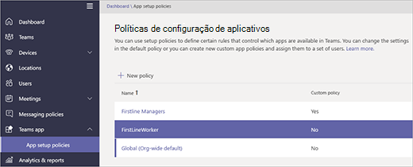

# <a name="manage-the-shifts-app-for-your-organization-in-microsoft-teams"></a>Gerencie o aplicativo Turnos para sua organização no Microsoft Teams

> [!IMPORTANT]
> A partir de 31 de dezembro de 2019, o Microsoft StaffHub será desativado. Estamos criando recursos de StaffHub no Microsoft Teams. Hoje, o Teams inclui o aplicativo turnos para gerenciamento de agendamento e recursos adicionais se acumularão ao longo do tempo. O StaffHub deixará de funcionar para todos os usuários em 31 de dezembro de 2019. Qualquer pessoa que tentar abrir o StaffHub será exibida uma mensagem direcionando-o para o download do teams. Para saber mais, confira [Microsoft StaffHub para ser desativado](microsoft-staffhub-to-be-retired.md).  

## <a name="overview-of-shifts"></a>Visão geral de turnos

O aplicativo turnos no Microsoft Teams mantém os trabalhadores de primeiro lugar conectados e em sincronização. Ele foi criado para o seu celular primeiro para gerenciamento e comunicação de tempo rápido e eficiente para equipes. Os turnos permitem que os funcionários de primeira mão e seus gerentes usem seus dispositivos móveis para gerenciar os cronogramas e manter contato. 

- Gerentes criam, atualizam e gerenciam os cronogramas de turnos do teams. Eles podem enviar mensagens para uma pessoa ("há um derramamento na base") ou toda a equipe ("a GM regional é chegando em 20 minutos"). Eles também podem enviar documentos de política, boletins de notícias e vídeos. 
- Os funcionários visualizam seus próximos turnos, podem ver quem mais está agendado para o dia, solicitar a troca ou oferecer um turno e solicitar folga. 

É importante saber que os turnos atualmente não dão suporte a usuários convidados. Isso significa que os convidados de uma equipe não podem ser adicionados ou usar as agendas de turnos quando o acesso de convidado está ativado no Teams. 

## <a name="availability-of-shifts"></a>Disponibilidade de turnos

Os turnos estão disponíveis em todos os SKUs corporativos nos quais o Microsoft Teams está disponível.

## <a name="location-of-shifts-data"></a>Local dos dados de turnos

Os dados de turnos atualmente estão armazenados no Azure em data centers na América do Norte, Europa Ocidental e Pacífico Asiático. Para obter mais informações sobre onde os dados são armazenados, confira [onde estão os meus dados](http://o365datacentermap.azurewebsites.net/)?

## <a name="set-up-shifts"></a>Configurar turnos

### <a name="enable-or-disable-shifts-in-your-organization"></a>Habilitar ou desabilitar turnos em sua organização

Os turnos são habilitados por padrão para todos os usuários do teams na sua organização. Você pode desativar ou ativar o aplicativo no nível da organização na página [gerenciar aplicativos](../../manage-apps.md) no centro de administração do Microsoft Teams.

1. Na navegação à esquerda do centro de administração do Microsoft Teams, vá até **Team apps** > **gerenciar aplicativos** .
2. Na lista de aplicativos, siga um destes procedimentos:

    - Para desativar os turnos da sua organização, procure o aplicativo turnos, selecione-o e clique em **Bloquear**.
    - Para ativar turnos para sua organização, procure o aplicativo turnos, selecione-o e clique em **permitir**.

### <a name="enable-or-disable-shifts-for-specific-users-in-your-organization"></a>Habilitar ou desabilitar turnos para usuários específicos em sua organização

Para permitir ou bloquear usuários específicos em sua organização usando turnos, certifique-se de que os turnos estejam ativados para sua organização na página [gerenciar aplicativos](../../manage-apps.md) e crie uma política de permissão de aplicativo personalizada e atribua-a a esses usuários. Para saber mais, consulte [gerenciar políticas de permissão do aplicativo no Microsoft Teams](../../teams-app-permission-policies.md).

### <a name="use-the-firstlineworker-app-setup-policy-to-pin-shifts-to-teams"></a>Usar a política de configuração do aplicativo FirstlineWorker para fixar mudanças em equipes

As políticas de configuração do aplicativo permitem que você personalize o Microsoft Teams para realçar os aplicativos que são mais importantes para os usuários da sua organização. Os aplicativos definidos em uma política são fixados na barra&mdash;do aplicativo na barra do cliente da área de trabalho do Teams e na parte inferior dos clientes&mdash;móveis do Teams, nos quais os usuários podem acessá-los de forma rápida e fácil. 
 
O Teams inclui uma política interna de configuração de aplicativos FirstlineWorker que você pode atribuir a trabalhos de primeiros a sua organização. Por padrão, a política inclui os aplicativos atividade, turnos, chat e chamadas. 

Para exibir a política FirstlineWorker, no painel de navegação esquerdo do centro de administração do Microsoft Teams, vá para**políticas de configuração do aplicativo** **Teams app** > .



#### <a name="assign-the-firstlineworker-policy-to-individual-users"></a>Atribuir a política FirstlineWorker a usuários individuais

1. Na barra de navegação à esquerda do centro de administração do Microsoft Teams, vá para **Usuários** e clique no usuário.
2. Ao lado de **políticas atribuídas**, escolha **Editar**.
3. Em **política de configuração do aplicativo Teams**, selecione **FirstlineWorker**e, em seguida, escolha **salvar**.

#### <a name="assign-the-firstlineworker-app-setup-policy-to-user-members-of-a-group"></a>Atribuir a política de configuração do aplicativo FirstlineWorker a membros do grupo de usuários

Você pode atribuir a política de configuração do aplicativo FirstlineWorker a membros do grupo, como um grupo de segurança, conectando-se ao módulo do PowerShell do Azure Active Directory e ao módulo do PowerShell do Skype for Business. Para obter mais informações sobre como usar o PowerShell para gerenciar o Microsoft Teams, consulte [visão geral do teams PowerShell](../../teams-powershell-overview.md).

Neste exemplo, atribuímos a política de configuração do aplicativo FirstlineWorker a todos os membros do grupo de equipe do contoso First.

> [!NOTE]
> Verifique se você se conectou primeiro ao módulo do PowerShell do Azure Active Directory e do módulo do PowerShell do Skype for Business seguindo as etapas em [conectar a todos os serviços do Office 365 em uma única janela do Windows PowerShell](https://docs.microsoft.com/office365/enterprise/powershell/connect-to-all-office-365-services-in-a-single-windows-powershell-window).

Obtenha o GroupObjectId do grupo específico.
```PowerShell
$group = Get-AzureADGroup -SearchString "Contoso Firstline Team"
```
Obter os membros do grupo especificado.
```PowerShell
$members = Get-AzureADGroupMember -ObjectId $group.ObjectId -All $true | Where-Object {$_.ObjectType -eq "User"}
```
Atribua a política de configuração do aplicativo FirstlineWorker a todos os membros de usuário do grupo.
```PowerShell
$members | ForEach-Object {Grant-CsTeamsAppSetupPolicy -PolicyName "FirstlineWorker" -Identity $_.EmailAddress}
``` 
Dependendo do número de membros do grupo, esse comando pode levar alguns minutos para ser executado.

## <a name="related-topics"></a>Tópicos relacionados
- [Ajuda de turnos para trabalhadores de primeira mão](https://support.office.com/article/apps-and-services-cc1fba57-9900-4634-8306-2360a40c665b)
