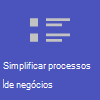
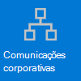

# Introdução ao Teams para Varejo

Os ambientes de varejo, com suas agendas rotativas e equipe em qualquer lugar, têm necessidades muito diferentes das de outras organizações. Para aproveitar ao máximo sua organização de varejo, você primeiro escolhe quais cenários o Teams pode ajudar você em suas operações comerciais diárias e, em seguida, verifique se você preparou seu ambiente do Teams com os conceitos básicos, equipes e aplicativos certos para suportar esses cenários.

1. [Escolha os cenários](#choose-your-scenarios) que você deseja implementar para sua empresa.
:::image type="content" source="../media/retail-teams-scenarios.png" alt-text="Diagrama mostrando cenários do Teams para varejo." lightbox="../media/retail-teams-scenarios.png":::
1. [Configure o conceitos básicos](#set-up-the-fundamentals) - Dê suporte à sua força de trabalho com os conceitos básicos: Gerencie contas e dispositivos e certifique-se de que as políticas apropriadas do Teams sejam aplicadas. :::image type="content" source="../media/retail-teams-fundamentals.png" alt-text="Diagrama mostrando os conceitos básicos, incluindo políticas, contas e dispositivos do Teams." lightbox="../media/retail-teams-fundamentals.png":::
1. [Configurar equipes e aplicativos](#set-up-teams-and-apps) - Use modelos de equipe para configurar as equipes necessárias rapidamente, incluindo os canais e aplicativos necessários para sua empresa. Adicione outros aplicativos da Microsoft conforme necessário para dar suporte aos seus cenários.
:::image type="content" source="../media/retail-teams-apps.png" alt-text="Diagrama mostrando equipes, modelos de equipe e aplicativos que podem ser incluídos." lightbox="../media/retail-teams-apps.png":::

<!-- Additional capabilities for retail environments are available with the Microsoft Cloud for Retail, which includes capabilities from Dynamics 365 and Microsoft Azure as well as the Microsoft 365 features. For more information, see [Microsoft Cloud for Retail](/industry/retail/). -->

## Escolha seus cenários

O Microsoft 365 e o Microsoft Teams oferecem vários recursos que podem ajudar as organizações de varejo com suas operações diárias e transformação digital. Recomendamos os seguintes cenários para organizações de varejo:

     

> [!NOTE]
> Esses cenários também fazem parte do Microsoft Cloud para Varejo. Você pode fazer mais com esses cenários quando também usa outros recursos do Microsoft Cloud for Retail, como o Microsoft Dynamics 365. Saiba mais sobre como usar essa solução, que reúne recursos do Azure, do Dynamics 365 e do Microsoft 365 no [Microsoft Cloud para Varejo](/industry/retail).

### Comunicação e colaboração na loja

Reunir associados e gerenciamento na loja para colaborar e simplificar operações com o Teams e aplicativos do Teams.

**Principais aplicativos:** Turnos, Walkie Talkie, Tarefas, Aprovações, Chat, Elogio, Listas, Arquivos

**Serviços adicionais:** Conexões do Microsoft Viva, SharePoint, Power Platform e Power Apps

Mais informações: [Colaboração em equipe de varejo](retail-team-collaboration.md)

### Comunicação e colaboração entre lojas

Os membros da equipe podem se comunicar e colaborar em várias lojas em uma região ou com a sede usando as mesmas ferramentas e aplicativos que você usa em sua loja.

**Principais aplicativos:** Turnos, Walkie Talkie, Tarefas, Aprovações, Chat, Elogio, Listas, Arquivos

**Serviços adicionais:** Viva Connections, Yammer, SharePoint, Power Platform e Power Apps

Mais informações: [Colaboração em equipe de varejo](retail-team-collaboration.md)

### Conexões virtuais e consultas

O aplicativo Bookings no Microsoft Teams oferece às organizações uma maneira simples de agendar e gerenciar compromissos virtuais para associados e clientes. Use-o para agendar compromissos virtuais, como experiências de compras virtuais.

**Principais recursos e aplicativos:** reuniões, Bookings

Mais informações: [compromissos virtuais com o Microsoft Teams e o aplicativo Bookings](bookings-virtual-visits.md)

### Simplificar processos comerciais

Você pode utilizar os aplicativos do Teams, Power Apps e Power BI para simplificar os processos de negócios. Por exemplo, você pode:

- Definir e manter agendas para seus funcionários com Turnos.
- Conduza passeios de loja e inventários com Power Apps.
- Controlar os KPIs (indicadores de desempenho principais) com relatórios do Power BI.

**Principais aplicativos:** Turnos, Tarefas, Listas, Aprovações

**Serviços adicionais:** Power Platform com Power Apps e Power BI

Mais informações: [Simplificar processos comerciais](retail-business-processes.md)

### Comunicação corporativa

O envolvimento dos funcionários é um colaborador significativo para a satisfação, a fidelidade e a produtividade do local de trabalho em qualquer organização. Saiba como manter todos informados e envolvidos usando o SharePoint, o Teams, o Yammer, o Stream e Conexões do Microsoft Viva.

**Serviços adicionais:** Conexões do Microsoft Viva, SharePoint, Stream, Yammer

Mais informações: [Comunicações organizacionais: diretrizes, métodos e produtos](/sharepoint/corporate-communications-overview)

### Integrando novos funcionários

Faça com que a integração de novos funcionários seja uma ótima experiência, promovendo um ambiente de trabalho híbrido tudo em um, no qual os novos funcionários possam encontrar recursos importantes, conhecer pessoas em sua organização e se preparar para serem bem-sucedidos em sua nova função.

**Principais aplicativos:** Listas, Reuniões ao Vivo

**Serviços adicionais:** Aprendizagem do Microsoft Viva, SharePoint, Yammer

Mais informações: [Integração de novos funcionários](/sharepoint/onboard-employees)

> [!NOTE]
> Para todos esses recursos, os usuários devem ter uma licença apropriada. Microsoft 365 para os trabalhadores de linha de frente F1 e F3 ou Office 365 F3, Office 365 A3, A5, E3 e E5, bem como Microsoft 365 Business Standard, Business Premium, A3, A5, E3 e E5 possuem suporte. Para obter mais informações sobre licenciamento geral do Teams, consulte [Gerenciar o acesso do usuário ao Teams](../user-access.md). Consulte [Opções de licenciamento para trabalhadores de linha de frente](../flw-licensing-options.md) para obter mais informações sobre como usar o Microsoft 365 para trabalhadores de linha de frente em combinação com outras licenças.

## Configurar os conceitos básicos

Crie a base certa para seus funcionários escolhendo licenças apropriadas para eles, gerenciando suas contas e gerenciando seus dispositivos para que você possa fornecer uma maneira segura e compatível de fazer o trabalho deles.

:::image type="content" source="../media/retail-teams-fundamentals.png" alt-text="Diagrama dos Conceitos Básicos que suportam cenários para o Teams, como políticas de contas e dispositivos do Teams.":::

### Licenciamento

A equipe de varejo geralmente é uma força de trabalho móvel: trabalhadores de linha de frente e gerentes que não estão vinculados a computadores o dia todo, ao contrário da equipe corporativa. Portanto, as ferramentas e aplicativos necessários são diferentes. O Microsoft 365 para trabalhadores de linha de frente fornece um conjunto de recursos personalizado para esse público. Consulte mais em [Opções de licenciamento para trabalhadores de linha de frente](../flw-licensing-options.md).

### Contas

Com alta rotatividade, a capacidade de adicionar e remover contas rapidamente e obter as políticas certas atribuídas é fundamental. Introdução ao assistente de Integração de Trabalhadores de Linha de Frente no Centro de administração do Microsoft 365. O assistente configura uma equipe para seus trabalhadores de linha de frente e atribui licenças e pacotes de política a cada membro da equipe. Para obter mais informações, consulte [Usar o assistente de integração de Trabalhadores de Linha de Frente para que sua força de trabalho de linha de frente entre em funcionamento](../flw-onboarding-wizard.md).

Se você tiver muitas equipes que quer implantar, consulte [Implantar equipes em escala para os trabalhadores da linha de frente](../deploy-teams-at-scale.md).

A presença de Trabalhadores de Linha de Frente geralmente é menos previsível do que outras equipes, pois suas horas de trabalho normalmente não são as mesmas todos os dias. Como administrador, você pode configurar o Teams com o acesso baseado em Turno (Visualização) para mostrar um conjunto de estados de presença baseados em turnos para os Trabalhadores de Linha de Frente em sua organização indicarem quando eles estão dentro e fora do turno. Também é possível gerenciar o acesso ao Teams quando os trabalhadores de linha de frente estão fora do turno. Para obter mais informações, consulte [Gerenciar acesso baseado em turno para Trabalhadores de Linha de Frente](shifts/manage-shift-based-access-flw.md).

### Dispositivos

Como a força de trabalho é em grande parte móvel, o gerenciamento de contas e dispositivos é fundamental para ambientes de varejo. É necessário definir uma linha de base segura e compatível com dispositivos gerenciados para sua força de trabalho usar, seja um dispositivo compartilhado ou o próprio dispositivo de um funcionário. Veja mais em:

- [Planejar sua implantação de dispositivo do Azure Active Directory](/azure/active-directory/devices/plan-device-deployment)
- [Visão geral do Microsoft Intune](/mem/intune/fundamentals/what-is-intune#manage-devices)
- [Microsoft Teams para RealWear](../flw-realwear.md)

### Políticas

Certifique-se de que seus associados de vendas e outros trabalhadores de linha de frente tenham o acesso apropriado à funcionalidade do Teams configurando os pacotes de política apropriados. As políticas do Teams ajudam a controlar o que os usuários em funções específicas podem fazer. Os [pacotes de política de gerente de linha de frente e de trabalhadores de linha de frente](../manage-policy-packages.md#policy-packages-included-in-teams) são personalizados para serem apropriados para trabalhadores de linha de frente, como aqueles em lojas de varejo.

O Teams integra-se com o aplicativo Turnos e o Trabalhador de Linha de Frente, que podem ser usados para coordenar os recursos de equipe de turno e muito mais. Por exemplo, em Turnos, os gerentes de loja podem configurar e coordenar agendas para sua equipe, e os funcionários podem verificar agendas e alternar turnos.

## Configurar equipes e aplicativos

:::image type="content" source="../media/retail-teams-apps.png" alt-text="Diagrama de equipes, modelos de equipe e aplicativos que podem ser incluídos.":::

### Aplicativos e serviços para varejo

Certifique-se de que seus funcionários possam se comunicar, colaborar e oferecer um excelente serviço ao cliente com aplicativos como Turnos, Walkie Talkie, Tarefas, Listas, Elogio e assim por diante. É possível determinar quais aplicativos estão disponíveis para seus usuários habilitando-os no Centro de administração do Teams ou incluindo-os em um modelo de equipe. Mais informações sobre [como gerenciar aplicativos do Teams](../manage-apps.md).

Para ambientes de varejo, os seguintes aplicativos e serviços podem ajudá-lo a transformar seus processos comerciais e dar suporte à comunicação:

| Aplicativos e serviços do Teams | Descrição | Gerenciar | Ajuda |
| ----- | ----- | ----- | ----- |
| Aprovações | As aprovações podem ser integradas ao chat para facilitar a aprovação. | [Gerenciar Aprovações](../approval-admin.md) | [Usar Aprovações](https://support.microsoft.com/office/what-is-approvals-a9a01c95-e0bf-4d20-9ada-f7be3fc283d3) |
| Chat | Habilite conversas rápidas e verificações entre a equipe com ferramentas de comunicação seguras e de nível empresarial, em vez de aplicativos de nível de consumidor ou SMS. | [Chat, equipes, canais e aplicativos no Microsoft Teams](../deploy-chat-teams-channels-microsoft-teams-landing-page.md) | [Chat no Teams](https://support.microsoft.com/office/start-and-pin-chats-a864b052-5e4b-4ccf-b046-2e26f40e21b5?wt.mc_id=otc_microsoft_teams) |
| Documentos | Compartilhe procedimentos operacionais padrão, políticas de loja, planos e muito mais. | [Como o SharePoint e o OneDrive interagem com o Microsoft Teams](../sharepoint-onedrive-interact.md) | [Compartilhe arquivos](https://support.microsoft.com/office/upload-and-share-files-57b669db-678e-424e-b0a0-15d19215cb12) |
| Elogio | Reconheça colegas de trabalho por um excelente trabalho em equipe com o aplicativo Elogio. | [Gerenciar o aplicativo Elogio](../manage-praise-app.md) | [Enviar Elogio às pessoas](https://support.microsoft.com/office/send-praise-to-people-50f26b47-565f-40fe-8642-5ca2a5ed261e) |
| Dispositivos RealWear | Comunicação com as mãos livres com dispositivos. | [Microsoft Teams para RealWear](../flw-realwear.md) | [Usar Microsoft Teams para RealWear](https://support.microsoft.com/office/using-microsoft-teams-for-realwear-af20d232-d18c-476f-8031-843a4edccd5f) |
| Turnos | Gerencie agendas e entre e saia com Turnos. | [Gerenciar Turnos](shifts-for-teams-landing-page.md) | [Usar Turnos](https://support.microsoft.com/office/what-is-shifts-f8efe6e4-ddb3-4d23-b81b-bb812296b821) |
| Tarefas | Ajude os funcionários a saber no que devem se concentrar quando não estão com os clientes atribuindo tarefas. As operações podem usar a [publicação de tarefas](../manage-tasks-app.md#task-publishing) para enviar tarefas para locais e acompanhar o progresso nesses locais. | [Gerenciar o aplicativo Tarefas](../manage-tasks-app.md) | [Usar Tarefas](https://support.microsoft.com/office/use-the-tasks-app-in-teams-e32639f3-2e07-4b62-9a8c-fd706c12c070) |
| Walkie Talkie | Aperte para falar rapidamente sem restrições geográficas, como rádios bidirecionais padrão.| [Gerenciar o aplicativo Walkie Talkie](../walkie-talkie.md) | [Usar Walkie Talkie](https://support.microsoft.com/office/get-started-with-teams-walkie-talkie-25bdc3d5-bbb2-41b7-89bf-650fae0c8e0c) |

| Mais aplicativos e serviços da Microsoft | Descrição | Gerenciar | Ajuda |
| ----- | ----- | ----- | ----- |
| Bookings | Habilitar conexões virtuais e consultas. | [Compromissos virtuais com o Microsoft Teams e o aplicativo Bookings](bookings-virtual-visits.md) | [Usar o Bookings](https://support.microsoft.com/en-us/office/what-is-bookings-42d4e852-8e99-4d8f-9b70-d7fc93973cb5) |
| Power Apps e o Power Platform | Integre processos comerciais e habilite atualizações rápidas para dados, como inventário de loja, números de vendas, relatórios de incidentes e muito mais. | [Integração do Teams com o Microsoft Power Platform](/microsoftteams/platform/samples/teams-low-code-solutions) e [Gerenciar aplicativos do Microsoft Power Platform no Centro de Administração do Microsoft Teams](../manage-power-platform-apps.md) | -  |
| SharePoint | Quando você cria uma nova equipe, um novo site do SharePoint é criado e conectado à equipe. Muitos dos cenários acima dependem de recursos do SharePoint já incorporados ao Teams, como o compartilhamento de documentos para colaboração em equipe. | [Integração do Teams e do SharePoint](/sharepoint/teams-connected-sites) | [Adicionar uma página, lista ou biblioteca de documentos do SharePoint como uma guia no Teams](https://support.microsoft.com/office/add-a-sharepoint-page-list-or-document-library-as-a-tab-in-teams-131edef1-455f-4c67-a8ce-efa2ebf25f0b)|
| Conexões do Microsoft Viva | Conexões do Microsoft Viva cria um hub em Teams onde seus associados de varejo podem exibir um feed de notícias personalizado de sua organização e um painel personalizado com recursos necessários. | [Visão geral de Conexões do Microsoft Viva](/sharepoint/viva-connections-overview) | [Conexões do Microsoft Viva no Microsoft Teams](https://support.microsoft.com/office/your-intranet-is-now-in-microsoft-teams-8b4e7f76-f305-49a9-b6d2-09378476f95b) |
| Aprendizagem do Microsoft Viva | Forneça treinamento quando necessário, bem no fluxo de seu trabalho. | [Gerenciar a Aprendizagem do Microsoft Viva](/microsoft-365/learning/) | [Usar a Aprendizagem do Microsoft Viva (Visualização)](https://support.microsoft.com/office/viva-learning-preview-01bfed12-c327-41e0-a68f-7fa527dcc98a) |
| Yammer | Conecte sua organização e permita a comunicação entre departamentos e regiões com o Yammer. | [Gerenciar o Yammer](/yammer) | [Usar o Yammer](https://support.microsoft.com/office/what-is-yammer-1b0f3b3e-89ee-4b66-aac5-30def12f287c) |

### Usar modelos para configurar equipes

Crie equipes que incluam um conjunto predefinido de configurações, canais, guias e aplicativos pré-instalados para comunicação e colaboração em uma loja individual, com uma região ou entre a sede e sua equipe onde quer que estejam.

- O modelo **Organizar uma loja** de varejo inclui canais para Geral, Entrega de Turno, Preparação da Loja e Aprendizagem e inclui os aplicativos Aprovações, Tarefas e Wiki.
- O modelo de **Varejo para gerentes** inclui canais para Geral, Operações e Aprendizagem e inclui uma guia Wiki.

Também é possível [criar um modelo personalizado](../create-a-team-template.md) para incluir os aplicativos que sua loja precisa. Mais informações: [Introdução aos modelos de equipe de varejo](../get-started-with-retail-teams-templates.md)

Além dos modelos de equipe, também é possível configurar outros sites e serviços para ajudar na comunicação: sites do SharePoint e Conexões do Microsoft Viva.

- Configure sites do SharePoint para criar uma página inicial para sua organização, distribua notícias em toda a sua empresa e forneça um local com recursos para usuários de integração. Saiba mais sobre como usar sites do SharePoint para cenários de comunicação corporativa em [Comunicações organizacionais: diretrizes, métodos e produtos](/sharepoint/corporate-communications-overview).
- Use Conexões do Microsoft Viva para reunir tudo. Com Conexões do Microsoft Viva como a central do seu funcionário no Teams, ele pode obter atualizações sobre suas tarefas, notícias organizacionais e muito mais. Para obter mais informações, consulte [Visão geral: Conexões do Microsoft Viva (Visualização)](/viva/connections/viva-connections-overview) e [Adicionar o aplicativo Conexões do Microsoft Viva no Centro de Administração do Teams (Visualização)](/viva/connections/add-viva-connections-app).

## Prepare-se para implantar seus cenários - identifique funções e responsabilidades para cenários

Agora que você sabe quais cenários deseja implementar e o que precisa para apoiá-los, você pode reunir sua equipe para que possa planejar, implementar e monitorar como eles estão trabalhando na sua organização. Por exemplo, as seguintes funções podem ser necessárias para implantar esses cenários na sua organização:

| Imagem | Função | Responsibilities | Departamento |
| ---- | ---- | ----- | ----- |
| | Administrador de TI | Trabalhe com a equipe de gerenciamento de operações e varejo para definir cenários e como eles funcionarão na organização.   Defina as configurações no Centro de administração do Teams, como políticas e modelos, e habilite aplicativos.   Defina as configurações de aplicativo (como configurações globais de Turnos) para a organização.   Adicione e licencie usuários.  | Departamento de TI |
|| Equipe de operações | Trabalhe com administradores para definir cenários e determine quais configurações, políticas, modelos e aplicativos são necessários para o Teams.   Crie equipes regionais ou divisionais a partir de modelos.   Configure tarefas, listas e fluxos de aprovação para coordenação entre as lojas em uma região ou entre as lojas e a sede.   Configure a estrutura de aprendizagem para funcionários. | Operações centrais |
| | Gerente da loja | Trabalhe com a equipe de Administradores e Operações para definir cenários.   Crie equipes para a loja a partir de modelos.   Configure canais e aplicativos para as equipes, conforme necessário. Por exemplo: um canal para entregas de turno.   Configure agendas de loja em Turnos.   Configure tarefas, listas e fluxos de aprovação específicos para a loja.   Configure tarefas de aprendizagem para a equipe. | Gerenciamento da loja |

Para obter mais informações sobre como implementar e adotar o Teams, consulte [Adoção do Microsoft Teams](../adopt-microsoft-teams-landing-page.md).
