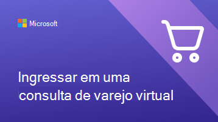
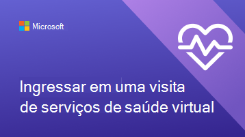
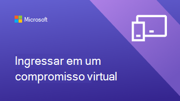

# Ajudar seus clientes e clientes a usar compromissos virtuais

Agora que sua organização começou a usar o Microsoft Teams e o aplicativo Bookings para compromissos virtuais, você precisará garantir que seus clientes e clientes entendam como agendar e ingressar nesses compromissos.

Assista a este vídeo para obter uma visão geral rápida do que os compromissos virtuais podem fazer para sua organização.

> [!VIDEO https://www.microsoft.com/videoplayer/embed/RE4TQop]

## O que está incluído neste kit de ferramentas

Este kit de ferramentas destina-se a ajudar você a ajudar seus clientes e clientes a ingressar com êxito em um compromisso virtual. Você pode personalizar os recursos que fornecemos e incluir links para eles em suas comunicações sobre compromissos virtuais. Este kit de ferramentas inclui:

[Diretrizes para seu site](#guidance-for-your-website):   Perguntas frequentes sobre compromissos virtuais que você pode personalizar e hospedar em seu site. Certifique-se de adicionar seus próprios links e quaisquer informações adicionais que seus clientes precisam saber sobre suas políticas.

[Recursos para sua equipe](#resources-for-your-team):   Artigos e vídeos para ajudar sua equipe a se familiarizar com a realização de compromissos virtuais.

[Recursos para seus clientes](#resources-for-your-clients):  
Um link para o conteúdo de suporte da Microsoft, que inclui um vídeo sobre como ingressar em um compromisso virtual. 
Infográficos que você pode personalizar para sua organização.

## Diretrizes para seu site

Informe aos clientes o que esperar com compromissos virtuais respondendo a perguntas comuns. Tudo o que você precisa fazer é editar este Q&A para se alinhar às políticas de compromisso virtual e colá-lo em seu site.

### Noções básicas sobre compromissos virtuais

**O que é um compromisso virtual?**

Um compromisso virtual é um compromisso online realizado por Microsoft Teams. Você vai falar um contra um com um de nossos membros da equipe, assim como faria para uma visita presencial.

**Como os compromissos virtuais são diferentes das visitas presenciais?**

Informe aos clientes se há diferenças nos serviços que você fornece virtualmente e pessoalmente. Você também pode descrever as diferenças de taxa entre compromissos virtuais e presenciais.

**Como funciona um compromisso virtual?**

Ao ingressar no link na confirmação por email, você entrará em uma sala de espera virtual. Depois que um membro da equipe ingressar na chamada, você entrará em uma sala virtual com eles onde ocorrerá sua visita um-a-um.

**Como funciona o pagamento para compromissos virtuais?**

Informe seus clientes se você aceitar diferentes tipos de pagamento para Compromissos.

### Reservar um compromisso

**Como fazer marcar um compromisso?**

Link para a página de reserva da sua organização. Informe aos clientes se há maneiras alternativas de fazer compromissos virtuais, como por telefone, por email ou por meio de mídias sociais.

**Who posso marcar uma consulta?**

Certifique-se de que seus clientes possam manter relações com seus provedores preferenciais compartilhando quais, se houver, a equipe está operando exclusivamente virtualmente ou pessoalmente.

**Como fazer cancelar ou reagendar um compromisso virtual?**

Você pode vincular à política de cancelamento e reagendamento da sua organização aqui ou descrever as diferenças na política entre compromissos virtuais e presenciais.

### Tecnologia

**De quais equipamentos preciso para um compromisso virtual?**

Os clientes podem ingressar em um compromisso virtual em qualquer navegador da Web ou por meio do Microsoft Teams aplicativo. Liste aqui se sua organização tiver especificações adicionais, como uma webcam ou microfone de alta qualidade. Se sua organização de saúde tiver o EHR integrado às equipes, os pacientes poderão ingressar em visitas do portal de saúde.

**Como fazer ingressar em um compromisso virtual?**

Você pode vincular seus clientes aqui a ingressar em um compromisso do Bookings como um participante (microsoft.com) para mostrar a eles um vídeo detalhado e um processo passo a passo de como ingressar em um compromisso.

## Recursos para sua equipe

Faça o máximo de compromissos virtuais, fazendo com que os membros da sua equipe saibam como conduzi-los. Você pode compartilhar esses artigos e vídeos com os membros da equipe para ajudá-los a entender melhor os compromissos virtuais.

- [Saiba como usar o aplicativo Bookings no Teams](https://support.microsoft.com/office/what-is-bookings-42d4e852-8e99-4d8f-9b70-d7fc93973cb5)
- [Saiba como ingressar em um Bookings agendamento](https://support.microsoft.com/office/join-a-bookings-appointment-attendees-3deb7bde-3ea3-4b41-8a06-741ad0db9fc0)
- [Realizar uma visita virtual](/microsoftteams/expand-teams-across-your-org/bookings-virtual-visits#conduct-a-visit)
- [Assista a um vídeo sobre compromissos virtuais](#help-your-clients-and-customers-use-virtual-appointments)

## Recursos para seus clientes

Você pode vincular a este artigo para mostrar aos clientes como ingressar em compromissos virtuais:  
[Saiba como ingressar em um compromisso virtual](https://support.microsoft.com/office/join-a-bookings-appointment-as-an-attendee-95cea12d-2220-421f-a663-6efb20913c7f)

Baixe e [personalize](#customize-your-infographic) um desses infográficos para recurso em seu site. Isso oferece aos clientes uma maneira rápida e visualmente envolvente de entender como os compromissos virtuais com sua organização funcionam.

| Gráfico                | Descrição e links              |
| :------------------- | -------------------: |
|  | Infográfico personalizável para sua organização de serviços financeiros   [Baixar como um PDF](//download.microsoft.com/download/8/5/7/85784cd8-6945-4fcc-a3c3-972bd88d3fef/VirtualVisit_Financial_Infographic.pdf)   [Baixar como um PowerPoint](//download.microsoft.com/download/8/5/7/85784cd8-6945-4fcc-a3c3-972bd88d3fef/VirtualVisit_Financial_Infographic.pptx)
|  | Infográfico personalizável para sua organização de varejo   [Baixar como um PDF](//download.microsoft.com/download/a/b/5/ab5c07d9-cf7a-47b3-ba54-05a8a0a2a1bd/VirtualVisit_Retail_Infographic.pdf)   [Baixar como um PowerPoint](//download.microsoft.com/download/a/b/5/ab5c07d9-cf7a-47b3-ba54-05a8a0a2a1bd/VirtualVisit_Retail_Infographic.pptx) |
|  | Infográfico personalizável para sua organização de saúde   [Baixar como um PDF](//download.microsoft.com/download/4/d/3/4d3d9c53-0304-4aea-a56a-60a16402c58f/VirtualVisit_Healthcare_Infographic.pdf)   [Baixar como um PowerPoint](//download.microsoft.com/download/4/d/3/4d3d9c53-0304-4aea-a56a-60a16402c58f/VirtualVisit_Healthcare_Infographic.pptx) |
|  | Infográfico personalizável não específico para um setor específico   [Baixar como um PDF](//download.microsoft.com/download/c/6/9/c69d3f29-a8f5-462b-a645-79119beab406/VirtualVisit_Generic_Infographic.pdf)   [Baixar como um PowerPoint](//download.microsoft.com/download/c/6/9/c69d3f29-a8f5-462b-a645-79119beab406/VirtualVisit_Generic_Infographic.pptx) |

### Personalizar seu infográfico

1. Escolha um dos três infográficos predefinido, dependendo das necessidades da sua organização:
    1. Saúde
    2. Serviços financeiros
    3. Varejo

2. Personalize o infográfico no PowerPoint.
    1. Use as cores e as fontes preferenciais da sua organização.
    2. Adicione o logotipo ou as imagens da marca da sua organização.
    3. Link para páginas em seu site, como sua página de reserva, informações de cobrança ou home page.
    4. Adicione informações adicionais que seus clientes precisam saber antes de ingressar em um compromisso virtual.

3. Exporte seu infográfico personalizado como um PDF.
