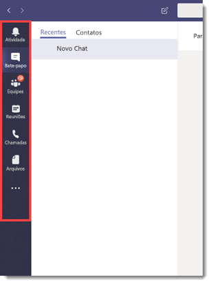
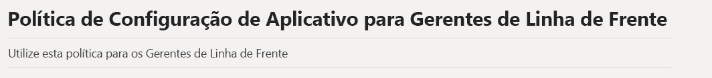
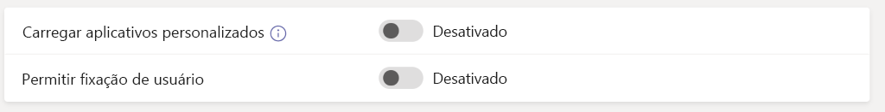
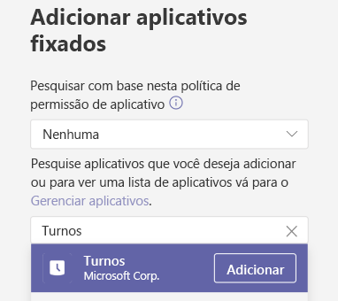
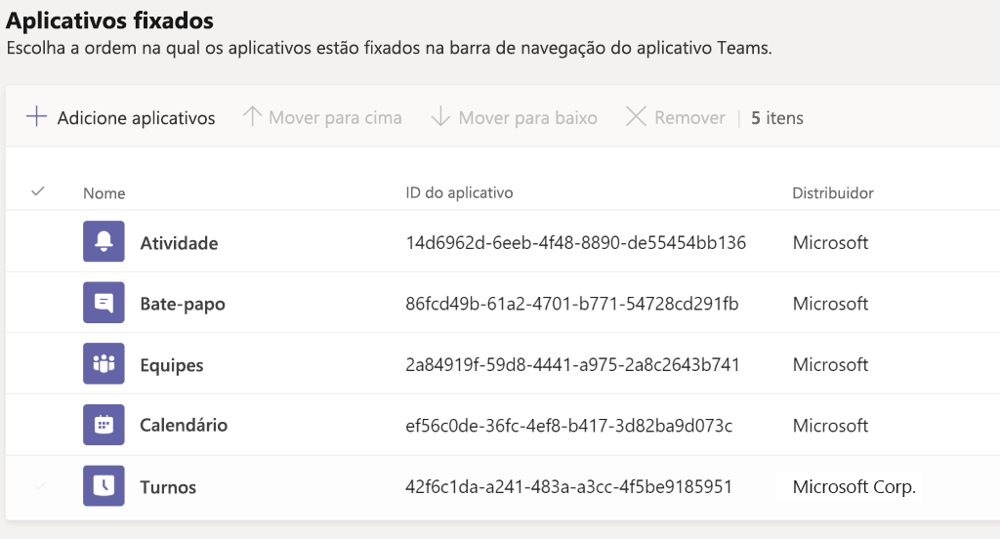
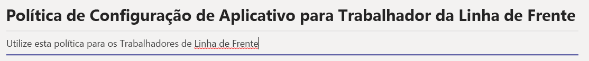
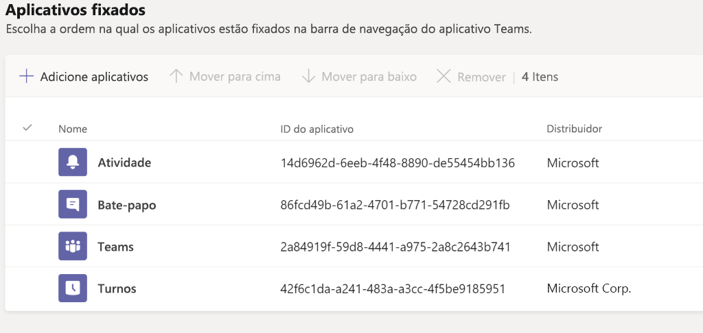
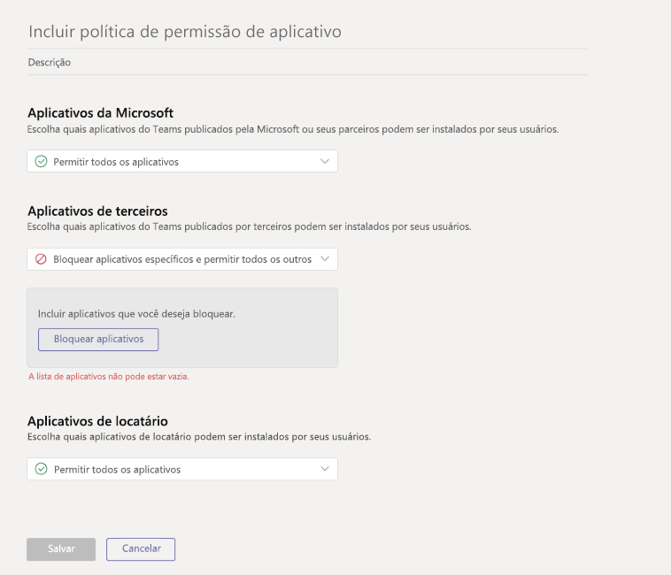

# <a name="how-to-provision-teams-at-scale-for-firstline-workers"></a><span data-ttu-id="a3b91-103">Como provisionar o Teams em escala para os Trabalhadores da Linha de Frente</span><span class="sxs-lookup"><span data-stu-id="a3b91-103">How to provision Teams at scale for Firstline Workers</span></span>

<span data-ttu-id="a3b91-104">Precisa integrar rapidamente um grande número de usuários ao Microsoft Teams e configurar uma experiência simplificada para eles?</span><span class="sxs-lookup"><span data-stu-id="a3b91-104">Do you need to rapidly onboard a large number of users to Microsoft Teams and configure a streamlined experience for them?</span></span> <span data-ttu-id="a3b91-105">Você pode rapidamente provisionar identidades e equipes, além de atribuir todas as políticas relevantes para controlar a experiência do usuário final, através das instruções a seguir.</span><span class="sxs-lookup"><span data-stu-id="a3b91-105">You can quickly provision identities, provision teams, and assign all relevant policies to control the end user experience by walking through the following instructions.</span></span>

<span data-ttu-id="a3b91-106">Nesse passo a passo, você aprenderá como:</span><span class="sxs-lookup"><span data-stu-id="a3b91-106">In this walkthrough, you'll learn how to:</span></span>

- <span data-ttu-id="a3b91-107">Criar um grande número de usuários.</span><span class="sxs-lookup"><span data-stu-id="a3b91-107">Create a large number of users.</span></span>
- <span data-ttu-id="a3b91-108">Criar um grande número de equipes e configurar os canais apropriados.</span><span class="sxs-lookup"><span data-stu-id="a3b91-108">Create a large number of teams and set up the appropriate channels.</span></span>
- <span data-ttu-id="a3b91-109">Atribuir licenciamento em escala.</span><span class="sxs-lookup"><span data-stu-id="a3b91-109">Assign licensing at scale.</span></span>
- <span data-ttu-id="a3b91-110">Criar políticas de envio de mensagens do Teams, políticas de configuração de aplicativos e políticas de permissão de aplicativos apropriados.</span><span class="sxs-lookup"><span data-stu-id="a3b91-110">Create appropriate Teams Messaging Policies, App Setup Policies, and App Permission Policies.</span></span>
- <span data-ttu-id="a3b91-111">Aplicar essas políticas a usuários em escala.</span><span class="sxs-lookup"><span data-stu-id="a3b91-111">Apply those policies to users at scale.</span></span>
- <span data-ttu-id="a3b91-112">Atribuir um grande número de usuários a uma equipe designada.</span><span class="sxs-lookup"><span data-stu-id="a3b91-112">Assign a large number of users into a designated team.</span></span>

> [!NOTE]
> <span data-ttu-id="a3b91-113">Se você revisou estas informações e acha que precisa de ajuda ou tem alguma dúvida, [**clique aqui**](https://forms.office.com/Pages/ResponsePage.aspx?id=v4j5cvGGr0GRqy180BHbRyMDv-1voW9MqL7zkQ11DzBUREZaU1E0WEk5T0NYS0NDSkFMSDROUUdYMC4u) para entrar em contato com o Suporte White Glove.</span><span class="sxs-lookup"><span data-stu-id="a3b91-113">If you've reviewed this information and feel like you need some help or have some questions, you can [**click here**](https://forms.office.com/Pages/ResponsePage.aspx?id=v4j5cvGGr0GRqy180BHbRyMDv-1voW9MqL7zkQ11DzBUREZaU1E0WEk5T0NYS0NDSkFMSDROUUdYMC4u) to reach out for White Glove Support.</span></span>

## <a name="prerequisites"></a><span data-ttu-id="a3b91-114">Pré-requisitos</span><span class="sxs-lookup"><span data-stu-id="a3b91-114">Prerequisites</span></span>

<span data-ttu-id="a3b91-115">Baixe os ativos a partir [deste local](https://aka.ms/flwteamsscale).</span><span class="sxs-lookup"><span data-stu-id="a3b91-115">Download the assets from [this location](https://aka.ms/flwteamsscale).</span></span>

> [!IMPORTANT]
> <span data-ttu-id="a3b91-116">Os scripts no link acima são fornecidos como estão pela Microsoft, e devem ser modificados para suas necessidades individuais.</span><span class="sxs-lookup"><span data-stu-id="a3b91-116">The scripts in the link provided above are provided as-is by Microsoft, and must be modified for your individual needs.</span></span>

## <a name="technical-requirements"></a><span data-ttu-id="a3b91-117">Requisitos técnicos</span><span class="sxs-lookup"><span data-stu-id="a3b91-117">Technical requirements</span></span>

- <span data-ttu-id="a3b91-118">O locatário deve ter o número adequado de licenças disponíveis que incluam o Microsoft Teams.</span><span class="sxs-lookup"><span data-stu-id="a3b91-118">Your tenant must have the appropriate number of licenses available that include Microsoft Teams.</span></span> <span data-ttu-id="a3b91-119">Se você ainda não possui essas licenças, consulte o [Exploratório do Teams](teams-exploratory.md) para obter uma assinatura de avaliação gratuita.</span><span class="sxs-lookup"><span data-stu-id="a3b91-119">If you do not already have these licenses, check out [Teams Exploratory](teams-exploratory.md) for a free trial subscription.</span></span>
- <span data-ttu-id="a3b91-120">O usuário que executa estas etapas deve ter as seguintes funções atribuídas: Administrador Global, Administrador de Usuários e Administrador de Serviço do Teams, no Microsoft Azure Active Directory.</span><span class="sxs-lookup"><span data-stu-id="a3b91-120">The user taking these steps must have these roles assigned: Global Admin, User Admin, and Teams Service Admin, in Azure AD.</span></span>
- <span data-ttu-id="a3b91-121">Os usuários devem ter direitos para instalar e configurar softwares no computador local.</span><span class="sxs-lookup"><span data-stu-id="a3b91-121">User must have the rights to install and configure software on their local machine.</span></span>

## <a name="step-by-step-process-overview"></a><span data-ttu-id="a3b91-122">Processo passo a passo</span><span class="sxs-lookup"><span data-stu-id="a3b91-122">Step-by-step process overview</span></span>

1. <span data-ttu-id="a3b91-123">**Configure seu ambiente**</span><span class="sxs-lookup"><span data-stu-id="a3b91-123">**Set up Your Environment**</span></span>
    1. <span data-ttu-id="a3b91-124">Download do repositório GitHub contendo os scripts e documentação de exemplo do Windows PowerShell</span><span class="sxs-lookup"><span data-stu-id="a3b91-124">Download from the GitHub repository containing the sample PowerShell scripts and documentation</span></span>
    1. <span data-ttu-id="a3b91-125">Configurar o ambiente local</span><span class="sxs-lookup"><span data-stu-id="a3b91-125">Configure the local environment</span></span>
    1. <span data-ttu-id="a3b91-126">Credenciais de configuração</span><span class="sxs-lookup"><span data-stu-id="a3b91-126">Setup credentials</span></span>
    1. <span data-ttu-id="a3b91-127">Configurar Módulos do Windows PowerShell e variáveis ambientais</span><span class="sxs-lookup"><span data-stu-id="a3b91-127">Configure PowerShell Modules and environmental variables</span></span>
1. <span data-ttu-id="a3b91-128">**Criar e configurar equipes**</span><span class="sxs-lookup"><span data-stu-id="a3b91-128">**Create and Setup Teams**</span></span>
    1. <span data-ttu-id="a3b91-129">Criar equipes</span><span class="sxs-lookup"><span data-stu-id="a3b91-129">Create teams</span></span>
    1. <span data-ttu-id="a3b91-130">Etapas para a criação de equipes</span><span class="sxs-lookup"><span data-stu-id="a3b91-130">Steps to create teams</span></span>
    1. <span data-ttu-id="a3b91-131">Criar canais para as equipes</span><span class="sxs-lookup"><span data-stu-id="a3b91-131">Create channels for teams</span></span>
1. <span data-ttu-id="a3b91-132">**Criar Políticas do Teams**</span><span class="sxs-lookup"><span data-stu-id="a3b91-132">**Create Teams Policies**</span></span>
    1. <span data-ttu-id="a3b91-133">Criar políticas de mensagens do Teams</span><span class="sxs-lookup"><span data-stu-id="a3b91-133">Create Teams message policies</span></span>
    1. <span data-ttu-id="a3b91-134">Criar políticas de configuração de aplicativos do Teams</span><span class="sxs-lookup"><span data-stu-id="a3b91-134">Create Teams app setup policies</span></span>
    1. <span data-ttu-id="a3b91-135">Criar políticas de permissão de aplicativos do Teams</span><span class="sxs-lookup"><span data-stu-id="a3b91-135">Create Teams app permission policies</span></span>
1. <span data-ttu-id="a3b91-136">**Usuários e grupos de segurança**</span><span class="sxs-lookup"><span data-stu-id="a3b91-136">**Users and Security Groups**</span></span>
    1. <span data-ttu-id="a3b91-137">Criar usuários e grupos de segurança</span><span class="sxs-lookup"><span data-stu-id="a3b91-137">Create users and security groups</span></span>
    1. <span data-ttu-id="a3b91-138">Atribuir licenciamento a usuários por meio de um licenciamento com base em grupo</span><span class="sxs-lookup"><span data-stu-id="a3b91-138">Assign licensing to users via group-based licensing</span></span>
1. <span data-ttu-id="a3b91-139">**Atribuir Usuários e Políticas**</span><span class="sxs-lookup"><span data-stu-id="a3b91-139">**Assign Users and Policies**</span></span>
    1. <span data-ttu-id="a3b91-140">Atribuir usuários ao Teams</span><span class="sxs-lookup"><span data-stu-id="a3b91-140">Assign users to Teams</span></span>
    1. <span data-ttu-id="a3b91-141">Atribuir políticas do Teams aos usuários</span><span class="sxs-lookup"><span data-stu-id="a3b91-141">Assign Teams policies to users</span></span>
    1. <span data-ttu-id="a3b91-142">OPCIONAL: converter tipo de associação do grupo</span><span class="sxs-lookup"><span data-stu-id="a3b91-142">OPTIONAL: Convert group membership type</span></span>
1. <span data-ttu-id="a3b91-143">**Testar e validar**</span><span class="sxs-lookup"><span data-stu-id="a3b91-143">**Test and Validate**</span></span>
    1. <span data-ttu-id="a3b91-144">Entrar no Teams com um usuário de teste</span><span class="sxs-lookup"><span data-stu-id="a3b91-144">Login to Teams with a test user</span></span>
    1. <span data-ttu-id="a3b91-145">Verificar se há erros</span><span class="sxs-lookup"><span data-stu-id="a3b91-145">Check for errors</span></span>
    1. <span data-ttu-id="a3b91-146">Tratamento de erros</span><span class="sxs-lookup"><span data-stu-id="a3b91-146">Error handling</span></span>
1. <span data-ttu-id="a3b91-147">**Leituras adicionais**</span><span class="sxs-lookup"><span data-stu-id="a3b91-147">**Further reading**</span></span>

## <a name="set-up-your-environment"></a><span data-ttu-id="a3b91-148">Configurar ambiente</span><span class="sxs-lookup"><span data-stu-id="a3b91-148">Set up your environment</span></span>

<span data-ttu-id="a3b91-149">As etapas a seguir permitem configurar o ambiente:</span><span class="sxs-lookup"><span data-stu-id="a3b91-149">The following steps will allow you to set up your environment:</span></span>

### <a name="download-from-the-github-repository-containing-sample-powershell-scripts-and-documentation"></a><span data-ttu-id="a3b91-150">Download do repositório GitHub contendo exemplos de scripts e documentação do Windows PowerShell</span><span class="sxs-lookup"><span data-stu-id="a3b91-150">Download from the GitHub repository containing sample PowerShell scripts and documentation</span></span>

<span data-ttu-id="a3b91-151">Antes de prosseguir, será necessário baixar os scripts [deste local](https://aka.ms/flwteamsscale).</span><span class="sxs-lookup"><span data-stu-id="a3b91-151">Before you can proceed, you'll need to download the scripts at [this location](https://aka.ms/flwteamsscale).</span></span>

### <a name="configure-the-local-environment"></a><span data-ttu-id="a3b91-152">Configurar o ambiente local</span><span class="sxs-lookup"><span data-stu-id="a3b91-152">Configure the local environment</span></span>

<span data-ttu-id="a3b91-153">A configuração das variáveis de ambiente local permite que os scripts mencionados aqui sejam executados usando caminhos relativos.</span><span class="sxs-lookup"><span data-stu-id="a3b91-153">Setting the local environment variables allows the scripts referenced here to be run using relative paths.</span></span> <span data-ttu-id="a3b91-154">O rootPath é a raiz de onde você clonou este repositório, e o tenantName está no formato **yourTenant.onmicrosoft.com** (https não deve ser incluído).</span><span class="sxs-lookup"><span data-stu-id="a3b91-154">The rootPath is the root of where you cloned this repository, and the tenantName is in the form **yourTenant.onmicrosoft.com** (https should not be included).</span></span>

1. <span data-ttu-id="a3b91-155">Abra uma sessão do Windows PowerShell e navegue até a pasta scripts dentro do repositório git clonado.</span><span class="sxs-lookup"><span data-stu-id="a3b91-155">Open a PowerShell session and navigate to the scripts folder inside the cloned git repo.</span></span>
1. <span data-ttu-id="a3b91-156">Execute o script .\SetConfig.ps1 -tenantName [nome do seu locatário] -rootPath "caminho completo para a raiz do repositório git".</span><span class="sxs-lookup"><span data-stu-id="a3b91-156">Run the script .\SetConfig.ps1 -tenantName [your tenant name] -rootPath "full path to the root of the git repo".</span></span>

<span data-ttu-id="a3b91-157">Por exemplo: .\SetConfig.ps1 -tenantName contoso.onmicrosoft.com -rootPath "C:\data\source\FLWTeamsScale"</span><span class="sxs-lookup"><span data-stu-id="a3b91-157">For example: .\SetConfig.ps1 -tenantName contoso.onmicrosoft.com -rootPath "C:\data\source\FLWTeamsScale"</span></span>

### <a name="setup-credentials"></a><span data-ttu-id="a3b91-158">Credenciais de configuração</span><span class="sxs-lookup"><span data-stu-id="a3b91-158">Setup credentials</span></span>

> [!IMPORTANT]
> <span data-ttu-id="a3b91-159">A forma como as credenciais são gerenciadas nesses scripts pode não ser adequada para o seu uso; ela pode ser facilmente alterada para atender aos seus requisitos.</span><span class="sxs-lookup"><span data-stu-id="a3b91-159">How credentials are managed in these scripts may not be appropriate for your use, and they're easily changed to meet your requirements.</span></span> <span data-ttu-id="a3b91-160">Sempre siga os padrões e práticas da sua empresa para proteger contas de serviço e identidades gerenciadas.</span><span class="sxs-lookup"><span data-stu-id="a3b91-160">Always follow your company's standards and practices for securing service accounts and managed identities.</span></span>

<span data-ttu-id="a3b91-161">Os scripts usam credenciais armazenadas como arquivos XML em $ENV:LOCALAPPDATA\keys, ou seja, a pasta AppData\Local.</span><span class="sxs-lookup"><span data-stu-id="a3b91-161">The scripts use credentials that are stored as XML files in $ENV:LOCALAPPDATA\keys, that is, the AppData\Local folder.</span></span> <span data-ttu-id="a3b91-162">A função auxiliar **Set-Creds** no módulo **BulkAddFunctions.psm1** precisa ser chamada para definir as credenciais usadas para executar esses scripts.</span><span class="sxs-lookup"><span data-stu-id="a3b91-162">The helper function **Set-Creds** in the module **BulkAddFunctions.psm1** needs to be called to set the credentials used to run these scripts.</span></span> <span data-ttu-id="a3b91-163">Esta técnica elimina a necessidade de autenticação em todos os pontos de extremidade de serviço, mantendo as credenciais em um armazenamento local.</span><span class="sxs-lookup"><span data-stu-id="a3b91-163">This technique removes the need for you to authenticate to all various service endpoints while maintaining the credentials in a local store.</span></span> <span data-ttu-id="a3b91-164">De dentro de cada script, as credenciais apropriadas são lidas com a função auxiliar **Get-Creds**, e essas credenciais são usadas para conectar-se aos vários serviços.</span><span class="sxs-lookup"><span data-stu-id="a3b91-164">From within each script, the appropriate credentials are read with the helper function **Get-Creds** and those credentials are used to connect to the various services.</span></span>

<span data-ttu-id="a3b91-165">Quando você chama **Set-Creds**, é solicitado que você forneça um nome de arquivo XML que será gravado em $ENV:LOCALAPPDATA\keys.</span><span class="sxs-lookup"><span data-stu-id="a3b91-165">When you call **Set-Creds**, you're prompted to provide an XML file name that will be written to $ENV:LOCALAPPDATA\keys.</span></span> <span data-ttu-id="a3b91-166">Você pode ter diferentes credenciais para diferentes serviços.</span><span class="sxs-lookup"><span data-stu-id="a3b91-166">You might have different credentials for different services.</span></span> <span data-ttu-id="a3b91-167">Por exemplo, você pode ter diferentes credenciais para MicrosoftTeams, AzureAD e MSonline; nesse caso, você pode executar **Set-Creds** mais de uma vez, salvando cada arquivo de credencial com seu próprio nome significativo.</span><span class="sxs-lookup"><span data-stu-id="a3b91-167">For example, you might have different credentials for MicrosoftTeams, AzureAD, and MSonline, in which case you can run **Set-Creds** more than once, saving each credential file with its own meaningful name.</span></span>

<span data-ttu-id="a3b91-168">Exemplos: Set-Creds msol-cred.xml Set-Creds azuread-cred.xml Set-Creds teams-cred.xml</span><span class="sxs-lookup"><span data-stu-id="a3b91-168">Examples: Set-Creds msol-cred.xml Set-Creds azuread-cred.xml Set-Creds teams-cred.xml</span></span>

<span data-ttu-id="a3b91-169">Execute o script **SetCreds.ps1** para salvar suas credenciais.</span><span class="sxs-lookup"><span data-stu-id="a3b91-169">Run the script **SetCreds.ps1** to save your credentials.</span></span> <span data-ttu-id="a3b91-170">Você verá uma solicitação "Executando a Operação" Export-Clixml "..."; digite 'Y' para aprovar.</span><span class="sxs-lookup"><span data-stu-id="a3b91-170">You will be prompted with "Performing the operation "Export-Clixml"..." and enter 'Y' to approve.</span></span>

> [!NOTE]
> <span data-ttu-id="a3b91-171">A conta usada para as credenciais não pode exigir MFA (autenticação multifator).</span><span class="sxs-lookup"><span data-stu-id="a3b91-171">The account used for the credentials cannot require Multi-Factor Auth (MFA).</span></span>

<span data-ttu-id="a3b91-172">Aqui está um exemplo de como os vários scripts usam as credenciais salvas para autenticar:</span><span class="sxs-lookup"><span data-stu-id="a3b91-172">Here's an example of how the various scripts use the saved credentials to authenticate:</span></span>

```azurepowershell
# Connect to MicrosoftTeams
$teams_cred = Get-Creds teams-cred.xml
Connect-MicrosoftTeams -Credential $teams_cred
```

### <a name="configure-powershell-modules-and-environmental-variables"></a><span data-ttu-id="a3b91-173">Configurar os módulos do Windows PowerShell e as variáveis de ambiente</span><span class="sxs-lookup"><span data-stu-id="a3b91-173">Configure PowerShell modules and environmental variables</span></span>

<span data-ttu-id="a3b91-174">Você precisará instalar e conectar-se a vários módulos do Windows PowerShell, incluindo Microsoft Azure Active Directory, MSAL, MSCloudUtils e MicrosoftTeams.</span><span class="sxs-lookup"><span data-stu-id="a3b91-174">You'll need to install and connect to several PowerShell modules, including Azure AD, MSAL, MSCloudUtils, and MicrosoftTeams.</span></span>

1. <span data-ttu-id="a3b91-175">Localize o **ConfigurePowerShellModules.ps1** na pasta de scripts no repositório.</span><span class="sxs-lookup"><span data-stu-id="a3b91-175">Find the **ConfigurePowerShellModules.ps1** in the scripts folder in the repository.</span></span>
1. <span data-ttu-id="a3b91-176">No PowerShell, execute o script **ConfigurePowerShellModules.ps1**.</span><span class="sxs-lookup"><span data-stu-id="a3b91-176">From PowerShell, run the **ConfigurePowerShellModules.ps1** script.</span></span>

## <a name="create-and-set-up-teams"></a><span data-ttu-id="a3b91-177">Criar e configurar equipes</span><span class="sxs-lookup"><span data-stu-id="a3b91-177">Create and set up Teams</span></span>

<span data-ttu-id="a3b91-178">Para se comunicar e colaborar com os trabalhadores da linha de frente, primeiro será necessário estabelecer uma série de equipes e adicionar canais padrão a elas, o que explicaremos a seguir.</span><span class="sxs-lookup"><span data-stu-id="a3b91-178">In order to communicate and collaborate with your Firstline Workers, you will first need to establish a series of Teams and add standard Channels to those teams, which we'll walk through next.</span></span>

### <a name="create-teams"></a><span data-ttu-id="a3b91-179">Criar equipes</span><span class="sxs-lookup"><span data-stu-id="a3b91-179">Create teams</span></span>

<span data-ttu-id="a3b91-180">As equipes são um conjunto de pessoas, conteúdos e ferramentas dentro da organização.</span><span class="sxs-lookup"><span data-stu-id="a3b91-180">Teams are a collection of people, content, and tools within your organization.</span></span> <span data-ttu-id="a3b91-181">Para a maioria das organizações centradas no trabalhador da linha de frente, a melhor prática é ancorar uma equipe a um local físico.</span><span class="sxs-lookup"><span data-stu-id="a3b91-181">For most Firstline Worker-centric organizations, it is best practice to anchor a Team around a physical location.</span></span> <span data-ttu-id="a3b91-182">Por exemplo, uma equipe para cada um dos seguintes itens:</span><span class="sxs-lookup"><span data-stu-id="a3b91-182">For example, a Team for each of the following:</span></span>

- <span data-ttu-id="a3b91-183">Repositório</span><span class="sxs-lookup"><span data-stu-id="a3b91-183">Store</span></span>
- <span data-ttu-id="a3b91-184">Centro de distribuição</span><span class="sxs-lookup"><span data-stu-id="a3b91-184">Distribution Center</span></span>
- <span data-ttu-id="a3b91-185">Unidade fabril</span><span class="sxs-lookup"><span data-stu-id="a3b91-185">Manufacturing Plant</span></span>
- <span data-ttu-id="a3b91-186">Hospital</span><span class="sxs-lookup"><span data-stu-id="a3b91-186">Hospital</span></span>
- <span data-ttu-id="a3b91-187">Mercearia</span><span class="sxs-lookup"><span data-stu-id="a3b91-187">Grocery Store</span></span>

<span data-ttu-id="a3b91-188">*Discussão de prática recomendada*: ao projetar suas equipes, é importante lembrar das [especificações e limites do Teams](limits-specifications-teams.md).</span><span class="sxs-lookup"><span data-stu-id="a3b91-188">*Best Practice Discussion*: When designing your teams, it's important to keep in mind [Teams limits and specifications](limits-specifications-teams.md).</span></span> <span data-ttu-id="a3b91-189">Para organizações menores, uma equipe de toda a organização pode ser usada para agilizar a comunicação e complementar uma estrutura de local físico.</span><span class="sxs-lookup"><span data-stu-id="a3b91-189">For smaller organizations, an org-wide team can be used to streamline communication and complement a physical location structure.</span></span> <span data-ttu-id="a3b91-190">Para outros, uma convenção de nomenclatura de equipe com local físico estruturado auxilia na comunicação corporativa com postagem cruzada para várias equipes simultaneamente com facilidade.</span><span class="sxs-lookup"><span data-stu-id="a3b91-190">For others, a structured physical location Team naming convention helps assist Corporate Communications with Cross Posting to multiple teams simultaneously with ease.</span></span> <span data-ttu-id="a3b91-191">Por exemplo, você pode pesquisar e postar em todas as equipes com os EUA no nome para apontar todos os locais dos EUA.</span><span class="sxs-lookup"><span data-stu-id="a3b91-191">For example, you can search and cross-post to all Teams with US in the name to target all US locations.</span></span> <span data-ttu-id="a3b91-192">Mais informações sobre a postagem cruzada podem ser encontradas [aqui](https://support.office.com/article/cross-post-a-channel-conversation-in-teams-9c1252a3-67ef-498e-a7c1-dd7147b3d295).</span><span class="sxs-lookup"><span data-stu-id="a3b91-192">More information on cross-posting can be found [here](https://support.office.com/article/cross-post-a-channel-conversation-in-teams-9c1252a3-67ef-498e-a7c1-dd7147b3d295).</span></span>

#### <a name="steps-to-create-teams"></a><span data-ttu-id="a3b91-193">Etapas para criar equipes</span><span class="sxs-lookup"><span data-stu-id="a3b91-193">Steps to create teams</span></span>

1. <span data-ttu-id="a3b91-194">Localize o arquivo **TeamsInformation.csv** na pasta de dados no repositório.</span><span class="sxs-lookup"><span data-stu-id="a3b91-194">Find the **TeamsInformation.csv** file in the data folder in the repository.</span></span>
1. <span data-ttu-id="a3b91-195">Atualize as informações no arquivo **TeamsInformation.csv** com as informações específicas da sua organização.</span><span class="sxs-lookup"><span data-stu-id="a3b91-195">Update the information in the **TeamsInformation.csv** file with your organization's specific information.</span></span> <span data-ttu-id="a3b91-196">Lembre-se das nossas melhores práticas acima.</span><span class="sxs-lookup"><span data-stu-id="a3b91-196">Keep in mind our best practices above.</span></span>
1. <span data-ttu-id="a3b91-197">Localize o script **CreateTeams.ps1**.</span><span class="sxs-lookup"><span data-stu-id="a3b91-197">Find the **CreateTeams.ps1** script.</span></span>
1. <span data-ttu-id="a3b91-198">No PowerShell, execute o script **CreateTeams.ps1**.</span><span class="sxs-lookup"><span data-stu-id="a3b91-198">From PowerShell, run the **CreateTeams.ps1** script.</span></span>

### <a name="create-channels-for-teams"></a><span data-ttu-id="a3b91-199">Criar canais para as equipes</span><span class="sxs-lookup"><span data-stu-id="a3b91-199">Create channels for teams</span></span>

<span data-ttu-id="a3b91-200">Os canais são seções dedicadas dentro de uma equipe para manter as conversas organizadas por disciplinas, projetos, tópicos específicos e muito mais.</span><span class="sxs-lookup"><span data-stu-id="a3b91-200">Channels are dedicated sections within a team to keep conversations organized by specific topic, project, discipline, and more.</span></span> <span data-ttu-id="a3b91-201">Cada equipe recebe automaticamente um canal geral, mas a partir daí é possível personalizar sua estrutura de acordo com as necessidades da sua empresa.</span><span class="sxs-lookup"><span data-stu-id="a3b91-201">Every Team automatically gets a General channel, but from there you can customize your structure according to the needs of your business.</span></span> <span data-ttu-id="a3b91-202">Por exemplo, a estrutura de canal adicional poderia incluir:</span><span class="sxs-lookup"><span data-stu-id="a3b91-202">For example, your additional channel structure could include:</span></span>

- <span data-ttu-id="a3b91-203">**Fabricação** – Segurança, Linha 1, Linha 2, Comunicação Corporativa, Treinamento</span><span class="sxs-lookup"><span data-stu-id="a3b91-203">**Manufacturing** - Safety, Line 1, Line 2, Corporate Communications, Training</span></span>
- <span data-ttu-id="a3b91-204">**Mercearia** – Padaria, Produção, Carne, Comunicação Corporativa, Treinamento</span><span class="sxs-lookup"><span data-stu-id="a3b91-204">**Grocery** - Bakery, Produce, Meat, Corporate Communications, Training</span></span>
- <span data-ttu-id="a3b91-205">**Saúde** – Enfermeiras, Médicos, Unidade de Cuidados Críticos 1, Unidade de Cuidados Críticos 2</span><span class="sxs-lookup"><span data-stu-id="a3b91-205">**Healthcare** - Nurses, Doctors, Critical Care Unit 1, Critical Care Unit 2</span></span>
- <span data-ttu-id="a3b91-206">**Hospitalidade** – Recepção, Manutenção, Limpeza, Manobrista e Bagagem, Comunicação Corporativa, Treinamento</span><span class="sxs-lookup"><span data-stu-id="a3b91-206">**Hospitality** - Front Desk, Maintenance, Housekeeping, Valet and Baggage, Corporate Communications, Training</span></span>
- <span data-ttu-id="a3b91-207">**Varejo** – Frente de Loja, Fundo de Loja, Comunicação Corporativa, Treinamento</span><span class="sxs-lookup"><span data-stu-id="a3b91-207">**Retail** - Front of Store, Back of Store, Corporate Communications, Training</span></span>

> [!NOTE]
> <span data-ttu-id="a3b91-208">Os canais não devem ser considerados como um limite de segurança.</span><span class="sxs-lookup"><span data-stu-id="a3b91-208">Channels should not be thought of as a security boundary.</span></span> <span data-ttu-id="a3b91-209">Eles são um meio de organizar os trabalhadores para fins de colaboração.</span><span class="sxs-lookup"><span data-stu-id="a3b91-209">They are a means of organizing your workers for the purposes of collaboration.</span></span>

<span data-ttu-id="a3b91-210">*Discussão de prática recomendada*: ao projetar a estrutura de canais, é importante manter as coisas simples, especialmente quando se pretende integrar um grande número de usuários.</span><span class="sxs-lookup"><span data-stu-id="a3b91-210">*Best Practice Discussion*: When designing your channel structure, it's important to keep things simple, especially when you're looking to onboard a lot of users.</span></span> <span data-ttu-id="a3b91-211">Resista ao impulso de criar canais para cada situação, função ou tópico, a fim de minimizar a necessidade de treinamento.</span><span class="sxs-lookup"><span data-stu-id="a3b91-211">Resist the urge to create channels for every situation, role, or topic in order to minimize the need for training.</span></span> <span data-ttu-id="a3b91-212">Para começar, escolha de três a cinco canais no máximo.</span><span class="sxs-lookup"><span data-stu-id="a3b91-212">Pick 3-5 channels at most to get started.</span></span> <span data-ttu-id="a3b91-213">Canais adicionais podem ser facilmente criados conforme a necessidade.</span><span class="sxs-lookup"><span data-stu-id="a3b91-213">Additional channels can easily be created as the need arises.</span></span> <span data-ttu-id="a3b91-214">Na verdade, por enquanto não há problema em usar apenas o canal geral!</span><span class="sxs-lookup"><span data-stu-id="a3b91-214">In fact, it's okay to just use the General channel alone for now!</span></span>

#### <a name="steps-to-create-channels-for-teams"></a><span data-ttu-id="a3b91-215">Etapas para criar canais para as equipes</span><span class="sxs-lookup"><span data-stu-id="a3b91-215">Steps to Create Channels for Teams</span></span>

1. <span data-ttu-id="a3b91-216">Localize o arquivo **TeamsChannels.csv** na pasta de scripts no repositório.</span><span class="sxs-lookup"><span data-stu-id="a3b91-216">Find the **TeamsChannels.csv** file in the scripts folder in the repository.</span></span>
1. <span data-ttu-id="a3b91-217">Atualize o arquivo **TeamsChannels.csv** com as informações específicas da sua organização.</span><span class="sxs-lookup"><span data-stu-id="a3b91-217">Update the **TeamsChannels.csv** file with your organization's specific information.</span></span> <span data-ttu-id="a3b91-218">Lembre-se das nossas melhores práticas acima.</span><span class="sxs-lookup"><span data-stu-id="a3b91-218">Keep in mind our best practices above.</span></span>
1. <span data-ttu-id="a3b91-219">Localize o script **CreateTeamsChannels.ps1** na pasta de scripts no repositório.</span><span class="sxs-lookup"><span data-stu-id="a3b91-219">Find the **CreateTeamsChannels.ps1** script in the scripts folder in the repository.</span></span>
1. <span data-ttu-id="a3b91-220">No Windows PowerShell, execute o script **CreateTeamsChannels.ps1**.</span><span class="sxs-lookup"><span data-stu-id="a3b91-220">From PowerShell, run the **CreateTeamsChannels.ps1** script.</span></span>

## <a name="create-teams-policies"></a><span data-ttu-id="a3b91-221">Criar políticas do Teams</span><span class="sxs-lookup"><span data-stu-id="a3b91-221">Create Teams policies</span></span>

<span data-ttu-id="a3b91-222">Como administrador, você pode usar as políticas de equipes no Microsoft Teams para controlar o que os usuários em sua organização podem ver.</span><span class="sxs-lookup"><span data-stu-id="a3b91-222">As an admin, you can use teams policies in Microsoft Teams to control what users in your organization see and can.</span></span> <span data-ttu-id="a3b91-223">Por exemplo, você pode controlar quais aplicativos estão fixados na barra esquerda da área de trabalho ou do navegador da Web, ou a barra inferior em dispositivos móveis, a fim de simplificar a experiência do usuário final ao integrar uma grande quantidade de usuários.</span><span class="sxs-lookup"><span data-stu-id="a3b91-223">For example, you can control which applications are pinned to the left rail on your Desktop or Web browser, or the bottom bar on mobile devices, in order to simplify the end user experience when onboarding a large amount of users.</span></span> <span data-ttu-id="a3b91-224">Algumas dessas políticas podem ser criadas com o PowerShell, e outras têm de ser criadas manualmente no console de administração do Teams.</span><span class="sxs-lookup"><span data-stu-id="a3b91-224">Some of these policies can be created with PowerShell, and others have to be manually created in the Teams Admin Console.</span></span>

<span data-ttu-id="a3b91-225">*Discussão de prática recomendada*: para cada uma das seguintes políticas, optamos por criar realmente duas políticas: uma para os trabalhadores da linha de frente e outra para os gerentes da linha de frente.</span><span class="sxs-lookup"><span data-stu-id="a3b91-225">*Best Practice Discussion*: For each of the following policies, we're choosing to actually create two policies: one for Firstline Workers and one for Firstline Managers.</span></span> <span data-ttu-id="a3b91-226">Você pode optar por criar quantos forem necessários.</span><span class="sxs-lookup"><span data-stu-id="a3b91-226">You can choose to create as many or as few as you like.</span></span> <span data-ttu-id="a3b91-227">Para a maioria dos clientes, duas é uma quantidade boa para começar, mesmo que você atribua as mesmas configurações para cada grupo inicialmente.</span><span class="sxs-lookup"><span data-stu-id="a3b91-227">For most customers, two is a good place to start, even if you give the same settings to each group initially.</span></span> <span data-ttu-id="a3b91-228">À medida que sua experiência com o Teams aumentar, você poderá optar por diferenciar ainda mais sua experiência e ter as duas políticas separadas já criadas, poderá tornar isso mais simples.</span><span class="sxs-lookup"><span data-stu-id="a3b91-228">As your experience with Teams grows, you may choose to differentiate their experience further and having the two separate policies already created can make that simpler.</span></span>

### <a name="create-teams-message-policies"></a><span data-ttu-id="a3b91-229">Criar políticas de mensagens do Teams</span><span class="sxs-lookup"><span data-stu-id="a3b91-229">Create Teams message policies</span></span>

<span data-ttu-id="a3b91-230">As políticas de mensagens são usadas para controlar quais recursos de mensagens de chat e canal estão disponíveis para usuários no Microsoft Teams.</span><span class="sxs-lookup"><span data-stu-id="a3b91-230">Messaging policies are used to control which chat and channel messaging features are available to users in Microsoft Teams.</span></span>

<span data-ttu-id="a3b91-231">*Discussão de prática recomendada*: embora seja possível usar a política global padrão criada automaticamente, optamos por criar uma política personalizada usando as etapas a seguir para fornecer uma experiência mais bloqueada, simples e diferenciada para os gerentes e trabalhadores da linha de frente.</span><span class="sxs-lookup"><span data-stu-id="a3b91-231">*Best Practice Discussion*: While you can use the default Global policy that is created automatically, we have opted to create a custom policy using the steps below to provide a more locked down, simple, and differentiated experience for Firstline Managers and Firstline Workers.</span></span>

#### <a name="steps-to-create-teams-message-policies"></a><span data-ttu-id="a3b91-232">Etapas para criar políticas de mensagens do Teams</span><span class="sxs-lookup"><span data-stu-id="a3b91-232">Steps to Create Teams Message Policies</span></span>

1. <span data-ttu-id="a3b91-233">Localize o arquivo **TeamsMessagingPolicies.csv** na pasta de scripts no repositório.</span><span class="sxs-lookup"><span data-stu-id="a3b91-233">Find the **TeamsMessagingPolicies.csv** file in the scripts folder in the repository.</span></span>
1. <span data-ttu-id="a3b91-234">Atualize o arquivo **TeamsMessagingPolicies.csv** com as informações específicas da sua organização.</span><span class="sxs-lookup"><span data-stu-id="a3b91-234">Update the **TeamsMessagingPolicies.csv** file with your organization's specific information.</span></span> <span data-ttu-id="a3b91-235">Informações adicionais sobre algumas das várias opções podem ser encontradas [aqui](https://docs.microsoft.com/microsoftteams/messaging-policies-in-teams#messaging-policy-settings).</span><span class="sxs-lookup"><span data-stu-id="a3b91-235">Additional information on some of the various options can be found [here](https://docs.microsoft.com/microsoftteams/messaging-policies-in-teams#messaging-policy-settings).</span></span>
1. <span data-ttu-id="a3b91-236">Localize o script **CreateTeamsMessagePolicies.ps1** na pasta de scripts no repositório.</span><span class="sxs-lookup"><span data-stu-id="a3b91-236">Find the **CreateTeamsMessagePolicies.ps1** script in the scripts folder in the repository.</span></span>
1. <span data-ttu-id="a3b91-237">No Windows PowerShell, execute o script **CreateTeamsMessagePolicies.ps1**.</span><span class="sxs-lookup"><span data-stu-id="a3b91-237">From PowerShell, run the **CreateTeamsMessagePolicies.ps1** script.</span></span>

### <a name="create-teams-app-setup-policies"></a><span data-ttu-id="a3b91-238">Criar políticas de configuração de aplicativos do Teams</span><span class="sxs-lookup"><span data-stu-id="a3b91-238">Create Teams app setup policies</span></span>

<span data-ttu-id="a3b91-239">Como administrador, é possível usar as políticas de configuração de aplicativos para fazer o seguinte:</span><span class="sxs-lookup"><span data-stu-id="a3b91-239">As an admin, you can use app setup policies to do the following:</span></span>

- <span data-ttu-id="a3b91-240">Personalize o Teams para destacar os aplicativos mais importantes para os usuários.</span><span class="sxs-lookup"><span data-stu-id="a3b91-240">Customize Teams to highlight the apps that are most important for your users.</span></span> <span data-ttu-id="a3b91-241">Você escolhe os aplicativos a serem fixados e define a ordem em que eles aparecem.</span><span class="sxs-lookup"><span data-stu-id="a3b91-241">You choose the apps to pin and set the order in which they appear.</span></span> <span data-ttu-id="a3b91-242">A fixação de aplicativos permite mostrar os aplicativos que os usuários da sua organização precisam, inclusive aqueles criados por terceiros ou por desenvolvedores da sua organização.</span><span class="sxs-lookup"><span data-stu-id="a3b91-242">Pinning apps lets you showcase apps that users in your organization need, including those built by third parties or by developers in your organization.</span></span>
- <span data-ttu-id="a3b91-243">Controle se os usuários podem fixar aplicativos no Teams.</span><span class="sxs-lookup"><span data-stu-id="a3b91-243">Control whether users can pin apps to Teams.</span></span>

<span data-ttu-id="a3b91-244">Os aplicativos do são fixados na barra do aplicativo.</span><span class="sxs-lookup"><span data-stu-id="a3b91-244">Apps are pinned to the app bar.</span></span> <span data-ttu-id="a3b91-245">Esta é a barra do lado do cliente da área de trabalho do Teams e na parte inferior dos clientes móveis do Teams (iOS e Android).</span><span class="sxs-lookup"><span data-stu-id="a3b91-245">This is the bar on the side of the Teams desktop client and at the bottom of the Teams mobile clients (iOS and Android).</span></span>

|<span data-ttu-id="a3b91-246">Cliente da área de trabalho do Teams</span><span class="sxs-lookup"><span data-stu-id="a3b91-246">Teams Desktop Client</span></span>  |         |<span data-ttu-id="a3b91-247">Cliente móvel do Teams</span><span class="sxs-lookup"><span data-stu-id="a3b91-247">Teams Mobile Client</span></span>  |
|---------|---------|---------|
|         |         | |

<span data-ttu-id="a3b91-250">*Discussão de prática recomendada*: gerencie as políticas de configuração de aplicativos no centro administrativo do Microsoft Teams.</span><span class="sxs-lookup"><span data-stu-id="a3b91-250">*Best Practice Discussion*: You manage app setup policies in the Microsoft Teams admin center.</span></span> <span data-ttu-id="a3b91-251">Eles não podem ser criados com o PowerShell.</span><span class="sxs-lookup"><span data-stu-id="a3b91-251">They aren't able to be created with PowerShell.</span></span> <span data-ttu-id="a3b91-252">Você pode usar a política global (padrão para toda a organização) ou criar políticas personalizadas e atribuí-las aos usuários.</span><span class="sxs-lookup"><span data-stu-id="a3b91-252">You can use the global (Org-wide default) policy or create custom policies and assign them to users.</span></span> <span data-ttu-id="a3b91-253">Os usuários em sua organização terão automaticamente a política global atribuída, a menos que você crie e atribua uma política personalizada.</span><span class="sxs-lookup"><span data-stu-id="a3b91-253">Users in your organization will automatically be assigned to the global policy unless you create and assign a custom policy.</span></span> <span data-ttu-id="a3b91-254">Para nossos propósitos, criaremos duas novas políticas para os trabalhadores e gerentes da linha de frente, a fim de proporcioná-los uma experiência mais simples e aperfeiçoada, facilitando a integração de um grande número de usuários simultaneamente.</span><span class="sxs-lookup"><span data-stu-id="a3b91-254">For our purposes, we are creating two new policies for Firstline Workers and Firstline Managers, in order to provide them a simpler and more streamlined experience to ease onboarding a large number of users simultaneously.</span></span> <span data-ttu-id="a3b91-255">Você pode optar por personalizar a experiência conforme as necessidades da empresa.</span><span class="sxs-lookup"><span data-stu-id="a3b91-255">You can choose to customize the experience as your business needs.</span></span>

#### <a name="create-the-firstline-manager-app-setup-policy"></a><span data-ttu-id="a3b91-256">Criar a política de configuração do aplicativo de gerente da linha de frente</span><span class="sxs-lookup"><span data-stu-id="a3b91-256">Create the Firstline Manager app setup policy</span></span>

<span data-ttu-id="a3b91-257">As seguintes configurações podem ser personalizadas para atender às suas necessidades de negócios.</span><span class="sxs-lookup"><span data-stu-id="a3b91-257">The following settings can be customized to meet your business needs.</span></span> <span data-ttu-id="a3b91-258">Escolhemos algumas das opções recomendadas com base nas práticas recomendadas e para melhorar a facilidade de integrar novos usuários em escala.</span><span class="sxs-lookup"><span data-stu-id="a3b91-258">We have chosen some recommended options based on best practices and to improve the ease of onboarding new users at scale.</span></span> <span data-ttu-id="a3b91-259">Para saber mais, clique [aqui](https://docs.microsoft.com/MicrosoftTeams/teams-app-setup-policies#create-a-custom-app-setup-policy).</span><span class="sxs-lookup"><span data-stu-id="a3b91-259">For more information, click [here](https://docs.microsoft.com/MicrosoftTeams/teams-app-setup-policies#create-a-custom-app-setup-policy).</span></span>

1. <span data-ttu-id="a3b91-260">Na barra de navegação à esquerda do centro de administração do Microsoft Teams, vá para  **Aplicativos do Teams** > **Políticas de configuração**.</span><span class="sxs-lookup"><span data-stu-id="a3b91-260">In the left navigation of the Microsoft Teams admin center, go to **Teams apps** > **Setup policies**.</span></span>
2. <span data-ttu-id="a3b91-261">Clique em  **Adicionar**.</span><span class="sxs-lookup"><span data-stu-id="a3b91-261">Click **Add**.</span></span>  
3. <span data-ttu-id="a3b91-262">Insira um nome e uma descrição para a política.</span><span class="sxs-lookup"><span data-stu-id="a3b91-262">Enter a name and description for the policy.</span></span> <span data-ttu-id="a3b91-263">Como exemplo: **Políticas de Configuração do Aplicativo de Gerente da Linha de Frente**.</span><span class="sxs-lookup"><span data-stu-id="a3b91-263">As an example: **Firstline Manager App Setup Policy**.</span></span>
<span data-ttu-id="a3b91-264"></span><span class="sxs-lookup"><span data-stu-id="a3b91-264"></span></span>

4. <span data-ttu-id="a3b91-265">Desativar o **Carregamento de aplicativos personalizados**.</span><span class="sxs-lookup"><span data-stu-id="a3b91-265">Turn off **Upload custom apps**.</span></span>
5. <span data-ttu-id="a3b91-266">Desativar a **Permissão de fixação do usuário**.</span><span class="sxs-lookup"><span data-stu-id="a3b91-266">Turn off **Allow user pinning**.</span></span>
<span data-ttu-id="a3b91-267">.</span><span class="sxs-lookup"><span data-stu-id="a3b91-267"></span></span>

6. <span data-ttu-id="a3b91-268">Se ainda não estiver listado, adicione o aplicativo **Turnos**.</span><span class="sxs-lookup"><span data-stu-id="a3b91-268">If it's not already listed, add the **Shifts** app.</span></span> <span data-ttu-id="a3b91-269">Para saber mais sobre **Turnos**, clique [aqui](expand-teams-across-your-org/shifts/manage-the-shifts-app-for-your-organization-in-teams.md).</span><span class="sxs-lookup"><span data-stu-id="a3b91-269">For more information about **Shifts**, click [here](expand-teams-across-your-org/shifts/manage-the-shifts-app-for-your-organization-in-teams.md).</span></span>
<span data-ttu-id="a3b91-270"></span><span class="sxs-lookup"><span data-stu-id="a3b91-270"></span></span>

7. <span data-ttu-id="a3b91-271">Remover chamadas, caso isso apareça.</span><span class="sxs-lookup"><span data-stu-id="a3b91-271">Remove Calling, if it appears.</span></span> <span data-ttu-id="a3b91-272">Observação: a remoção desse recurso não o desabilitará para o usuário, mas impedirá que ele apareça na barra do aplicativo para simplificar a experiência do usuário final.</span><span class="sxs-lookup"><span data-stu-id="a3b91-272">Note: removing this feature will not disable it for the user, but will prevent it from appearing on the app bar to simplify the end user experience.</span></span>
8. <span data-ttu-id="a3b91-273">Organize os aplicativos na seguinte ordem para ditar a ordem na barra de aplicativos do Teams e, em seguida, clique em  **Salvar**.</span><span class="sxs-lookup"><span data-stu-id="a3b91-273">Arrange the apps in the following order to dictate their order in the Teams App Bar, and then click **Save**.</span></span>
    1. <span data-ttu-id="a3b91-274">Atividade</span><span class="sxs-lookup"><span data-stu-id="a3b91-274">Activity</span></span>
    1. <span data-ttu-id="a3b91-275">Bate-papo</span><span class="sxs-lookup"><span data-stu-id="a3b91-275">Chat</span></span>
    1. <span data-ttu-id="a3b91-276">Equipes</span><span class="sxs-lookup"><span data-stu-id="a3b91-276">Teams</span></span>
    1. <span data-ttu-id="a3b91-277">Calendário</span><span class="sxs-lookup"><span data-stu-id="a3b91-277">Calendar</span></span>
    1. <span data-ttu-id="a3b91-278">Turnos </span><span class="sxs-lookup"><span data-stu-id="a3b91-278">Shifts </span></span>

#### <a name="create-the-firstline-worker-app-setup-policy"></a><span data-ttu-id="a3b91-279">Criar a política de configuração do aplicativo de trabalhador da linha de frente</span><span class="sxs-lookup"><span data-stu-id="a3b91-279">Create the Firstline Worker app setup policy</span></span>

<span data-ttu-id="a3b91-280">As seguintes configurações podem ser personalizadas para atender às suas necessidades de negócios.</span><span class="sxs-lookup"><span data-stu-id="a3b91-280">The following settings can be customized to meet your business needs.</span></span> <span data-ttu-id="a3b91-281">Escolhemos algumas das opções recomendadas com base nas práticas recomendadas e para melhorar a facilidade de integrar novos usuários em escala.</span><span class="sxs-lookup"><span data-stu-id="a3b91-281">We have chosen some recommended options based on best practices and to improve the ease of onboarding new users at scale.</span></span> <span data-ttu-id="a3b91-282">Para saber mais, clique [aqui](https://docs.microsoft.com/MicrosoftTeams/teams-app-setup-policies#create-a-custom-app-setup-policy).</span><span class="sxs-lookup"><span data-stu-id="a3b91-282">For more information, click [here](https://docs.microsoft.com/MicrosoftTeams/teams-app-setup-policies#create-a-custom-app-setup-policy).</span></span>

1. <span data-ttu-id="a3b91-283">Na barra de navegação à esquerda do centro de administração do Microsoft Teams, vá para  **Aplicativos do Teams** > **Políticas de configuração**.</span><span class="sxs-lookup"><span data-stu-id="a3b91-283">In the left navigation of the Microsoft Teams admin center, go to **Teams apps** > **Setup policies**.</span></span>
2. <span data-ttu-id="a3b91-284">Clique em  **Adicionar**.</span><span class="sxs-lookup"><span data-stu-id="a3b91-284">Click **Add**.</span></span>
3. <span data-ttu-id="a3b91-285">Insira um nome e uma descrição para a política.</span><span class="sxs-lookup"><span data-stu-id="a3b91-285">Enter a name and description for the policy.</span></span> <span data-ttu-id="a3b91-286">Como exemplo: **Políticas de Configuração do Aplicativo de Trabalhador da Linha de Frente**.</span><span class="sxs-lookup"><span data-stu-id="a3b91-286">As an example: **Firstline Worker App Setup Policy**.</span></span>
<span data-ttu-id="a3b91-287"></span><span class="sxs-lookup"><span data-stu-id="a3b91-287"></span></span>

4. <span data-ttu-id="a3b91-288">Desativar o **Carregamento de aplicativos personalizados**.</span><span class="sxs-lookup"><span data-stu-id="a3b91-288">Turn off **Upload custom apps**.</span></span>
5. <span data-ttu-id="a3b91-289">Desativar a **Permissão de fixação do usuário**.</span><span class="sxs-lookup"><span data-stu-id="a3b91-289">Turn off **Allow user pinning**.</span></span>
<span data-ttu-id="a3b91-290">.</span><span class="sxs-lookup"><span data-stu-id="a3b91-290"></span></span>

6. <span data-ttu-id="a3b91-291">Se ainda não estiver listado, adicione o aplicativo **Turnos**.</span><span class="sxs-lookup"><span data-stu-id="a3b91-291">If it's not already listed, add the **Shifts** app.</span></span> <span data-ttu-id="a3b91-292">Para saber mais sobre **Turnos**, clique aqui.</span><span class="sxs-lookup"><span data-stu-id="a3b91-292">For more information about **Shifts**, click here.</span></span>
<span data-ttu-id="a3b91-293"></span><span class="sxs-lookup"><span data-stu-id="a3b91-293"></span></span>

7. <span data-ttu-id="a3b91-294">Remova reuniões e chamadas, caso apareçam.</span><span class="sxs-lookup"><span data-stu-id="a3b91-294">Remove Meetings and Calling, if they appear.</span></span> <span data-ttu-id="a3b91-295">Observação: a remoção desses recursos não os desabilitará para o usuário, mas impedirá que eles apareçam na barra do aplicativo para simplificar a experiência do usuário final.</span><span class="sxs-lookup"><span data-stu-id="a3b91-295">Note: removing these features will not disable them for the user, but will prevent them from appearing on the app bar to simplify the end user experience.</span></span>
8. <span data-ttu-id="a3b91-296">Organize os aplicativos na seguinte ordem para ditar a ordem na barra de aplicativos do Teams e, em seguida, clique em  **Salvar**.</span><span class="sxs-lookup"><span data-stu-id="a3b91-296">Arrange the apps in the following order to dictate their order in the Teams App Bar, and then click **Save**.</span></span>
    1. <span data-ttu-id="a3b91-297">Atividade</span><span class="sxs-lookup"><span data-stu-id="a3b91-297">Activity</span></span>
    1. <span data-ttu-id="a3b91-298">Bate-papo</span><span class="sxs-lookup"><span data-stu-id="a3b91-298">Chat</span></span>
    1. <span data-ttu-id="a3b91-299">Teams</span><span class="sxs-lookup"><span data-stu-id="a3b91-299">Teams</span></span>
    1. <span data-ttu-id="a3b91-300">Turnos </span><span class="sxs-lookup"><span data-stu-id="a3b91-300">Shifts </span></span>

### <a name="create-teams-app-permission-policies"></a><span data-ttu-id="a3b91-301">Criar políticas de permissão de aplicativos do Teams</span><span class="sxs-lookup"><span data-stu-id="a3b91-301">Create Teams app permission policies</span></span>

<span data-ttu-id="a3b91-302">Como administrador, você pode usar as políticas de permissão do aplicativo para controlar quais aplicativos estarão disponíveis para os usuários do Microsoft Teams em sua organização.</span><span class="sxs-lookup"><span data-stu-id="a3b91-302">As an admin, you can use app permission policies to control what apps are available to Microsoft Teams users in your organization.</span></span> <span data-ttu-id="a3b91-303">Você pode permitir ou bloquear todos os aplicativos, ou aplicativos específicos publicados pela Microsoft, por terceiros e pela sua organização.</span><span class="sxs-lookup"><span data-stu-id="a3b91-303">You can allow or block all apps, or specific apps published by Microsoft, third-parties, and your organization.</span></span> <span data-ttu-id="a3b91-304">Ao bloquear um aplicativo, os usuários que têm a política não conseguem instalá-lo da loja de aplicativos do Teams.</span><span class="sxs-lookup"><span data-stu-id="a3b91-304">When you block an app, users who have the policy are unable to install it from the Teams app store.</span></span> <span data-ttu-id="a3b91-305">Você deve ser um administrador global ou administrador de serviços do Teams para gerenciar essas políticas.</span><span class="sxs-lookup"><span data-stu-id="a3b91-305">You must be a global admin or Teams service admin to manage these policies.</span></span>

<span data-ttu-id="a3b91-306">*Discussão de prática recomendada*: gerencie as políticas de configuração de aplicativos no centro administrativo do Microsoft Teams.</span><span class="sxs-lookup"><span data-stu-id="a3b91-306">*Best Practice Discussion*: You manage app setup policies in the Microsoft Teams admin center.</span></span> <span data-ttu-id="a3b91-307">Eles não podem ser criados com o PowerShell.</span><span class="sxs-lookup"><span data-stu-id="a3b91-307">They aren't able to be created with PowerShell.</span></span> <span data-ttu-id="a3b91-308">Você pode usar a política global (padrão para toda a organização) ou criar políticas personalizadas e atribuí-las aos usuários.</span><span class="sxs-lookup"><span data-stu-id="a3b91-308">You can use the global (Org-wide default) policy or create custom policies and assign them to users.</span></span> <span data-ttu-id="a3b91-309">Os usuários da sua organização terão automaticamente a política global, a menos que você crie e atribua uma política personalizada.</span><span class="sxs-lookup"><span data-stu-id="a3b91-309">Users in your organization will automatically get the global policy unless you create and assign a custom policy.</span></span> <span data-ttu-id="a3b91-310">Para nossos propósitos, criaremos duas novas políticas para os trabalhadores e gerentes da linha de frente, a fim de proporcionar uma experiência mais simples e aperfeiçoada, facilitando a integração de um grande número de usuários simultaneamente.</span><span class="sxs-lookup"><span data-stu-id="a3b91-310">For our purposes, we are creating two new policies for Firstline Workers and Firstline Managers in order to provide a secure and more streamlined experience to ease onboarding a large number of users simultaneously.</span></span> <span data-ttu-id="a3b91-311">Claro que você pode optar por personalizar a experiência conforme as necessidades da empresa.</span><span class="sxs-lookup"><span data-stu-id="a3b91-311">You can of course choose to customize the experience as your business needs.</span></span>

#### <a name="create-the-firstline-manager-app-permission-policy"></a><span data-ttu-id="a3b91-312">Criar a política de permissão do aplicativo de gerente da linha de frente</span><span class="sxs-lookup"><span data-stu-id="a3b91-312">Create the Firstline Manager app permission policy</span></span>

<span data-ttu-id="a3b91-313">As seguintes configurações podem ser personalizadas para atender às suas necessidades de negócios.</span><span class="sxs-lookup"><span data-stu-id="a3b91-313">The following settings can be customized to meet your business needs.</span></span> <span data-ttu-id="a3b91-314">Estas são algumas das opções com base nas práticas recomendadas que podem melhorar a facilidade de integração de novos usuários em escala.</span><span class="sxs-lookup"><span data-stu-id="a3b91-314">These are some recommended options based on best practices that can improve the ease of onboarding new users at scale.</span></span> <span data-ttu-id="a3b91-315">Para saber mais, clique [aqui](teams-app-permission-policies.md).</span><span class="sxs-lookup"><span data-stu-id="a3b91-315">For more information, click [here](teams-app-permission-policies.md).</span></span>

1. <span data-ttu-id="a3b91-316">Na barra de navegação à esquerda do centro de administração do Microsoft Teams, vá para  **Aplicativos do Teams** > **Políticas de permissão**.</span><span class="sxs-lookup"><span data-stu-id="a3b91-316">In the left navigation of the Microsoft Teams admin center, go to **Teams apps** > **Permission policies**.</span></span>
2. <span data-ttu-id="a3b91-317">Clique em  **Adicionar**.</span><span class="sxs-lookup"><span data-stu-id="a3b91-317">Click **Add**.</span></span>
<span data-ttu-id="a3b91-318"></span><span class="sxs-lookup"><span data-stu-id="a3b91-318"></span></span>

3. <span data-ttu-id="a3b91-319">Insira um nome e uma descrição para a política.</span><span class="sxs-lookup"><span data-stu-id="a3b91-319">Enter a name and description for the policy.</span></span> <span data-ttu-id="a3b91-320">Como exemplo: Política de Permissão do Aplicativo de Gerente da Linha de Frente.</span><span class="sxs-lookup"><span data-stu-id="a3b91-320">As an example: Firstline Manager App Permission Policy.</span></span>
4. <span data-ttu-id="a3b91-321">Em aplicativos da Microsoft, escolha **Permitir todos os aplicativos**.</span><span class="sxs-lookup"><span data-stu-id="a3b91-321">Under Microsoft apps, select **Allow all apps**.</span></span>
5. <span data-ttu-id="a3b91-322">Em aplicativos de terceiros, escolha **Permitir todos os aplicativos**.</span><span class="sxs-lookup"><span data-stu-id="a3b91-322">Under Third-party apps, select **Allow all apps**.</span></span>
6. <span data-ttu-id="a3b91-323">Em aplicativos do locatário, escolha **Permitir todos os aplicativos**.</span><span class="sxs-lookup"><span data-stu-id="a3b91-323">Under Tenant apps, select **Allow all apps**.</span></span>
7. <span data-ttu-id="a3b91-324">Clique em **Salvar**.</span><span class="sxs-lookup"><span data-stu-id="a3b91-324">Click **Save**.</span></span>

#### <a name="create-the-firstline-worker-app-permission-policy"></a><span data-ttu-id="a3b91-325">Criar a política de permissão do aplicativo de trabalhador da linha de frente</span><span class="sxs-lookup"><span data-stu-id="a3b91-325">Create the Firstline Worker App Permission Policy</span></span>

<span data-ttu-id="a3b91-326">As seguintes configurações podem ser personalizadas para atender às suas necessidades de negócios.</span><span class="sxs-lookup"><span data-stu-id="a3b91-326">The following settings can be customized to meet your business needs.</span></span> <span data-ttu-id="a3b91-327">Estas são algumas das opções com base nas práticas recomendadas que podem melhorar a facilidade de integração de novos usuários em escala.</span><span class="sxs-lookup"><span data-stu-id="a3b91-327">These are some recommended options based on best practices that can improve the ease of onboarding new users at scale.</span></span> <span data-ttu-id="a3b91-328">Para saber mais, clique [aqui](teams-app-permission-policies.md).</span><span class="sxs-lookup"><span data-stu-id="a3b91-328">For more information, click [here](teams-app-permission-policies.md).</span></span>

1. <span data-ttu-id="a3b91-329">Na barra de navegação à esquerda do centro de administração do Microsoft Teams, vá para  **Aplicativos do Teams** > **Políticas de permissão**.</span><span class="sxs-lookup"><span data-stu-id="a3b91-329">In the left navigation of the Microsoft Teams admin center, go to **Teams apps** > **Permission policies**.</span></span>
2. <span data-ttu-id="a3b91-330">Clique em  **Adicionar**.</span><span class="sxs-lookup"><span data-stu-id="a3b91-330">Click **Add**.</span></span>
<span data-ttu-id="a3b91-331"></span><span class="sxs-lookup"><span data-stu-id="a3b91-331"></span></span>

3. <span data-ttu-id="a3b91-332">Insira um nome e uma descrição para a política.</span><span class="sxs-lookup"><span data-stu-id="a3b91-332">Enter a name and description for the policy.</span></span> <span data-ttu-id="a3b91-333">Como exemplo: Política de Permissão do Aplicativo de Trabalhador da Linha de Frente.</span><span class="sxs-lookup"><span data-stu-id="a3b91-333">As an example: Firstline Worker App Permission Policy.</span></span>
4. <span data-ttu-id="a3b91-334">Em aplicativos da Microsoft, escolha **Permitir todos os aplicativos**.</span><span class="sxs-lookup"><span data-stu-id="a3b91-334">Under Microsoft apps, select **Allow all apps**.</span></span>
5. <span data-ttu-id="a3b91-335">Em aplicativos de terceiros, escolha **Bloquear todos os aplicativos**.</span><span class="sxs-lookup"><span data-stu-id="a3b91-335">Under Third-party apps, select **Block all apps**.</span></span>
6. <span data-ttu-id="a3b91-336">Em aplicativos do locatário, escolha **Permitir todos os aplicativos**.</span><span class="sxs-lookup"><span data-stu-id="a3b91-336">Under Tenant apps, select **Allow all apps**.</span></span>
7. <span data-ttu-id="a3b91-337">Clique em **Salvar**.</span><span class="sxs-lookup"><span data-stu-id="a3b91-337">Click **Save**.</span></span>

## <a name="users-and-security-groups"></a><span data-ttu-id="a3b91-338">Usuários e grupos de segurança</span><span class="sxs-lookup"><span data-stu-id="a3b91-338">Users and security groups</span></span>

### <a name="create-users-and-security-groups"></a><span data-ttu-id="a3b91-339">Criar usuários e grupos de segurança</span><span class="sxs-lookup"><span data-stu-id="a3b91-339">Create users and security groups</span></span>

<span data-ttu-id="a3b91-340">Para trabalhar com uma grande quantidade de usuários no Teams, primeiro é necessário ter os usuários criados no Azure AD.</span><span class="sxs-lookup"><span data-stu-id="a3b91-340">To work with a large amount of users in Teams you first need to have the users created in Azure AD.</span></span> <span data-ttu-id="a3b91-341">Há muitas maneiras de provisionar um grande número de usuários, mas vamos destacar o seguinte:</span><span class="sxs-lookup"><span data-stu-id="a3b91-341">There are many ways to provision a large number of users, but we're going to highlight the following:</span></span>

- <span data-ttu-id="a3b91-342">Se esses usuários já existirem em um dos seguintes sistemas de RH, use os links a seguir para configurar o provisionamento do usuário:</span><span class="sxs-lookup"><span data-stu-id="a3b91-342">If these users already exist in one of the following HR systems, use the following links to set up user provisioning:</span></span>
  - <span data-ttu-id="a3b91-343">Fatores de Sucesso SAP – [Tutorial: configurar o SAP SuccessFactors para o provisionamento de usuários do Active Directory](https://docs.microsoft.com/azure/active-directory/saas-apps/sap-successfactors-inbound-provisioning-tutorial).</span><span class="sxs-lookup"><span data-stu-id="a3b91-343">SAP Success Factors - [Tutorial: Configure SAP SuccessFactors to Active Directory user provisioning](https://docs.microsoft.com/azure/active-directory/saas-apps/sap-successfactors-inbound-provisioning-tutorial).</span></span>
  - <span data-ttu-id="a3b91-344">Dia útil – [Tutorial: configurar o dia útil para o provisionamento automático do usuário](https://docs.microsoft.com/azure/active-directory/saas-apps/workday-inbound-tutorial).</span><span class="sxs-lookup"><span data-stu-id="a3b91-344">Workday - [Tutorial: Configure Workday for automatic user provisioning](https://docs.microsoft.com/azure/active-directory/saas-apps/workday-inbound-tutorial).</span></span>
- <span data-ttu-id="a3b91-345">Caso tenha suas informações de usuário em outros sistemas, prossiga com as seguintes etapas.</span><span class="sxs-lookup"><span data-stu-id="a3b91-345">If you have your user information in other systems, proceed with the following steps.</span></span>

<span data-ttu-id="a3b91-346">A fim de gerenciar esses usuários em escala com mais eficiência, você precisa criar dois grupos de segurança para os trabalhadores da linha de frente e os gerentes da linha de frente, e provisionar esses usuários diretamente para os grupos de segurança, seguindo essas etapas:</span><span class="sxs-lookup"><span data-stu-id="a3b91-346">In order to manage these users at scale more effectively, you need to create two security groups for Firstline Workers and Firstline Managers, and provision those users into the security groups directly, following these steps:</span></span>

1. <span data-ttu-id="a3b91-347">Localize o arquivo **Users.csv** na pasta de scripts no repositório.</span><span class="sxs-lookup"><span data-stu-id="a3b91-347">Find the **Users.csv** file in the scripts folder in the repository.</span></span>
1. <span data-ttu-id="a3b91-348">Atualize o arquivo **Users.csv** com as informações específicas da organização.</span><span class="sxs-lookup"><span data-stu-id="a3b91-348">Update the **Users.csv** file with your organization's specific information.</span></span>
    1. <span data-ttu-id="a3b91-349">Por padrão, o script fornecido criará um usuário com uma senha temporária que deve ser alterada no primeiro logon.</span><span class="sxs-lookup"><span data-stu-id="a3b91-349">By default, the script we've provided will create a user with a temporary password that must be changed on first login.</span></span> <span data-ttu-id="a3b91-350">Se você não quiser usar a senha padrão, edite o script **CreateUsers.ps1** para atender às suas necessidades.</span><span class="sxs-lookup"><span data-stu-id="a3b91-350">If you don't want to use the default password, edit the **CreateUsers.ps1** script to meet your requirements.</span></span>
    1. <span data-ttu-id="a3b91-351">Certifique-se de atualizar o campo SecurityGroup para refletir o nome apropriado criado anteriormente.</span><span class="sxs-lookup"><span data-stu-id="a3b91-351">Make sure to update the SecurityGroup field to reflect the appropriate name created earlier.</span></span>
1. <span data-ttu-id="a3b91-352">Localize o arquivo **SecurityGroups.csv** na pasta de scripts no repositório.</span><span class="sxs-lookup"><span data-stu-id="a3b91-352">Find the **SecurityGroups.csv** file in the scripts folder in the repository.</span></span>
1. <span data-ttu-id="a3b91-353">Atualize o arquivo **SecurityGroups.csv** com as informações específicas do grupo de segurança da sua organização.</span><span class="sxs-lookup"><span data-stu-id="a3b91-353">Update the **SecurityGroups.csv** file with your organization's specific security group information.</span></span>
    1. <span data-ttu-id="a3b91-354">Certifique-se de atualizar os campos **MessagePolicy**, **AppPermissionPolicy** e **AppSetupPolicy** para mapear as políticas adequadas que você criou anteriormente.</span><span class="sxs-lookup"><span data-stu-id="a3b91-354">Make sure to update the **MessagePolicy**, **AppPermissionPolicy**, and **AppSetupPolicy** fields to map to the appropriate policies you created earlier.</span></span>
    1. <span data-ttu-id="a3b91-355">Certifique-se de atualizar o campo **LicensePlan** para refletir o licenciamento que você pretende dar a cada um desses usuários.</span><span class="sxs-lookup"><span data-stu-id="a3b91-355">Make sure to update the **LicensePlan** field to reflect the licensing that you intend to give each of these users.</span></span> <span data-ttu-id="a3b91-356">Para mais informações sobre nomes de produtos e identificadores de planos de serviços, confira a documentação [aqui](https://docs.microsoft.com/azure/active-directory/users-groups-roles/licensing-service-plan-reference).</span><span class="sxs-lookup"><span data-stu-id="a3b91-356">For more information on product names and service plan identifiers, review the documentation [here](https://docs.microsoft.com/azure/active-directory/users-groups-roles/licensing-service-plan-reference).</span></span>
1. <span data-ttu-id="a3b91-357">No Windows PowerShell, execute o script **CreateUsers.ps1** de ativos.</span><span class="sxs-lookup"><span data-stu-id="a3b91-357">From PowerShell, run the script **CreateUsers.ps1** from assets.</span></span>

### <a name="assign-licensing-to-users-via-group-based-licensing"></a><span data-ttu-id="a3b91-358">Atribuir licenciamento a usuários por meio de um licenciamento com base em grupo</span><span class="sxs-lookup"><span data-stu-id="a3b91-358">Assign licensing to users via group-based licensing</span></span>

<span data-ttu-id="a3b91-359">Os serviços de nuvem pagos da Microsoft, como o Microsoft 365, Office 365, Enterprise Mobility + Security, Dynamics 365 e outros produtos similares, exigem licenças.</span><span class="sxs-lookup"><span data-stu-id="a3b91-359">Microsoft paid cloud services, such as Microsoft 365, Office 365, Enterprise Mobility + Security, Dynamics 365, and other similar products, require licenses.</span></span> <span data-ttu-id="a3b91-360">Estas licenças são atribuídas a cada usuário que necessita ter acesso a esses serviços.</span><span class="sxs-lookup"><span data-stu-id="a3b91-360">These licenses are assigned to each user who needs access to these services.</span></span> <span data-ttu-id="a3b91-361">Para gerencias as licenças, os administradores usam um dos portais de gerenciamento (Office ou Azure) e cmdlets do PowerShell.</span><span class="sxs-lookup"><span data-stu-id="a3b91-361">To manage licenses, administrators use one of the management portals (Office or Azure) and PowerShell cmdlets.</span></span> <span data-ttu-id="a3b91-362">O Azure Active Directory (Azure AD) é a infraestrutura subjacente que oferece suporte ao gerenciamento de identidade para todos os serviços de nuvem da Microsoft.</span><span class="sxs-lookup"><span data-stu-id="a3b91-362">Azure Active Directory (Azure AD) is the underlying infrastructure that supports identity management for all Microsoft cloud services.</span></span> <span data-ttu-id="a3b91-363">O Azure AD armazena informações sobre os estados de atribuição de licenças para os usuários.</span><span class="sxs-lookup"><span data-stu-id="a3b91-363">Azure AD stores information about license assignment states for users.</span></span>

<span data-ttu-id="a3b91-364">A fim de permitir o licenciamento em escala, o Azure AD inclui agora o licenciamento baseado em grupos, e por esta razão criamos os grupos de segurança no início deste artigo.</span><span class="sxs-lookup"><span data-stu-id="a3b91-364">In order to enable licensing at scale, Azure AD now includes group-based licensing, and for this reason we created the security groups earlier in this article.</span></span> <span data-ttu-id="a3b91-365">Você pode atribuir uma ou mais licenças de produto a um grupo.</span><span class="sxs-lookup"><span data-stu-id="a3b91-365">You can assign one or more product licenses to a group.</span></span> <span data-ttu-id="a3b91-366">O Azure AD garante que as licenças sejam atribuídas a todos os membros do grupo.</span><span class="sxs-lookup"><span data-stu-id="a3b91-366">Azure AD ensures that the licenses are assigned to all members of the group.</span></span> <span data-ttu-id="a3b91-367">Todos os novos membros que ingressarem no grupo receberão as licenças apropriadas.</span><span class="sxs-lookup"><span data-stu-id="a3b91-367">Any new members who join the group are assigned the appropriate licenses.</span></span> <span data-ttu-id="a3b91-368">As licenças são removidas dos membros que deixam o grupo.</span><span class="sxs-lookup"><span data-stu-id="a3b91-368">Licenses are removed from members who leave the group.</span></span> <span data-ttu-id="a3b91-369">Este gerenciamento de licenciamento elimina a necessidade de automatizar gerenciamentos via PowerShell para refletir as mudanças na organização e estrutura departamental por usuário.</span><span class="sxs-lookup"><span data-stu-id="a3b91-369">This licensing management eliminates the need for automating license management via PowerShell to reflect changes in the organization and departmental structure on a per-user basis.</span></span>

## <a name="assign-users-and-policies"></a><span data-ttu-id="a3b91-370">Atribuir usuários e políticas</span><span class="sxs-lookup"><span data-stu-id="a3b91-370">Assign Users and Policies</span></span>

### <a name="assign-users-to-teams"></a><span data-ttu-id="a3b91-371">Atribuir usuários a equipes</span><span class="sxs-lookup"><span data-stu-id="a3b91-371">Assign users to teams</span></span>

<span data-ttu-id="a3b91-372">Agora que você criou os usuários e as equipes, é hora de colocar todos os usuários nas equipes apropriadas.</span><span class="sxs-lookup"><span data-stu-id="a3b91-372">Now that you've created the users and created the Teams, it's time to put all the users in the appropriate Teams.</span></span>

1. <span data-ttu-id="a3b91-373">Localize o arquivo **Users.csv** na pasta de dados no repositório e certifique-se de que você tenha um mapeamento exato para as equipes neste arquivo.</span><span class="sxs-lookup"><span data-stu-id="a3b91-373">Find the **Users.csv** file in the data folder in the repository and make sure you have accurate mapping to Teams in this file.</span></span>
1. <span data-ttu-id="a3b91-374">No Windows PowerShell, execute o script **AssignUserstoTeams.ps1** na pasta de scripts no repositório.</span><span class="sxs-lookup"><span data-stu-id="a3b91-374">From PowerShell, run the script **AssignUserstoTeams.ps1** from the scripts folder in the repository.</span></span>

### <a name="assign-teams-policies-to-users"></a><span data-ttu-id="a3b91-375">Atribuir políticas de equipes aos usuários</span><span class="sxs-lookup"><span data-stu-id="a3b91-375">Assign Teams policies to users</span></span>

<span data-ttu-id="a3b91-376">Agora que você criou os usuários e as políticas para modificar sua experiência nas equipes, é hora de atribuir essas políticas aos usuários corretos.</span><span class="sxs-lookup"><span data-stu-id="a3b91-376">Now that you've created the users and the policies to modify their experience in Teams, it's time to assign those policies to the correct users.</span></span>

1. <span data-ttu-id="a3b91-377">Localize o arquivo **SecurityGroups.csv** na pasta de dados no repositório e certifique-se de que você tenha um mapeamento preciso das políticas para os grupos.</span><span class="sxs-lookup"><span data-stu-id="a3b91-377">Find the **SecurityGroups.csv** file in the data folder in the repository and make sure you have accurate mapping of the policies to the groups.</span></span>
1. <span data-ttu-id="a3b91-378">No Windows PowerShell, execute o script **AssignPoliciestoUsers.ps1** na pasta de scripts no repositório.</span><span class="sxs-lookup"><span data-stu-id="a3b91-378">From PowerShell, run the script **AssignPoliciestoUsers.ps1** from the scripts folder in the repository.</span></span>

### <a name="optional-convert-group-membership-type"></a><span data-ttu-id="a3b91-379">OPCIONAL: converter tipo de associação do grupo</span><span class="sxs-lookup"><span data-stu-id="a3b91-379">OPTIONAL: Convert group membership type</span></span>

> [!NOTE]
> <span data-ttu-id="a3b91-380">Esta etapa é para pessoas que tenham o Microsoft Azure Active Directory P1 ou superior.</span><span class="sxs-lookup"><span data-stu-id="a3b91-380">This step is for people who have Azure AD P1 or above.</span></span>

<span data-ttu-id="a3b91-381">Quando licenciado para o Microsoft Azure Active Directory P1 ou superior, você tem a opção de usar a Associação Dinâmica de Grupo em vez de usar a associação atribuída.</span><span class="sxs-lookup"><span data-stu-id="a3b91-381">When licensed for Azure AD P1 or above, you have the option of using Dynamic Group Membership instead of using assigned membership.</span></span> <span data-ttu-id="a3b91-382">Os scripts que criaram as equipes também criaram grupos do Office do tipo de associação Atribuído, o que significa que seus membros devem ser adicionados explicitamente.</span><span class="sxs-lookup"><span data-stu-id="a3b91-382">The scripts that created the Teams also created Office Groups of the membership type Assigned, which means its members must be explicitly added.</span></span>

<span data-ttu-id="a3b91-383">Usando a Associação Dinâmica, regras são escritas para determinar se alguém é membro da equipe ou não.</span><span class="sxs-lookup"><span data-stu-id="a3b91-383">Using Dynamic membership, rules are written to determine if someone is a member of the team or not.</span></span>

> [!NOTE]
> <span data-ttu-id="a3b91-384">Quando você executar este script, os membros atuais do grupo serão removidos (exceto seus proprietários) e novos membros serão adicionados quando o trabalho de sincronização da associação for executado.</span><span class="sxs-lookup"><span data-stu-id="a3b91-384">When you run this script, the current membership of the group will be removed (except for its owners), and new members will be added when the membership synch job runs.</span></span>

1. <span data-ttu-id="a3b91-385">Localize o arquivo **migrateGroups.csv** na pasta de dados no repositório.</span><span class="sxs-lookup"><span data-stu-id="a3b91-385">Find the **migrateGroups.csv** file in the data folder in the repository.</span></span>
1. <span data-ttu-id="a3b91-386">Atualize o arquivo CSV **migrateGroups.csv** com os grupos que serão migrados, juntamente com a regra para associação dinâmica.</span><span class="sxs-lookup"><span data-stu-id="a3b91-386">Update the CSV file **migrateGroups.csv** with the groups that will be migrated, along with the rule for dynamic membership.</span></span>
1. <span data-ttu-id="a3b91-387">Localize o arquivo **ConvertGroupMembershipType.ps1** na pasta de scripts no repositório.</span><span class="sxs-lookup"><span data-stu-id="a3b91-387">Find the **ConvertGroupMembershipType.ps1** file in the scripts folder in the repository.</span></span>
1. <span data-ttu-id="a3b91-388">No Windows PowerShell, execute o script **ConvertGroupMembershipType.ps1**</span><span class="sxs-lookup"><span data-stu-id="a3b91-388">From PowerShell, run the script **ConvertGroupMembershipType.ps1**</span></span>

## <a name="test-and-validate"></a><span data-ttu-id="a3b91-389">Testar e validar</span><span class="sxs-lookup"><span data-stu-id="a3b91-389">Test and validate</span></span>

### <a name="login-to-teams-with-a-test-user"></a><span data-ttu-id="a3b91-390">Entrar no Teams com um usuário de teste</span><span class="sxs-lookup"><span data-stu-id="a3b91-390">Login to Teams with a test user</span></span>

<span data-ttu-id="a3b91-391">Agora que você completou todas as etapas, é hora de verificar o trabalho concluído.</span><span class="sxs-lookup"><span data-stu-id="a3b91-391">Now that you've completed all the steps, it's time to verify the work you've completed.</span></span>

1. <span data-ttu-id="a3b91-392">O usuário criado terá uma senha inicial, que está no arquivo CreateUsers.ps1, e precisará alterá-la na primeira vez que entrar.</span><span class="sxs-lookup"><span data-stu-id="a3b91-392">The created user will have an initial password that is in the CreateUsers.ps1 and they are required to change it at their first login.</span></span>
1. <span data-ttu-id="a3b91-393">Verifique se a aparência do Teams é a esperada.</span><span class="sxs-lookup"><span data-stu-id="a3b91-393">Verify the look and feel of Teams is what you expected.</span></span> <span data-ttu-id="a3b91-394">Caso contrário, reveja as seções **Criar políticas do Teams** e **Atribuir políticas do Teams aos usuários**.</span><span class="sxs-lookup"><span data-stu-id="a3b91-394">If not, review the **Create Teams Policies** and the **Assign Teams Policies to Users** sections.</span></span>
1. <span data-ttu-id="a3b91-395">Verifique se o usuário está na equipe correta.</span><span class="sxs-lookup"><span data-stu-id="a3b91-395">Verify the user is in the correct team.</span></span> <span data-ttu-id="a3b91-396">Caso contrário, reveja as seções **Criar e configurar usuários** e **Atribuir usuários ao Teams**.</span><span class="sxs-lookup"><span data-stu-id="a3b91-396">If not, review the **Create and Setup Users** and **Assign Users to Teams** sections.</span></span>

> [!NOTE]
> <span data-ttu-id="a3b91-397">Se o provisionamento de funcionários de contato direto for gerenciado por meio da sua equipe de Gerenciamento de Acesso, você precisará seguir o processo da equipe para fornecer as credenciais ao funcionário.</span><span class="sxs-lookup"><span data-stu-id="a3b91-397">If Firstline employee provisioning is managed through your Identity and Access Management team, you will need to follow their process for providing the employee their credentials.</span></span>

### <a name="check-for-errors"></a><span data-ttu-id="a3b91-398">Verificar se há erros</span><span class="sxs-lookup"><span data-stu-id="a3b91-398">Check for errors</span></span>

<span data-ttu-id="a3b91-399">Enquanto você executava os scripts anteriores, erros ou exceções foram gravados em um arquivo .csv localizado na pasta de logs na sua cópia do repositório.</span><span class="sxs-lookup"><span data-stu-id="a3b91-399">As you ran the earlier scripts, errors or exceptions were written to a .csv file located in the logs folder in your copy of the repository.</span></span> <span data-ttu-id="a3b91-400">Esse arquivo pode ser usado para investigar todos os problemas que possam ter ocorrido.</span><span class="sxs-lookup"><span data-stu-id="a3b91-400">This file can be used to investigate any issues that may have occurred.</span></span>

<span data-ttu-id="a3b91-401">Um exemplo de exceção poderia ser se você tentasse criar uma equipe que já existisse no seu locatário.</span><span class="sxs-lookup"><span data-stu-id="a3b91-401">An example of an exception could be if you tried to create a team that already existed in your tenant.</span></span>

1. <span data-ttu-id="a3b91-402">Encontre a pasta **Logs** e revise qualquer arquivo .csv que ela possa conter.</span><span class="sxs-lookup"><span data-stu-id="a3b91-402">Find the **Logs** folder and review any .csv file it may contain.</span></span> <span data-ttu-id="a3b91-403">Se não houver exceções, poderá não encontrar um arquivo de exceção aqui.</span><span class="sxs-lookup"><span data-stu-id="a3b91-403">If there are no exceptions, you may not find an exception file here.</span></span>

### <a name="error-handling"></a><span data-ttu-id="a3b91-404">Tratamento de erros</span><span class="sxs-lookup"><span data-stu-id="a3b91-404">Error handling</span></span>

<span data-ttu-id="a3b91-405">O tratamento mínimo de erros foi implementado nesses scripts de exemplo. </span><span class="sxs-lookup"><span data-stu-id="a3b91-405">Minimal error handling has been implemented in these sample scripts.</span></span> <span data-ttu-id="a3b91-406">Existem blocos try/catch e, se acionados, armazenamos o erro em uma variável no bloco catch.</span><span class="sxs-lookup"><span data-stu-id="a3b91-406">There are try/catch blocks and, if triggered, we store the error into a variable in the catch block.</span></span> <span data-ttu-id="a3b91-407">O tratamento de erros adicional deve ser implementado de acordo com suas preferências.</span><span class="sxs-lookup"><span data-stu-id="a3b91-407">Additional error handling must be implemented according to your preferences.</span></span>

## <a name="further-reading"></a><span data-ttu-id="a3b91-408">Leituras adicionais</span><span class="sxs-lookup"><span data-stu-id="a3b91-408">Further reading</span></span>

- [<span data-ttu-id="a3b91-409">Novo canal de equipe (Windows PowerShell)</span><span class="sxs-lookup"><span data-stu-id="a3b91-409">New Team Channel (Powershell)</span></span>](https://docs.microsoft.com/powershell/module/teams/new-teamchannel?view=teams-ps)
- [<span data-ttu-id="a3b91-410">Nova política de mensagens do Teams (Windows PowerShell)</span><span class="sxs-lookup"><span data-stu-id="a3b91-410">New Teams Messaging Policy (Powershell)</span></span>](https://docs.microsoft.com/powershell/module/skype/new-csteamsmessagingpolicy?view=skype-ps)
- [<span data-ttu-id="a3b91-411">Atribuir políticas aos usuários no Microsoft Teams</span><span class="sxs-lookup"><span data-stu-id="a3b91-411">Assign policies to your users in Microsoft Teams</span></span>](assign-policies.md#install-and-connect-to-the-microsoft-teams-powershell-module)
- [<span data-ttu-id="a3b91-412">Atribuir licenças e contas de usuário usando o Office 365 PowerShell</span><span class="sxs-lookup"><span data-stu-id="a3b91-412">Assign licenses and user accounts with Office 365 PowerShell</span></span>](https://docs.microsoft.com/office365/enterprise/powershell/assign-licenses-to-user-accounts-with-office-365-powershell)
