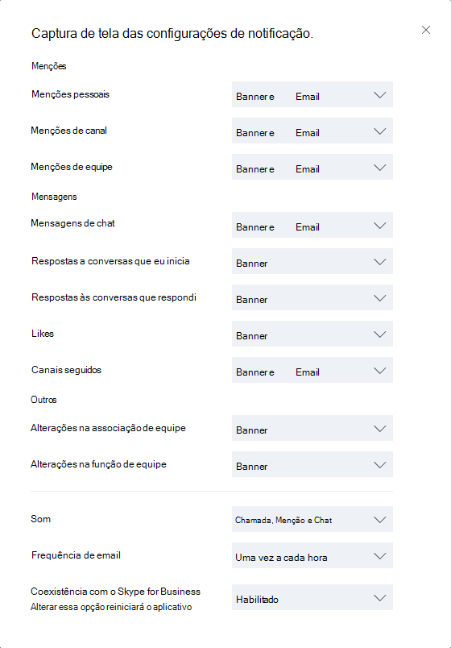

<a name="get-clients-for-microsoft-teams"></a><span data-ttu-id="d862c-103">Obter clientes para o Microsoft Teams</span><span class="sxs-lookup"><span data-stu-id="d862c-103">Get clients for Microsoft Teams</span></span> 
===========================

<span data-ttu-id="d862c-104">Microsoft Teams possui clientes móveis e disponíveis para a área de trabalho web (Windows e Mac), (Android e iOS).</span><span class="sxs-lookup"><span data-stu-id="d862c-104">Microsoft Teams has clients available for desktop (Windows and Mac), web, and mobile (Android and  iOS).</span></span> <span data-ttu-id="d862c-105">Todos esses clientes precisam de uma conexão à internet ativa e não são suportados em modo offline.</span><span class="sxs-lookup"><span data-stu-id="d862c-105">These clients all require an active internet connection and do not support an offline mode.</span></span>

> [!NOTE]
> <span data-ttu-id="d862c-106">29 de novembro de 2018, você não conseguirá usar Teams Microsoft para o aplicativo do Windows 10 S (Preview), disponível do Microsoft Store efetiva.</span><span class="sxs-lookup"><span data-stu-id="d862c-106">Effective November 29, 2018, you'll no longer be able to use the Microsoft Teams for Windows 10 S (Preview) app, available from the Microsoft Store.</span></span> <span data-ttu-id="d862c-107">Recomendamos que você use um dos aplicativos equipes descritos a seguir neste artigo após 29 de novembro.</span><span class="sxs-lookup"><span data-stu-id="d862c-107">We recommend that you use one of the Teams apps described below in this article after November 29.</span></span>

<a name="desktop-client"></a><span data-ttu-id="d862c-108">Cliente de desktop</span><span class="sxs-lookup"><span data-stu-id="d862c-108">Desktop client</span></span>
--------------

> [!Tip]
> <span data-ttu-id="d862c-109">Assista a sessão de seguir para saber mais sobre os benefícios da área de trabalho do Windows, cliente, como planejar para ele e como implantá-la: [Equipes Windows Desktop Client](https://aka.ms/teams-clients)</span><span class="sxs-lookup"><span data-stu-id="d862c-109">Watch the following session to learn about the benefits of the Windows Desktop Client, how to plan for it, and how to deploy it: [Teams Windows Desktop Client](https://aka.ms/teams-clients)</span></span>

<span data-ttu-id="d862c-110">O cliente de desktop do Microsoft Teams é um aplicativo autônomo e atualmente não faz parte do Office 365 ProPlus.</span><span class="sxs-lookup"><span data-stu-id="d862c-110">The Microsoft Teams desktop client is a standalone application and currently not part of Office 365 ProPlus.</span></span> <span data-ttu-id="d862c-111">As equipes está disponível para o Windows (7 +), versões de 32 bits e 64 bits e macOS (10.10 +).</span><span class="sxs-lookup"><span data-stu-id="d862c-111">Teams is available for both Windows (7+), both 32-bit and 64-bit versions, and macOS (10.10+).</span></span> <span data-ttu-id="d862c-112">No Windows, equipes requer o .NET Framework 4.5 ou posterior; o instalador de equipes se oferecerá para instalá-lo se você não tiver a ele.</span><span class="sxs-lookup"><span data-stu-id="d862c-112">On Windows, Teams requires .NET Framework 4.5 or later; the Teams installer will offer to install it for you if you don't have it.</span></span> 

<span data-ttu-id="d862c-113">Os clientes de área de trabalho oferecem suporte a comunicação em tempo real (áudio, vídeo e conteúdo compartilhamento) para reuniões de equipe, chamadas individuais chamando e particulares do grupo.</span><span class="sxs-lookup"><span data-stu-id="d862c-113">The desktop clients provide real-time communications support (audio, video, and content sharing) for team meetings, group calling, and private one-on-one calls.</span></span>

<span data-ttu-id="d862c-114">Clientes de área de trabalho podem ser baixados e instalados pelos usuários finais diretamente do [https://teams.microsoft.com/downloads](https://go.microsoft.com/fwlink/?linkid=855754) se eles têm as permissões apropriadas de locais (direitos de administrador não são necessários para instalar o cliente de equipes em um PC, mas são necessários em um Mac).</span><span class="sxs-lookup"><span data-stu-id="d862c-114">Desktop clients can be downloaded and installed by end users directly from [https://teams.microsoft.com/downloads](https://go.microsoft.com/fwlink/?linkid=855754) if they have the appropriate local permissions (admin rights are not required to install the Teams client on a PC but are required on a Mac).</span></span>

<span data-ttu-id="d862c-115">Administradores de TI podem escolher seu método preferencial para distribuir os arquivos de instalação para computadores em sua organização, como o System Center Configuration Manager (Windows) ou Jamf Pro (macOS).</span><span class="sxs-lookup"><span data-stu-id="d862c-115">IT admins can choose their preferred method to distribute the installation files to computers in their organization, such as System Center Configuration Manager (Windows) or Jamf Pro (macOS).</span></span> <span data-ttu-id="d862c-116">Para obter o pacote MSI para distribuição do Windows, consulte [instalar equipes da Microsoft usando o MSI](msi-deployment.md).</span><span class="sxs-lookup"><span data-stu-id="d862c-116">To get the MSI package for Windows distribution, see [Install Microsoft Teams using MSI](msi-deployment.md).</span></span>

> [!NOTE]
> <span data-ttu-id="d862c-117">A distribuição do cliente por esses mecanismos é apenas para a instalação inicial dos clientes Microsoft Teams, e não para atualizações futuras.</span><span class="sxs-lookup"><span data-stu-id="d862c-117">Distribution of the client via these mechanisms is only for the initial installation of Microsoft Team clients and not for future updates.</span></span>

### <a name="windows"></a><span data-ttu-id="d862c-118">Windows</span><span class="sxs-lookup"><span data-stu-id="d862c-118">Windows</span></span>

<span data-ttu-id="d862c-119">A instalação do Microsoft Teams para Windows oferece instaladores para download nas arquiteturas de 32 bits e 64 bits.</span><span class="sxs-lookup"><span data-stu-id="d862c-119">The Microsoft Teams installation for Windows provides downloadable installers in 32-bit and 64-bit architecture.</span></span>

> [!NOTE]
> <span data-ttu-id="d862c-120">A arquitetura (32 bits versus 64 bits) do Microsoft Teams é independente da arquitetura do Windows e do Office que está instalado.</span><span class="sxs-lookup"><span data-stu-id="d862c-120">The architecture (32-bit vs. 64-bit) of Microsoft Teams is agnostic to the architecture of Windows and Office that is installed.</span></span>

<span data-ttu-id="d862c-121">O cliente Windows é implantado na pasta AppData localizada no perfil do usuário.</span><span class="sxs-lookup"><span data-stu-id="d862c-121">The Windows client is deployed to the AppData folder located in the user’s profile.</span></span> <span data-ttu-id="d862c-122">A implantação no perfil local do usuário permite que o cliente seja instalado sem exigir direitos elevados.</span><span class="sxs-lookup"><span data-stu-id="d862c-122">Deploying to the user’s local profile allows the client to be installed without requiring elevated rights.</span></span> <span data-ttu-id="d862c-123">O cliente Windows aproveita os seguintes locais:</span><span class="sxs-lookup"><span data-stu-id="d862c-123">The Windows client leverages the following locations:</span></span>

- <span data-ttu-id="d862c-124">% LocalAppData %\\Microsoft\\equipes</span><span class="sxs-lookup"><span data-stu-id="d862c-124">%LocalAppData%\\Microsoft\\Teams</span></span>

- <span data-ttu-id="d862c-125">% LocalAppData %\\Microsoft\\TeamsMeetingsAddin</span><span class="sxs-lookup"><span data-stu-id="d862c-125">%LocalAppData%\\Microsoft\\TeamsMeetingsAddin</span></span>

- <span data-ttu-id="d862c-126">% AppData %\\Microsoft\\equipes</span><span class="sxs-lookup"><span data-stu-id="d862c-126">%AppData%\\Microsoft\\Teams</span></span>

- <span data-ttu-id="d862c-127">% LocalAppData %\\SquirrelTemp</span><span class="sxs-lookup"><span data-stu-id="d862c-127">%LocalAppData%\\SquirrelTemp</span></span>

<span data-ttu-id="d862c-128">Quando os usuários iniciam uma chamada usando o cliente Microsoft Teams pela primeira vez, eles podem notar um aviso com as configurações de firewall do Windows, que solicita que os usuários permitam a comunicação.</span><span class="sxs-lookup"><span data-stu-id="d862c-128">When users initiate a call using the Microsoft Teams client for the first time, they might notice a warning with the Windows firewall settings that asks for users to allow communication.</span></span> <span data-ttu-id="d862c-129">Os usuários podem ser instruídos para ignorar essa mensagem porque a chamada funcione, mesmo quando o aviso é descartado.</span><span class="sxs-lookup"><span data-stu-id="d862c-129">Users might be instructed to ignore this message because the call will work, even when the warning is dismissed.</span></span>


> [!NOTE]
> <span data-ttu-id="d862c-131">A configuração do Firewall do Windows será alterada mesmo quando o aviso for descartado ao selecionar “Cancelar”.</span><span class="sxs-lookup"><span data-stu-id="d862c-131">Windows Firewall configuration will be altered even when the prompt is dismissed by selecting “Cancel”.</span></span> <span data-ttu-id="d862c-132">Serão criadas duas regras de entrada para teams.exe com a ação Block para protocolos TCP e UDP.</span><span class="sxs-lookup"><span data-stu-id="d862c-132">Two inbound rules for teams.exe will be created with Block action for both TCP and UDP protocols.</span></span>

### <a name="mac"></a><span data-ttu-id="d862c-133">Mac</span><span class="sxs-lookup"><span data-stu-id="d862c-133">Mac</span></span>

<span data-ttu-id="d862c-134">Usuários de Mac podem instalar equipes usando um arquivo de instalação do pacote para computadores macOS.</span><span class="sxs-lookup"><span data-stu-id="d862c-134">Mac users can install Teams by using a PKG installation file for macOS computers.</span></span> <span data-ttu-id="d862c-135">É obrigatório acesso administrativo para instalar o cliente Mac.</span><span class="sxs-lookup"><span data-stu-id="d862c-135">Administrative access is required to install the Mac client.</span></span> <span data-ttu-id="d862c-136">O cliente macOS é instalado na pasta/aplicativos.</span><span class="sxs-lookup"><span data-stu-id="d862c-136">The macOS client is installed to the /Applications folder.</span></span>

#### <a name="install-teams-by-using-the-pkg-file"></a><span data-ttu-id="d862c-137">Instalar as equipes usando o arquivo de pacote</span><span class="sxs-lookup"><span data-stu-id="d862c-137">Install Teams by using the PKG file</span></span>

1. <span data-ttu-id="d862c-138">Na [página de download de equipes](https://teams.microsoft.com/downloads), **Mac**, clique em **Baixar**.</span><span class="sxs-lookup"><span data-stu-id="d862c-138">From the [Teams download page](https://teams.microsoft.com/downloads), under **Mac**, click **Download**.</span></span>
2. <span data-ttu-id="d862c-139">Clique duas vezes o arquivo de pacote.</span><span class="sxs-lookup"><span data-stu-id="d862c-139">Double click the PKG file.</span></span>
3. <span data-ttu-id="d862c-140">Siga o Assistente de instalação para concluir a instalação.</span><span class="sxs-lookup"><span data-stu-id="d862c-140">Follow the installation wizard to complete the installation.</span></span>
4. <span data-ttu-id="d862c-141">Pasta/aplicativos equipes serão instaladas.</span><span class="sxs-lookup"><span data-stu-id="d862c-141">Teams will be installed to /Applications folder.</span></span> <span data-ttu-id="d862c-142">É uma instalação de toda a máquina.</span><span class="sxs-lookup"><span data-stu-id="d862c-142">It is a machine-wide installation.</span></span>

> [!NOTE]
> <span data-ttu-id="d862c-143">Durante a instalação, o pacote vai solicitar credenciais de administrador.</span><span class="sxs-lookup"><span data-stu-id="d862c-143">During the installation, the PKG will prompt for admin credentials.</span></span> <span data-ttu-id="d862c-144">O usuário precisa digitar as credenciais de administrador, independentemente de estarem ou não o usuário é um administrador.</span><span class="sxs-lookup"><span data-stu-id="d862c-144">The user needs to enter the admin credentials, regardless of whether or not the user is an admin.</span></span>

<span data-ttu-id="d862c-145">Se um usuário atualmente tem uma instalação DMG das equipes e quiser substituí-la com a instalação do pacote, o usuário deve:</span><span class="sxs-lookup"><span data-stu-id="d862c-145">If a user currently has a DMG installation of Teams and wants to replace it with the PKG installation, the user should:</span></span>

1. <span data-ttu-id="d862c-146">Saia do aplicativo de equipes.</span><span class="sxs-lookup"><span data-stu-id="d862c-146">Exit the Teams app.</span></span>
2. <span data-ttu-id="d862c-147">Desinstale o aplicativo de equipes.</span><span class="sxs-lookup"><span data-stu-id="d862c-147">Uninstall the Teams app.</span></span>
3. <span data-ttu-id="d862c-148">Instale o arquivo de pacote.</span><span class="sxs-lookup"><span data-stu-id="d862c-148">Install the PKG file.</span></span>

<span data-ttu-id="d862c-149">Administradores de TI podem usar implantação gerenciada de equipes para distribuir os arquivos de instalação para todos os Macs na sua organização, como Jamf Pro.</span><span class="sxs-lookup"><span data-stu-id="d862c-149">IT admins can use managed deployment of Teams to distribute the installation files to all Macs in their organization, such as Jamf Pro.</span></span>

> [!NOTE]
> <span data-ttu-id="d862c-150">Se você perceber problemas ao instalar o pacote, fale conosco.</span><span class="sxs-lookup"><span data-stu-id="d862c-150">If you experience issues installing the PKG, let us know.</span></span> <span data-ttu-id="d862c-151">Na seção **comentários** no final deste artigo, clique em **comentários sobre o produto**.</span><span class="sxs-lookup"><span data-stu-id="d862c-151">In the **Feedback** section at the end of this article, click **Product feedback**.</span></span>

<a name="web-client"></a><span data-ttu-id="d862c-152">Cliente web</span><span class="sxs-lookup"><span data-stu-id="d862c-152">Web client</span></span> 
----------

<span data-ttu-id="d862c-153">O cliente da web ([https://teams.microsoft.com](https://go.microsoft.com/fwlink/?linkid=855753)) é um cliente de funcional completo que pode ser usado em uma variedade de navegadores.</span><span class="sxs-lookup"><span data-stu-id="d862c-153">The web client ([https://teams.microsoft.com](https://go.microsoft.com/fwlink/?linkid=855753)) is a full, functional client that can be used from a variety of browsers.</span></span> <span data-ttu-id="d862c-154">O cliente web oferece suporte a reuniões e chamadas usando webRTC, portanto, há não plug-in ou download necessário para executar as equipes em um navegador da web.</span><span class="sxs-lookup"><span data-stu-id="d862c-154">The web client supports Calling and Meetings by using webRTC, so there is no plug-in or download required to run Teams in a web browser.</span></span> <span data-ttu-id="d862c-155">O navegador deve ser configurado para permitir que os cookies de terceiros.</span><span class="sxs-lookup"><span data-stu-id="d862c-155">The browser must be configured to allow third-party cookies.</span></span> 

[!INCLUDE [browser-support](includes/browser-support.md)]

<span data-ttu-id="d862c-156">Cliente web executa a detecção de versão do navegador após a conexão com [https://teams.microsoft.com](https://go.microsoft.com/fwlink/?linkid=855753).</span><span class="sxs-lookup"><span data-stu-id="d862c-156">The web client performs browser version detection upon connecting to [https://teams.microsoft.com](https://go.microsoft.com/fwlink/?linkid=855753).</span></span> <span data-ttu-id="d862c-157">Se for detectada uma versão sem suporte do navegador, ela será bloqueie o acesso à interface da web e recomendável que o usuário baixe o cliente de área de trabalho ou aplicativos móveis.</span><span class="sxs-lookup"><span data-stu-id="d862c-157">If an unsupported browser version is detected, it will block access to the web interface and recommend that the user download the desktop client or mobile app.</span></span>

<a name="mobile-clients"></a><span data-ttu-id="d862c-158">Clientes móveis</span><span class="sxs-lookup"><span data-stu-id="d862c-158">Mobile clients</span></span>
--------------

<span data-ttu-id="d862c-159">Aplicativos móveis Microsoft Teams estão disponíveis para Android e iOS e são voltados para usuários no go participando de bate-papo com base em conversas e permitir que as chamadas de áudio ponto a ponto.</span><span class="sxs-lookup"><span data-stu-id="d862c-159">The Microsoft Teams mobile apps are available for Android and iOS, and are geared for on-the-go users participating in chat-based conversations and allow peer-to-peer audio calls.</span></span> <span data-ttu-id="d862c-160">Para aplicativos móveis, vá para o mobile relevante armazena Google tocar e loja de App Apple.</span><span class="sxs-lookup"><span data-stu-id="d862c-160">For mobile apps, go to the relevant mobile stores Google Play and the Apple App Store.</span></span> <span data-ttu-id="d862c-161">O aplicativo do Windows Phone foi desativado 20 de julho de 2018 e talvez não funcione mais.</span><span class="sxs-lookup"><span data-stu-id="d862c-161">The Windows Phone App was retired July 20, 2018 and may no longer work.</span></span> 

<span data-ttu-id="d862c-162">As plataformas móveis suportadas para os aplicativos móveis da Microsoft Teams são as seguintes:</span><span class="sxs-lookup"><span data-stu-id="d862c-162">Supported mobile platforms for Microsoft Teams mobile apps are the following:</span></span>

-   <span data-ttu-id="d862c-163">**Android**: 4.4 ou posterior</span><span class="sxs-lookup"><span data-stu-id="d862c-163">**Android**: 4.4 or later</span></span>

-   <span data-ttu-id="d862c-164">**iOS**: 10.0 ou posterior</span><span class="sxs-lookup"><span data-stu-id="d862c-164">**iOS**: 10.0 or later</span></span>

> [!NOTE]
> <span data-ttu-id="d862c-165">A versão móvel deve estar disponível para o público na ordem para equipes trabalhem conforme o esperado.</span><span class="sxs-lookup"><span data-stu-id="d862c-165">The mobile version must be available to the public in order for Teams to work as expected.</span></span>

<span data-ttu-id="d862c-166">Os aplicativos móveis são distribuídos e atualizados apenas pela respectiva loja de aplicativos da plataforma móvel e não estão disponíveis para ser distribuídos por meio de soluções MDM (gerenciamento de dispositivos móveis) ou carregamento lateral.</span><span class="sxs-lookup"><span data-stu-id="d862c-166">Mobile apps are distributed and updated through the respective mobile platform’s app store only, and are not available to be distributed through MDM (mobile device management) solutions or side-loaded.</span></span>


| | | |
|---------|---------|---------|
|      |<span data-ttu-id="d862c-168">Ponto de decisão</span><span class="sxs-lookup"><span data-stu-id="d862c-168">Decision Point</span></span>         |<span data-ttu-id="d862c-169">Existe alguma restrição que esteja impedindo os usuários de instalar o cliente Microsoft Teams adequado em seus dispositivos?</span><span class="sxs-lookup"><span data-stu-id="d862c-169">Are there any restrictions preventing users from installing the appropriate Microsoft Teams client on their devices?</span></span>         |
|     |<span data-ttu-id="d862c-171">Próximos passos</span><span class="sxs-lookup"><span data-stu-id="d862c-171">Next Steps</span></span>         |<span data-ttu-id="d862c-172">Se sua organização restringe a instalação de software, verifique se esse processo é compatível com o Microsoft Teams.</span><span class="sxs-lookup"><span data-stu-id="d862c-172">If your organization restricts software installation, make sure that process is compatible with Microsoft Teams.</span></span> <span data-ttu-id="d862c-173">Nota: Os direitos de administrador não são obrigatórios para a instalação do cliente PC, mas são obrigatórios para a instalação em Mac.</span><span class="sxs-lookup"><span data-stu-id="d862c-173">Note: Admin rights are not required for PC client installation but are required for installation on a Mac.</span></span>         |

<a name="client-update-management"></a><span data-ttu-id="d862c-174">Gerenciamento de atualização do cliente</span><span class="sxs-lookup"><span data-stu-id="d862c-174">Client update management</span></span>
------------------------

<span data-ttu-id="d862c-175">No momento, os clientes são atualizados automaticamente pelo serviço do Microsoft Teams, sem a necessidade de intervenção de um administrador de TI.</span><span class="sxs-lookup"><span data-stu-id="d862c-175">Clients are currently updated automatically by the Microsoft Teams service with no IT administrator intervention required.</span></span> <span data-ttu-id="d862c-176">Se uma atualização estiver disponível, o cliente baixará automaticamente a atualização e, quando o aplicativo estiver ocioso por um período de tempo, o processo de atualização será iniciado.</span><span class="sxs-lookup"><span data-stu-id="d862c-176">If an update is available, the client will automatically download the update and when the app has idled for a period of time, the update process will kick off.</span></span>

<a name="client-side-configurations"></a><span data-ttu-id="d862c-177">Configurações do lado do cliente</span><span class="sxs-lookup"><span data-stu-id="d862c-177">Client-side configurations</span></span>
---------------------------

<span data-ttu-id="d862c-178">No momento, não estão disponibilizadas opções para configurar o cliente através do administrador do locatário, do PowerShell, do Group Policy Objects, nem do registro.</span><span class="sxs-lookup"><span data-stu-id="d862c-178">Currently, there are no supported options available to configure the client either through the tenant admin, PowerShell, Group Policy Objects or the registry.</span></span>

<a name="notification-settings"></a><span data-ttu-id="d862c-179">Configurações de notificação</span><span class="sxs-lookup"><span data-stu-id="d862c-179">Notification settings</span></span>
----------------------------

<span data-ttu-id="d862c-180">No momento, não estão disponibilizadas opções para administradores de TI definirem as configurações de notificação do lado do cliente.</span><span class="sxs-lookup"><span data-stu-id="d862c-180">There are currently no options available for IT administrators to configure client-side notification settings.</span></span> <span data-ttu-id="d862c-181">Todas as opções de notificação são definidas pelo usuário.</span><span class="sxs-lookup"><span data-stu-id="d862c-181">All notification options are set by the user.</span></span> <span data-ttu-id="d862c-182">A figura abaixo descreve as configurações padrão do cliente.</span><span class="sxs-lookup"><span data-stu-id="d862c-182">The figure below outlines the default client settings.</span></span>



<a name="sample-powershell-script"></a><span data-ttu-id="d862c-184">Exemplo de Script do PowerShell</span><span class="sxs-lookup"><span data-stu-id="d862c-184">Sample PowerShell Script</span></span>
----------------------------

<span data-ttu-id="d862c-185">Este script de amostra, o que precisa ser executado em computadores clientes no contexto de uma conta de administrador com privilégios elevados, criará uma nova regra de firewall de entrada para cada pasta de usuário encontrada no c:\users.</span><span class="sxs-lookup"><span data-stu-id="d862c-185">This sample script, which needs to run on client computers in the context of an elevated administrator account, will create a new inbound firewall rule for each user folder found in c:\users.</span></span> <span data-ttu-id="d862c-186">Quando equipes encontrar esta regra, ele impedirá o aplicativo de equipes de solicitar aos usuários para criar regras de firewall quando os usuários fazem sua primeira chamada de equipes.</span><span class="sxs-lookup"><span data-stu-id="d862c-186">When Teams finds this rule, it will prevent the Teams application from prompting users to create firewall rules when the users make their first call from Teams.</span></span> 

```
$users = Get-Childitem c:\users
foreach ($user in $users) 
{
    $Path = "c:\users\" + $user.Name + "\appdata\local\Microsoft\Teams\Current\Teams.exe"
    if (Test-Path $Path) 
    {
            $name = "teams.exe " + $user.Name
            if (!(Get-NetFirewallRule -DisplayName $name))
        {
                New-NetFirewallRule -DisplayName “teams.exe” -Direction Inbound -Profile Domain -Program $Path -Action Allow
        }
    }
}
<#
        .ABOUT THIS SCRIPT
        (c) Microsoft Corporation 2018. All rights reserved. Script provided as-is without any warranty of any kind. Use it freely at your own risks.

        Must be run with elevated permissions. Can be run as a GPO Computer Startup script, or as a Scheduled Task with elevated permissions. 

        The script will create a new inbound firewall rule for each user folder found in c:\users. 

        Requires PowerShell 3.0
        
#>

```
