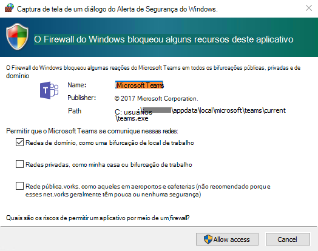

# <a name="get-clients-for-microsoft-teams"></a>Obter clientes do Microsoft Teams

> [!TIP]
> **Quer instalar o Teams no seu PC, Mac ou dispositivo móvel?** Confira [Instalar o cliente do Teams](https://go.microsoft.com/fwlink/?linkid=855754).

O Microsoft Teams pode ser instalado em PCs, Macs e dispositivos móveis e também pode ser acessado por meio de um navegador da web. A maioria dos usuários finais pode começar a usar o Teams apenas [instalando o cliente](https://go.microsoft.com/fwlink/?linkid=855754). Depois de instalar o cliente do Teams, tudo o que eles precisam fazer é fazer logon com seu nome de usuário e senha.

Se você é um profissional de TI e deseja saber mais sobre a experiência de instalação do Teams e seus requisitos, selecione um sistema operacional do cliente neste artigo para obter mais informações.

Para obter detalhes sobre as funcionalidades de cada cliente em diferentes plataformas, consulte [Recursos do Teams por plataforma](https://support.microsoft.com/office/teams-features-by-platform-debe7ff4-7db4-4138-b7d0-fcc276f392d3).

## <a name="desktop-clients"></a>Clientes desktop

O cliente desktop do Teams está disponível como um aplicativo autônomo e como parte do [Microsoft 365 Apps para Grandes Empresas](/deployoffice/teams-install) para um dos seguintes sistemas operacionais:

- Versões de 32 bits e 64 bits do Windows (8.1 ou posterior)
- ARM64 para Windows 10 em ARM
- Windows Server (2012 R2 ou posterior)
- macOS
- Linux (em formatos`.deb` e `.rpm`)
- Chrome OS (para obter mais informações, consulte [Como usar o Microsoft Office em um Chromebook](https://support.office.com/article/how-to-install-and-run-microsoft-office-on-a-chromebook-32f14a23-2c1a-4579-b973-d4b1d78561ad))

Os clientes desktop podem ser baixados e instalados pelos usuários finais diretamente de [https://teams.microsoft.com/downloads](https://go.microsoft.com/fwlink/?linkid=855754) se eles tiverem as permissões locais apropriadas. As permissões de administrador não são necessárias para instalar o cliente do Teams em PCs com Windows, mas são necessárias em Macs.

Os profissionais de TI podem escolher seu método preferido para distribuir os arquivos de instalação para computadores em sua organização. Entre os exemplos estão o Microsoft Endpoint Configuration Manager (Windows) ou Jamf Pro (macOS). Para obter mais informações sobre como distribuir o Teams, consulte o seguinte.

- **Windows** [Instalar o Teams usando Gerenciador de Configuração do Ponto de extremidade](msi-deployment.md)
- **MacOS** [Jamf Pro](https://www.jamf.com/products/jamf-pro/)

> [!NOTE]
> A distribuição do cliente através destes mecanismos é apenas para a instalação inicial dos clientes do Teams e não para atualizações futuras. Para obter informações sobre o processo de atualização do Teams, consulte [Processo de atualização do Teams](teams-client-update.md).

### <a name="windows"></a>[Windows](#tab/Windows)

> [!TIP]
> Assista à sessão a seguir para conhecer os benefícios do Windows Desktop Client e como planejar e executar sua implantação: [Cliente de Desktop do Microsoft Teams](https://aka.ms/teams-clients)

Teams no Windows fornece instaladores MSI para baixar nas arquiteturas [32 bits](https://teams.microsoft.com/downloads/desktopurl?env=production&plat=windows&managedInstaller=true&download=true), [64 bits](https://teams.microsoft.com/downloads/desktopurl?env=production&plat=windows&arch=x64&managedInstaller=true&download=true) e [ARM64](https://teams.microsoft.com/downloads/desktopurl?env=production&plat=windows&arch=arm64&managedInstaller=true&download=true). A arquitetura x86 (32 bits versus 64 bits) do Teams é independente da arquitetura do Windows e do Office instalada. Recomendamos a versão de 64 bits do Teams em sistemas de 64 bits.

O Teams requer .NET Framework 4.5 ou posterior. Se .NET Framework ou posterior não estiver instalado, o instalador do Teams oferecerá a instalação para você.

O cliente Windows é implantado na pasta AppData localizada no perfil do usuário. A implantação no perfil local do usuário permite que o cliente seja instalado sem exigir direitos elevados. O cliente Windows aproveita os seguintes locais:

- %LocalAppData%\\Microsoft\\Teams

- %LocalAppData%\\Microsoft\\TeamsMeetingAddin

- %AppData%\\Microsoft\\Teams

- %LocalAppData%\\SquirrelTemp

Quando os usuários iniciam uma chamada usando o cliente do Teams pela primeira vez, eles podem notar um aviso com as configurações de firewall do Windows que solicita que os usuários permitam a comunicação. Os usuários podem ser instruídos a ignorar esta mensagem porque a chamada funcionará mesmo quando o aviso for recusado.



> [!NOTE]
> A configuração do Firewall do Windows será alterada mesmo quando o aviso for descartado ao selecionar “Cancelar”. Duas regras de entrada para o teams.exe serão criadas com a ação Permitir para os protocolos TCP e UDP.

Se você deseja impedir que o Teams solicite que os usuários criem regras de firewall quando os usuários fizerem sua primeira chamada do Teams, use o script do PowerShell em [Script de exemplo - script do PowerShell do firewall do Microsoft Teams](client-firewall-script.md).

### <a name="mac"></a>[Mac](#tab/Mac)

Usuários de Mac podem instalar o Teams usando um arquivo de instalação PKG para computadores macOS. É necessário acesso administrativo para instalar o cliente Mac. O cliente macOS é instalado na pasta /Applications.

1. Na [página de download do Teams](https://teams.microsoft.com/downloads), em **Mac**, clique em **Download**.
2. Clique duas vezes no arquivo PKG.
3. Siga o assistente de instalação para concluir a instalação.
4. O Teams será instalado na pasta /Applications. É uma instalação em toda a máquina.

> [!NOTE]
> Durante a instalação, o PKG solicitará credenciais de administrador. O usuário precisa inserir as credenciais de administrador, independentemente de o usuário ser ou não um administrador.

Se um usuário tiver atualmente uma instalação DMG do Teams e quiser substituí-lo pela instalação PKG, o usuário deverá:

1. Sair do aplicativo Teams.
2. Desinstalar o aplicativo do Teams.
3. Instalar o arquivo PKG.

Os profissionais de TI podem usar uma solução de implantação gerenciada, como o Jamf Pro, para distribuir os arquivos de instalação do Teams para todos os Macs em sua organização.

### <a name="linux"></a>[Linux](#tab/Linux)

No Linux, os gerenciadores de pacote, como `apt` e `yum`, tentarão instalar quaisquer requisitos para você. No entanto, se eles não instalarem, você precisará instalar todos os requisitos relatados antes de instalar o Teams no Linux.

Os usuários poderão instalar pacotes nativos do Linux nos formatos `.deb` e `.rpm`. A instalação do pacote DEB ou RPM instalará automaticamente o repositório de pacotes.

- DEB `https://packages.microsoft.com/repos/ms-teams stable main`
- RPM `https://packages.microsoft.com/yumrepos/ms-teams`

A chave de assinatura para habilitar a atualização automática usando o gerenciador de pacotes do sistema é instalado automaticamente. No entanto, ele também pode ser encontrado em: <https://packages.microsoft.com/keys/microsoft.asc>. O Teams é enviado mensalmente e, se o repositório foi instalado corretamente, o gerenciador de pacotes do sistema deve lidar com a atualização automática da mesma maneira que outros pacotes no sistema.

#### <a name="install-teams-using-deb-package"></a>Instalar o Teams usando o pacote DEB

1. Baixe o pacote de <https://aka.ms/getteams>.
2. Instale usando uma destas opções:
    - Abra a ferramenta de gerenciamento de pacotes relevante e siga o processo autodirigido de instalação de aplicativos do Linux.
    - Ou se você adora o Terminal, digite: `sudo dpkg -i **teams download file**`

Você pode lançar o Teams por meio de Atividades ou por meio do Terminal digitando `teams`.

#### <a name="install-teams-using-rpm-package"></a>Instalar o Teams usando o pacote RPM

1. Baixe o pacote de <https://aka.ms/getteams>.
2. Instale usando uma destas opções:
    - Abra a ferramenta de gerenciamento de pacotes relevante e siga o processo autodirigido de instalação de aplicativos do Linux.
    - Ou se você adora o Terminal, digite: `sudo yum install **teams download file**`

Você pode lançar o Teams por meio de Atividades ou por meio do Terminal digitando `teams`.

#### <a name="install-manually-from-the-command-line"></a>Instalar manualmente da linha de comando

Instale manualmente nas distribuições do Debian e do Ubuntu:

```bash
curl https://packages.microsoft.com/keys/microsoft.asc | sudo apt-key add -

sudo sh -c 'echo "deb [arch=amd64] https://packages.microsoft.com/repos/ms-teams stable main" > /etc/apt/sources.list.d/teams.list'

sudo apt update
sudo apt install teams
```

Instale manualmente em distribuições baseadas em RHEL, Fedora e CentOS:

```bash
sudo rpm --import https://packages.microsoft.com/keys/microsoft.asc

sudo sh -c 'echo -e "[teams]\nname=teams\nbaseurl=https://packages.microsoft.com/yumrepos/ms-teams\nenabled=1\ngpgcheck=1\ngpgkey=https://packages.microsoft.com/keys/microsoft.asc" > /etc/yum.repos.d/teams.repo'

sudo dnf check-update
sudo dnf install teams
```

Como alternativa, para usar yum em vez de dnf:

```bash
yum check-update
sudo yum install teams
```

Instale manualmente em distribuições baseadas em openSUSE:

```bash
sudo rpm --import https://packages.microsoft.com/keys/microsoft.asc

sudo sh -c 'echo -e "[teams]\nname=teams\nbaseurl=https://packages.microsoft.com/yumrepos/ms-teams\nenabled=1\nautorefresh=1\nkeeppackages=0\ntype=rpm-md\ngpgcheck=1\ngpgkey=https://packages.microsoft.com/keys/microsoft.asc" > /etc/zypp/repos.d/teams.repo'

sudo zypper refresh
sudo zypper install teams
```

---

## <a name="mobile-clients"></a>Clientes móveis

Os aplicativos móveis do Teams estão disponíveis para Android e iOS e são voltados para usuários em trânsito que participam de conversas baseados em chat e permitem chamadas de áudio ponto a ponto. Para aplicativos para dispositivos móveis, acesse as lojas relevantes, Google Play e a Apple App Store.

As plataformas móveis com suporte para aplicativos móveis do Teams são as seguintes:

- **Android**: o suporte é limitado às últimas quatro versões principais do Android. Quando uma nova versão principal do Android é lançada, a nova versão e as três versões anteriores são oficialmente suportadas.

- **iOS**: o suporte é limitado às duas versões principais mais recentes do iOS. Quando uma nova versão principal do iOS é lançada, a nova versão do iOS e a versão anterior são oficialmente suportadas.

> [!NOTE]
> A versão móvel deve estar disponível ao público para que o Teams funcione conforme o esperado.

Os aplicativos móveis são distribuídos e atualizados somente por meio da loja de aplicativos da respectiva plataforma móvel. A distribuição dos aplicativos móveis via MDM ou carregamento lateral não são suportados pela Microsoft. Depois que o aplicativo móvel for instalado em uma plataforma móvel compatível, o próprio aplicativo móvel do Teams será suportado, desde que a versão esteja dentro de três meses a partir da versão atual.

Se você estiver na China, poderá instalar o Teams nas seguintes lojas de aplicativos:

- **Xiaomi** <https://aka.ms/TeamsXiaomi>
- **Huawei** <https://aka.ms/TeamsHuawei>
- **Oppo** Pesquisar por "Teams" na loja da Oppo
- **Baidu** <https://aka.ms/teams_baidu_direct_dl>

## <a name="browser-client"></a>Cliente do navegador

O cliente do navegador ([https://teams.microsoft.com](https://go.microsoft.com/fwlink/?linkid=855753)) é um cliente completo e funcional que pode ser usado em vários navegadores. O cliente do navegador oferece suporte a Chamadas e reuniões usando webRTC, portanto, não há necessidade de plug-in ou baixar para executar o Teams em um navegador. O navegador deve ser configurado para permitir cookies de terceiros.

[!INCLUDE [browser-support](includes/browser-support.md)]

O cliente do navegador executa a detecção da versão do navegador ao se conectar ao [https://teams.microsoft.com](https://go.microsoft.com/fwlink/?linkid=855753). Se uma versão do navegador não suportado for detectado, isso bloqueará acesso à interface do navegador e recomendará que o usuário baixe o cliente de área de trabalho ou aplicativo móvel.
