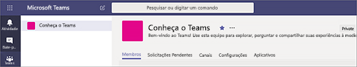

# Criar as primeiras equipes e canais no Microsoft Teams

Quando configura e usa o primeiro conjunto de equipes e canais, você consolida sua experiência com o Teams e identifica os defensores que podem ajudar a promover a adoção do programa em toda a organização.
Se ainda não instalou o Teams, confira [Obter clientes do Teams](get-clients.md) e [Entrar no Teams usando uma autenticação moderna](sign-in-teams.md).

## Sugestões para o primeiro conjunto de equipes e canais

 Uma equipe é um conjunto de pessoas que se reúnem em prol de um objetivo comum. Canais são os espaços de colaboração dentro de uma equipe, nos quais o trabalho real é feito.

Para saber mais, confira [Visão geral de equipes e canais no Microsoft Teams](teams-channels-overview.md) e [Práticas recomendadas para organização de equipes no Microsoft Teams](best-practices-organizing.md).

 Sugerimos começar com a equipe de "Introdução ao Teams", onde os usuários iniciantes podem testar, fazer perguntas e descobrir os recursos do Teams. Essa equipe poderá ser essencial para seu êxito quando você começa a usar o Teams.

### Equipe de "Introdução ao Teams"

A equipe de projetos pode usar a equipe de "Introdução ao Teams" para garantir que os usuários estejam preparados para trabalhar com os clientes do Teams, iniciem algumas conversas e descubram o que o programa pode fazer. Talvez você já tenha um grupo de pessoas na organização que aproveitam o acesso antecipado a novos recursos. Pode ser uma das primeiras equipes integradas e ela pode contribuir fornecendo comentários antecipados.

Veja uma sugestão de estrutura para a equipe.

| Canal | Descrição e uso | Guias fixas, bots e aplicativos |
| ------------ | -------------------- | -------------------- |
| Geral | Todas as equipes começam com um canal geral. Use este canal para fazer comunicados enquanto começa a se familiarizar com o Teams. |  |
| Dê boas-vindas | Apresente-se à equipe e compartilhe o que você espera do Teams. |  |
| Instruções | Um canal para fazer perguntas sobre instruções. Etapa 1 – Instalar os clientes móveis e da área de trabalho. Etapa 2 – Entrar no Teams.| Guia fixa vinculada à [Central de ajuda do Microsoft Teams](https://support.office.com/teams) Guia fixa vinculada a [vídeos de treinamento do Microsoft Teams](https://support.office.com/article/microsoft-teams-video-training-4f108e54-240b-4351-8084-b1089f0d21d7) Guia fixa vinculada a [links para baixar o cliente móvel ou da área de trabalho do Microsoft Teams](https://teams.microsoft.com/downloads) |
| Comentários | Compartilhe opiniões sobre a experiência com o Teams. | Guia fixa com Votações do Polly|
| Ideias para equipes futuras | Compartilhe opiniões sobre onde o Teams pode ser mais vantajoso para a organização. Como essas equipes poderiam se chamar? Quem poderia ser membro? ||
| Suporte | Se algo não estiver funcionando como esperado, use este canal para obter ajuda. ||

## Colocar as primeiras equipes em ação

Como administrador, você pode criar e gerenciar equipes e canais no cliente do Teams ou no Centro de administração do Microsoft Teams. Você pode criar equipes públicas e privadas ou Você também pode criar uma [equipe em toda a organização](create-an-org-wide-team.md). Todas as pessoas que usam o Teams na organização podem ingressar em uma equipe pública. No caso de equipes privadas, os respectivos proprietários gerenciam a associação de equipe. Já na equipe de toda a organização, todas as pessoas da empresa são adicionadas automaticamente.

Para começar, recomendamos criar equipes privadas e adicionar outro proprietário para gerenciar as configurações e a associação da equipe.

> [!NOTE]
> Nas etapas a seguir, usamos o cliente da área de trabalho do Teams para criar equipes e canais. Como administrador, você pode também realizar essas tarefas no Centro de administração do Microsoft Teams.

### Criar uma equipe

No lado esquerdo do Teams, clique em **Teams**, na parte inferior da lista de equipes, clique em **Ingressar ou criar uma equipe** e, em seguida, clique em **Criar uma nova equipe**.

Depois de criar a equipe, convide pessoas para ingressar nela. Você pode adicionar usuários individuais, grupos e até mesmo grupos inteiros de contatos (conhecidos anteriormente como "listas de distribuição").

### Adicionar um proprietário de equipe

Localize a equipe que você criou, clique em **Mais opções...** > **Gerenciar equipe**. Em seguida, vá para a guia **Membros** e procure as pessoas que você deseja designar como proprietárias da equipe. Em **Função**, clique em **Proprietário**.

### Criar um canal na equipe

Encontre a equipe que você criou, clique em **Mais opções ...** > **Adicionar canal**. É possível também clicar em **Gerenciar equipe** e adicionar um canal na guia **Canais**.

Atribua um nome descritivo para que os usuários entendam facilmente a finalidade do canal.

Como proprietário, você pode adicionar canais favoritos automaticamente, tornando-os mais visíveis para toda a equipe. É possível também fixar guias no canal para adicionar ferramentas, como o OneNote, links para páginas da Web e outros tipos de conteúdo, de modo que os usuários possam compartilhar opiniões e encontrar facilmente aquilo que precisam.

Veja o exemplo de um canal de "Instruções", na equipe de "Introdução ao Teams", mostrando guias fixas vinculadas a páginas da Web do Teams &ndash; vídeos de treinamento, Central de administração e links para baixar o Microsoft Teams.

## Próximas etapas

Vá para [Integrar os usuários iniciantes](get-started-with-teams-onboard-early-adopters.md).
