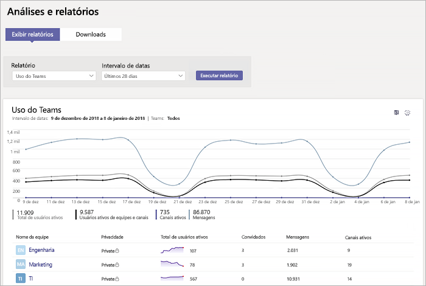
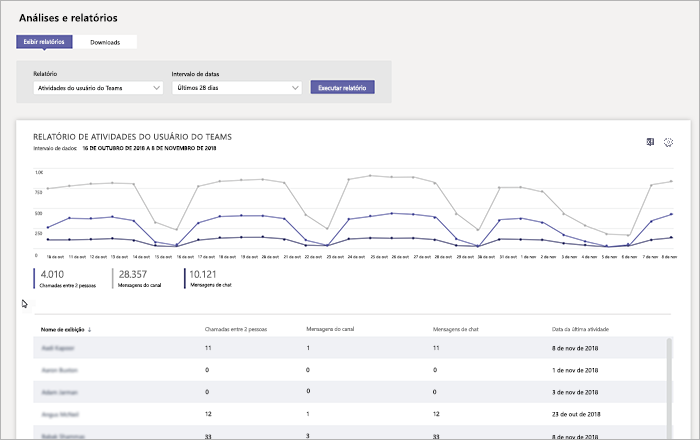
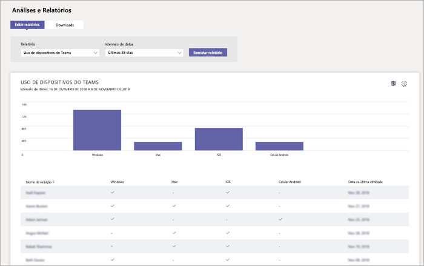

# Monitorar o uso e os comentários no Microsoft Teams
É importante saber como os usuários estão usando o Teams e como está sendo a experiência deles com o Teams. Os relatórios de uso podem ajudar você a entender melhor os padrões de uso e, com os comentários dos usuários, fornecer informações para orientar a implantação geral e indicar onde priorizar os esforços de treinamento e comunicação.

## Monitorar o uso
Para seus primeiros conjuntos de equipes, recomendamos analisar os relatórios duas vezes por semana para entender as novas tendências. 

Por exemplo, os relatórios de uso mostram que poucos usuários estão usando os clientes móveis do Teams. Isso pode indicar que os usuários não estão sabendo como instalar os clientes. Publicar instruções passo a passo de instalação em um canal pode ajudar a aumentar a utilização pelos clientes. Ou, os relatórios de uso mostram que usuários estão usando o Teams principalmente para conversas particulares. Neste exemplo, convém examinar os contextos da equipe, porque os usuários estão conversando fora das equipes e dos canais iniciais que foram definidos. 

Veja aqui como obter relatórios para exibir o uso do Teams. 

### Relatórios e análises do Teams (Centro de administração do Microsoft Teams)

Os relatórios de equipes no centro de administração do Microsoft Teams fornecem informações sobre como o Teams é usado em sua organização. Use os relatórios para obter uma perspectiva sobre o uso do Teams, atividades do usuário e uso de dispositivos em sua organização. 

Para ver esses relatórios, você deve ser um administrador global do Microsoft 365 ou Office 365, administrador de serviço do Teams ou administrador do Skype for Business. Acesse o centro de administração do Microsoft Teams, na navegação à esquerda, selecione **Análises e relatórios** e, em **Relatório**, escolha o relatório que você deseja executar.

- **Relatório de uso do Teams**: este relatório fornece uma visão geral da atividade de uso no Teams, inclusive do total de usuários e canais ativos, e do número de usuários e canais ativos, convidados e mensagens em cada equipe. 

         
- **Relatório de atividades do usuário no Teams**: este relatório fornece informações sobre os tipos de atividades com as quais os usuários se envolvem, como quantas pessoas se comunicam por chamadas particulares, mensagens do canal e mensagens de chat privadas. 

     
`
- **Relatório de uso de dispositivos do Teams**: este relatório mostra como os usuários se conectam ao Teams, inclusive quantas pessoas usam o Teams em seus dispositivos móveis. 

    

Para saber mais, confira [Análises e relatórios de equipes](teams-analytics-and-reports/teams-reporting-reference.md). 

### Relatórios de atividades do Teams (centro de administração do Microsoft 365)
Você também pode visualizar as atividades do Teams pelos relatórios disponíveis no centro de administração do Office 365. Estes relatórios fazem parte dos relatórios do Microsoft 365 no Centro de administração do Microsoft 365 e fornecem informações sobre a atividade do usuário e o uso do dispositivo. 

Para ver esses relatórios, acesse o centro de administração do Office 365 e clique em **Relatórios** > **Uso**. Em **Selecionar um relatório**, clique em **Microsoft Teams**. Nele, escolha o relatório que você deseja visualizar.

Para saber mais, acesse [Usar relatórios de atividades no Teams](teams-activity-reports.md).

### Análise de uso do Microsoft 365

Você pode usar a análise do uso do Microsoft 365 no Power BI para visualizar e analisar o uso dos dados do Teams e de outros produtos e serviços do Microsoft 365 ou Office 365. A análise de uso do Microsoft 365 é um pacote de conteúdo que inclui um painel predefinido e uma série de relatórios predefinidos. Cada relatório fornece informações e dados de uso específicos. Para conectar o pacote de conteúdo, você precisa do Power BI e deve ser um administrador global do Microsoft 365, Office 365 ou leitor de relatórios. Se você ainda não tem o Power BI [Inscreva-se no serviço do Power BI gratuitamente](https://powerbi.microsoft.com). 

Para saber mais, confira [Análise de uso do Microsoft 365](https://support.office.com/article/Microsoft-365-usage-analytics-77ff780d-ab19-4553-adea-09cb65ad0f1f). 

## Coletar comentários
A adoção de uma nova experiência de colaboração gira em torno de mudar o comportamento dos usuários. Para que haja a mudança é preciso treinamento, incentivo e exemplos positivos. É importante que os usuários possam compartilhar o que pensam durante a transição para o Teams e possam compartilhar abertamente suas experiências. Recomendamos usar o canal de Feedback na equipe "Conheça o Teams" que você criou para receber e analisar os comentários sobre as experiências dos usuários com o Teams. 

## Próximas etapas
Acesse [Obter recursos para planejar a distribuição do Teams para toda a organização](get-started-with-teams-resources-for-org-wide-rollout.md).
