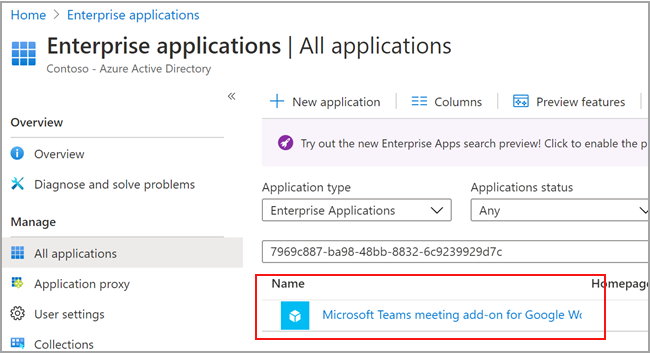

# <a name="set-up-microsoft-teams-meeting-add-on-for-google-workspace"></a>Configurar o complemento de reunião do Microsoft Teams para o Google Workspace

O uso do complemento de reunião do Microsoft Teams permite que os usuários do calendário do Google agendem e ingressem em uma reunião do Microsoft Teams diretamente do Google Workspace. Os usuários terão acesso aos recursos de reuniões do Teams, incluindo vídeo e audioconferência, compartilhamento de tela, chat de reunião, quadros de comunicações digitais e muito mais. Mantenha-se conectado e organizado para fazer mais juntos no trabalho, na escola e na vida.

O complemento de reunião do Microsoft Teams para o Google Workspace deve ser habilitado por um administrador do Teams antes que os usuários do locatário possam acessar o aplicativo.

## <a name="enable-or-disable-microsoft-teams-meeting-add-on-for-google-workspace-in-the-azure-portal"></a>Habilitar ou desabilitar o complemento de reunião do Microsoft Teams para o Google Workspace no portal do Azure

Como administrador de locatários, você pode habilitar ou desabilitar um complemento de reunião do Microsoft Teams para o Google Workspace da conta de administrador da sua organização usando o portal do Azure.

O complemento está habilitado por padrão.

1. Entre no portal do Azure.

2. Selecione **Aplicativos empresariais Todos** > **os aplicativos**.

3. Pesquise **o complemento de reunião do Microsoft Teams para o Google Workspace**.

   

4. Selecione **Sim**.

   

5. (Opcional) Para desabilitar o complemento, selecione **Não em** vez de **Sim** na Etapa 4.

## <a name="disable-microsoft-teams-meeting-add-on-for-google-workspace-using-powershell"></a>Desabilitar o complemento de reunião do Microsoft Teams para o Workspace do Google usando o PowerShell

```powershell
Connect-AzureAD

$displayName = 'Microsoft Teams meeting add-on for Google Workspace'
$appId = '7969c887-ba98-48bb-8832-6c9239929d7c'

# Check if a service principal already exists for the app
$servicePrincipal = Get-AzureADServicePrincipal -Filter "appId eq '$appId'"
if ($servicePrincipal) {
    # Service principal exists already, disable it
    Set-AzureADServicePrincipal -ObjectId $servicePrincipal.ObjectId -AccountEnabled $false
    Write-Host "Disabled existing Service Principal \n"
} else {
    # Service principal does not yet exist, create it and disable it at the same time
    New-AzureADServicePrincipal -AppId $appId -DisplayName $displayName
    Get-AzureADServicePrincipal -Filter "appId eq '$appId'" | Set-AzureADServicePrincipal -AccountEnabled:$false
    Write-Host "Created and disabled the Service Principal \n"
}
```

Para obter mais informações, [consulte Criar uma entidade de serviço do Azure com Azure PowerShell](/powershell/azure/create-azure-service-principal-azureps?view=azps-5.0.0).

## <a name="delete-the-microsoft-teams-meeting-add-on-for-google-workspace"></a>Excluir o complemento de reunião do Microsoft Teams para o Google Workspace

Consulte a documentação do Google [Excluir um aplicativo do Google Workspace Marketplace](https://support.google.com/a/answer/6216211?hl=en) para obter instruções.

## <a name="create-the-microsoft-teams-meeting-add-on-for-google-workspace-using-powershell"></a>Criar o complemento de reunião do Microsoft Teams para o Workspace do Google usando o PowerShell

Caso o complemento de reunião do Microsoft Teams não esteja presente em seu locatário, você pode criar usando o PowerShell: 

```powershell
Connect-AzureAD

$displayName = 'Microsoft Teams meeting add-on for Google Workspace'
$appId = '7969c887-ba98-48bb-8832-6c9239929d7c'

# Check if a service principal already exists for the app
$servicePrincipal = Get-AzureADServicePrincipal -Filter "appId eq '$appId'"
if ($servicePrincipal) {
    # Service principal exists already
    Write-Host "The Service principal already exists"
} else {
    # Service principal does not yet exist, create it
    New-AzureADServicePrincipal -AppId $appId -DisplayName $displayName
    Write-Host "Created the Service Principal"
}
```
