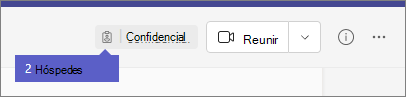

# Experiência de convidado no Teams

Quando um convidado é solicitado a entrar em uma equipe, ele recebe uma mensagem de boas-vindas por e-mail. Essa mensagem contém algumas informações sobre a equipe e o que esperar agora que ele é um membro. O convidado deve aceitar o convite selecionando **Abrir Microsoft Teams** na mensagem de e-mail antes de poder acessar a equipe e seus canais.
    

    
Todos os membros da equipe veem uma mensagem no tópico do canal anunciando que o proprietário da equipe adicionou um convidado e informou o nome do convidado. Todos da equipe podem identificar facilmente quem é um convidado. Uma marca no canto superior direito do encadeamento de canal indica o número de convidados na equipe e um rótulo de **(Convidado)** é exibido ao lado do nome de cada convidado.

Confira estes vídeos sobre a experiência de convidado no Teams:
- [Participar de uma Teams como convidado](https://support.microsoft.com/office/join-a-teams-meeting-078e9868-f1aa-4414-8bb9-ee88e9236ee4)
- [Trabalhar com convidados externos em uma Teams reunião](https://support.microsoft.com/office/work-with-external-guests-180ed260-d3ef-4247-9f24-1984fc76d5f0)

## Recursos do convidado e membro da equipe

A tabela a seguir compara as funcionalidades disponíveis no Teams para os membros da equipe de uma organização e seus convidados. Os administradores do Teams controlam os recursos disponíveis aos convidados.

| Recurso no Teams | Usuário do Teams na organização | Guest |
|:-----|:-----|:-----|
|Criar um canal     *Os proprietário de equipes controlam essa configuração.*    |&#x2713;|&#x2713;|
|Participar de um bate-papo privado    |&#x2713;|&#x2713;|
|Participar de uma conversa de canal    |&#x2713;|&#x2713;|
|Publicar, excluir e editar mensagens    |&#x2713;|&#x2713;|
|Compartilhar um arquivo de canal    |&#x2713;|&#x2713;|
|Acessar arquivos do SharePoint  |&#x2713;|&#x2713;|
|Anexar arquivos  |&#x2713;|Somente postagens de canal|
|Baixar arquivos particulares de chat  |&#x2713;|&#x2713;|
|Pesquisar dentro de arquivos  |&#x2713;||
|Compartilhar um arquivo de bate-papo    |&#x2713;||
|Adicionar aplicativos (guias, bots ou conectores)    |&#x2713;||
|Crie reuniões ou acesse agendas    |&#x2713;||
|Acessar o armazenamento do OneDrive for Business    |&#x2713;||
|Criar políticas de acesso de convidados de equipes/canais de todos os locatários    |&#x2713;||
|Convidar um usuário de fora do domínio da organização do Microsoft 365 ou do Office 365    *Os proprietários do Teams controlam essa configuração.*      |&#x2713;||
|Criar uma equipe    |&#x2713;||
|Descobrir e entrar em uma equipe pública    |&#x2713;||
|Visualizar o organograma    |&#x2713;||
|Usar a tradução de mensagens embutida    |&#x2713;||
|Tornar-se proprietário da equipe    |&#x2713;||

A tabela a seguir mostra os recursos de chamada e reunião disponíveis para convidados, em comparação com outros tipos de usuários.

| Recurso de chamada | Guest | Usuário E1 e E3 | Usuários E5 e Enterprise Voice |
| --------------- | ----- | -------------- | -------------- |
| Chamadas de VOIP | Sim | Sim | Sim |
| Chamadas de grupo | Sim | Sim | Sim |
| Controles principais de chamada suportados (segurar, ativar mudo, vídeo, compartilhamento de tela) | Sim | Sim | Sim |
| Destino de transferência | Sim | Sim | Sim |
| Pode transferir uma chamada | Sim | Sim | Sim |
| Pode transferência consultiva | Sim | Sim | Sim |
| Pode adicionar outros usuários a uma chamada via VOIP | Sim | Sim | Sim |
| Pode adicionar usuários por telefone a uma chamada | Não | Não | Sim |
| Destino de encaminhamento | Não | Sim | Sim |
| Destino do grupo de chamadas | Não | Sim | Sim |
| Destino não respondido | Não | Sim | Sim |
| Pode ser o destino de uma chamada federada | Não | Sim | Sim |
| Pode fazer uma chamada federada | Não | Sim | Sim |
| Pode encaminhar suas chamadas imediatamente | Não | Não | Sim |
| Pode ligar simultaneamente suas chamadas | Não | Não | Sim |
| Pode direcionar suas chamadas não respondidas | Não | Não | Sim |
| Chamadas perdidas podem ir para a caixa postal | Não | Não1 |Sim |
| Tem um número de telefone que possa receber chamadas | Não | Não | Sim |
| Pode discar números de telefone | Não | Não | Sim |
| Pode acessar as configurações de chamada | Não | Não | Sim |
| Pode alterar a saudação da caixa postal | Não | Não1 | Sim |
| Pode alterar toques | Não | Não  | Sim |
| Suporte a TTY | Não | Não | Sim |
| Pode ter delegados | Não | Não | Sim |
|  Pode ser um representante | Não | Não | Sim |

1 Este recurso estará disponível em breve.

> [!NOTE]
> A política de **restrições de acesso de usuário convidado** no Azure AD Directory (Azure AD) determina permissões para convidados em seu diretório. Há três opções de políticas.
>  - Os **Usuários convidados têm o mesmo acesso que os membros (mais inclusivos)** às configuração, o que significa que os convidados têm o mesmo acesso aos dados do diretório como usuários regulares do seu diretório.
>  - Os **Usuários convidados têm acesso limitado a propriedades e associação de objetos do diretório** das configurações, o que significa que os convidados não têm permissões para determinadas tarefas de diretório, como enumerar usuários, grupos ou outros recursos de diretório usando o Microsoft Graph.
>  - O **Acesso de usuário convidado é restrito a propriedades e associações de seus próprios objetos de diretório (mais restritivos)** da configuração, o que significa que os convidados só podem acessar seus próprios objetos de diretório.
>
>Para saber mais, confira [Quais são as permissões de usuário padrão no Azure Active Directory?](/azure/active-directory/fundamentals/users-default-permissions)

## Tópicos relacionados

[Deixar uma organização como um convidado](/azure/active-directory/b2b/leave-the-organization)

[Use o acesso para convidado e o acesso externo para colaborar com pessoas de fora da sua organização](communicate-with-users-from-other-organizations.md)
