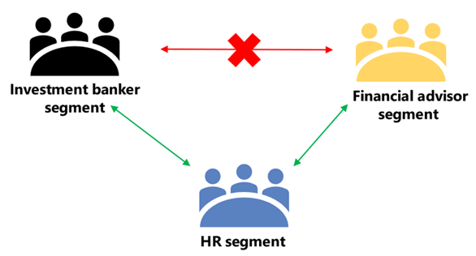
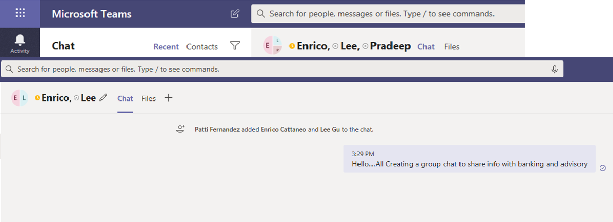
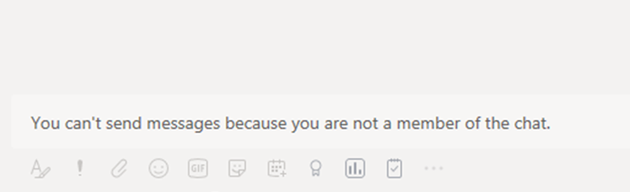

# <a name="information-barriers-in-microsoft-teams"></a>Barreiras de informações no Microsoft Teams

Os IBs ([Barreiras de Informações) do Microsoft Purview](/microsoft-365/compliance/information-barriers) são políticas que um administrador pode configurar para impedir que indivíduos ou grupos se comuniquem entre si. Os IBs serão úteis se, por exemplo, um departamento estiver tratando informações que não devem ser compartilhadas com outros departamentos. Os IBs também são úteis quando um grupo precisa ser isolado ou impedido de se comunicar com qualquer pessoa fora desse grupo. Os canais compartilhados Microsoft Teams são compatíveis com as barreiras de informações. Dependendo do tipo de compartilhamento, as políticas de barreiras de informações podem restringir o compartilhamento de determinadas maneiras. Para obter mais informações sobre canais compartilhados e comportamento de barreiras de informações, consulte [Barreiras de informações e Canais Compartilhados](information-barriers-shared-channels.md).

Por Microsoft Teams, as barreiras de informações podem determinar e impedir os seguintes tipos de colaborações não autorizadas:

- Adicionar um usuário a uma equipe ou canal
- Acesso do usuário ao conteúdo da equipe ou do canal
- Acesso do usuário a chats em grupo e 1:1
- Acesso do usuário a reuniões
- Impede pesquisas e descobertas, os usuários não estarão visíveis no seletor de pessoas.

>[!NOTE]
>- Grupos de barreiras de informações não podem ser criados entre locatários.
>- Não há suporte para o uso de bots, Azure Active Directory (Azure AD), APIs para enviar notificações do feed de atividades e algumas APIs para adicionar usuários na versão 1.
>- Os canais privados são compatíveis com as políticas de barreiras de informações que você configura.
>- Para obter informações sobre o suporte a barreiras para SharePoint sites conectados ao Teams, consulte [Segmentos associados Microsoft Teams sites](/sharepoint/information-barriers#segments-associated-with-microsoft-teams-sites).

## <a name="background"></a>Plano de fundo

O principal fator para IBs vem do setor de serviços financeiros. A [FinRA]( https://www.finra.org) (Autoridade Regulatória do Setor Financeiro) revisa IBs e conflitos de interesse em empresas membro e fornece diretrizes sobre como gerenciar esses conflitos (FINRA 2241, Aviso Regulatório de Pesquisa de Dívidas [15-31](https://www.finra.org/sites/default/files/Regulatory-Notice-15-31_0.pdf).

No entanto, desde a introdução de IBs, muitas outras áreas as acharam úteis. Outros cenários comuns incluem:

- **Educação**: os alunos de uma escola não podem procurar detalhes de contato para alunos de outras escolas.
- **Legal**: Manter a confidencialidade dos dados obtidos pelo advogado de um cliente e impedi-los de serem acessados por um advogado da mesma empresa que representa um cliente diferente.
- **Governo**: o acesso e o controle de informações são limitados entre departamentos e grupos.
- **Professional serviços**: um grupo de pessoas em uma empresa só é capaz de conversar com um cliente ou um cliente específico por meio do acesso de convidado durante uma participação do cliente.

Por exemplo, E fields pertence ao segmento Bancário e Pradeep pertence ao segmento consultor financeiro. Ecompartilhamento e Pradeep não podem se comunicar entre si porque a política de IB da organização bloqueia a comunicação e a colaboração entre esses dois segmentos. No entanto, Elee e Pradeep podem se comunicar com Lee no RH.



## <a name="when-to-use-information-barriers"></a>Quando usar barreiras de informações

Talvez você queira usar IBs em situações como estas:

- Uma equipe deve ser impedida de se comunicar ou compartilhar dados com uma outra equipe específica.
- Uma equipe não deve se comunicar ou compartilhar dados com qualquer pessoa fora da equipe.

O Serviço de Avaliação da Política de Barreira de Informações determina se uma comunicação está em conformidade com as políticas de IB.

## <a name="managing-information-barrier-policies"></a>Gerenciar políticas de barreira de informações

As políticas de IB são gerenciadas no portal de conformidade do Microsoft Purview (SCC) usando cmdlets do PowerShell. Para obter mais informações, consulte [Definir políticas para barreiras de informações](/office365/securitycompliance/information-barriers-policies).

>[!IMPORTANT]
>Antes de configurar ou definir políticas, você deve habilitar a pesquisa de diretório com escopo Microsoft Teams. Aguarde pelo menos algumas horas depois de habilitar a pesquisa de diretório com escopo antes de configurar ou definir políticas para barreiras de informações. Para obter mais informações, consulte [Definir políticas de barreira de informações](/office365/securitycompliance/information-barriers-policies#prerequisites).

## <a name="information-barriers-administrator-role"></a>Função de administrador de barreiras de informações

A função de Gerenciamento de Conformidade do IB é responsável por gerenciar políticas de IB. Para obter mais informações sobre essa função, consulte [Permissões no portal de conformidade do Microsoft Purview](/office365/securitycompliance/permissions-in-the-security-and-compliance-center).

## <a name="information-barrier-triggers"></a>Gatilhos de barreira de informações

As políticas de IB são ativadas quando ocorrem Teams eventos a seguir:

- **Os membros são adicionados a** uma equipe: sempre que você adiciona um usuário a uma equipe, a política do usuário deve ser avaliada em relação às políticas de IB de outros membros da equipe. Depois que o usuário for adicionado com êxito, o usuário poderá executar todas as funções na equipe sem mais verificações. Se a política do usuário os impede de serem adicionados à equipe, o usuário não aparecerá na pesquisa.

    

- **Um novo chat** é solicitado: sempre que um usuário solicita um novo chat com um ou mais outros usuários, o chat é avaliado para garantir que ele não está violando nenhuma política de IB. Se a conversa violar uma política de IB, a conversa não será iniciada.

    Aqui está um exemplo de um chat 1:1.

    

    Aqui está um exemplo de um chat em grupo.

    

- Um usuário é convidado a ingressar em uma **reunião: quando** um usuário é convidado a ingressar em uma reunião, a política de IB que se aplica ao usuário é avaliada em relação às políticas de IB que se aplicam aos outros membros da equipe. Se houver uma violação, o usuário não terá permissão para ingressar na reunião.

    

- **Uma tela** é compartilhada entre dois ou mais usuários: quando um usuário compartilha uma tela com outros usuários, o compartilhamento deve ser avaliado para garantir que ele não viole as políticas de IB de outros usuários. Se uma política de IB for violada, o compartilhamento de tela não será permitido.

    Aqui está um exemplo de compartilhamento de tela antes que a política seja aplicada.

    

    Aqui está um exemplo de compartilhamento de tela depois que a política é aplicada. Os ícones de compartilhamento de tela e chamada não estão visíveis.

    

- Um usuário faz uma chamada telefônica no **Teams**: sempre que um usuário inicia uma chamada de voz (via VOIP) para outro usuário ou grupo de usuários, a chamada é avaliada para garantir que ela não viole as políticas de IB de outros membros da equipe. Se houver alguma violação, a chamada de voz será bloqueada.

- **Convidados no Teams**: as políticas de IB também se aplicam Teams convidados. Se os convidados precisarem ser detectáveis na lista de endereços global da sua organização, consulte [Gerenciar o acesso](/microsoft-365/admin/create-groups/manage-guest-access-in-groups) de convidados Grupos do Microsoft 365. Depois que os convidados forem detectáveis, você poderá [definir políticas de IB](/office365/securitycompliance/information-barriers-policies).

## <a name="how-policy-changes-impact-existing-chats"></a>Como as alterações de política afetam os chats existentes

Quando o administrador de política de IB faz alterações em uma política ou quando uma alteração de política é ativada devido a uma alteração no perfil de um usuário (como para uma alteração de trabalho), o Serviço de Avaliação da Política de Barreira de Informações pesquisa automaticamente os membros para garantir que sua associação à equipe não viole nenhuma política.

Se houver um chat existente ou outra comunicação entre os usuários e uma nova política for definida ou uma política existente for alterada, o serviço avaliará as comunicações existentes para garantir que as comunicações ainda possam ocorrer. 

- **Chat 1:1**: se a comunicação entre dois usuários não for mais permitida (devido ao aplicativo a um ou ambos os usuários de uma política que bloqueia a comunicação), a comunicação adicional será bloqueada. Suas conversas de chat existentes se tornam somente leitura.

    Aqui está um exemplo que mostra que o chat está visível.

    

    Aqui está um exemplo que mostra que o chat está desabilitado.

    

- Chat em **grupo: se** a comunicação de um usuário para um grupo não for mais permitida (por exemplo, porque um usuário alterou trabalhos), o usuário, juntamente com os outros usuários cuja participação viola a política, poderá ser removido do chat em grupo e não será permitida uma comunicação adicional com o grupo. O usuário ainda pode ver conversas antigas, mas não poderá ver ou participar de novas conversas com o grupo. Se a política nova ou alterada que impede a comunicação for aplicada a mais de um usuário, os usuários afetados pela política poderão ser removidos do chat em grupo. Eles ainda podem ver conversas antigas.

  Neste exemplo, E email foi movido para um departamento diferente dentro da organização e é removido do chat em grupo.

  

  E emails não podem mais enviar mensagens para o chat em grupo.

  

- **Equipe**: todos os usuários que foram removidos do grupo são removidos da equipe e não poderão ver ou participar de conversas novas ou existentes.

## <a name="scenario-a-user-in-an-existing-chat-becomes-blocked"></a>Cenário: um usuário em um chat existente fica bloqueado

Atualmente, os usuários experimentarão os seguintes cenários se uma política de IB bloquear outro usuário:

- **Guia Pessoas**: um usuário não pode ver usuários bloqueados na **guia** Pessoas.

- **Seletor de** Pessoas: os usuários bloqueados não estarão visíveis no seletor de pessoas.

    

- **Guia Atividade**: se um usuário visitar a **guia Atividade** de um usuário bloqueado, nenhuma postagem será exibida. (A **guia** Atividade exibe apenas postagens de canal e não haveria canais comuns entre os dois usuários.)

    Aqui está um exemplo da exibição da guia atividade que está bloqueada.

    

- **Organogramas**: se um usuário acessar um organograma no qual um usuário bloqueado aparece, o usuário bloqueado não aparecerá no organograma. Em vez disso, uma mensagem de erro será exibida.

- **Cartão de** pessoas: se um usuário participar de uma conversa e o usuário for bloqueado posteriormente, outros usuários verão uma mensagem de erro em vez do cartão de pessoas quando passar o mouse sobre o nome do usuário bloqueado. As ações listadas no cartão (como chamada e chat) não estarão disponíveis.

- **Contatos sugeridos**: usuários bloqueados não aparecem na lista de contatos sugeridas (a lista de contatos inicial que aparece para novos usuários).

- **Contatos de chat**: um usuário pode ver usuários bloqueados na lista de contatos de chats, mas os usuários bloqueados serão identificados. A única ação que o usuário pode executar nos usuários bloqueados é excluí-los. O usuário também pode selecioná-lo para exibir sua conversa passada.

- **Chamadas de contatos**: um usuário pode ver usuários bloqueados na lista de contatos de chamadas, mas os usuários bloqueados serão identificados. A única ação que o usuário pode executar no bloco de usuários é excluí-los.

    Aqui está um exemplo de um usuário bloqueado na lista de contatos de chamadas.

    > [!div class="mx-imgBorder"]
    > 

    Aqui está um exemplo do chat que está sendo desabilitado para um usuário na lista de conteúdo de chamadas.

    > [!div class="mx-imgBorder"]
    > 

- **Skype para Teams** migração: durante uma migração do Skype for Business para o Teams, todos os usuários, mesmo os usuários bloqueados pelas políticas de IB, serão migrados para o Teams. Esses usuários são tratados conforme descrito acima.

## <a name="teams-policies-and-sharepoint-sites"></a>Teams políticas e SharePoint sites

Quando uma equipe é criada, um site SharePoint é provisionado e associado ao Microsoft Teams para a experiência de arquivos. As políticas de barreira de informações não são respeitadas neste SharePoint site e arquivos por padrão. Para habilitar as barreiras de SharePoint e OneDrive, siga as diretrizes e as etapas no artigo Usar [barreiras de informações SharePoint](/sharepoint/information-barriers#enable-sharepoint-and-onedrive-information-barriers-in-your-organization) artigo.

## <a name="information--barrier-modes-and-teams"></a>Modos de barreira de informações e Teams

O modo de barreiras de informações ajuda a fortalecer quem pode ser adicionado ou removido de uma equipe. Ao usar barreiras de informações com Teams, há suporte para os seguintes modos de IB:

- **Aberto**: essa configuração é o modo IB padrão para todos os grupos existentes que foram provisionados antes que as barreiras de informações fossem habilitadas. Nesse modo, não há políticas de IB aplicáveis.
- **Implícito**: essa configuração é o modo IB padrão quando uma equipe é provisionada depois de habilitar as barreiras de informações. O modo implícito permite adicionar todos os usuários compatíveis no grupo.
- **Proprietário Moderado**: esse modo é definido em uma equipe quando você deseja permitir a colaboração entre usuários de segmento incompatíveis que são moderados pelo proprietário. O proprietário da equipe pode adicionar novos membros de acordo com sua política de IB.

Teams criada antes de ativar uma política de barreira de informações em seu locatário são definidas automaticamente para *o modo* Aberto por padrão. Depois de ativar políticas de IB em seu locatário, você precisará atualizar o modo de suas equipes existentes para *Implícito* para garantir que as equipes existentes estejam em conformidade com IB.

Use o cmdlet [Set-UnifiedGroup](/powershell/module/exchange/set-unifiedgroup) com o *parâmetro InformationBarrierMode* que corresponde ao modo que você deseja usar para seus segmentos. A lista de valores permitida para o *parâmetro InformationBarrierMode* *é Open*, *Implicit* e *Owner Moderated*.

Por exemplo, para configurar o modo *implícito* para um grupo Microsoft 365, você usará o seguinte comando do PowerShell:

```powershell
Set-UnifiedGroup -InformationBarrierMode Implicit
```

Para atualizar o modo de Abrir para Implícito para todas as equipes existentes, use este [script do PowerShell](information-barriers-mode-script.md).

Se você alterar a configuração do modo Aberto em grupos conectados Teams existentes para atender aos requisitos de conformidade da sua organização, precisará atualizar os modos [de IB para sites SharePoint associados conectados](/sharepoint/information-barriers#view-and-manage-ib-modes-as-an-administrator-with-sharepoint-powershell) à equipe do Teams.

## <a name="required-licenses-and-permissions"></a>Licenças e permissões necessárias

Para obter mais informações sobre licenças e permissões, planos e preços, consulte Microsoft 365 diretrizes de licenciamento para conformidade & [segurança](/office365/servicedescriptions/microsoft-365-service-descriptions/microsoft-365-tenantlevel-services-licensing-guidance/microsoft-365-security-compliance-licensing-guidance).

## <a name="known-issues"></a>Problemas Conhecidos

- Os usuários não podem ingressar em reuniões **ad hoc**: se as políticas de IB estiverem habilitadas, os usuários não poderão ingressar em reuniões se o tamanho da lista de participantes for maior que os limites de participação da [reunião.](limits-specifications-teams.md) A causa raiz é que as verificações de IB dependem se os usuários podem ser adicionados a uma lista de chat de reunião e somente quando eles podem ser adicionados à lista de participantes têm permissão para ingressar na reunião. Um usuário ingressando em uma reunião uma vez adiciona esse usuário à lista de participantes; portanto, para reuniões recorrentes, a lista pode se preencher rapidamente. Depois que a lista de participantes do chat atingir os limites de participação da [reunião](limits-specifications-teams.md), usuários adicionais não poderão ser adicionados à reunião. Se a IB estiver habilitada para a organização e a lista de participantes do chat estiver cheia para uma reunião, novos usuários (os usuários que ainda não estão na lista) não poderão ingressar na reunião. Mas se a IB não estiver habilitada para a organização e a lista de chat da reunião estiver cheia, novos usuários (aqueles que ainda não estão na lista de participantes) poderão ingressar na reunião, embora não vejam a opção de chat na reunião. Uma solução de curto prazo é remover membros inativos da lista de chat da reunião para criar espaço para novos usuários. No entanto, aumentaremos o tamanho das listas de participantes do chat de reunião em uma data posterior.
- **Os usuários não podem** ingressar em reuniões de canal: se as políticas de IB estiverem habilitadas, os usuários não poderão ingressar em reuniões de canal se não forem membros da equipe. A causa raiz é que as verificações de IB dependem se os usuários podem ser adicionados a uma lista de chat de reunião e somente quando eles podem ser adicionados à lista de participantes têm permissão para ingressar na reunião. A conversa de chat em uma reunião de canal está disponível apenas para membros da equipe/canal e não membros não podem ver ou acessar a conversa de chat. Se a IB estiver habilitada para a organização e um membro não da equipe tentar ingressar em uma reunião de canal, esse usuário não poderá ingressar na reunião. No entanto, se o IB não estiver* habilitado para a organização e um membro não da equipe tentar ingressar em uma reunião de canal, o usuário poderá ingressar na reunião, mas não verá a opção de chat na reunião.
- **Número máximo de segmentos permitidos em uma** organização: cada organização pode configurar até 100 segmentos ao configurar políticas de IB. Não há limite para o número de políticas que podem ser configuradas.
- **As políticas de IB** não funcionam para usuários federados: se você permitir a federação com organizações externas, os usuários dessas organizações não serão restritos pelas políticas de IB. Se os usuários da sua organização ingressarem em um chat ou reunião organizada por usuários federados externos, as políticas de IB também não restringirão a comunicação entre os usuários da sua organização.

## <a name="more-information"></a>Mais informações

- Para saber mais sobre IBs, consulte [Barreiras de informações](/office365/securitycompliance/information-barriers).
- Para configurar políticas de IB, consulte [Introdução barreiras de informações](/office365/securitycompliance/information-barriers-policies).
- Para editar ou remover políticas de IB, consulte [Gerenciar políticas de barreira de informações](/microsoft-365/compliance/information-barriers-edit-segments-policies).
- [Barreiras de informações e canais compartilhados](information-barriers-shared-channels.md)

## <a name="availability"></a>Disponibilidade

As barreiras de Teams estão disponíveis em nossas nuvens públicas, GCC, GCC - Alta e DOD.
