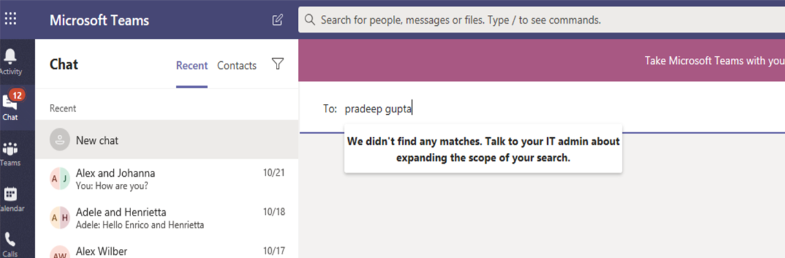

# Barreiras de informação no Microsoft Teams

As barreiras de informação (IBs) são políticas que um administrador pode configurar para impedir que pessoas ou grupos se comuniquem uns com os outros. IBs são úteis se, por exemplo, um departamento estiver manipulando informações que não devem ser compartilhadas com outros departamentos. O IBs também é útil quando um grupo precisa ser isolado ou impedido de se comunicar com qualquer pessoa fora desse grupo.

> [!NOTE]
> - Os grupos de barreira de informações (IB) não podem ser criados em locatários.
> - Usar bots, aplicativos Azure Active Directory (Azure AD) e algumas APIs para adicionar usuários não é compatível com a versão 1.
> - Os canais privados são compatíveis com as políticas da IB que você configurar.
> - Novo: para obter informações sobre o suporte a barreiras para sites do SharePoint que estão conectados ao Teams, consulte [segmentos associados a sites do Microsoft Teams](https://docs.microsoft.com/sharepoint/information-barriers#segments-associated-with-microsoft-teams-sites).

Políticas IB também impedem pesquisas e descoberta. Se você tentar se comunicar com alguém com quem não está se comunicando, não encontrará esse usuário no seletor de pessoas.

## Plano de fundo

O principal driver para IBs vem do setor de serviços financeiros. A autoridade de certificação do setor financeiro ([FINRA]( https://www.finra.org)) analisa o IBS e conflitos de interesse em instituições de membros e fornece orientação sobre como gerenciar tais conflitos (FINRA 2241, [aviso de regulamentação de pesquisa de dívida 15-31](https://www.finra.org/sites/default/files/Regulatory-Notice-15-31_0.pdf).

No entanto, como apresentar IBs, muitas outras áreas o encontraram para serem úteis. Outros cenários comuns incluem:

- Educação: os alunos em uma escola não conseguem Pesquisar detalhes de contato para alunos de outras escolas.

- Legal: manter a confidencialidade dos dados obtidos pela advogado de um cliente e impedir que ele seja acessado por um advogado para a mesma empresa que representa um cliente diferente.

- Governo: o acesso às informações e o controle são limitados entre departamentos e grupos.

- Serviços profissionais: um grupo de pessoas em uma empresa só pode conversar com um cliente ou um cliente específico por meio do acesso de convidado durante um envolvimento do cliente.

Por exemplo, Enrico pertence ao segmento bancário e Pradeep pertence ao segmento de supervisor financeiro. O Enrico e o Pradeep não conseguem se comunicar uns com os outros porque a política IB da organização bloqueia a comunicação e a colaboração entre esses dois segmentos. No entanto, Enrico e Pradeep podem se comunicar com Lee em RH.

## Quando usar barreiras de informações

Talvez você queira usar IBs em situações como estas:

- Uma equipe deve ser impedida de comunicação ou compartilhamento de dados com outra equipe específica.
- Uma equipe não deve se comunicar nem compartilhar dados com pessoas de fora da equipe.

O serviço de avaliação da política de barreira de informações determina se uma comunicação está em conformidade com as políticas da IB.

## Gerenciar políticas de barreira de informações

Políticas IB são gerenciadas no centro de conformidade do Microsoft 365 (SCC) usando cmdlets do PowerShell. Para obter mais informações, consulte [definir políticas para barreiras de informação](https://docs.microsoft.com/office365/securitycompliance/information-barriers-policies).

> [!IMPORTANT]
> Antes de configurar ou definir políticas, você deve habilitar a pesquisa de diretório em escopo no Microsoft Teams. Aguarde pelo menos algumas horas depois de habilitar a pesquisa de diretório de escopo antes de configurar ou definir políticas para barreiras de informação. Para obter mais informações, consulte [definir políticas de barreira de informações](https://docs.microsoft.com/office365/securitycompliance/information-barriers-policies#prerequisites).

## Função de administrador de barreiras de informações

A função de gerenciamento de conformidade IB é responsável por gerenciar políticas de IB. Para obter mais informações sobre essa função, consulte [permissões no centro de conformidade do Microsoft 365](https://docs.microsoft.com/office365/securitycompliance/permissions-in-the-security-and-compliance-center).

## Gatilhos de barreira de informações

Políticas IB são ativadas quando ocorrem os seguintes eventos de equipe:

- **Os membros são adicionados a uma equipe** , sempre que você adiciona um usuário a uma equipe, a política do usuário deve ser avaliada em relação às políticas da IB de outros membros da equipe. Depois que o usuário for adicionado com êxito, o usuário poderá executar todas as funções na equipe sem verificações adicionais. Se a política do usuário impedir que elas sejam adicionadas à equipe, o usuário não será exibido na pesquisa.

    

- **Um novo Chat é solicitado** -toda vez que um usuário solicita um novo chat com um ou mais usuários, o chat é avaliado para garantir que ele não está violando nenhuma política de IB. Se a conversa violar uma política de IB, a conversa não será iniciada.

    Veja um exemplo de um chat do 1:1.

    > [!div class="mx-imgBorder"]
    > 

    Aqui está um exemplo de um chat em grupo.

    > [!div class="mx-imgBorder"]
    > 

- **Um usuário é convidado a ingressar em uma reunião** -quando um usuário é convidado a ingressar em uma reunião, a política IB que se aplica ao usuário é avaliada em relação às políticas da IB aplicáveis aos outros membros da equipe. Se houver uma violação, o usuário não terá permissão para ingressar na reunião.

    

- **Uma tela é compartilhada entre dois ou mais usuários** – quando um usuário compartilha uma tela com outros usuários, o compartilhamento deve ser avaliado para garantir que ele não viole as políticas da IB de outros usuários. Se uma política de IB for violada, o compartilhamento de tela não será permitido. 
 
    Aqui está um exemplo de compartilhamento de tela antes da aplicação da política. 

    > [!div class="mx-imgBorder"]
    > 

    Aqui está um exemplo de compartilhamento de tela após a aplicação da política. Os ícones de compartilhamento de tela e chamada não estão visíveis.

    > [!div class="mx-imgBorder"]
    > 

- **Um usuário faz uma chamada telefônica no Microsoft Teams** – sempre que um usuário inicia uma chamada de voz (via VoIP) para outro usuário ou grupo de usuários, a chamada é avaliada para garantir que ela não viole as políticas de IB de outros membros da equipe. Se houver alguma violação, a chamada de voz será bloqueada.

- **Convidados no Teams** – as políticas da IB também se aplicam aos convidados no Teams. Se os convidados precisarem ser detectáveis na lista de endereços global da sua organização, consulte [gerenciar o acesso de convidados nos grupos do Microsoft 365](https://docs.microsoft.com/microsoft-365/admin/create-groups/manage-guest-access-in-groups). Uma vez que os convidados sejam detectáveis, você pode [definir políticas da IB](https://docs.microsoft.com/office365/securitycompliance/information-barriers-policies).

## Como as alterações de política afetam os chats existentes

Quando o administrador da política IB faz alterações em uma política ou quando uma alteração de política é ativada devido a uma alteração no perfil de um usuário (por exemplo, para uma alteração de trabalho), o serviço de avaliação da política de barreira de informações pesquisa automaticamente os membros para garantir que sua participação na equipe não viole nenhuma política.

Se houver um chat existente ou outras comunicações entre usuários e uma nova política for definida ou uma política existente for alterada, o serviço avaliará as comunicações existentes para garantir que as comunicações ainda sejam permitidas. 

- **1:1 chat** -se a comunicação entre dois usuários não for mais permitida (devido ao aplicativo para um ou ambos usuários de uma política que bloqueia a comunicação), a comunicação será bloqueada. Suas conversas de chat existentes se tornam somente leitura. 

    Aqui está um exemplo que mostra que o chat está visível.

    > [!div class="mx-imgBorder"]
    > 

    Aqui está um exemplo que mostra que o chat está desabilitado.

    > [!div class="mx-imgBorder"]
    > 

- **Chat em grupo** -se a comunicação de um usuário para um grupo não for mais permitida (por exemplo, porque um usuário alterou trabalhos), o usuário, junto com os outros usuários cuja participação viola a política, pode ser removido do chat em grupo, e outras comunicações com o grupo não serão permitidas. O usuário ainda pode ver conversas antigas, mas não poderá ver ou participar de conversas novas com o grupo. Se a política nova ou alterada que impede a comunicação for aplicada a mais de um usuário, os usuários afetados pela política poderão ser removidos do chat em grupo. Eles ainda podem ver conversas antigas.

  Neste exemplo, o Enrico é movido para um departamento diferente dentro da organização e é removido do chat em grupo.

  

  O Enrico não pode mais enviar mensagens para o chat em grupo.

  

- **Equipe** -todos os usuários que foram removidos do grupo são removidos da equipe e não poderão ver ou participar de conversas existentes ou novas.

## Cenário: um usuário em um chat existente torna-se bloqueado

Atualmente, os usuários perceberão os seguintes cenários se uma política IB bloquear outro usuário:

- **Guia pessoas** -um usuário não pode ver usuários bloqueados na guia **pessoas** .

- **Seletor de pessoas** – os usuários bloqueados não ficarão visíveis no seletor de pessoas.

    
    
- **Guia atividade** -se um usuário visitar a guia **atividade** de um usuário bloqueado, nenhuma postagem será exibida. (A guia **atividade** exibe somente Postagens de canal e não haveria canais comuns entre os dois usuários.)

    Veja um exemplo do modo de exibição da guia atividade que está bloqueado.

    > [!div class="mx-imgBorder"]
    > 

- **Organogramas** -se um usuário acessar um organograma no qual um usuário bloqueado será exibido, o usuário bloqueado não será exibido no organograma. Em vez disso, uma mensagem de erro será exibida.

- **Cartão de visita** -se um usuário participar de uma conversa e o usuário for bloqueado posteriormente, outros usuários verão uma mensagem de erro em vez do cartão de pessoas quando passarem o mouse sobre o nome do usuário bloqueado. As ações listadas no cartão (como chamada e chat) não estarão disponíveis.

- **Contatos sugeridos** : os usuários bloqueados não aparecem na lista de contatos sugeridos (a lista de contatos inicial exibida para novos usuários).

- **Contatos de chat** -um usuário pode ver usuários bloqueados na lista de contatos chats, mas os usuários bloqueados serão identificados. A única ação que o usuário pode executar nos usuários bloqueados é excluí-los. O usuário também pode clicar neles para ver a conversa anterior.

- **Chamadas contatos** -um usuário pode ver usuários bloqueados na lista de contatos chamadas, mas os usuários bloqueados serão identificados. A única ação que o usuário pode executar em bloquear usuários é exclui-los.

    Aqui está um exemplo de um usuário bloqueado na lista de contatos chamadas.

    > [!div class="mx-imgBorder"]
    > 

    Veja um exemplo do chat que está sendo desabilitado para um usuário na lista de conteúdo chamadas.

    > [!div class="mx-imgBorder"]
    > 

- **Migração do Skype para o Teams** -durante uma migração do Skype for Business para o Teams, todos os usuários, até mesmo os usuários bloqueados por políticas de IB, serão migrados para o Teams. Esses usuários são manipulados conforme descrito acima.

## Políticas de equipe e sites do SharePoint

Quando uma equipe é criada, um site do SharePoint é provisionado e associado ao Microsoft Teams para a experiência dos arquivos. As políticas IB não são respeitadas neste site e arquivos do SharePoint por padrão. Para habilitar políticas IB, o administrador já preencheu um formulário, solicitando que as políticas de IB sejam habilitadas no SharePoint e no OneDrive (consulte a seção *pré-requisitos* nas [barreiras de informação](https://docs.microsoft.com/sharepoint/information-barriers#prerequisites)). Se a política IB estiver ativada no SharePoint e no OneDrive, as políticas de IB funcionarão em sites do SharePoint provisionados quando uma equipe é criada com o Microsoft Teams.

**Exemplo de políticas de IB no site do SharePoint de uma equipe**: na contoso Bank Corporation, o usuário ' Sesha@contosobank.onmicrosoft.com ' pertence ao segmento do banco de investimentos e o usuário ' Nikita@contosobank.onmicrosoft.com ' pertence ao segmento Consultivo. A política IB da organização bloqueia a comunicação e a colaboração entre esses dois segmentos.
Quando o usuário Sesha cria uma equipe para o segmento do banco de investimentos, a equipe e o site do SharePoint que o faz para fazer isso serão acessíveis somente para os usuários do banco de investimentos. O Nikita do usuário não pode acessar esse site, mesmo que ele tenha o link do site.

Para obter mais informações, consulte [usar barreiras de informações com o SharePoint](https://docs.microsoft.com/sharepoint/information-barriers#segments-associated-with-microsoft-teams-sites).

## Permissões e licenças necessárias

Para obter mais informações sobre licenças e permissões, incluindo planos e preços, consulte [orientação de licenciamento do Microsoft 365 para conformidade com a segurança &](https://docs.microsoft.com/office365/servicedescriptions/microsoft-365-service-descriptions/microsoft-365-tenantlevel-services-licensing-guidance/microsoft-365-security-compliance-licensing-guidance).

## Problemas conhecidos
- **Os usuários não podem ingressar em reuniões ad hoc**: se as políticas do IB estiverem habilitadas, os usuários não poderão ingressar em reuniões se o tamanho da lista de reuniões for maior do que os [limites de presença da reunião](limits-specifications-teams.md). A causa raiz é que as verificações de IB dependem se os usuários podem ser adicionados a uma lista de chats de reunião e somente quando elas podem ser adicionadas à lista são autorizadas a ingressar na reunião. Um usuário ingressando em uma reunião depois adiciona esse usuário à lista; Portanto, para reuniões recorrentes, a lista pode ser preenchida rapidamente. Quando a lista de chats atinge os [limites de participação da reunião](limits-specifications-teams.md), nenhum usuário adicional pode ser adicionado à reunião. Se o IB estiver habilitado para o locatário e a lista de chats estiver cheia para uma reunião, novos usuários (aqueles que ainda não estiverem na lista) não poderão ingressar na reunião. Mas se a IB não estiver habilitada para o locatário e a lista de chats da reunião estiver cheia, novos usuários (aqueles que ainda não estiverem na lista) poderão ingressar na reunião, embora não vejam a opção chat na reunião. Uma solução de curto prazo é remover membros inativos da lista de chats da reunião para liberar espaço para novos usuários. No entanto, vamos aumentar o tamanho das escalas de chat da reunião em uma data posterior.

- **Os usuários não podem ingressar em reuniões de canal**: se as políticas do IB estiverem habilitadas, os usuários não poderão ingressar em reuniões de canal se não forem membros da equipe. A causa raiz é que as verificações de IB dependem se os usuários podem ser adicionados a uma lista de chats de reunião e somente quando elas podem ser adicionadas à lista são autorizadas a ingressar na reunião. O thread de chat em uma reunião de canal está disponível somente para membros de equipe/canal, e não membros não podem ver ou acessar o thread de chat. Se o IB estiver habilitado para o locatário e um membro de não equipe tentar ingressar em uma reunião de canal, esse usuário não poderá ingressar na reunião. No entanto, se a IB _não_ estiver habilitada para o locatário e um membro de não equipe tentar ingressar em uma reunião de canal, o usuário poderá ingressar na reunião, mas ela não verá a opção de chat na reunião.

## Mais informações

- Para saber mais sobre o IBs, consulte [barreiras de informações](https://docs.microsoft.com/office365/securitycompliance/information-barriers).

- Para configurar políticas de IB, consulte [definir políticas para barreiras de informação](https://docs.microsoft.com/office365/securitycompliance/information-barriers-policies).

- Para editar ou remover políticas do IB, consulte [Editar (ou remover) políticas de barreira de informações](https://docs.microsoft.com/microsoft-365/compliance/information-barriers-edit-segments-policies).
