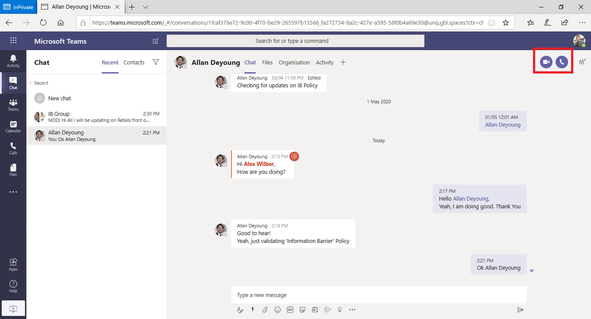

# Barreiras de informação no Microsoft TeamsInformation barriers in Microsoft Teams

As barreiras de informação (IBs) são políticas que um administrador pode configurar para impedir que pessoas ou grupos se comuniquem uns com os outros.Information barriers (IBs) are policies that an admin can configure to prevent individuals or groups from communicating with each other. IBs são úteis se, por exemplo, um departamento estiver manipulando informações que não devem ser compartilhadas com outros departamentos.IBs are useful if, for example, one department is handling information that shouldn't be shared with other departments. O IBs também é útil quando um grupo precisa ser isolado ou impedido de se comunicar com qualquer pessoa fora desse grupo.IBs are also useful when a group needs to be isolated or prevented from communicating with anyone outside of that group.

> [!NOTE]
> - Os grupos de barreira de informações (IB) não podem ser criados em locatários.Information barrier (IB) groups cannot be created across tenants.
> - Usar bots, aplicativos Azure Active Directory (Azure AD) e algumas APIs para adicionar usuários não é compatível com a versão 1.Using bots, Azure Active Directory (Azure AD) apps, and some APIs to add users is not supported in version 1.
> - Os canais privados são compatíveis com as políticas da IB que você configurar.Private channels are compliant to IB policies that you configure.
> - Novo: para obter informações sobre o suporte a barreiras para sites do SharePoint que estão conectados ao Teams, consulte [segmentos associados a sites do Microsoft Teams](https://docs.microsoft.com/sharepoint/information-barriers#segments-associated-with-microsoft-teams-sites).New: For information about support for barriers for SharePoint sites that are connected to Teams, see [Segments associated with Microsoft Teams sites](https://docs.microsoft.com/sharepoint/information-barriers#segments-associated-with-microsoft-teams-sites).

Políticas IB também impedem pesquisas e descoberta.IB policies also prevent lookups and discovery. Se você tentar se comunicar com alguém com quem não está se comunicando, não encontrará esse usuário no seletor de pessoas.If you attempt to communicate with someone you shouldn't be communicating with, you won't find that user in the people picker.

## Plano de fundoBackground

O principal driver para IBs vem do setor de serviços financeiros.The primary driver for IBs comes from the financial services industry. A autoridade de certificação do setor financeiro ([FINRA]( https://www.finra.org)) analisa o IBS e conflitos de interesse em instituições de membros e fornece orientação sobre como gerenciar tais conflitos (FINRA 2241, [aviso de regulamentação de pesquisa de dívida 15-31](https://www.finra.org/sites/default/files/Regulatory-Notice-15-31_0.pdf).The Financial Industry Regulatory Authority ([FINRA]( https://www.finra.org)) reviews IBs and conflicts of interest within member firms and provides guidance about managing such conflicts (FINRA 2241, [Debt Research Regulatory Notice 15-31](https://www.finra.org/sites/default/files/Regulatory-Notice-15-31_0.pdf).

No entanto, como apresentar IBs, muitas outras áreas o encontraram para serem úteis.However, since introducing IBs, many other areas have found them to be useful. Outros cenários comuns incluem:Other common scenarios include:

- Educação: os alunos em uma escola não conseguem Pesquisar detalhes de contato para alunos de outras escolas.Education: Students in one school aren't able to look up contact details for students of other schools.

- Legal: manter a confidencialidade dos dados obtidos pela advogado de um cliente e impedir que ele seja acessado por um advogado para a mesma empresa que representa um cliente diferente.Legal: Maintaining the confidentiality of data that is obtained by the lawyer of one client and preventing it from being accessed by a lawyer for the same firm who represents a different client.

- Governo: o acesso às informações e o controle são limitados entre departamentos e grupos.Government: Information access and control are limited across departments and groups.

- Serviços profissionais: um grupo de pessoas em uma empresa só pode conversar com um cliente ou um cliente específico por meio do acesso de convidado durante um envolvimento do cliente.Professional services: A group of people in a company is only able to chat with a client or a specific customer via guest access during a customer engagement.

Por exemplo, Enrico pertence ao segmento bancário e Pradeep pertence ao segmento de supervisor financeiro.For example, Enrico belongs to the Banking segment and Pradeep belongs to the Financial advisor segment. O Enrico e o Pradeep não conseguem se comunicar uns com os outros porque a política IB da organização bloqueia a comunicação e a colaboração entre esses dois segmentos.Enrico and Pradeep can't communicate with each other because the organization's IB policy blocks communication and collaboration between these two segments. No entanto, Enrico e Pradeep podem se comunicar com Lee em RH.However, Enrico and Pradeep can communicate with Lee in HR.

## Quando usar barreiras de informaçõesWhen to use information barriers

Talvez você queira usar IBs em situações como estas:You might want to use IBs in situations like these:

- Uma equipe deve ser impedida de comunicação ou compartilhamento de dados com outra equipe específica.A team must be prevented from communicating or sharing data with a specific other team.
- Uma equipe não deve se comunicar nem compartilhar dados com pessoas de fora da equipe.A team must not communicate or share data with anyone outside of the team.

O serviço de avaliação da política de barreira de informações determina se uma comunicação está em conformidade com as políticas da IB.The Information Barrier Policy Evaluation Service determines whether a communication complies with IB policies.

## Gerenciar políticas de barreira de informaçõesManaging information barrier policies

Políticas IB são gerenciadas no centro de conformidade do Microsoft 365 (SCC) usando cmdlets do PowerShell.IB policies are managed in the Microsoft 365 Compliance Center (SCC) using PowerShell cmdlets. Para obter mais informações, consulte [definir políticas para barreiras de informação](https://docs.microsoft.com/office365/securitycompliance/information-barriers-policies).For more information, see [Define policies for information barriers](https://docs.microsoft.com/office365/securitycompliance/information-barriers-policies).

> [!IMPORTANT]
> Antes de configurar ou definir políticas, você deve habilitar a pesquisa de diretório em escopo no Microsoft Teams.Before you set up or define policies, you must enable scoped directory search in Microsoft Teams. Aguarde pelo menos algumas horas depois de habilitar a pesquisa de diretório de escopo antes de configurar ou definir políticas para barreiras de informação.Wait at least a few hours after enabling scoped directory search before you set up or define policies for information barriers. Para obter mais informações, consulte [definir políticas de barreira de informações](https://docs.microsoft.com/office365/securitycompliance/information-barriers-policies#prerequisites).For more information, see [Define information barrier policies](https://docs.microsoft.com/office365/securitycompliance/information-barriers-policies#prerequisites).

## Função de administrador de barreiras de informaçõesInformation barriers administrator role

A função de gerenciamento de conformidade IB é responsável por gerenciar políticas de IB.The IB Compliance Management role is responsible for managing IB policies. Para obter mais informações sobre essa função, consulte [permissões no centro de conformidade do Microsoft 365](https://docs.microsoft.com/office365/securitycompliance/permissions-in-the-security-and-compliance-center).For more information about this role, see [Permissions in the Microsoft 365 Compliance Center](https://docs.microsoft.com/office365/securitycompliance/permissions-in-the-security-and-compliance-center).

## Gatilhos de barreira de informaçõesInformation barrier triggers

Políticas IB são ativadas quando ocorrem os seguintes eventos de equipe:IB policies are activated when the following Teams events take place:

- **Os membros são adicionados a uma equipe** , sempre que você adiciona um usuário a uma equipe, a política do usuário deve ser avaliada em relação às políticas da IB de outros membros da equipe.**Members are added to a team** - Whenever you add a user to a team, the user's policy must be evaluated against the IB policies of other team members. Depois que o usuário for adicionado com êxito, o usuário poderá executar todas as funções na equipe sem verificações adicionais.After the user is successfully added, the user can perform all functions in the team without further checks. Se a política do usuário impedir que elas sejam adicionadas à equipe, o usuário não será exibido na pesquisa.If the user's policy blocks them from being added to the team, the user won't show up in search.

    

- **Um novo Chat é solicitado** -toda vez que um usuário solicita um novo chat com um ou mais usuários, o chat é avaliado para garantir que ele não está violando nenhuma política de IB.**A new chat is requested** - Each time that a user requests a new chat with one or more other users, the chat is evaluated to make sure that it isn't violating any IB policies. Se a conversa violar uma política de IB, a conversa não será iniciada.If the conversation violates an IB policy, then the conversation isn't started.

    Veja um exemplo de um chat do 1:1.Here's an example of a 1:1 chat.

    > [!div class="mx-imgBorder"]
    > 

    Aqui está um exemplo de um chat em grupo.Here's an example of a group chat.

    > [!div class="mx-imgBorder"]
    > 

- **Um usuário é convidado a ingressar em uma reunião** -quando um usuário é convidado a ingressar em uma reunião, a política IB que se aplica ao usuário é avaliada em relação às políticas da IB aplicáveis aos outros membros da equipe.**A user is invited to join a meeting** - When a user is invited to join a meeting, the IB policy that applies to the user is evaluated against the IB policies that apply to the other team members. Se houver uma violação, o usuário não terá permissão para ingressar na reunião.If there's a violation, the user won't be allowed to join the meeting.

    

- **Uma tela é compartilhada entre dois ou mais usuários** – quando um usuário compartilha uma tela com outros usuários, o compartilhamento deve ser avaliado para garantir que ele não viole as políticas da IB de outros usuários.**A screen is shared between two or more users** - When a user shares a screen with other users, the sharing must be evaluated to make sure that it doesn't violate the IB policies of other users. Se uma política de IB for violada, o compartilhamento de tela não será permitido.If an IB policy is violated, the screen share won't be allowed. 
 
    Aqui está um exemplo de compartilhamento de tela antes da aplicação da política.Here's an example of screen share before the policy is applied. 

    > [!div class="mx-imgBorder"]
    > 

    Aqui está um exemplo de compartilhamento de tela após a aplicação da política.Here's an example of screen share after the policy is applied. Os ícones de compartilhamento de tela e chamada não estão visíveis.The screen share and call icons aren't visible.

    > [!div class="mx-imgBorder"]
    > 

- **Um usuário faz uma chamada telefônica no Microsoft Teams** – sempre que um usuário inicia uma chamada de voz (via VoIP) para outro usuário ou grupo de usuários, a chamada é avaliada para garantir que ela não viole as políticas de IB de outros membros da equipe.**A user places a phone call in Teams** - Whenever a user initiates a voice call (via VOIP) to another user or group of users, the call is evaluated to make sure that it doesn't violate the IB policies of other team members. Se houver alguma violação, a chamada de voz será bloqueada.If there's any violation, the voice call is blocked.

- **Convidados no Teams** – as políticas da IB também se aplicam aos convidados no Teams.**Guests in Teams** - IB policies apply to guests in Teams, too. Se os convidados precisarem ser detectáveis na lista de endereços global da sua organização, consulte [gerenciar o acesso de convidados nos grupos do Microsoft 365](https://docs.microsoft.com/microsoft-365/admin/create-groups/manage-guest-access-in-groups).If guests need to be discoverable in your organization's global address list, see [Manage guest access in Microsoft 365 Groups](https://docs.microsoft.com/microsoft-365/admin/create-groups/manage-guest-access-in-groups). Uma vez que os convidados sejam detectáveis, você pode [definir políticas da IB](https://docs.microsoft.com/office365/securitycompliance/information-barriers-policies).Once guests are discoverable, you can [define IB policies](https://docs.microsoft.com/office365/securitycompliance/information-barriers-policies).

## Como as alterações de política afetam os chats existentesHow policy changes impact existing chats

Quando o administrador da política IB faz alterações em uma política ou quando uma alteração de política é ativada devido a uma alteração no perfil de um usuário (por exemplo, para uma alteração de trabalho), o serviço de avaliação da política de barreira de informações pesquisa automaticamente os membros para garantir que sua participação na equipe não viole nenhuma política.When the IB policy administrator makes changes to a policy, or when a policy change is activated because of a change to a user's profile (such as for a job change), the Information Barrier Policy Evaluation Service automatically searches the members to ensure that their membership in the team doesn't violate any policies.

Se houver um chat existente ou outras comunicações entre usuários e uma nova política for definida ou uma política existente for alterada, o serviço avaliará as comunicações existentes para garantir que as comunicações ainda sejam permitidas.If there's an existing chat or other communication between users, and a new policy is set or an existing policy is changed, the service evaluates existing communications to make sure that the communications are still allowed to occur. 

- **1:1 chat** -se a comunicação entre dois usuários não for mais permitida (devido ao aplicativo para um ou ambos usuários de uma política que bloqueia a comunicação), a comunicação será bloqueada.**1:1 chat** - If communication between two users is no longer allowed (because of application to one or both users of a policy that blocks communication), further communication is blocked. Suas conversas de chat existentes se tornam somente leitura.Their existing chat conversations become read-only. 

    Aqui está um exemplo que mostra que o chat está visível.Here's an example that shows the chat is visible.

    > [!div class="mx-imgBorder"]
    > 

    Aqui está um exemplo que mostra que o chat está desabilitado.Here's an example that shows the chat is disabled.

    > [!div class="mx-imgBorder"]
    > 

- **Chat em grupo** -se a comunicação de um usuário para um grupo não for mais permitida (por exemplo, porque um usuário alterou trabalhos), o usuário, junto com os outros usuários cuja participação viola a política, pode ser removido do chat em grupo, e outras comunicações com o grupo não serão permitidas.**Group chat** - If communication from one user to a group is no longer allowed (for example, because a user changed jobs), the user—along with the other users whose participation violates the policy—may be removed from group chat, and further communication with the group won't be allowed. O usuário ainda pode ver conversas antigas, mas não poderá ver ou participar de conversas novas com o grupo.The user can still see old conversations, but won't be able to see or participate in any new conversations with the group. Se a política nova ou alterada que impede a comunicação for aplicada a mais de um usuário, os usuários afetados pela política poderão ser removidos do chat em grupo.If the new or changed policy that prevents communication is applied to more than one user, the users who are affected by the policy may be removed from group chat. Eles ainda podem ver conversas antigas.They can still see old conversations.

  Neste exemplo, o Enrico é movido para um departamento diferente dentro da organização e é removido do chat em grupo.In this example, Enrico moved to a different department within the organization and is removed from the group chat.

  

  O Enrico não pode mais enviar mensagens para o chat em grupo.Enrico can no longer send messages to the group chat.

  

- **Equipe** -todos os usuários que foram removidos do grupo são removidos da equipe e não poderão ver ou participar de conversas existentes ou novas.**Team** - Any users who have been removed from the group are removed from the team and won't be able to see or participate in existing or new conversations.

## Cenário: um usuário em um chat existente torna-se bloqueadoScenario: A user in an existing chat becomes blocked

Atualmente, os usuários perceberão os seguintes cenários se uma política IB bloquear outro usuário:Currently, users experience the following scenarios if an IB policy blocks another user:

- **Guia pessoas** -um usuário não pode ver usuários bloqueados na guia **pessoas** .**People tab** - A user can't see blocked users on the **People** tab.

- **Seletor de pessoas** – os usuários bloqueados não ficarão visíveis no seletor de pessoas.**People Picker** - Blocked users won't be visible in the people picker.

    
    
- **Guia atividade** -se um usuário visitar a guia **atividade** de um usuário bloqueado, nenhuma postagem será exibida.**Activity tab** - If a user visits the **Activity** tab of a blocked user, no posts will appear. (A guia **atividade** exibe somente Postagens de canal e não haveria canais comuns entre os dois usuários.)(The **Activity** tab displays channel posts only, and there would be no common channels between the two users.)

    Veja um exemplo do modo de exibição da guia atividade que está bloqueado.Here's an example of the activity tab view that is blocked.

    > [!div class="mx-imgBorder"]
    > 

- **Organogramas** -se um usuário acessar um organograma no qual um usuário bloqueado será exibido, o usuário bloqueado não será exibido no organograma.**Org charts** - If a user accesses an org chart on which a blocked user appears, the blocked user won't appear on the org chart. Em vez disso, uma mensagem de erro será exibida.Instead, an error message will appear.

- **Cartão de visita** -se um usuário participar de uma conversa e o usuário for bloqueado posteriormente, outros usuários verão uma mensagem de erro em vez do cartão de pessoas quando passarem o mouse sobre o nome do usuário bloqueado.**People card** - If a user participates in a conversation and the user is later blocked, other users will see an error message instead of the people card when they hover over the blocked user's name. As ações listadas no cartão (como chamada e chat) não estarão disponíveis.Actions listed on the card (such as calling and chat) will be unavailable.

- **Contatos sugeridos** : os usuários bloqueados não aparecem na lista de contatos sugeridos (a lista de contatos inicial exibida para novos usuários).**Suggested contacts** - Blocked users don't appear on the suggested contacts list (the initial contact list that appears for new users).

- **Contatos de chat** -um usuário pode ver usuários bloqueados na lista de contatos chats, mas os usuários bloqueados serão identificados.**Chat contacts** - A user can see blocked users on the chats contact list, but the blocked users will be identified. A única ação que o usuário pode executar nos usuários bloqueados é excluí-los.The only action that the user can perform on the blocked users is to delete them. O usuário também pode clicar neles para ver a conversa anterior.The user can also click on them to view their past conversation.

- **Chamadas contatos** -um usuário pode ver usuários bloqueados na lista de contatos chamadas, mas os usuários bloqueados serão identificados.**Calls contacts** - A user can see blocked users on the calls contact list, but the blocked users will be identified. A única ação que o usuário pode executar em bloquear usuários é exclui-los.The only action that the user can perform on the block users is to delete them.

    Aqui está um exemplo de um usuário bloqueado na lista de contatos chamadas.Here's an example of a blocked user in the calls contact list.

    > [!div class="mx-imgBorder"]
    > 

    Veja um exemplo do chat que está sendo desabilitado para um usuário na lista de conteúdo chamadas.Here's an example of the chat being disabled for a user on the calls content list.

    > [!div class="mx-imgBorder"]
    > 

- **Migração do Skype para o Teams** -durante uma migração do Skype for Business para o Teams, todos os usuários, até mesmo os usuários bloqueados por políticas de IB, serão migrados para o Teams.**Skype to Teams migration** - During a migration from Skype for Business to Teams, all users—even those users who are blocked by IB policies—will be migrated to Teams. Esses usuários são manipulados conforme descrito acima.Those users are then handled as described above.

## Políticas de equipe e sites do SharePointTeams policies and SharePoint sites

Quando uma equipe é criada, um site do SharePoint é provisionado e associado ao Microsoft Teams para a experiência dos arquivos.When a team is created, a SharePoint site is provisioned and associated with Microsoft Teams for the files experience. As políticas IB não são respeitadas neste site e arquivos do SharePoint por padrão.IB policies aren't honored on this SharePoint site and files by default. Para habilitar políticas IB, o administrador já preencheu um formulário, solicitando que as políticas de IB sejam habilitadas no SharePoint e no OneDrive (consulte a seção *pré-requisitos* nas [barreiras de informação](https://docs.microsoft.com/sharepoint/information-barriers#prerequisites)).To enable IB policies, the administrator has already filled out a form, requesting that IB policies be enabled on SharePoint and OneDrive (see the *Prerequisites* section in [Information barriers](https://docs.microsoft.com/sharepoint/information-barriers#prerequisites)). Se a política IB estiver ativada no SharePoint e no OneDrive, as políticas de IB funcionarão em sites do SharePoint provisionados quando uma equipe é criada com o Microsoft Teams.If the IB policy is turned on in SharePoint and OneDrive, then the IB policies will work on SharePoint sites that are provisioned when a team is created with Microsoft Teams.

**Exemplo de políticas de IB no site do SharePoint de uma equipe**: na contoso Bank Corporation, o usuário ' Sesha@contosobank.onmicrosoft.com ' pertence ao segmento do banco de investimentos e o usuário ' Nikita@contosobank.onmicrosoft.com ' pertence ao segmento Consultivo.**Example of IB policies on SharePoint site of a team**: In Contoso Bank corporation, user 'Sesha@contosobank.onmicrosoft.com' belongs to the Investment Banking segment and user 'Nikita@contosobank.onmicrosoft.com' belongs to the Advisory segment. A política IB da organização bloqueia a comunicação e a colaboração entre esses dois segmentos.The organization's IB policy blocks communication and collaboration between these two segments.
Quando o usuário Sesha cria uma equipe para o segmento do banco de investimentos, a equipe e o site do SharePoint que o faz para fazer isso serão acessíveis somente para os usuários do banco de investimentos.When user Sesha creates a team for the Investment Banking segment, the team and the SharePoint site that backs it will be accessible only to Investment Banking users. O Nikita do usuário não pode acessar esse site, mesmo que ele tenha o link do site.User Nikita can't access that site even if she has the site link.

Para obter mais informações, consulte [usar barreiras de informações com o SharePoint](https://docs.microsoft.com/sharepoint/information-barriers#segments-associated-with-microsoft-teams-sites).For more information, see [Use information barriers with SharePoint](https://docs.microsoft.com/sharepoint/information-barriers#segments-associated-with-microsoft-teams-sites).

## Permissões e licenças necessáriasRequired licenses and permissions

Para obter mais informações sobre licenças e permissões, incluindo planos e preços, consulte [orientação de licenciamento do Microsoft 365 para conformidade com a segurança &](https://docs.microsoft.com/office365/servicedescriptions/microsoft-365-service-descriptions/microsoft-365-tenantlevel-services-licensing-guidance/microsoft-365-security-compliance-licensing-guidance).For more information on licenses and permissions, including plans and pricing, see [Microsoft 365 licensing guidance for security & compliance](https://docs.microsoft.com/office365/servicedescriptions/microsoft-365-service-descriptions/microsoft-365-tenantlevel-services-licensing-guidance/microsoft-365-security-compliance-licensing-guidance).

## Problemas conhecidosKnown Issues
- **Os usuários não podem ingressar em reuniões ad hoc**: se as políticas do IB estiverem habilitadas, os usuários não poderão ingressar em reuniões se o tamanho da lista de reuniões for maior do que os [limites de presença da reunião](limits-specifications-teams.md).**Users can't join ad-hoc meetings**: If IB policies are enabled, users aren't allowed to join meetings if the size of the meeting roster is greater than the [meeting attendance limits](limits-specifications-teams.md). A causa raiz é que as verificações de IB dependem se os usuários podem ser adicionados a uma lista de chats de reunião e somente quando elas podem ser adicionadas à lista são autorizadas a ingressar na reunião.The root cause is that IB checks rely on whether users can be added to a meeting chat roster, and only when they can be added to the roster are they allowed to join the meeting. Um usuário ingressando em uma reunião depois adiciona esse usuário à lista; Portanto, para reuniões recorrentes, a lista pode ser preenchida rapidamente.A user joining a meeting once adds that user to the roster; hence for recurring meetings, the roster can fill up fast. Quando a lista de chats atinge os [limites de participação da reunião](limits-specifications-teams.md), nenhum usuário adicional pode ser adicionado à reunião.Once the chat roster reaches the [meeting attendance limits](limits-specifications-teams.md), no additional users are allowed to be added to the meeting. Se o IB estiver habilitado para o locatário e a lista de chats estiver cheia para uma reunião, novos usuários (aqueles que ainda não estiverem na lista) não poderão ingressar na reunião.If IB is enabled for the tenant and the chat roster is full for a meeting, new users (those users who aren't already on the roster) aren't allowed to join the meeting. Mas se a IB não estiver habilitada para o locatário e a lista de chats da reunião estiver cheia, novos usuários (aqueles que ainda não estiverem na lista) poderão ingressar na reunião, embora não vejam a opção chat na reunião.But if IB isn't enabled for the tenant and the meeting chat roster is full, new users (those users who aren't already on the roster) are allowed to join the meeting, though they won't see the chat option in the meeting. Uma solução de curto prazo é remover membros inativos da lista de chats da reunião para liberar espaço para novos usuários.A short-term solution is to remove inactive members from the meeting chat roster to make space for new users. No entanto, vamos aumentar o tamanho das escalas de chat da reunião em uma data posterior.We will, however, be increasing the size of meeting chat rosters at a later date.

- **Os usuários não podem ingressar em reuniões de canal**: se as políticas do IB estiverem habilitadas, os usuários não poderão ingressar em reuniões de canal se não forem membros da equipe.**Users can't join channel meetings**: If IB policies are enabled, users aren't allowed to join channel meetings if they're not a member of the team. A causa raiz é que as verificações de IB dependem se os usuários podem ser adicionados a uma lista de chats de reunião e somente quando elas podem ser adicionadas à lista são autorizadas a ingressar na reunião.The root cause is that IB checks rely on whether users can be added to a meeting chat roster, and only when they can be added to the roster are they allowed to join the meeting. O thread de chat em uma reunião de canal está disponível somente para membros de equipe/canal, e não membros não podem ver ou acessar o thread de chat.The chat thread in a channel meeting is available to Team/Channel members only, and non-members can't see or access the chat thread. Se o IB estiver habilitado para o locatário e um membro de não equipe tentar ingressar em uma reunião de canal, esse usuário não poderá ingressar na reunião.If IB is enabled for the tenant and a non-team member attempts to join a channel meeting, that user isn't allowed to join the meeting. No entanto, se a IB _não_ estiver habilitada para o locatário e um membro de não equipe tentar ingressar em uma reunião de canal, o usuário poderá ingressar na reunião, mas ela não verá a opção de chat na reunião.However, if IB is _not_ enabled for the tenant and a non-team member attempts to join a channel meeting, the user is allowed to join the meeting—but they won't see the chat option in the meeting.

## Mais informaçõesMore information

- Para saber mais sobre o IBs, consulte [barreiras de informações](https://docs.microsoft.com/office365/securitycompliance/information-barriers).To learn more about IBs, see [Information barriers](https://docs.microsoft.com/office365/securitycompliance/information-barriers).

- Para configurar políticas de IB, consulte [definir políticas para barreiras de informação](https://docs.microsoft.com/office365/securitycompliance/information-barriers-policies).To set up IB policies, see [Define policies for information barriers](https://docs.microsoft.com/office365/securitycompliance/information-barriers-policies).

- Para editar ou remover políticas do IB, consulte [Editar (ou remover) políticas de barreira de informações](https://docs.microsoft.com/microsoft-365/compliance/information-barriers-edit-segments-policies).To edit or remove IB policies, see [Edit (or remove) information barrier policies](https://docs.microsoft.com/microsoft-365/compliance/information-barriers-edit-segments-policies).
