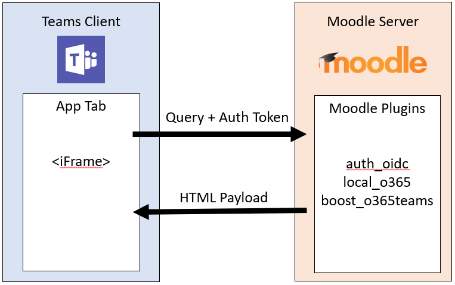

# Instalando a integração do Moodle com o Microsoft TeamsInstalling the Moodle integration with Microsoft Teams

> [!VIDEO https://www.youtube.com/embed/OHlPt22nKoE]

[Moodle](https://moodle.org/), o sistema de gerenciamento de aprendizagem de código aberto mais popular do mundo agora está integrado ao Microsoft Teams![Moodle](https://moodle.org/), the most popular and open-source Learning Management System (LMS) in the world, is now integrated with Microsoft Teams! Esta integração ajuda educadores e professores a colaborarem em cursos Moodle, fazerem perguntas sobre suas notas e suas tarefas e permanecerem atualizados com as notificações - dentro do Teams!This integration helps educators and teachers collaborate around Moodle courses, ask questions about their grades and assignments and stay updated with notifications -- right within Teams!

Para ajudar os administradores de TI a configurar facilmente essa integração, atualizamos nosso plug-in Moodle de código aberto com os seguintes recursos:To help IT admins easily set this integration up, we have updated our open-source Moodle Plugin with the following capabilities:

* Registro automático do seu servidor Moodle com o Microsoft Azure Active Directory.Auto-registration of your Moodle server with Azure AD.
* Implantação em um único clique do seu bot do assistente do Moodle para o Azure.One-click deployment of your Moodle Assistant bot to Azure.
* Provisionamento automático de equipes e sincronização automática de inscrições de equipe para cursos selecionados ou todos os cursos do Moodle.Auto-provisioning of teams and auto-synchronization of team enrollments for all or select Moodle courses.
* Instalação automática da guia Moodle e do bot do assistente do Moodle em cada equipe sincronizada.Auto-installation of the Moodle tab and the Moodle Assistant bot into each synchronized team. (Em breve)(Coming soon)
* Publicação em um clique do aplicativo Moodle em sua Microsoft Store do Teams particular.One-click publishing of the Moodle app into your private Teams App Store. (Em breve)(Coming soon)

Para saber mais sobre a funcionalidade que essa integração fornece, consulte [Installing the Moodle integration with Microsoft Teams](/microsoftteams/platform/resources/moodleinstructions).To learn more about the functionality this integration provides, see [Installing the Moodle integration with Microsoft Teams](/microsoftteams/platform/resources/moodleinstructions).

## Pré-requisitosPrerequisites

Para instalar e configurar esse aplicativo, você precisará do seguinte:In order to install and configure this application you'll need:

1. Credenciais de administrador do MoodleMoodle administrator credentials
2. Credenciais de Administrador do Microsoft Azure ADAzure AD administrator credentials
3. Uma assinatura do Microsoft Azure AD na qual você possa criar novos recursosAn Azure subscription you can create new resources in

## Etapa 1: Instalar o plug-in do MoodleStep 1: Install the Moodle Plugin

> [!VIDEO https://www.youtube.com/embed/SETEC5nzMgk]

A integração Moodle no Microsoft Teams é produzida pelo [pacote do plug-in do Moodle](https://github.com/Microsoft/o365-moodle) de código aberto.The Moodle integration in Microsoft Teams is powered by the open source [Moodle plugin set](https://github.com/Microsoft/o365-moodle). Para instalar o plug-in no seu servidor do Moodle:To install the plugin in your Moodle server:

1. Primeiro, baixe o [pacote do plug-in do Moodle](https://moodle.org/plugins/pluginversions.php?plugin=local_o365) e salve-o no seu computador local.First, download the [Moodle plugin set](https://moodle.org/plugins/pluginversions.php?plugin=local_o365) and save it to your local computer. Será necessário usar a versão 3.5 ou posterior.You'll need to use version 3.5 or newer.
    * Instalar o plug-in local_o365 também instalará os plug-ins [auth_oidc](https://moodle.org/plugins/auth_oidc) e [boost_o365Teams](https://moodle.org/plugins/pluginversions.php?plugin=theme_boost_o365teams).Installing the local_o365 plugin will also install the [auth_oidc](https://moodle.org/plugins/auth_oidc) and [boost_o365Teams](https://moodle.org/plugins/pluginversions.php?plugin=theme_boost_o365teams) plugins.
1. Entre no servidor Moodle como administrador e selecione **Administração de site** no painel de navegação esquerdo.Sign in to your Moodle server as an administrator, and select **Site administration** from the left navigation panel.
1. Selecione a guia **Plug-ins** e, em seguida, clique em **Instalar plug-ins**.Select the **Plugins** tab, and then click **Install plugins**.
1. Na seção **Instalar plug-in do arquivo ZIP**, clique no botão **Escolha um arquivo**.Under the **Install plugin from ZIP file** section click the **Choose a file** button.
1. Selecione o **Upload uma opção de** arquivo na navegação à esquerda, navegue até o arquivo que você baixou acima e clique Upload este **arquivo**.Select the **Upload a file** option from the left navigation, browse for the file you downloaded above and click **Upload this file**.
1. Selecione a opção **Administração do site** no painel de navegação à esquerda novamente, para retornar ao seu painel de administração.Select the **Site administration** option from the left navigation panel again to return to your admin dashboard. Role a tela para baixo até **Plug-ins locais** e clique no link **Integração do Microsoft Office 365**.Scroll down to the **Local plugins** and click the **Microsoft Office 365 Integration** link. Mantenha a página de configuração aberta em uma guia separada do navegador, pois ela será usada durante todo o restante deste processo.Keep this configuration page open in a separate browser tab as you'll be using it throughout the rest of this process.

Você pode encontrar mais informações sobre como instalar plug-ins do Moodle na [documentação do Moodle](https://docs.moodle.org/34/en/Installing_plugins).You can find more information on how to install Moodle plugins in the [Moodle documentation](https://docs.moodle.org/34/en/Installing_plugins).

**Observação importante:** manter a página de configuração do plug-in do Moodle no Microsoft 365 ou no Office 365 aberta em uma guia separada do navegador, porque você retornará a este conjunto de páginas durante todo o processo.**Important Note:** Keep your Microsoft 365 or Office 365 Moodle Plugin configuration page open in a separate browser tab as you will be returning to this set of pages throughout this process.

*Ainda não tem um site do Moodle?**Don't have a Moodle site already?* Talvez você queira conferir o nosso [repositório](https://github.com/azure/moodle) do Moodle no Azure, onde é possível implantar rapidamente uma instância do Moodle no Azure e personalizá-la de acordo com as suas necessidades.You might want to check out our Moodle on Azure [repo](https://github.com/azure/moodle) where you can quickly deploy a Moodle instance on Azure and customize it to your needs.

## Etapa 2: configurar a conexão entre o plug-in do Microsoft 365 ou do Office 365 e o Azure Active DirectoryStep 2: Configure the connection between the Microsoft 365 or Office 365 plugin and Azure Active Directory

> [!VIDEO https://www.youtube.com/embed/FpGEezaJ3SA]

Em seguida, você precisará registrar o Moodle como um aplicativo no Azure Active Directory.Next you'll need to register Moodle as an application in your Azure Active Directory. Fornecemos um script do Windows PowerShell para ajudar você a concluir esse processo.We've provided a PowerShell script to help you complete this process. O script do Windows PowerShell provisiona um novo aplicativo do Azure AD para a sua organização do Microsoft 365 ou do Office 365, que será usado pelo plug-in do Moodle.The PowerShell Script provisions a new Azure AD application for your Microsoft 365 or Office 365 organization, which will be used by the Moodle Plugin. O script provisionará o aplicativo para seu locatário do Microsoft 365 ou do Office 365, configurará todas as URLs de respostas e de permissões necessárias para o aplicativo provisionado e retornará a AppID e a chave.The script will provision the app for your Microsoft 365 or Office 365 tenant, set up all the required Reply URLs and Permissions for the provisioned app and return the AppID and Key. Você pode usar a AppID e a chave geradas na página de configuração do plug-in do Moodle para configurar seu servidor Moodle com o Microsoft Azure Active Directory.You can use the generated AppID and Key in your Moodle Plugin Setup Page to configure your Moodle server with Azure AD. Caso pretenda ver as etapas manuais detalhadas para a automação do script do Windows PowerShell, você pode encontrá-las na [documentação completa para o plug-in](https://docs.moodle.org/34/en/Office365#Register_your_Moodle_instance_as_an_Application).If you want to see the detailed manual steps that the PowerShell script is automating, you can find them in the full [documentation for the plugin](https://docs.moodle.org/34/en/Office365#Register_your_Moodle_instance_as_an_Application).

### Guia Moodle para o fluxo de informações do Microsoft TeamsMoodle tab for Microsoft Teams information flow

1. Na página do plug-in de integração do Microsoft 365 ou do Office 365, selecione a guia **Configuração**.From the Microsoft 365 or Office 365 Integration plugin page, select the **Setup** tab.
1. Clique no botão **Baixar script do Windows PowerShell** e salve-o no seu computador local.Click the **Download PowerShell Script** button and save it to your local computer.
1. Será necessário preparar o script do Windows PowerShell do arquivo ZIP.You'll need to prepare the PowerShell script from the ZIP file. Para fazer isso:To do so:
    * Baixar e extrair o arquivo `Moodle-AzureAD-Powershell.zip`.Download and extract the `Moodle-AzureAD-Powershell.zip` file.
    * Abrir a pasta extraída.Open the extracted folder.
    * Clique com o botão direito no arquivo `Moodle-AzureAD-Script.ps1` e selecione **Propriedades**.Right-click on the `Moodle-AzureAD-Script.ps1` file and select **Properties**.
    * Na guia **Geral** da janela Propriedades, marque a caixa `Unblock` ao lado do atributo **Segurança** na parte inferior.Under the **General** tab of the Properties window, check the `Unblock` box next to the **Security** attribute at the bottom.
    * Clique em **OK**.Click **OK**.
    * Copie o caminho do diretório da pasta extraída.Copy the directory path of the extracted folder.
1. Iniciar o Windows PowerShell como um administrador:Next you'll run PowerShell as an administrator:
    * Clique em Iniciar.Click Start.
    * Digite Windows PowerShell.Type PowerShell.
    * Clique com o botão direito em Windows PowerShell.Right-click Windows PowerShell.
    * Clique em “Executar como administrador”.Click "Run as Administrator".
1. Navegue até o diretório descompactado, digitando `cd ...\...\Moodle-AzureAD-Powershell` onde `...\...` é o caminho para o diretório.Navigate to the unzipped directory by typing `cd ...\...\Moodle-AzureAD-Powershell` where `...\...` is the path to the directory.
1. Execute o script do Windows PowerShell:Execute the PowerShell script by:
    * Enter `Set-ExecutionPolicy -ExecutionPolicy RemoteSigned -Scope CurrentUser`.Enter `Set-ExecutionPolicy -ExecutionPolicy RemoteSigned -Scope CurrentUser`.
    * Enter `.\Moodle-AzureAD-Script.ps1`.Enter `.\Moodle-AzureAD-Script.ps1`.
    * Entre na sua conta de administrador do Microsoft 365 ou do Office 365 na janela pop-up.Log in to your Microsoft 365 or Office 365 Administrator account in the pop-up window.
    * Insira o nome do aplicativo do Microsoft Azure Active Directory (Ex.Enter the name of the Azure AD Application (Ex. plug-in Moodle/Moodle).Moodle/Moodle plugin).
    * Insira a URL do seu servidor Moodle.Enter the URL of your Moodle server.
    * Copie a **ID do aplicativo** e a **Chave do aplicativo** gerados pelo script e salve-os.Copy the **Application ID** and **Application Key** generated by the script and save them.
1. Em seguida, você precisará adicionar a ID e a chave ao plug-in do Moodle.Next you'll need to add the Id and Key to the Moodle Plugin. Retornar à página de administração do plug-in (Administração de site > Plug-ins > Integração do Microsoft 365).Return to the plugin administration page (Site administration > Plugins > Microsoft 365 Integration).
1. Na guia **Configuração** adicione a **Identificação do aplicativo** e a **Chave do aplicativo** que você copiou anteriormente e, em seguida, clique em **Salvar alterações**.On the **Setup** tab add the **Application Id** and **Application Key** you copied previously, then click **Save changes**.
1. Depois que a página for atualizada, você verá uma nova seção **Escolher método de conexão**.Once the page refreshes you should now see a new section **Choose connection method**. Clique na caixa de seleção rotulada **Padrão** e clique em **Salvar alterações** novamente.Click the checkbox labeled **Default** and then click **Save changes** again.
1. Depois que a página for atualizada, você verá outra seção nova **Consentimento de administrador & informações adicionais**.Once the page refreshes you will see another new section **Admin consent & additional information**.
    * Clique no link **Fornecer consentimento de administrador**, digite suas credenciais de administrador global do Microsoft 365 ou do Office 365 e **Aceitar** para conceder as permissões.Click the **Provide Admin Consent** link, enter your Microsoft 365 or Office 365 Global Administrator credentials, then **Accept** to grant the permissions.
    * Ao lado do campo **Locatário do Microsoft Azure Active Directory** e clique no botão **Detectar**.Next to the **Azure AD Tenant** field click the **Detect** button.
    * Ao lado da **URL do OneDrive for Business**, clique no botão **Detectar**.Next to the **OneDrive for Business URL** click the **Detect** button.
    * Após preencher os campos, clique no botão **Salvar alterações** novamente.Once the fields populate, click the **Save changes** button again.
1. Clique no botão **Atualizar** para verificar a instalação e, em seguida, **Salvar alterações**.Click the **Update** button to verify the installation, then **Save changes**.
1. Em seguida, você precisará sincronizar os usuários entre o servidor do Moodle e o Azure Active Directory.Next you'll need to synchronize users between your Moodle server and Azure Active Directory. Dependendo do seu ambiente, você pode selecionar opções diferentes durante essa etapa.Depending on your environment, you may select different options during this stage. Observe que a configuração que você define aqui será executada com cada Moodle cron Run (normalmente, uma vez por dia) para manter tudo em sincronia. Para começar:Note that the configuration you set here will run with each Moodle cron run (typically once a day) to keep everything in sync. To get started:
    * Alternar para a **guia Configurações de sincronização**Switch to the **Sync Settings tab**
    * Na seção **Sincronizar usuários com o Microsoft Azure Active Directory**, marque as caixas de seleção que se aplicam ao seu ambiente.In the **Sync users with Azure AD** section, select the checkboxes that apply to your environment. Geralmente, você selecionaria pelo menos:Typically you would select at least:
        * Criar contas no Moodle para usuários no Microsoft Azure Active DirectoryCreate accounts in Moodle for users in Azure AD
        * Atualizar todas as contas no Moodle para usuários no Microsoft Azure Active DirectoryUpdate all accounts in Moodle for users in Azure AD
    * Na seção **Restrição de Criação de** Usuário, você pode configurar um filtro para limitar os usuários do Azure AD que serão sincronizados com o Moodle.In the **User Creation Restriction** section you can set up a filter to limit the Azure AD users that will be synced to Moodle.
    * A seção **Mapeamento de campos de usuário** permitirá que você personalize o mapeamento do campo de perfil de usuário do Microsoft Azure Active Directory para o Moodle.The **User Field Mapping** section will allow you to customize the Azure AD to Moodle User Profile field mapping.
    * Na seção **Sincronização do Teams** você pode optar por criar Grupos (ou seja, Equipes) automaticamente para alguns ou todos os cursos existentes do Moodle.In the **Teams Sync** section you can choose to automatically create Groups (i.e. Teams) for some, or all, of your existing Moodle courses.
1. Para validar os trabalhos cron (e executá-los manualmente se desejar para a primeira execução), clique no link **página de Gerenciamento de tarefas agendadas** na seção **Sincronizar usuários com o Microsoft Azure Active Directory**.To validate the cron jobs (and run them manually if you wish to for the first run) click the **Scheduled tasks management page** link in the **Sync users with Azure AD** section. Isso levará você para a página de **Tarefas agendadas**.This will take you to the **Scheduled Tasks** page.
    * Role a tela para baixo e encontre o trabalho **Sincronizar usuários com o Microsoft Azure Active Directory** e clique em **Executar agora**.Scroll down and find the job **Sync users with Azure AD** job and click **Run now**.
    * Se você optar por criar Grupos com base em cursos existentes, também poderá executar o trabalho **Criar grupos de usuários no Office 365**.If you chose to create Groups based on existing courses, you can also run the **Create user groups in Office 365** job.
1. Retorne à página de administração do plug-in (Administração de site > Plug-ins > Integração do Microsoft 365) e selecione a página **Configurações do Teams**.Return to the plugin administration page (Site administration > Plugins > Microsoft 365 Integration) and select the **Teams Settings** page. Será necessário definir algumas configurações de segurança para habilitar a integração de aplicativos do Teams.You'll need to configure some security settings to enable the Teams app integration.
    * Para habilitar o OpenID Connect, clique no link **Gerenciar a autenticação** e clique no ícone de olho na linha **OpenId Connect** se estiver acinzentado.To enable OpenID Connect, click the **Manage Authentication** link, and click the eye icon on the **OpenId Connect** line if it is greyed out.
    * Em seguida, você precisará habilitar a incorporação de quadro.Next you'll need to enable frame embedding. Clique no link **Segurança HTTP** e, em seguida, clique na caixa de seleção ao lado de **Permitir incorporação de quadro**.Click the **HTTP Security** link, then click the checkbox next to **Allow frame embedding**.
    * A próxima etapa é habilitar os serviços da Web, que habilitarão os recursos da API do Moodle.The next step is to enable web services which will enable the Moodle API features. Clique no link **Recursos avançados** e, em seguida, verifique se a caixa de seleção ao lado de **Habilitar serviços Web** está marcada.Click the **Advanced Features** link, then make sure the checkbox next to **Enable web services** is checked.
    * Por fim, você precisará habilitar os serviços externos para Microsoft 365 ou Office 365.Finally you'll need to enable the external services for Microsoft 365 or Office 365. Clique no link **Serviços externos** e, então:Click the **External services** link then:
        * Clique em **Editar** na linha **Moodle Office 365 Webservices**.Click **Edit** on the **Moodle Office 365 Webservices** row.
        * Marque a caixa de seleção ao lado de **Habilitada**, em seguida, clique em **Salvar alterações**Mark the checkbox next to **Enabled**, then click **Save Changes**
    * Em seguida, você precisará editar suas permissões de usuário autenticado para permitir que eles criem tokens de serviço Web.Next you'll need to edit your authenticated user permissions to allow them to create web service tokens. Clique no link **Editando a função 'Usuário autenticado'**.Click the **Editing role 'Authenticated user'** link. Role para baixo e localize a funcionalidade **Criar um token de serviço Web** e marque a caixa de seleção **Permitir**.Scroll down and find the **Create a web service token** capability and mark the **Allow** checkbox.

## Etapa 3: implantar o bot assistente do Moodle para o AzureStep 3: Deploy the Moodle Assistant Bot to Azure

> [!VIDEO https://www.youtube.com/embed/gbkJxf8FlfY]

O bot gratuito assistente do Moodle para Microsoft Teams ajuda professores e alunos a responder a perguntas sobre cursos, tarefas, notas e outras informações no Moodle.The free Moodle Assistant Bot for Microsoft Teams helps teachers and students answer questions about their courses, assignments, grades and other information in Moodle. O bot também envia notificações do Moodle aos alunos e professores dentro do Teams.The bot also sends Moodle notifications to students and teachers right within Teams. Esse bot é um projeto de código aberto mantido pela Microsoft e [está disponível no GitHub](https://github.com/microsoft/Moodle-Teams-Bot).This bot is an open source project maintained by Microsoft, and is [available on GitHub](https://github.com/microsoft/Moodle-Teams-Bot).

> [!NOTE]
> Nesta seção, você implantará os recursos da sua assinatura do Azure, e todos os recursos serão configurados usando o nível **gratuito**.In this section you will deploy resources to your Azure subscription, and all resources will be configured using the **free** tier. Dependendo do uso de seu bot, talvez seja necessário escalar esses recursos.Depending on the usage of your bot, you may need to scale these resources.
> Se você quiser apenas usar a guia Moodle sem o bot, vá para [etapa 4](#step-4-deploy-your-microsoft-teams-app).If you want to just use the Moodle tab without the bot, skip to [step 4](#step-4-deploy-your-microsoft-teams-app).

### Fluxo de informações do bot do MoodleMoodle bot information flow

Para instalar o bot, primeiro será necessário registrá-lo na [Plataforma de Identidade da Microsoft](https://identity.microsoft.com/Landing).To install the bot, you'll first need to register it on the [Microsoft Identity Platform](https://identity.microsoft.com/Landing). Isso permite que o bot autentique seus pontos de extremidade da Microsoft.This allows your Bot to authenticate against your Microsoft endpoints. Para registrar seu bot:To register your bot:

1. Retorne à página de administração do plug-in (Administração do site > Plug-ins > Integração do Microsoft 365) e selecione a guia **Configurações do Teams**.Return to the plugin administration page (Site administration > Plugins > Microsoft 365 Integration) and select the **Teams Settings** tab.
1. Clique no link **Portal de Registro de Aplicativos Microsoft** e efetue logon com sua ID da Microsoft.Click the **Microsoft Application Registration Portal** link and login with your Microsoft Id.
1. Insira um nome para seu aplicativo (Por exemplo.Enter a name for your app (Eg. MoodleBot) e clique no botão **Criar**.MoodleBot) and click the **Create** button.
1. Copie a **ID do aplicativo** e cole-a no campo **Identificação do aplicativo bot** na página **Configurações da equipe**.Copy the **Application Id** and paste it into the **Bot Application ID** field on the **Team Settings** page.
1. Clique no botão **Gerar nova senha**.Click the **Generate New Password** button. Copie a senha gerada e a colar no campo Senha do Aplicativo **bot** na **página Configurações** Equipe.Copy the generated password and paste it into the **Bot Application Password** field on the **Team Settings** page.
1. Role até a parte inferior do formulário e clique em **Salvar alterações**.Scroll to the bottom of the form and click **Save Changes**.

Agora que você gerou a ID do aplicativo e a senha, chegou a hora de implantar o bot no Azure.Now that you've generated your Application Id and Password, it's time to deploy your bot to Azure. Clique no botão **Implantar no Azure** e preencha o formulário com as informações necessárias (a ID do aplicativo bot, a senha do aplicativo bot e o segredo Moodle estão na página **Configurações da equipe** e as informações do Azure estão na página **Configuração**).Click on the **Deploy to Azure** button and fill out the form with the necessary information (the Bot Application Id, Bot Application Password and the Moodle Secret are on the **Team Settings** page, and the Azure information is on the **Setup** page). Depois de preencher o formulário, marque a caixa de seleção para concordar com os termos e condições e, em seguida, clique no botão **Compra** (todos os recursos do Azure são implantados no nível gratuito).Once you've got the form filled out, click the check box to agree to the terms and conditions then click the **Purchase** button (all Azure resources are deployed to the free tier).

Depois que os recursos terminarem de implantar no Azure, você precisará configurar o plug-in Moodle com seu ponto de extremidade de mensagens.Once the resources are finished deploying to Azure, you'll need to configure the Moodle plugin with its messaging endpoint. Primeiro, você precisará obter o ponto de extremidade do seu bot no Azure.First, you'll need to get the endpoint from your Bot in Azure. Para fazer isso:To do that:

1. Se você ainda não tiver feito isso, entre no [portal do Azure](https://portal.azure.com).If you aren't already, log into the [Azure portal](https://portal.azure.com).
2. No painel esquerdo, selecione **Grupos de recursos**.In the left pane select **Resource groups**.
3. Na lista, selecione o grupo de recursos que você acabou de usar (ou criar) durante a implantação do bot.From the list select the resource group you just used (or created) while deploying your Bot.
4. Selecione o recurso **bot do WebApp** na lista de recursos do grupo.Select the **WebApp Bot** resource from the list of resources in the group.
5. Copie o **Ponto de extremidade de envio de mensagens** da seção **Visão geral**.Copy the **Messaging Endpoint** from the **Overview** section.
6. No Moodle, abra a página **Configurações da equipe** do seu plug-in do Moodle.In Moodle, open the **Team Settings** page of your Moodle Plugin.
7. No campo **Ponto de extremidade do bot**, cole a URL que você acabou de copiar e altere a palavra *mensagens* para *webhook*.In the **Bot Endpoint** field paste the URL you just copied and change the word *messages* to *webhook*. A URL agora deve ter a seguinte aparência `https://botname.azurewebsites.net/api/webhook`The URL should now look like `https://botname.azurewebsites.net/api/webhook`
8. Clique em **Salvar alterações**Click **Save Changes**
9. Depois de salvar as alterações, volte para a guia **Configurações da equipe**, clique no botão **Baixar arquivo de manifesto** e salve o pacote de manifesto no computador (você o usará na próxima seção).Once your changes have saved, go back to the **Team Settings** tab, click the **Download manifest file** button and save the manifest package to your computer (you'll use it in the next section).

## Etapa 4: implantar seu aplicativo Microsoft TeamsStep 4: Deploy your Microsoft Teams app

> [!VIDEO https://www.youtube.com/embed/2rMb7gtM_ZM]

Agora que você já instalou o seu bot no Azure e configurou para se comunicar com o servidor Moodle, chegou a hora de implantar o aplicativo Microsoft Teams.Now that you have your Bot deployed to Azure and configured to talk to your Moodle server, it's time to deploy your Microsoft Teams app. Para fazer isso, você carregará o arquivo de manifesto baixado da página Configurações da equipe do plug-in do Moodle na etapa anterior.To do this you'll load the manifest file you downloaded from the Moodle Plugin Team Settings page in the previous step.

Antes de poder instalar o aplicativo, você precisará verificar se os aplicativos externos e o sideload de aplicativos estão habilitados.Before you can install the app you'll need to make sure external apps and sideloading of apps is enabled. Para isso, siga [estas etapas](./admin-settings.md).To do so you can follow [these steps](./admin-settings.md). Depois que você tiver certeza de que os aplicativos externos estão habilitados, siga as etapas abaixo para implantar o aplicativo.Once you've ensured that external apps are enabled, you can follow the steps below to deploy your app.

1. Abra o Microsoft Teams.Open Microsoft Teams.
2. Clique no **ícone da** Loja no canto inferior esquerdo da barra de navegação.Click the **Store** icon on the lower left of the navigation bar.
3. Clique no link **Carregar um aplicativo personalizado** na lista de opções.Click the **Upload a custom app** link from the list of options. *Observação:* se você estiver conectado como um administrador global, terá a opção de carregar o aplicativo para a loja de aplicativos da sua organização. Caso contrário, você só poderá carregar o aplicativo para as equipes das quais você faz parte ("sideload").*Note:* If you're logged in as a global administer you'll have the option of uploading the app to your organization's app store, otherwise you'll only be able to load the app for Teams you're a part of ("sideloading").
4. Selecione o `manifest.zip` pacote baixado anteriormente e clique em **Salvar**.Select the `manifest.zip` package you downloaded previously and click **Save**. Caso ainda não tenha baixado o pacote de manifesto, você pode fazer isso na guia **Configurações da equipe** da página de configuração do plug-in do Moodle.If you haven't yet downloaded the manifest package, you can do so from the **Team Settings** tab of the plugin configuration page in Moodle.

Agora que você instalou o aplicativo, você pode adicionar a guia a qualquer canal ao qual tenha acesso.Now that you have the app installed you can add the tab to any channel that you have access to. Para fazer isso, navegue até o canal, clique no símbolo **+** e selecione seu aplicativo na lista.To do so navigate to the channel, click the **+** symbol and select your app from the list. Siga as instruções para concluir a adição da guia do curso Moodle a um canal.Follow the prompts to finish adding your Moodle course tab to a channel.

Isso é tudo!That's it! Você e sua equipe agora podem começar a trabalhar com seus cursos Moodle diretamente do Microsoft Teams.You and your team, can now start working with your Moodle courses directly from Microsoft Teams.

Para compartilhar uma solicitação de recurso ou comentários conosco, acesse nossa [página de Voz do usuário](https://microsoftteams.uservoice.com/forums/916759-moodle).To share any feature requests or feedback with us, please visit our [User Voice page](https://microsoftteams.uservoice.com/forums/916759-moodle).

[!INCLUDE [uservoice-disclaimer-note](includes/uservoice-disclaimer-note.md)]