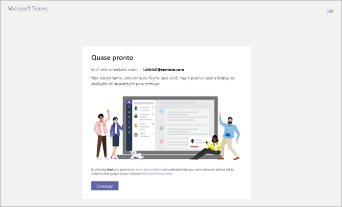
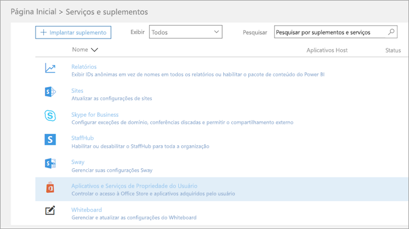
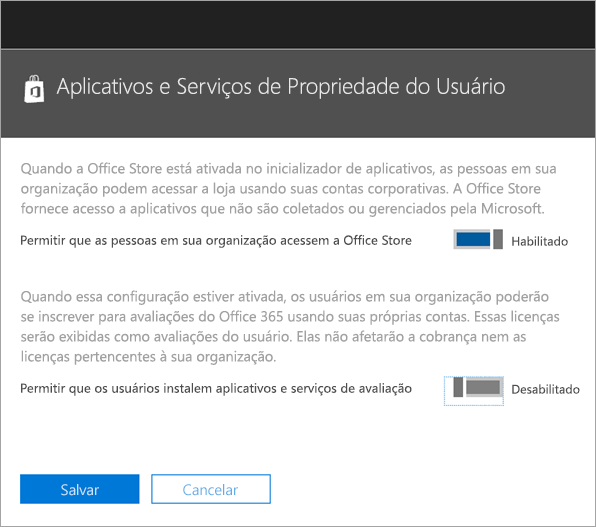

Gerenciar a oferta de avaliação na nuvem comercial do Microsoft Teams
=======================================================

O Microsoft Teams é uma ótima ferramenta de colaboração para sua organização. Ele permite que colaboradores e equipes discutam, inovem e compartilhem ideias usando o poder do Office 365. A avaliação do Microsoft Teams Commercial Cloud oferece 1 ano de avaliação do produto para usuários que já possuem o Office 365 em sua organização e não possuem licenças do Microsoft Teams.. Os administradores podem mudar ou desativar esse recurso para os usuários de sua organização. 

> [!IMPORTANT]
> A avaliação da Nuvem Comercial do Microsoft Teams foi atualizada para incluir planos de serviço adicionais para aumentar a funcionalidade do Teams e agora é de propriedade e controle do administrador de cobrança da sua organização. Isso torna o teste mais fácil de gerenciar e consistente com todas as outras ofertas do Microsoft 365. 

## O que está incluso na oferta?

Os planos de serviço dessa oferta estão:

- Exchange Foundation
- Flow para Office 365 Plano 1
- Formulários
- Microsoft Planner
- Microsoft Teams (Teams1, equipes IW)
- Office 
- PowerApps para Office 365 Plano 1
- SharePoint Online Kiosk
- Fluxo
- Sway
- Quadro de comunicações
- Yammer Enterprise 

A versão de avaliação concede uma assinatura de avaliação de um ano para toda a sua organização. Para cada licença, a versão de avaliação aloca 2 GB de armazenamento do SharePoint Online. 

## Quem se qualifica?

Habilite os usuários para se inscreverem em aplicativos e versões de avaliação (no Centro de administração do Office 365). Para obter mais informações, consulte [Gerenciar a avaliação](#manage-the-trial), mais adiante neste artigo. 

Os usuários que não têm uma licença do Office 365 que inclui o Teams podem iniciar a oferta de avaliação do Microsoft Teams Commercial Cloud. Por exemplo, se um usuário tiver o Office 365 Business (que não inclui o Teams), eles estará qualificado para a versão de avaliação.

## Quem não está qualificado

Sua organização não está qualificada para a avaliação se você for um cliente do parceiro de distribuição ou se for um cliente do GCC, do GCC High, do DoD ou do EDU.

Se sua organização não estiver qualificada para a oferta da avaliação do Microsoft Teams Commercial Cloud, você não verá a mudança **Permitir que os usuários instalem aplicativos e serviços de avaliação**.

## Como os usuários podem se inscrever para a versão de avaliação

Os usuários qualificados podem inscrever-se para a oferta de avaliação fazendo login no Teams ([teams.microsoft.com](https://teams.microsoft.com)). Eles verão a seguinte tela para iniciar a avaliação. 

Todas as avaliações em sua organização compartilham as mesmas datas de início e fim, que é a data em que o primeiro usuário se inscreveu na versão de avaliação. Por exemplo, se um usuário começa a primeira versão de avaliação em 25 de janeiro de 2019 e usuário B iniciar uma avaliação em 3 de junho de 2019, a avaliação de ambos expirará em 25 de janeiro de 2020.

## Gerenciar a versão de avaliação

A Versão de Avaliação do Teams deve ser iniciada por usuários finais individuais, e você não pode iniciar a oferta de Avaliação do Teams em nome de funcionários finais.

Os administradores podem desativar a capacidade de os usuários finais reivindicarem aplicativos e serviços de avaliação em sua organização. Atualmente, a avaliação descrita neste artigo é a única avaliação nessa categoria, mas pode se aplicar a outros programas semelhante no futuro. 

### Impeça que os usuários instalem serviços e aplicativos de avaliação

Você pode desativar a capacidade de um usuário de instalar serviços e aplicativos de avaliação.

1. No [Centro de administração do Microsoft 365](https://portal.office.com/adminportal/home), vá até **Configurações** > **Serviços e suplementos** > ** Aplicativos e serviços de propriedade do usuário**.

    

2. Desative **Permitir que os usuários instalem aplicativos e serviços de avaliação**.

    

### Gerencie a disponibilidade de avaliação de um usuário com uma licença que inclua o Teams

Um usuário que possui uma licença que inclui o Teams não está qualificado para a versão de avaliação. Quando o plano de serviço do Teams está habilitado, o usuário pode entrar e usar o Teams. Se o plano de serviços estiver desativado, o usuário não poderá entrar e não será apresentado à opção de avaliação.

Para desativar o acesso ao Teams:

1. No Centro de administração do Microsoft 365, selecione **Usuários** > **Usuários ativos**.

2. Marque a caixa ao lado do nome do usuário.

3. À direita, na linha **Licenças de produto**, escolha **Editar**.

4. No painel **Licenças de produto**, troque o botão para **Desativar**.

    

### Gerencie a disponibilidade do Teams para usuários que já haviam solicitado a versão de avaliação

Se um usuário solicitou uma licença de avaliação do Teams, você pode removê-lo ao remover o plano de serviço ou a licença.

Para desativar a licença de avaliação:

1. No Centro de administração do Microsoft 365, selecione **Usuários** > **Usuários ativos**.

2. Marque a caixa ao lado do nome do usuário.

3. À direita, na linha **Licenças de produto**, escolha **Editar**.

4. No painel **Licenças de produto**, troque o botão para **Desativar**.

    
    
>[!Note]
>A opção de alternância da Avaliação do Microsoft Teams será exibida depois que o primeiro usuário da organização se inscrever para a avaliação.

### Gerenciamento do Teams para usuários que possuem a licença de avaliação

Você pode gerenciar os usuários que têm uma licença de avaliação da mesma forma que gerencia os usuários que têm uma licença paga normal. Para saber mais, confira [Gerenciar configurações do Microsoft Teams para sua organização](enable-features-office-365.md).

### Atualize os usuários da licença de avaliação

Para atualizar os usuários da licença de avaliação, faça o seguinte:

1. Compre uma assinatura que inclua o Teams.

2. Remova a assinatura de avaliação do Teams do usuário.

3. Atribua as licenças adquiridas recentemente.

Para saber mais, confira [Licenças do Office 365 do Microsoft Teams](Office-365-licensing.md).

> [!NOTE]
> Se a avaliação terminar e um usuário não for atualizado imediatamente para uma assinatura que inclua o Teams, os dados do usuário não serão removidos. O usuário ainda existe no Azure Active Directory e todos os dados no Teams ainda permanecem. Depois que uma nova licença for atribuída ao usuário para ativar a funcionalidade do Teams novamente, todo o conteúdo ainda existirá. 

### Remover uma licença de avaliação herdada do Microsoft Teams

A partir de 22 de abril de 2019, os usuários podem começar a solicitar a licença de avaliação do Microsoft Teams Commercial Cloud mais recente. Caso pretenda migrar os usuários em sua organização da licença de avaliação herdada e para o mais recente, primeiro será necessário remover a licença de avaliação herdada do Microsoft Teams de cada usuário. Após a remoção da licença herdada, todos os usuários afetados poderão solicitar a licença de avaliação do Microsoft Teams Commercial Cloud.

- Se você quiser remover essa licença por meio do PowerShell, confira [: remover licenças de contas de usuário com o Office 365 PowerShell](https://docs.microsoft.com/office365/enterprise/powershell/remove-licenses-from-user-accounts-with-office-365-powershell)

- Se você quiser remover essa licença por meio do portal de administração, confira: [remover licenças de usuários no Office 365 para empresas](https://docs.microsoft.com/office365/admin/subscriptions-and-billing/remove-licenses-from-users?view=o365-worldwide)
