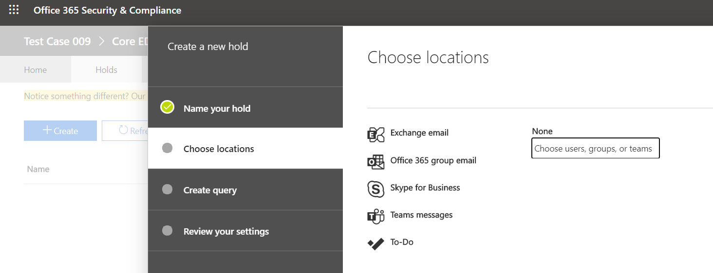

Colocar um usuário ou uma equipe do Microsoft Teams em retenção legal
==================================================

Quando há uma expectativa razoável de litígio, as organizações precisam preservar as ESI (informações armazenadas eletronicamente), incluindo mensagens de chat de equipes que são relevantes para o caso. As organizações podem precisar preservar todas as mensagens relacionadas a um tópico específico ou a determinadas pessoas. Este artigo abordará o controle legal no Microsoft Teams (para abordar a implementação de controle em todo o espaço M365, consulte [gerenciar casos de descoberta eletrônica: colocar locais de conteúdo em espera](https://docs.microsoft.com/microsoft-365/compliance/ediscovery-cases#step-4-place-content-locations-on-hold).).

> [!NOTE]
> Em fevereiro de 2020, ativamos o controle legal ou retenção de maiúsculas e minúsculas (os chats de canal privado são armazenados nas caixas de correio do usuário, os chats de canal normais são armazenados nas caixas de correio do grupo da equipe). Se já houver um bloqueio legal para uma caixa de correio de usuário, a política de retenção será aplicada automaticamente às mensagens de canal privado armazenadas nessa caixa de correio. Não há nenhuma ação adicional necessária para que um administrador ative isso. Também há suporte para o controle legal de arquivos compartilhados em canais privados.

No Microsoft Teams, uma equipe inteira ou selecione os usuários podem ser colocados em espera ou em retenção legal. Fazer isso garantirá que todas as mensagens que foram trocadas nessas equipes (incluindo canais particulares) ou mensagens trocadas por esses indivíduos sejam detectáveis pelos gerentes de conformidade da organização ou pelos administradores de equipe.

> [!NOTE]
> A colocação de um usuário em retenção não coloca automaticamente um grupo em retenção ou vice-versa.

Para colocar um usuário ou uma equipe em retenção legal:

1. Navegue até o [centro de conformidade do & de segurança](https://go.microsoft.com/fwlink/?linkid=854628). Quando você cria um caso novo, você se depara com a opção de colocar caixas de correio ou sites em retenção.
1. Acesse descoberta eletrônica ou descoberta eletrônica avançada e crie um caso clicando em "+ criar um caso". Quando o caso for criado, abra-o.

1. Vá para a seção "isenções" do menu superior e clique em "+ criar" para criar um usuário ou uma equipe em espera salva todas as mensagens trocadas por esses usuários ou mensagens quando você cria um novo caso, é apresentada a opção para colocar caixas de correio ou sites em espera.

    1. **Nomeie a espera**. Selecione um nome descritivo e exclusivo para a isenção que você vai criar.

    1. **Escolha local**. Escolha se você deseja que a retenção seja aplicada em um usuário ou em uma equipe inteira (não é possível aplicar a retenção em canais individuais por enquanto). Observação: se um usuário estiver em espera, todas as suas mensagens ficarão em espera, incluindo o que enviarem em um chat do 1:1, 1: muitos ou chat em grupo ou uma conversa de canal (incluindo canais privados).
    
    1. **Criar consulta**. Você pode personalizar a isenção se quiser mais granularidade na política de retenção. Por exemplo, você pode especificar palavras-chave a serem procuradas, ou pode adicionar mais condições, que precisariam ser satisfeitas para que a isenção entre em vigor.
    1. **Revise suas configurações** antes de publicá-las em sua organização.

Depois que o controle legal tiver sido definido, você poderá descobrir todo o conteúdo mantido por qualquer política de retenção após o artigo da [descoberta eletrônica do teams](eDiscovery-investigation.md) .

> [!IMPORTANT]
> Quando um usuário ou grupo é colocado em espera, todas as cópias da mensagem serão mantidas. Por exemplo, se um usuário tiver postado uma mensagem em um canal e, em seguida, modificasse a mensagem, em um cenário de espera, ambas as cópias da mensagem serão mantidas. Sem o controle legal in-loco, apenas a mensagem mais recente é mantida.

Como um guia útil, você pode usar a tabela a seguir para entender o que precisa ser colocado em retenção legal com base em requisitos de dados:

|Cenário  |O que colocar em retenção  |
|---------|---------|
|**Conteúdo de chat do Microsoft Teams por um usuário (em 1:1 chats, 1: muitos ou chats em grupo, conversas de canal privado etc.)**     |Caixa de correio do usuário         |
|**Chats de canal do Microsoft Teams (excluindo canais privados)**    |Caixa de correio do grupo usada para a equipe         |
|**Conteúdo do Microsoft Teams (por exemplo, wiki, arquivos)**     |Site SharePoint usado pela equipe         |
|**Arquivos de canal privado do Microsoft Teams**     |Site do SharePoint de canal privado dedicado     |
|**Conteúdo particular do usuário**     |Site OneDrive for Business do usuário         |

> [!NOTE]
> Para manter a comunicação em canais privados, você precisa colocar as caixas de correio do usuário (usuários do canal privado) em espera e usar a ferramenta de descoberta eletrônica para pesquisar, Pesquisar na caixa de correio do usuário. Como foi declarado anteriormente, os chats do canal privado são armazenados nas caixas de correio do usuário, não na caixa de correio de grupo de uma equipe.

Se quiser ler mais sobre este tópico para áreas não relacionadas ao Teams no M365, você deve revisar [gerenciar casos de descoberta eletrônica: colocar locais de conteúdo em espera](https://docs.microsoft.com/microsoft-365/compliance/ediscovery-cases#step-4-place-content-locations-on-hold).
