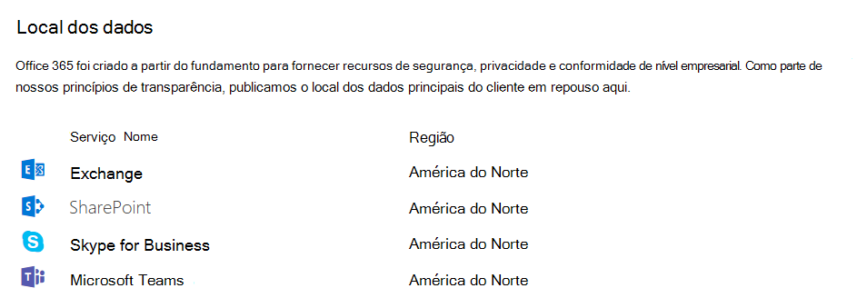

# Localização de dados no Microsoft Teams

No Teams, os dados são armazenados na região geográfica associada à sua organização do Microsoft 365 ou do Office 365. Atualmente, o Teams tem suporte nas regiões da Austrália, Canadá, França, Alemanha, Índia, Japão, África do Sul, Coréia do Sul, Suíça (que inclui Liechtenstein), Emirados Árabes Unidos, Reino Unido, Américas, APAC e EMEA. 

> [!IMPORTANT]
> Atualmente, o Teams oferece residência de dados na Austrália, Canadá, França, Alemanha, Índia, Japão, Emirados Árabes Unidos, Reino Unido, Coreia do Sul, África do Sul e Suíça (que inclui Liechtenstein) apenas para novos locatários.
> Um novo locatário é definido como qualquer locatário que não teve um único usuário do locatário que acessou o Teams. Os locatários existentes na Austrália, Índia, Japão e Coreia do Sul continuarão a ter seus dados do Teams armazenados na região APAC. Os locatários existentes no Canadá continuarão a ter os dados armazenados nas Américas. Os locatários existentes na França, Alemanha, Liechtenstein, Emirados Árabes Unidos, Reino Unido, África do Sul e Suíça terão seus dados armazenados na região EMEA.

## Onde os dados do Teams são armazenados

Para ver qual região hospeda os dados do seu locatário, vá para o [Centro de administração do Microsoft 365](https://portal.office.com/adminportal/home) > **Configurações** > **Perfil da organização**. Role para baixo até **Localização de dados**.

## Localização dos dados inativos do Teams

Os dados do Teams são armazenados de forma diferente, dependendo do tipo de conteúdo. 

Confira a [sessão de discussão do Ignite sobre a arquitetura do Microsoft Teams](https://channel9.msdn.com/Events/Ignite/Microsoft-Ignite-Orlando-2017/BRK3071) para uma discussão aprofundada.

### Principais dados do cliente do Teams

Se o locatário for provisionado na Austrália, Canadá, União Europeia, França, Alemanha, Índia, Japão, África do Sul, Coreia do Sul, Suíça (que inclui Liechtenstein), Emirados Árabes Unidos, Reino Unido ou Estados Unidos, a Microsoft armazena os seguintes dados inativos do cliente apenas nessa localização:

- Chats, conversas de equipe e canal, imagens, mensagens de correio de voz e contatos do Teams
- Conteúdo de site do SharePoint Online e os arquivos armazenados nesse site
- Arquivos carregados no OneDrive for Business

#### Chat, mensagens de canal, estrutura da equipe

Cada equipe no Teams tem o suporte de um Grupo do Microsoft 365 e seu site do SharePoint e caixa de correio do Exchange. Chats privados (incluindo chats em grupo), mensagens enviadas como parte de uma conversa em um canal e a estrutura de canais e equipes são armazenados em um serviço de chat em execução no Azure. Os dados também são armazenados em uma pasta oculta nas caixas de correio do usuário e do grupo para habilitar os recursos de Proteção de Informações.

#### Caixa postal e contatos

As caixas postais são armazenadas no Exchange. Os contatos são armazenados no repositório de dados em nuvem baseado no Exchange. O Exchange e o repositório em nuvem baseado no Exchange já fornecem residência de dados em cada um dos centros de dados geográficos em todo o mundo. Para todas as equipes da Austrália, Canadá, França, Alemanha, Índia, Japão, Emirados Árabes Unidos, Reino Unido, África do Sul, Coreia do Sul, Suíça (inclui Liechtenstein) e Estados Unidos a caixa postal e os contatos são armazenados no próprio país/região. Para todos os outros países/regiões, os arquivos são armazenados nos EUA, Europa ou no Pacífico Asiático com base na afinidade do locatário.

#### Imagens e mídia

A mídia usada em chats (exceto para GIFs do Giphy que não são armazenados, mas são um link de referência para a URL do serviço Giphy original, Giphy não é um serviço da Microsoft) é armazenada em um serviço de mídia baseado no Azure que é implantado nas mesmas localizações como o serviço de chat.

#### Arquivos

Os arquivos (incluindo o OneNote e Wiki) que alguém compartilha em um canal são armazenados no site do SharePoint da equipe. Os arquivos compartilhados em um chat privado ou durante uma reunião ou chamada são carregados e armazenados no OneDrive da Conta comercial do usuário que compartilha o arquivo. O Exchange, SharePoint e OneDrive já fornecem residência de dados em cada um dos centros de dados geográficos em todo o mundo. Portanto, para os clientes existentes, todos os arquivos, blocos de anotações do OneNote, conteúdo wiki do Teams e caixas de correio que fazem parte da experiência do Teams já são armazenados na localização com base na afinidade do locatário. Os arquivos da Austrália, Canadá, França, Alemanha, Índia, Japão, Emirados Árabes Unidos, Reino Unido, África do Sul, Coreia do Sul e Suíça (que inclui Liechtenstein) são armazenados no próprio país/região. Para todos os outros países/regiões, os arquivos são armazenados nos EUA, Europa ou no Pacífico Asiático com base na afinidade do locatário.

### Locais do datacenter

Os serviços do Teams descritos nesta seção armazenam dados inativos nos seguintes locais:

|País ou região  |Local do datacenter |
|---------|---------|
|Austrália   |Nova Gales do Sul e Vitória         |
|Canadá    |Cidade de Quebec, Toronto         |
|França    |Marseille e Paris         |
|Alemanha    |Berlim e Frankfurt      |
|Índia   |Chennai e Pune        |
|Japão    |Tokyo (Saitama) e Osaka         |
|Liechtenstein   |Genebra e Zurique       |
|África do Sul     |Cidade do Cabo e Joanesburgo         |
|Coreia do Sul     |Seul e Busan         |
|Suíça    |Genebra e Zurique       |
|Emirados Árabes Unidos     |Abu Dhabi e Dubai         |
|Reino Unido     | Cardiff e Londres        |
|Américas – Norte e Sul (AMER) |Bay, CA e Boydton, VA       |
|Pacífico Asiático (APAC)  |Cingapura e Hong Kong        |
|Europa, Oriente Médio e Ásia (EMEA)   |Dublin e Amsterdã        |

> [!NOTE]
> Para Liechtenstein, os dados são armazenados em repouso nos data centers da Suíça em Genebra e Zurique.

### Dados armazenados com um provedor de armazenamento de terceiros

As organizações que permitem que os usuários armazenem arquivos com um provedor de armazenamento de terceiros dependem da localização de armazenamento desses serviços e devem, portanto, revisar a localização dos dados inativos para esses serviços separadamente.

- **Guias**: As guias permitem que os usuários fixem informações de aplicativos e serviços em um canal. No entanto, isso varia de acordo com o tipo de guia onde os dados são armazenados. A própria guia não armazena dados. Por exemplo, uma guia do SharePoint armazenará dados com base em onde o conjunto de sites do SharePoint foi provisionado. Uma guia que inclui informações de um parceiro armazenará os dados diretamente no sistema usado pelo parceiro e apresentará apenas uma exibição deles.
- **Outros aplicativos de parceiros**: A Microsoft não fornece nenhum suporte de residência de dados para aplicativos e serviços de parceiros que você possa estar usando na experiência do Teams. Examine as informações dessas soluções diretamente para saber onde seus dados estão sendo armazenados.

## Confira também

- [O Microsoft Teams lança Residência de Dados nos Emirados Árabes Unidos](https://techcommunity.microsoft.com/t5/Microsoft-Teams-Blog/Microsoft-Teams-launches-United-Arab-Emirates-Data-Residency/ba-p/980330)

- [O Microsoft Teams lança Residência de Dados na Coreia do Sul](https://techcommunity.microsoft.com/t5/Microsoft-Teams-Blog/Microsoft-Teams-launches-South-Korea-Data-Residency/ba-p/789171)

- [O Microsoft Teams lança Residência de Dados na África do Sul](https://techcommunity.microsoft.com/t5/Microsoft-Teams-Blog/Microsoft-Teams-launches-South-Africa-Data-Residency/ba-p/776611)

- [O Microsoft Teams lança Residência de Dados na França](https://techcommunity.microsoft.com/t5/Microsoft-Teams-Blog/Microsoft-Teams-launches-France-Data-Residency/ba-p/364466)

- [O Microsoft Teams lança Residência de Dados na Índia. Outras localizações em breve](https://techcommunity.microsoft.com/t5/Microsoft-Teams-Blog/Microsoft-Teams-Launches-India-Data-Residency-other-geos-coming/ba-p/154083)

- [O Microsoft Teams lança Residência de Dados na Austrália e Japão](https://techcommunity.microsoft.com/t5/Microsoft-Teams-Blog/Microsoft-Teams-Launches-Australia-and-Japan-Data-Residency/ba-p/237827)

- [O Microsoft Teams lança Residência de Dados no Canadá. Austrália e Japão em breve](https://techcommunity.microsoft.com/t5/Microsoft-Teams-Blog/Microsoft-Teams-Launches-Canada-Data-Residency-Australia-and/ba-p/227178)
