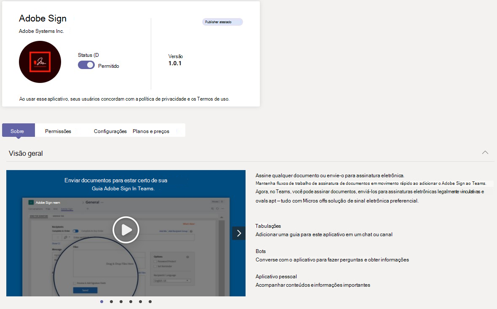

# Gerenciar seus aplicativos no Microsoft Teams de administração

Como administrador, você pode exibir e gerenciar todos os Teams aplicativos para sua organização. Na página Gerenciar aplicativos no Teams de administração, você pode:

- [Permitir ou bloquear aplicativos no nível da organização](#allow-and-block-apps)
- [Aplicativos bloqueados por editores](#apps-blocked-by-publishers)
- [Adicionar aplicativos às equipes](#add-an-app-to-a-team)
- [Aprovar ou carregar novos aplicativos personalizados na loja de aplicativos da sua organização](#publish-a-custom-app-to-your-organizations-app-store)
- [Exibir permissões solicitadas por aplicativos](#view-resource-specific-consent-permissions)
- [Conceder consentimento a aplicativos](#grant-admin-consent-to-apps)
- [Serviço de compra para aplicativos de terceiros](#purchase-services-for-third-party-apps)
- [Ver o status e as propriedades de aplicativos no nível da organização](#view-apps)
- [Gerenciar configurações de aplicativo em toda a organização](#manage-org-wide-app-settings)
- [Exibir informações de segurança e conformidade para Microsoft 365 Certificados](#view-security-and-compliance-information-for-microsoft-365-certified-apps)

A página Gerenciar aplicativos fornece uma exibição de todos os aplicativos disponíveis, fornecendo as informações necessárias para decidir quais aplicativos permitir ou bloquear em toda a sua organização. Em seguida, você pode usar políticas de [permissão](teams-app-permission-policies.md) de [aplicativo, políticas](teams-app-setup-policies.md) de configuração de aplicativo e políticas de aplicativo personalizadas e configurações para configurar a experiência do aplicativo para usuários [específicos](teams-custom-app-policies-and-settings.md) em sua organização.

Na navegação à esquerda do Centro de Administração do Microsoft Teams, vá para **Aplicativos do Teams** > **Gerenciar aplicativos**. Você deve ser um administrador global ou Teams de serviço para acessar a página.

> [!NOTE]
> A página Gerenciar aplicativos ainda não está disponível nas implantações Microsoft 365 Nuvem da Comunidade Governamental High (GCCH) ou DoD (Departamento de Defesa) do Teams.

## Exibir aplicativos

Você pode exibir todos os aplicativos, incluindo as informações a seguir sobre cada aplicativo.

- **Nome**: o nome do aplicativo. Selecione o nome do aplicativo para ir para a página de detalhes do aplicativo para ver mais informações sobre o aplicativo. Isso inclui uma descrição do aplicativo, seja ele permitido ou bloqueado, versão, política de privacidade, termos de uso, categorias que se aplicam ao aplicativo, status de certificação, recursos com suporte e ID do aplicativo.
- **Certificação**: se o aplicativo passou pela certificação, você verá **Microsoft 365 certificado** **ou Publisher certificado**. Selecione o link para exibir os detalhes de certificação do aplicativo. Se você vir `--`, não temos informações de certificação para o aplicativo. Para saber mais sobre aplicativos certificados Teams, [leia Microsoft 365 certificação de aplicativos](/microsoft-365-app-certification/overview).
- **Publisher**: nome do editor.
- **Status de publicação**: status de publicação de aplicativos personalizados.
- **Status**: status do aplicativo no nível da organização, que pode ser um dos seguintes:
  - **Permitido**: o aplicativo está disponível para todos os usuários em sua organização.
  - **Bloqueado**: o aplicativo está bloqueado e não está disponível para nenhum usuário em sua organização.
  - **Bloqueado pelo editor**: o aplicativo é bloqueado pelo editor e fica oculto dos usuários finais por padrão. Depois de configurar o aplicativo usando as diretrizes do editor, você pode permitir ou bloquear o aplicativo para torná-lo disponível para os usuários finais.
  - **Bloqueado em toda a organização**: o aplicativo é bloqueado nas configurações do aplicativo em toda a organização.
      É importante saber que essa coluna representa o status permitido e bloqueado de aplicativos que anteriormente estavam no **painel de configurações de toda** a organização. Agora você exibe, bloqueia e permite aplicativos em toda a organização na **página Gerenciar aplicativos** .
- **Licenças**: indica se um aplicativo oferece uma assinatura de SaaS (Software como Serviço) para compra. Essa coluna se aplica somente a aplicativos de terceiros. Cada aplicativo de terceiros terá um dos seguintes valores:
  - **Compra**: o aplicativo oferece uma assinatura de SaaS e está disponível para compra.  
  - **Comprado**: o aplicativo oferece uma assinatura de SaaS e você comprou licenças para ele.
  - **- -**: o aplicativo não oferece uma assinatura de SaaS.
- **Aplicativo personalizado**: se o aplicativo é um aplicativo personalizado.
- **Permissões**: indica se um aplicativo personalizado ou de terceiros registrado no Azure Active Directory (Azure AD) tem permissões que precisam de consentimento. Você verá um dos seguintes valores:
  - **Exibir detalhes**: o aplicativo tem permissões que exigem consentimento antes que o aplicativo possa acessar dados.
  - **- -**: o aplicativo não tem permissões que precisam de consentimento.
- **Categorias**: categorias que se aplicam ao aplicativo.
- **Versão**: versão do aplicativo.
- **O administrador pode instalar em reuniões**: indica se um aplicativo pode ser instalado por administradores em reuniões de equipe. [Saiba Mais](teams-app-setup-policies.md#install-apps)

Para ver as informações desejadas na tabela, selecione **Editar** Coluna no canto superior direito para adicionar ou remover colunas à tabela.

## Publicar um aplicativo personalizado na loja de aplicativos da sua organização

Use a página Gerenciar aplicativos para publicar aplicativos criados especificamente para sua organização. Depois de publicar um aplicativo personalizado, ele estará disponível para os usuários na loja de aplicativos da sua organização. Há duas maneiras de publicar um aplicativo personalizado na loja de aplicativos da sua organização. A maneira que você usa depende de como você obtém o aplicativo.

- [Aprovar um aplicativo personalizado](#approve-a-custom-app): use esse método se o desenvolvedor enviar o aplicativo diretamente para a página Gerenciar aplicativos usando a API de Envio Teams Aplicativo. Em seguida, você pode revisar e publicar (ou rejeitar) o aplicativo diretamente na página de detalhes do aplicativo.
- [Upload um pacote de aplicativos](#upload-an-app-package): use esse método se o desenvolvedor enviar o pacote do aplicativo no formato .zip aplicativo. Publique o aplicativo carregando o pacote do aplicativo.

### Aprovar um aplicativo personalizado

O widget **aprovações pendentes** na página Gerenciar aplicativos notifica você quando um desenvolvedor envia um aplicativo usando a API de envio Teams aplicativo. Um aplicativo recém-enviado é listado com um **status de** Publicação de **Enviado** e **um Status** de **Bloqueado**. Vá para a página de detalhes do aplicativo para ver mais informações sobre o aplicativo e, em seguida, para publicá-lo, defina o **status** de **Publicação como Publicar**.

Você também é notificado quando um desenvolvedor envia uma atualização para um aplicativo personalizado. Em seguida, você pode revisar e publicar (ou rejeitar) a atualização na página de detalhes do aplicativo. Todas as políticas de permissão de aplicativo e políticas de configuração de aplicativo permanecem impostas para o aplicativo atualizado.

Para saber mais, confira [Publicar um aplicativo personalizado enviado por meio da API Teams envio de aplicativo](submit-approve-custom-apps.md).

### Upload um pacote do aplicativo

O desenvolvedor cria um Teams de aplicativo usando [Teams App Studio](/microsoftteams/platform/get-started/get-started-app-studio) e, em seguida, o envia para você .zip formato. Quando você tiver o pacote do aplicativo, poderá carregá-lo na loja de aplicativos da sua organização.

Para carregar um novo aplicativo personalizado, selecione **Upload** carregar o pacote do aplicativo. O aplicativo não é realçado depois de carregado, portanto, você precisará pesquisar a lista de aplicativos na página Gerenciar aplicativos para encontrá-lo.

Para atualizar um aplicativo depois que ele for carregado, na lista de aplicativos na página Gerenciar aplicativos, selecione o nome do aplicativo e, em seguida, **selecione Atualizar**. Isso substitui o aplicativo existente e todas as políticas de permissão de aplicativo e as políticas de configuração de aplicativo permanecem impostas para o aplicativo atualizado.

Para saber mais, confira [Publicar um aplicativo personalizado carregando um pacote de aplicativos](upload-custom-apps.md).

## Permitir e bloquear aplicativos

A página Gerenciar aplicativos é onde você permite ou bloqueia aplicativos individuais no nível da organização. Ele mostra todos os aplicativos disponíveis e seu status atual do aplicativo no nível da organização. (O bloqueio e a permissão de aplicativos no nível da organização foram **movidos** do painel de configurações de aplicativo em toda a organização para aqui.)

Para permitir ou bloquear um aplicativo, selecione-o e selecione **Permitir** ou **Bloquear**. Quando você bloqueia um aplicativo, todas as interações com esse aplicativo são desabilitadas e o aplicativo não aparece no Teams para nenhum usuário em sua organização.

Quando você bloqueia ou permite um aplicativo na página Gerenciar aplicativos, esse aplicativo é bloqueado ou permitido para todos os usuários em sua organização.  Quando você bloqueia ou permite um aplicativo em uma Teams de permissão do aplicativo, ela é bloqueada ou permitida para usuários que recebem essa política. Para que um usuário possa instalar e interagir com qualquer aplicativo, você deve permitir o aplicativo no nível da organização na página Gerenciar aplicativos e na política de permissão do aplicativo atribuída ao usuário.

 > [!NOTE]
 > Para desinstalar um aplicativo, clique com o botão direito do  mouse no aplicativo e clique em Desinstalar ou use **o menu Mais** aplicativos no lado esquerdo.

## Aplicativos bloqueados por editores

Quando um ISV publica um aplicativo na loja de aplicativos global, eles podem precisar de administradores para configurar ou personalizar a experiência do aplicativo. O administrador pode dispo-lo para os usuários finais quando o aplicativo estiver totalmente configurado.

Por exemplo, a Contoso Electronics é um ISV que criou um aplicativo de suporte ajuda para Microsoft Teams. A Contoso Electronics deseja que seus clientes configurem determinadas propriedades do aplicativo para que, quando os usuários interajam com o aplicativo, ele funcione conforme o esperado. Antes que um administrador possa permitir ou bloquear o aplicativo, ele será exibido  como Bloqueado pelo publicador no centro de administração do Teams e ficará oculto dos usuários finais por padrão. Depois de seguir as diretrizes do editor para configurar o aplicativo, você pode dispo-lo para os usuários alterando para status Permitido ou impedir que os usuários usem o aplicativo alterando o status para **Bloqueado.**

## Adicionar um aplicativo a uma equipe

Use o **botão Adicionar à equipe** para instalar um aplicativo em uma equipe. Tenha em mente que isso é apenas para aplicativos que podem ser instalados em um escopo de equipe. O **botão Adicionar à** equipe não está disponível para aplicativos que só podem ser instalados no escopo pessoal.

1. Pesquise o aplicativo desejado e selecione o aplicativo clicando à esquerda do nome do aplicativo.
2. Selecione **Adicionar à equipe**.
3. No painel **Adicionar à equipe** , pesquise a equipe à qual você deseja adicionar o aplicativo, selecione a equipe e, em seguida, **selecione Aplicar**.

## Personalizar um aplicativo

Agora você pode personalizar um aplicativo para incluir uma aparência específica de acordo com as necessidades da sua organização. Consulte [Personalizar aplicativos no Teams](customize-apps.md).

## Comprar serviços para aplicativos de terceiros

Você pode pesquisar e comprar licenças para serviços oferecidos por aplicativos de terceiros para usuários em sua organização diretamente na página Gerenciar aplicativos. A **coluna Licenças** na tabela indica se um aplicativo oferece uma assinatura de SaaS paga. Selecione **Comprar agora** para exibir planos e informações de preços e comprar licenças para seus usuários. Para saber mais, confira [Serviços de compra Teams aplicativos de terceiros no centro Microsoft Teams administrador](purchase-third-party-apps.md).

## Conceder consentimento do administrador a aplicativos

Você pode examinar e conceder consentimento a aplicativos que solicitam permissões em nome de todos os usuários em sua organização. Faça isso para que os usuários não tenham que revisar e aceitar as permissões solicitadas pelo aplicativo quando iniciarem o aplicativo. A **coluna Permissões** indica se um aplicativo tem permissões que precisam de consentimento. Você verá um link **Exibir detalhes** para cada aplicativo registrado no Azure AD que tem permissões que precisam de consentimento. Para saber mais, confira [Exibir permissões de aplicativo e conceder consentimento do administrador no Microsoft Teams de administração](app-permissions-admin-center.md).

## Exibir permissões de consentimento específicas do recurso

As permissões de RSC (consentimento específico do recurso) permitem que os proprietários da equipe concedam consentimento para que um aplicativo acesse e modifique os dados de uma equipe. As permissões RSC são granulares e Teams específicas que definem o que um aplicativo pode fazer em uma equipe específica. Você pode exibir permissões RSC na **guia Permissões** da página de detalhes do aplicativo para um aplicativo. Para saber mais, confira [Exibir permissões de aplicativo e conceder consentimento do administrador no Microsoft Teams de administração](app-permissions-admin-center.md).

## Gerenciar configurações de aplicativo em toda a organização

Use as configurações de aplicativo em toda a organização para controlar se os usuários com uma licença [F](https://www.microsoft.com/microsoft-365/enterprise/frontline#office-SKUChooser-0dbn8nt) obtêm a experiência de aplicativo de linha de frente personalizada, se os usuários podem instalar aplicativos de terceiros e se os usuários podem carregar ou interagir com aplicativos personalizados em sua organização. As configurações de aplicativo em toda a organização controlam o comportamento de todos os usuários e substituem quaisquer outras políticas de permissão de aplicativo atribuídas aos usuários. Você pode usá-los para controlar aplicativos maliciosos ou problemáticos.

> [!NOTE]
> Para saber como usar as configurações de aplicativo em toda a organização no Microsoft 365 Government Nuvem da Comunidade Governamental – implantações de GCCH e Departamento de Defesa (DoD) do Teams, consulte Gerenciar políticas de permissão de aplicativo no [Teams](teams-app-permission-policies.md).

1. Na página Gerenciar aplicativos, selecione **configurações de aplicativo em toda a organização**. Em seguida, você pode definir as configurações desejadas no painel.

    :::image type="content" source="media/manage-apps-org-wide-app-settings.png" alt-text="Captura de tela do painel configurações de aplicativos em toda a organização na página Gerenciar aplicativos":::

1. Em **aplicativos personalizados**, desative ou ative **Mostrar aplicativos personalizados**. Quando essa configuração está ativada, os usuários com uma [licença F](https://www.microsoft.com/microsoft-365/enterprise/frontline#office-SKUChooser-0dbn8nt) obtêm a experiência de aplicativo de linha de frente personalizada. Essa experiência fixa os aplicativos mais relevantes no Teams para trabalhadores de linha de frente. Para saber mais, confira [Personalizar Teams aplicativos para seus trabalhadores de linha de frente](pin-teams-apps-based-on-license.md).

    Esse recurso está disponível para licenças F. Outros tipos de licença terão suporte no futuro.
1. Em **Aplicativos de terceiros**, desabilite ou ative essas configurações para controlar o acesso a aplicativos de terceiros:

    - **Permitir aplicativos de terceiros**: controla se os usuários podem usar aplicativos de terceiros. Se você desativar essa configuração, os usuários não poderão instalar nem usar aplicativos de terceiros, e o status do aplicativo desses aplicativos será exibido como Bloqueado em toda a  organização na tabela.

        > [!NOTE]
        > Quando Permitir aplicativos de terceiros está desativado, os [webhooks](/microsoftteams/platform/webhooks-and-connectors/what-are-webhooks-and-connectors) de saída ainda estão habilitados para todos os usuários, mas você pode **controlá-los** no nível do usuário permitindo ou bloqueando o aplicativo webhook de saída por meio de políticas de permissão de [aplicativo.](teams-app-permission-policies.md) Observe que, se você tiver políticas  de permissão de aplicativo existentes para aplicativos  da **Microsoft** que usam a configuração Permitir aplicativos específicos e bloquear todos os outros, e quiser habilitar webhooks de saída para os usuários, adicione o aplicativo Webhook de Saída à lista.

        > [!NOTE]
        > Os usuários do Teams podem adicionar aplicativos ao hospedar reuniões ou chats com pessoas de outras organizações. Eles também podem usar aplicativos compartilhados por pessoas de outras organizações quando ingressarem em reuniões ou chats hospedados por essas organizações. As políticas de dados da organização do usuário de hospedagem, assim como as práticas de compartilhamento de dados de qualquer aplicativo de terceiros compartilhado pela organização desse usuário, serão aplicadas.

    - **Permitir novos aplicativos de terceiros publicados na loja por padrão**: isso controla se os novos aplicativos de terceiros publicados na loja de aplicativos Teams se tornam automaticamente disponíveis no Teams. Você só pode definir essa opção se permitir aplicativos de terceiros.

1. Em **Aplicativos personalizados**, desative ou ative **Permitir interação com aplicativos personalizados**. Essa configuração controla se os usuários podem interagir com aplicativos personalizados. Para saber mais, confira [Gerenciar políticas e configurações de aplicativos personalizados no Teams](teams-custom-app-policies-and-settings.md).
1. Selecione **Salvar** para que as configurações de aplicativo em toda a organização entre em vigor.

## Exibir informações de segurança e conformidade para Microsoft 365 Certificados

Ao avaliar um aplicativo para sua organização, os administradores podem usar CASB (Cloud Access Security Brokers) independentes, como Microsoft Cloud App Security (MCAS), para encontrar informações sobre segurança e comportamentos de um aplicativo. O Teams de administração inclui informações de segurança e conformidade do MCAS para aplicativos certificados do Microsoft 365 para que você tenha mais informações sobre se o aplicativo atende ou não às suas necessidades.

> [!NOTE]
> Esse recurso está disponível para todos os administradores, independentemente de sua organização ter ou não uma licença compatível com MCAS.

Para acessar MCAS informações, siga estas etapas:

1. No centro Teams de administração, selecione **Gerenciar aplicativos** **em Teams aplicativos**.
1. Selecione **Certificação** para classificar aplicativos e efetuar push Microsoft 365 aplicativos certificados para a parte superior da tabela.
1. Escolha um Microsoft 365 Certificado.
1. Selecione a **guia Segurança e** Conformidade.

Nessa guia, você encontrará informações sobre segurança, conformidade e proteção de dados. Você também pode expandir cada lista suspensa para obter mais detalhes sobre quais recursos têm suporte para o aplicativo selecionado.

## Tópicos relacionados

- [Configurações de administrador para aplicativos no Teams](admin-settings.md)
