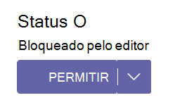

# Gerenciar aplicativos do Teams no centro de administração do Microsoft Teams

Você gerencia aplicativos para sua organização em **aplicativos do Teams** no centro de administração. Use a [página Gerenciar aplicativos](https://admin.teams.microsoft.com/policies/manage-apps) para exibir e gerenciar todos os aplicativos do Teams no catálogo de aplicativos da sua organização. A página Gerenciar aplicativos fornece uma exibição de todos os aplicativos disponíveis em seu catálogo de locatários, fornecendo as informações necessárias para decidir quais aplicativos permitir ou bloquear em toda a sua organização. Você pode ver o status no nível da organização e as propriedades de aplicativos, bloquear ou permitir aplicativos no nível da organização, carregar novos aplicativos personalizados no catálogo de locatários e gerenciar configurações de aplicativos em toda a organização.

Para usar o Centro de administração do Teams, você deve ser um administrador global ou administrador de serviços do Teams. Para obter detalhes, consulte [as funções de administrador do Teams](./using-admin-roles.md).

Para gerenciar aplicativos, use políticas para controlar permissões para usuários, instalação de aplicativos e upload de aplicativos personalizados criados em sua organização. Para entender as políticas, consulte [Visão geral das políticas de aplicativo](app-policies.md).

> [!NOTE]
> [!INCLUDE [new-teams-sfb-admin-center-notice](includes/new-teams-sfb-admin-center-notice.md)]

> [!NOTE]
> A página Gerenciar aplicativos não está disponível nas implantações do Microsoft 365 Government Community Cloud High (GCCH) ou do Departamento de Defesa (DoD) do Teams.

## Publicar um aplicativo personalizado na loja de aplicativos da sua organização

Use a página Gerenciar aplicativos para publicar aplicativos criados especificamente para sua organização. Depois de publicar um aplicativo personalizado, ele estará disponível para os usuários na loja de aplicativos da sua organização. Há duas maneiras de publicar um aplicativo personalizado na loja de aplicativos da sua organização. A maneira que você usa depende de como você obtém o aplicativo.

* [Aprovar um aplicativo personalizado](#approve-a-custom-app): use esse método se o desenvolvedor enviar o aplicativo diretamente para a página Gerenciar aplicativos usando a API de Envio de Aplicativos do Teams. Em seguida, você pode revisar e publicar (ou rejeitar) o aplicativo diretamente na página de detalhes do aplicativo.
* [Carregar um pacote do aplicativo](#upload-an-app-package): use esse método se o desenvolvedor enviar o pacote do aplicativo .zip formato. Publique o aplicativo carregando o pacote do aplicativo.

### Aprovar um aplicativo personalizado

O widget **aprovações pendentes** na página Gerenciar aplicativos notifica quando um desenvolvedor envia um aplicativo usando a API de Envio de Aplicativo do Teams. Um aplicativo recém-enviado é listado com um **status de** Publicação de **Enviado** e **um Status** de **Bloqueado**. Vá para a página de detalhes do aplicativo para ver mais informações sobre o aplicativo e, em seguida, para publicá-lo, defina o **status** de **Publicação como Publicar**.

Você também é notificado quando um desenvolvedor envia uma atualização para um aplicativo personalizado. Em seguida, você pode revisar e publicar (ou rejeitar) a atualização na página de detalhes do aplicativo. Todas as políticas de permissão de aplicativo e políticas de configuração de aplicativo permanecem impostas para o aplicativo atualizado.

Para saber mais, confira [Publicar um aplicativo personalizado enviado por meio da API de Envio de Aplicativo do Teams](submit-approve-custom-apps.md).

### Carregar um pacote do aplicativo

O desenvolvedor cria um pacote de aplicativos do Teams usando o [Teams App Studio](/microsoftteams/platform/get-started/get-started-app-studio) e, em seguida, o envia para você .zip formato. Quando você tiver o pacote do aplicativo, poderá carregá-lo na loja de aplicativos da sua organização.

Para carregar um novo aplicativo personalizado, selecione **Carregar** para carregar o pacote do aplicativo. O aplicativo não é realçado depois de carregado, portanto, você precisará pesquisar a lista de aplicativos na página Gerenciar aplicativos para encontrá-lo.

Para atualizar um aplicativo depois que ele for carregado, na lista de aplicativos na página Gerenciar aplicativos, selecione o nome do aplicativo e, em seguida, **selecione Atualizar**. Isso substitui o aplicativo existente e todas as políticas de permissão de aplicativo e as políticas de configuração de aplicativo permanecem impostas para o aplicativo atualizado.

Para saber mais, confira [Publicar um aplicativo personalizado carregando um pacote de aplicativos](upload-custom-apps.md).

## Permitir e bloquear aplicativos

A página Gerenciar aplicativos é onde você permite ou bloqueia aplicativos individuais no nível da organização. Ele mostra todos os aplicativos disponíveis e seu status atual do aplicativo no nível da organização.

Para permitir ou bloquear um aplicativo:

1. Vá para o Centro de administração do Teams > aplicativos do Teams > Gerenciar aplicativos.
1. Selecione um aplicativo na lista de aplicativos.
1. Selecione **Permitir** ou **Bloquear**.

Quando você bloqueia ou permite um aplicativo na página Gerenciar aplicativos, esse aplicativo é bloqueado ou permitido para todos os usuários em sua organização.  Quando você bloqueia ou permite um aplicativo em uma política de permissão de aplicativo do Teams, ele é bloqueado ou permitido para usuários que recebem essa política. Para que um usuário possa instalar e interagir com qualquer aplicativo, você deve permitir o aplicativo no nível da organização na página Gerenciar aplicativos e na política de permissão do aplicativo atribuída ao usuário.

 > [!NOTE]
 > Para desinstalar um aplicativo, clique com o botão direito do  mouse no aplicativo e clique em Desinstalar ou use **o menu Mais** aplicativos no lado esquerdo.

## Gerenciar solicitações de usuário para desbloquear aplicativos

Você pode exibir solicitações para disponibilizar um aplicativo bloqueado para uso. A solicitação é enviada ao administrador de TI, que pode exibir e gerenciar solicitações de usuário no centro de administração do Teams.

  :::image type="content" source="media/user-request.png" alt-text="Fazer uma solicitação de aprovação de aplicativos bloqueados":::

### Exibir uma solicitação

 1. Entre no centro de administração do Teams e selecione [Gerenciar aplicativos](https://admin.teams.microsoft.com/policies/manage-apps)

    :::image type="content" source="media/requested-apps1.png" alt-text="Solicitação por usuários" lightbox="media/requested-apps.png" border="true":::

 1. Para exibir e verificar o número de solicitações para cada aplicativo, classifique as solicitações na coluna **Solicitações por** usuário.
 1. Selecione o nome do aplicativo que você deseja desbloquear e ele abrirá a página de detalhes do aplicativo.
 1. Selecione **Gerenciar solicitações** e conclua as etapas exibidas na caixa de diálogo pop-up. As etapas para aprovar um aplicativo variam de acordo com o método usado para bloqueiá-lo.

    * Se o aplicativo for bloqueado usando políticas de permissão, permita que o aplicativo modifique as [políticas de permissão](teams-app-permission-policies.md).
    * Se o aplicativo estiver bloqueado para todos os usuários, [permita o aplicativo](#allow-and-block-apps).
    * Se todos os aplicativos forem bloqueados para todos os usuários, modifique [as configurações de toda a organização](#manage-org-wide-app-settings).

 Se um administrador permitir um aplicativo, ele não informará ao usuário final que a solicitação foi acionda. O usuário deve visitar o aplicativo na Loja para verificar se o aplicativo está desbloqueado ou não.

### Ignorar uma solicitação de usuário

 1. Selecione o nome do aplicativo para o qual você deseja ignorar as solicitações do usuário.
 1. Selecione **Gerenciar solicitações** e **selecione Ignorar todas as solicitações** na caixa de diálogo.
 1. Quando uma solicitação é ignorada, ela redefine as solicitações do usuário para zero.

  :::image type="content" source="media/reject.png" alt-text="rejeição de aplicativos bloqueados."border="true":::

Se um administrador ignorar uma solicitação, ele não informará ao usuário final que a solicitação foi acionda. O usuário deve visitar o aplicativo na Loja para verificar se o aplicativo está desbloqueado ou não.

## Aplicativos bloqueados por editores

Quando um ISV publica um aplicativo na loja de aplicativos global, eles podem precisar de administradores para configurar ou personalizar a experiência do aplicativo. O administrador pode dispo-lo para os usuários finais quando o aplicativo estiver completamente configurado.

Por exemplo, a Contoso Electronics é um ISV que criou um aplicativo de suporte ajuda para o Microsoft Teams. A Contoso Electronics deseja que seus clientes configurem determinadas propriedades do aplicativo para que, quando os usuários interajam com o aplicativo, ele funcione conforme o esperado. Antes que um administrador possa permitir ou bloquear o aplicativo, ele será exibido  como Bloqueado pelo editor no centro de administração do Teams e ficará oculto dos usuários finais por padrão. Depois de seguir as diretrizes do editor para configurar o aplicativo, você pode dispo-lo para os usuários alterando o status para Permitido ou impedindo que os usuários usem o aplicativo alterando o status para **Bloqueado**.

## Adicionar um aplicativo a uma equipe

Use o **botão Adicionar à equipe** para instalar um aplicativo em uma equipe. Tenha em mente que isso é apenas para aplicativos que podem ser instalados em um escopo de equipe. O **botão Adicionar à** equipe não está disponível para aplicativos que só podem ser instalados no escopo pessoal.

1. Pesquise o aplicativo desejado e selecione o aplicativo clicando à esquerda do nome do aplicativo.
1. Selecione **Adicionar à equipe**.
1. No painel **Adicionar à equipe** , pesquise a equipe à qual você deseja adicionar o aplicativo, selecione a equipe e, em seguida, **selecione Aplicar**.

## Personalizar um aplicativo

Agora você pode personalizar um aplicativo para incluir uma aparência específica de acordo com as necessidades da sua organização. Consulte [Personalizar aplicativos no Teams](customize-apps.md).

## Comprar serviços para aplicativos de terceiros

Você pode pesquisar e comprar licenças para serviços oferecidos por aplicativos de terceiros para usuários em sua organização diretamente na página Gerenciar aplicativos. A **coluna Licenças** na tabela indica se um aplicativo oferece uma assinatura de SaaS paga. Selecione **Comprar agora** para exibir planos e informações de preços e comprar licenças para seus usuários. Para saber mais, confira [Serviços de compra para aplicativos de terceiros do Teams no centro de administração do Microsoft Teams](purchase-third-party-apps.md).

## Conceder consentimento do administrador a aplicativos

Você pode examinar e conceder consentimento a aplicativos que solicitam permissões em nome de todos os usuários em sua organização. Faça isso para que os usuários não tenham que revisar e aceitar as permissões solicitadas pelo aplicativo quando iniciarem o aplicativo. A **coluna Permissões** indica se um aplicativo tem permissões que precisam de consentimento. Você verá um link **Exibir detalhes** para cada aplicativo registrado no Azure AD que tem permissões que precisam de consentimento. Para saber mais, confira [Exibir permissões de aplicativo e conceder consentimento do administrador no Centro de administração do Microsoft Teams](app-permissions-admin-center.md).

## Exibir permissões de consentimento específicas do recurso

As permissões de RSC (consentimento específico do recurso) permitem que os proprietários da equipe concedam consentimento para que um aplicativo acesse e modifique os dados de uma equipe. As permissões RSC são granulares e específicas do Teams que definem o que um aplicativo pode fazer em uma equipe específica. Você pode exibir permissões RSC na **guia Permissões** da página de detalhes do aplicativo para um aplicativo. Para saber mais, confira [Exibir permissões de aplicativo e conceder consentimento do administrador no Centro de administração do Microsoft Teams](app-permissions-admin-center.md).

## Gerenciar configurações de aplicativo em toda a organização

Use as configurações de aplicativo em toda a organização para controlar se os usuários com uma licença [F](https://www.microsoft.com/microsoft-365/enterprise/frontline#office-SKUChooser-0dbn8nt) obtêm a experiência de aplicativo de linha de frente personalizada, se os usuários podem instalar aplicativos de terceiros e se os usuários podem carregar ou interagir com aplicativos personalizados em sua organização. As configurações de aplicativo em toda a organização controlam o comportamento de todos os usuários e substituem quaisquer outras políticas de permissão de aplicativo atribuídas aos usuários. Você pode usá-los para controlar aplicativos maliciosos ou problemáticos.

> [!NOTE]
> Para saber como usar as configurações de aplicativo em toda a organização nas implantações do Microsoft 365 Government – Government Community Cloud High GCCH e do Departamento de Defesa (DoD) do Teams, consulte Gerenciar políticas de permissão de aplicativo no [Teams](teams-app-permission-policies.md).

1. Na página Gerenciar aplicativos, selecione **configurações de aplicativo em toda a organização**. Em seguida, você pode definir as configurações desejadas no painel.

    :::image type="content" source="media/manage-apps-org-wide-app-settings.png" alt-text="Captura de tela do painel configurações de aplicativos em toda a organização na página Gerenciar aplicativos":::

1. Em **aplicativos personalizados**, desative ou ative **Mostrar aplicativos personalizados**. Quando essa configuração está ativada, os usuários com uma [licença F](https://www.microsoft.com/microsoft-365/enterprise/frontline#office-SKUChooser-0dbn8nt) obtêm a experiência de aplicativo de linha de frente personalizada. Essa experiência fixa os aplicativos mais relevantes no Teams para trabalhadores da linha de frente. Para saber mais, confira [Personalizar aplicativos do Teams para seus funcionários da linha de frente](pin-teams-apps-based-on-license.md).

    Esse recurso está disponível para licenças F. Outros tipos de licença terão suporte no futuro.
1. Em **Aplicativos de terceiros**, desabilite ou ative essas configurações para controlar o acesso a aplicativos de terceiros:

    * **Permitir aplicativos de terceiros**: controla se os usuários podem usar aplicativos de terceiros. Se você desativar essa configuração, os usuários não poderão instalar nem usar aplicativos de terceiros, e o status do aplicativo desses aplicativos será exibido como Bloqueado em toda a  organização na tabela.

        > [!NOTE]
        > Quando Permitir aplicativos de terceiros está desativado, os [webhooks](/microsoftteams/platform/webhooks-and-connectors/what-are-webhooks-and-connectors) de saída ainda estão habilitados para todos os usuários, mas você pode **controlá-los** no nível do usuário permitindo ou bloqueando o aplicativo webhook de saída por meio de políticas de permissão de [aplicativo.](teams-app-permission-policies.md) Observe que, se você tiver políticas  de permissão de aplicativo existentes para aplicativos  da **Microsoft** que usam a configuração Permitir aplicativos específicos e bloquear todos os outros, e quiser habilitar webhooks de saída para os usuários, adicione o aplicativo Webhook de Saída à lista.

        > [!NOTE]
        > Os usuários do Teams podem adicionar aplicativos ao hospedar reuniões ou chats com pessoas de outras organizações. Eles também podem usar aplicativos compartilhados por pessoas de outras organizações quando ingressarem em reuniões ou chats hospedados por essas organizações. As políticas de dados da organização do usuário de hospedagem, assim como as práticas de compartilhamento de dados de qualquer aplicativo de terceiros compartilhado pela organização desse usuário, serão aplicadas.

    * **Permitir novos aplicativos de terceiros publicados na loja por padrão**: isso controla se os novos aplicativos de terceiros publicados na loja de aplicativos Teams se tornam automaticamente disponíveis no Teams. Você só pode definir essa opção se permitir aplicativos de terceiros.

1. Em **Aplicativos personalizados**, desative ou ative **Permitir interação com aplicativos personalizados**. Essa configuração controla se os usuários podem interagir com aplicativos personalizados. Para saber mais, confira [Gerenciar políticas e configurações de aplicativos personalizados no Teams](teams-custom-app-policies-and-settings.md).
1. Selecione **Salvar** para que as configurações de aplicativo em toda a organização entre em vigor.
