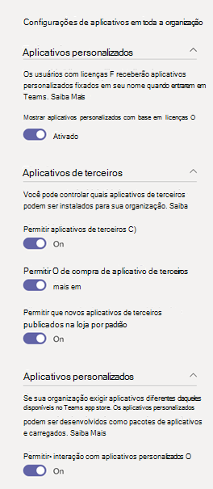
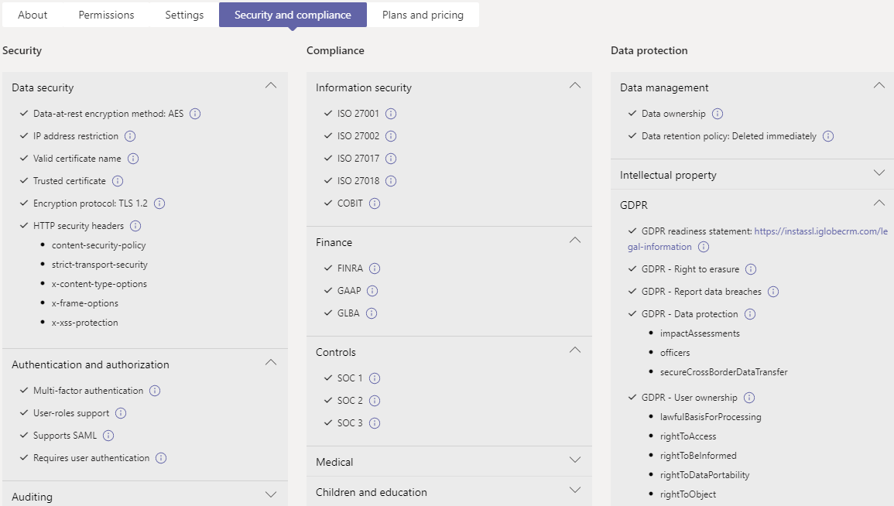

# Gerenciar seus aplicativos no Microsoft Teams de administração

Como administrador, a página Gerenciar aplicativos no centro de administração Microsoft Teams é onde você visualiza e gerencia todos os Teams aplicativos para sua organização. Aqui, você pode ver o status e as propriedades de aplicativos no nível da organização, aprovar ou carregar novos aplicativos personalizados na loja de aplicativos da sua organização, bloquear ou permitir aplicativos no nível da organização, adicionar aplicativos às equipes, comprar serviços para aplicativos de terceiros, exibir permissões solicitadas por aplicativos, conceder consentimento de administrador a aplicativos e gerenciar configurações de aplicativos em toda a organização.

A página Gerenciar aplicativos oferece uma exibição em todos os aplicativos disponíveis, fornecendo as informações necessárias para decidir quais aplicativos permitir ou bloquear em toda a sua organização. Em seguida, [você](teams-app-permission-policies.md)pode usar políticas de permissão de [aplicativo,](teams-app-setup-policies.md)políticas de configuração de aplicativo e políticas e configurações personalizadas do aplicativo para configurar a experiência do aplicativo para usuários [específicos](teams-custom-app-policies-and-settings.md) em sua organização.

Na navegação à esquerda do Centro de Administração do Microsoft Teams, vá para **Aplicativos do Teams** > **Gerenciar aplicativos**. Você deve ser um administrador global ou Teams de serviço para acessar a página.

> [!NOTE]
> A página Gerenciar aplicativos ainda não está disponível Microsoft 365 Nuvem da Comunidade Governamental implantações high (GCCH) ou Department of Defense (DoD) de Teams.

## Exibir aplicativos

Você pode exibir todos os aplicativos, incluindo as informações a seguir sobre cada aplicativo.

- **Nome**: o nome do aplicativo. Selecione o nome do aplicativo para ir até a página de detalhes do aplicativo para ver mais informações sobre o aplicativo. Isso inclui uma descrição do aplicativo, se ele é permitido ou bloqueado, versão, política de privacidade, termos de uso, categorias que se aplicam ao aplicativo, status de certificação, recursos com suporte e ID do aplicativo. Veja um exemplo:

  
  
- **Certificação**: se o aplicativo passou pela certificação, você verá Microsoft 365 **certificado** ou Publisher **atestado**. Selecione o link para exibir detalhes de certificação do aplicativo. Se você vir " **--** ", não temos informações de certificação para o aplicativo. Para saber mais sobre aplicativos certificados Teams, [leia Microsoft 365 Programa de Certificação de Aplicativos.](/teams-app-certification/all-apps)  
- **Publisher:** nome do editor.
- **Status de publicação**: Status de publicação de aplicativos personalizados.
- **Status**: Status do aplicativo no nível da organização, que pode ser um dos seguintes:
- **Permitido**: o aplicativo está disponível para todos os usuários em sua organização.
- **Bloqueado**: o aplicativo está bloqueado e não está disponível para nenhum usuário em sua organização.
- **Toda a organização bloqueada:** o aplicativo é bloqueado em configurações de aplicativo em toda a organização.
      É importante saber que essa coluna representa o status permitido e bloqueado dos **aplicativos** que anteriormente estavam no painel de configurações em toda a organização. Agora, você visualiza, bloqueia e permite aplicativos em toda a organização na página **Gerenciar aplicativos.**
- **Licenças**: Indica se um aplicativo oferece uma assinatura software como serviço (SaaS) para compra. Esta coluna se aplica somente a aplicativos de terceiros. Cada aplicativo de terceiros terá um dos seguintes valores:
- **Compre agora**: o aplicativo oferece uma assinatura SaaS e está disponível para compra.  
- **Comprado**: o aplicativo oferece uma assinatura SaaS e você comprou licenças para ele.
- **- -**: o aplicativo não oferece uma assinatura SaaS.
- **Aplicativo personalizado**: se o aplicativo é um aplicativo personalizado.
- **Permissões**: Indica se um aplicativo personalizado ou de terceiros registrado no Azure Active Directory (Azure AD) tem permissões que precisam de consentimento. Você verá um dos seguintes valores:
- **Detalhes de** exibição : o aplicativo tem permissões que exigem consentimento antes que o aplicativo possa acessar dados.
- **- -**: O aplicativo não tem permissões que precisam de consentimento.
- **Categorias**: categorias que se aplicam ao aplicativo.
- **Versão**: Versão do aplicativo.
- **O administrador pode instalar em reuniões**: Indica se um aplicativo pode ser instalado pelos administradores em reuniões de equipe. [Saiba Mais](teams-app-setup-policies.md#install-apps)

Para ver as informações que você deseja na tabela, selecione **Editar Coluna** no canto superior direito para adicionar ou remover colunas à tabela.

## Publicar um aplicativo personalizado na loja de aplicativos da sua organização

Use a página Gerenciar aplicativos para publicar aplicativos criados especificamente para sua organização. Depois de publicar um aplicativo personalizado, ele estará disponível para os usuários na loja de aplicativos da sua organização. Há duas maneiras de publicar um aplicativo personalizado na loja de aplicativos da sua organização. A maneira como você usa depende de como você obter o aplicativo.

- [Aprovar um aplicativo personalizado](#approve-a-custom-app): use este método se o desenvolvedor enviar o aplicativo diretamente para a página Gerenciar aplicativos usando a API Teams Envio de Aplicativos. Em seguida, você pode revisar e publicar (ou rejeitar) o aplicativo diretamente na página de detalhes do aplicativo.
- [Upload um pacote de aplicativos](#upload-an-app-package): use este método se o desenvolvedor enviar o pacote do aplicativo em .zip formato. Você publica o aplicativo carregando o pacote do aplicativo.

### Aprovar um aplicativo personalizado

O **widget De aprovações pendentes** na página Gerenciar aplicativos notifica você quando um desenvolvedor envia um aplicativo usando a API Teams envio de aplicativos. Um aplicativo recém-enviado é listado com um **status de** publicação de **Submitted** e **um Status** de **Bloqueado**. Vá até a página de detalhes do aplicativo para ver mais informações sobre o aplicativo e, em seguida, para publicá-lo, de definir **o status** de publicação como **Publicar**.

Você também é notificado quando um desenvolvedor envia uma atualização para um aplicativo personalizado. Em seguida, você pode revisar e publicar (ou rejeitar) a atualização na página de detalhes do aplicativo. Todas as políticas de permissão de aplicativo e políticas de configuração de aplicativo permanecem impostas para o aplicativo atualizado.

Para saber mais, confira Publicar um aplicativo personalizado enviado por [meio da API Teams envio de aplicativos.](submit-approve-custom-apps.md)

### Upload um pacote de aplicativos

O desenvolvedor cria um Teams de aplicativos usando [Teams App Studio](/microsoftteams/platform/get-started/get-started-app-studio)e o envia para você no formato .zip. Quando você tem o pacote de aplicativos, você pode carregar ele na loja de aplicativos da sua organização.

Para carregar um novo aplicativo personalizado, selecione **Upload** carregar o pacote do aplicativo. O aplicativo não é realçado depois de carregado, portanto, você precisará pesquisar a lista de aplicativos na página Gerenciar aplicativos para encontrá-lo.

Para atualizar um aplicativo depois de carregado, na lista de aplicativos na página Gerenciar aplicativos, selecione o nome do aplicativo e selecione **Atualizar**. Isso substitui o aplicativo existente e todas as políticas de permissão de aplicativo e políticas de configuração de aplicativo permanecem impostas para o aplicativo atualizado.

Para saber mais, confira [Publicar um aplicativo personalizado carregando um pacote de aplicativos.](upload-custom-apps.md)

## Permitir e bloquear aplicativos

A página Gerenciar aplicativos é onde você permite ou bloqueia aplicativos individuais no nível da organização. Ele mostra todos os aplicativos disponíveis e o status atual do aplicativo no nível da organização. (O bloqueio e a permissão de aplicativos no nível da organização foram movidos do painel de configurações de **aplicativos** em toda a organização para aqui.)

Para permitir ou bloquear um aplicativo, selecione-o e selecione **Permitir** ou **Bloquear**. Quando você bloqueia um aplicativo, todas as interações com esse aplicativo são desabilitadas e o aplicativo não aparece no Teams para qualquer usuário em sua organização.

Quando você bloqueia ou permite um aplicativo na página Gerenciar aplicativos, esse aplicativo é bloqueado ou permitido para todos os usuários em sua organização.  Quando você bloqueia ou permite um aplicativo em uma Teams de permissão de aplicativo, ela é bloqueada ou permitida para usuários que têm essa política atribuída. Para que um usuário possa instalar e interagir com qualquer aplicativo, você deve permitir que o aplicativo no nível da organização na página Gerenciar aplicativos e na política de permissão do aplicativo atribuída ao usuário.

 > [!NOTE]
 > Para desinstalar um aplicativo, clique  com o botão direito do mouse no aplicativo e clique em Desinstalar ou usar o menu **Mais aplicativos** no lado esquerdo.

## Adicionar um aplicativo a uma equipe

Use o botão **Adicionar à equipe** para instalar um aplicativo em uma equipe. Lembre-se de que isso é apenas para aplicativos que podem ser instalados em um escopo de equipe. O **botão Adicionar** à equipe não está disponível para aplicativos que só podem ser instalados no escopo pessoal.

1. Pesquise o aplicativo que você deseja e selecione o aplicativo clicando à esquerda do nome do aplicativo.
2. Selecione **Adicionar à equipe**.
3. No painel **Adicionar à equipe,** pesquise a equipe à que você deseja adicionar o aplicativo, selecione a equipe e selecione **Aplicar**.

## Personalizar um aplicativo

Agora você pode personalizar um aplicativo para incluir uma aparência específica de acordo com as necessidades da sua organização. Consulte [Personalizar aplicativos em Teams](customize-apps.md).

## Serviços de compra para aplicativos de terceiros

Você pode pesquisar e comprar licenças para serviços oferecidos por aplicativos de terceiros para usuários em sua organização diretamente na página Gerenciar aplicativos. A **coluna Licenças** na tabela indica se um aplicativo oferece uma assinatura saaS paga. Selecione **Comprar agora** para exibir planos e informações de preços e comprar licenças para seus usuários. Para saber mais, confira Serviços de compra para Teams aplicativos de terceiros [no Microsoft Teams de administração.](purchase-third-party-apps.md)

## Conceder consentimento de administrador a aplicativos

Você pode revisar e conceder consentimento a aplicativos que solicitam permissões em nome de todos os usuários em sua organização. Faça isso para que os usuários não tenham que revisar e aceitar as permissões solicitadas pelo aplicativo ao iniciar o aplicativo. A **coluna Permissões** indica se um aplicativo tem permissões que precisam de consentimento. Você verá um link **Exibir detalhes** para cada aplicativo registrado no Azure AD que tem permissões que precisam de consentimento. Para saber mais, confira Exibir permissões de aplicativo e conceder consentimento de administrador no centro de administração [Microsoft Teams.](app-permissions-admin-center.md)

## Exibir permissões de consentimento específicas do recurso

As permissões RSC (consentimento específico do recurso) permitem que os proprietários da equipe concedam consentimento para que um aplicativo acesse e modifique os dados de uma equipe. As permissões RSC são granulares, Teams específicas que definem o que um aplicativo pode fazer em uma equipe específica. Você pode exibir permissões RSC na guia **Permissões** da página de detalhes do aplicativo para um aplicativo. Para saber mais, confira Exibir permissões de aplicativo e conceder consentimento de administrador no centro de administração [Microsoft Teams.](app-permissions-admin-center.md)

## Gerenciar configurações de aplicativos em toda a organização

Use as configurações de aplicativos em toda a organização para controlar se os usuários podem instalar aplicativos de terceiros e se os usuários podem carregar ou interagir com aplicativos personalizados em sua organização. As configurações de aplicativo em toda a organização controlam o comportamento de todos os usuários e substituem quaisquer outras políticas de permissão de aplicativo atribuídas aos usuários. Você pode usá-los para controlar aplicativos maliciosos ou problemáticos.

> [!NOTE]
> Para saber como usar configurações de aplicativo em toda a organização no Microsoft 365 Government - implantações do Nuvem da Comunidade Governamental GCCH e do Departamento de Defesa (DoD) do Teams, consulte [Manage app permission policies in Teams](teams-app-permission-policies.md).

1. Na página Gerenciar aplicativos, selecione **Configurações de aplicativo** em toda a organização. Você pode então definir as configurações desejadas no painel.

    

2. Em **Aplicativos de terceiros**, desabilite ou ative essas configurações para controlar o acesso a aplicativos de terceiros:

    - **Permitir aplicativos de terceiros**: controla se os usuários podem usar aplicativos de terceiros. Se você desativar essa configuração, os usuários não poderão instalar ou usar aplicativos de terceiros,  e o status do aplicativo desses aplicativos será exibido como Bloqueado em toda a organização na tabela.

        > [!NOTE]
        > Quando Permitir que aplicativos de terceiros esteja desligado, os [webhooks](/microsoftteams/platform/webhooks-and-connectors/what-are-webhooks-and-connectors) de saída ainda serão habilitados para todos os usuários, mas você pode **controlá-los** no nível do usuário permitindo ou bloqueando o aplicativo Webhook de saída por meio de políticas de permissão de [aplicativo.](teams-app-permission-policies.md)   Observe que, se  você tiver políticas de permissão  de aplicativo existentes para aplicativos **da Microsoft** que usam a configuração Permitir aplicativos específicos e bloquear todos os outros, e quiser habilitar webhooks de saída para usuários, adicione o aplicativo Webhook de saída à lista.

        > [!NOTE]
        > Os usuários do Teams podem adicionar aplicativos ao hospedar reuniões ou chats com pessoas de outras organizações. Eles também podem usar aplicativos compartilhados por pessoas de outras organizações quando ingressarem em reuniões ou chats hospedados por essas organizações. As políticas de dados da organização do usuário de hospedagem, assim como as práticas de compartilhamento de dados de qualquer aplicativo de terceiros compartilhado pela organização desse usuário, serão aplicadas.

    - **Permitir novos aplicativos de terceiros publicados na loja por padrão**: isso controla se os novos aplicativos de terceiros publicados na loja de aplicativos Teams se tornam automaticamente disponíveis no Teams. Você só pode definir essa opção se permitir aplicativos de terceiros.

3. Em **Aplicativos personalizados**, desativar ou ativar **Permitir interação com aplicativos personalizados**. Essa configuração controla se os usuários podem interagir com aplicativos personalizados. Para saber mais, confira [Gerenciar políticas e configurações de aplicativos personalizados no Teams](teams-custom-app-policies-and-settings.md).
4. Selecione **Salvar** para que as configurações do aplicativo em toda a organização entre em vigor.

## Exibir informações de segurança e conformidade para Microsoft 365 aplicativos certificados

Ao avaliar um aplicativo para sua organização, os administradores podem usar CASB (Cloud Access Security Brokers) independentes, como Microsoft Cloud App Security (MCAS), para encontrar informações sobre segurança e comportamentos de um aplicativo. O Teams de administração inclui informações de segurança e conformidade do MCAS para aplicativos certificados Microsoft 365 para que você tenha mais informações sobre se o aplicativo atende ou não às suas necessidades.

> [!NOTE]
> Esse recurso está disponível para todos os administradores, independentemente de sua organização ter ou não uma licença compatível com o MCAS.

Para acessar informações do MCAS, siga estas etapas:

1. No centro Teams de administração, selecione **Gerenciar aplicativos** em Teams **aplicativos**.
1. Selecione **Certificação** para classificar aplicativos e Microsoft 365 todos os aplicativos certificados para a parte superior da tabela.
1. Escolha um Microsoft 365 certificado.
1. Selecione a **guia Segurança e conformidade.**

Nesta guia, você encontrará informações sobre segurança, conformidade e proteção de dados. Você também pode expandir cada listada para obter mais detalhes sobre quais recursos são suportados para o aplicativo selecionado.

## Tópicos relacionados

- [Configurações de administrador para aplicativos no Teams](admin-settings.md)
