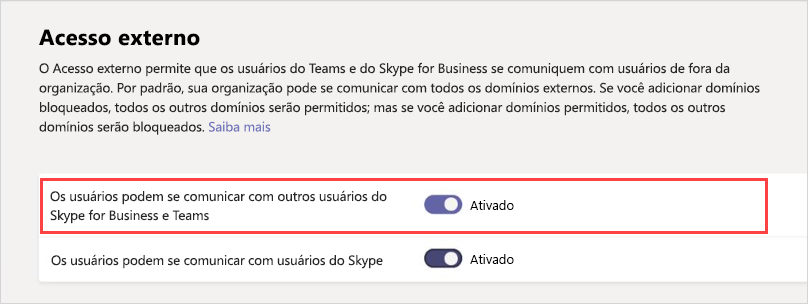

Gerenciar o acesso externo (federação) no Microsoft Teams
======================================================

Com o acesso externo de Teams da Microsoft, os usuários de outros domínios podem participar de sua bate-papos e chamadas. Você também pode permitir que usuários externos que ainda estejam usando Skype for Business para participar. 

Acesso externo (federação) e o acesso de convidado são diferentes:

- Acesso de convidado concede permissão de acesso a um indivíduo. Acesso externo concede permissão de acesso a um domínio inteiro.

- Acesso de convidado, uma vez concedido por um proprietário de equipe, permite que um convidado para [acessar recursos](guest-experience.md), como discussões de canal e de arquivos, para uma equipe específico e bate-papo com outros usuários na equipe de que foram convidados para. Com o acesso externo (federado bate-papo), os participantes externos chat não têm acesso para equipes ou os recursos da equipe da organização convidando. Eles só podem participar de bate-papo federado individuais. Administradores de Inquilino podem escolher entre as opções de dois comunicação, dependendo de qual nível de colaboração é desejável com o participante externo. Os administradores podem escolher abordagens ou ambos, dependendo de suas necessidades organizacionais, mas recomendamos que permitindo o acesso de convidado para uma experiência mais completa de equipes colaborativo. 

Consulte a tabela para obter uma comparação de externos e convidado para acessar os recursos a seguir.

| Recurso | Usuários de acesso externo | Usuários de acesso de convidado |
|---------|-----------------------|--------------------|
| Usuário puder conversar com alguém em outra empresa | Sim |Sim  |
| Usuário pode chamar alguém em outra empresa | Sim | Sim  |
| Usuário poderá ver se alguém de outra empresa está disponível para o bate-papo ou chamada | Sim | Sim1 |
| Usuários podem pesquisar para usuários por meio de inquilinos externos | Sim2 | Não |
| Usuário pode compartilhar arquivos | Não | Sim |
| Usuário pode acessar os recursos de equipes | Não | Sim |
| Usuário pode ser adicionado a um chat de grupo | Não | Sim |
| Usuário pode ser adicionado a uma reunião | Sim | Sim  |
| Usuários adicionais podem ser adicionados a uma conversa com um usuário externo | Nenhum3 | N/D |
| Usuário é identificado como um participante externo | Sim | Sim  |
| A presença é exibida | Sim | Sim  |
| Ausência temporária mensagem é mostrada | Não | Sim |
| Usuário individual poderão ser bloqueado. | Não | Sim |
| @mentions são suportados | Não | Sim |
||||

1 fornecida que o usuário foi adicionado como um convidado e tiver entrado no como convidado para o inquilino de convidado. 
2 somente por email ou endereço de protocolo de iniciação de sessão (SIP). 
3 bate-papo (federado) externo é 1:1 somente.

## Ativar ou desativar o acesso externo

Você pode usar o & Teams Microsoft Skype para centro de administração de negócios para gerenciar o acesso externo.

1. Na & Teams Microsoft Skype para Business Admin Center, selecione **configurações de toda a organização** > **acesso externo**.

     .

2. Alterne a chave de **acesso externo** para **ativada** ou **desativada**.

     .

3. Clique em **Salvar**. 

## Adicionar ou bloquear um domínio

Siga estas etapas para adicionar um domínio ou desativar o acesso externo para um domínio.

1. Na & Teams Microsoft Skype para Business Admin Center, selecione **configurações de toda a organização** > **acesso externo**.

2. Selecione **Adicionar um domínio**. 
 
    .

   O painel de **Adicionar um domínio** aparece.

    .

3. Em **Adicionar um domínio**, digite o nome do domínio; Por exemplo, digite Contoso.com.

4. Selecione **permitida** ou **bloqueada**. Você pode alterar essa configuração a qualquer momento.

2. Selecione **concluído**.

Depois de adicionar um domínio, você verá o nome de domínio e o status adicionado à lista de domínios na página de acesso externo.

## Mais informações

Para obter informações sobre o acesso de convidado no Teams da Microsoft, consulte [Gerenciar o acesso de convidado em equipes da Microsoft](manage-guests.md).