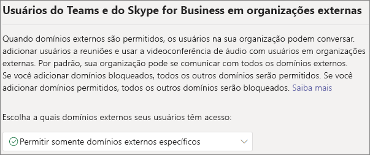
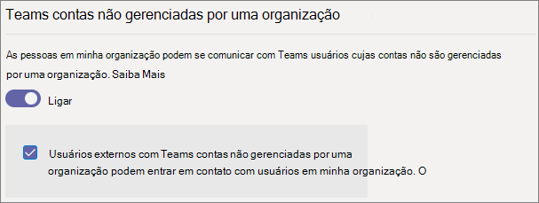
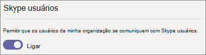

# <a name="manage-external-meetings-and-chat-in-microsoft-teams"></a>Gerenciar reuniões externas e chat no Microsoft Teams

Você pode configurar reuniões externas e chat no Teams usando o recurso *de acesso externo*. O acesso externo é uma maneira de os usuários do Teams de um domínio externo inteiro encontrarem, ligarem, conversarem e marcarem reuniões com você no Teams. Você também pode usar o acesso externo para se comunicar com pessoas de outras organizações que ainda usam o Skype for Business (online e local) e o Skype.

Se você quer que pessoas de outras organizações tenham acesso às equipes e canais, o acesso de convidado pode ser a melhor opção. Para obter mais informações sobre as diferenças entre o acesso externo e o acesso para convidado, confira [Comparar o acesso externo e o acesso para convidado](communicate-with-users-from-other-organizations.md#compare-external-and-guest-access). 

Usar o acesso externo quando:
  
- Você possui usuários em domínios externos que precisam conversar. Por exemplo, Rob@contoso.com e Ann@northwindtraders.com estão trabalhando em um projeto junto com outros nos domínios contoso.com e northwindtraders.com.

- Você desejar que as pessoas em sua organização usem o Teams para entrar em contato com pessoas em empresas específicas de fora de sua organização.

- Você desejar que todas as pessoas que usam o Teams sejam capazes de localizar e entrar em contato com você usando seu endereço de email. 

## <a name="plan-for-external-meetings-and-chat"></a>Planejar reuniões externas e chat

As políticas de acesso externo incluem controles para cada níveis da organização e do usuário. Desativar uma política no nível da organização a desativa para todos os usuários, independentemente da configuração de nível do usuário. Todas as configurações de acesso externo estão habilitadas por padrão.

O Centro de administração do Teams controla o acesso externo no nível da organização. A maioria das opções (exceto restrições de domínio) estão disponíveis no nível do usuário usando o PowerShell. Consulte [Usando o PowerShell](#using-powershell) abaixo para obter mais informações.

> [!NOTE]
> Se você desativar o acesso externo na sua organização, as pessoas fora da sua organização ainda poderão participar das reuniões por meio do ingresso anônimo. Para saber mais, consulte [Gerenciar configurações de reunião no Teams](meeting-settings-in-teams.md).

> [!NOTE]
> Os usuários do Teams podem adicionar aplicativos ao hospedar reuniões ou chats com pessoas de outras organizações. Eles também podem usar aplicativos compartilhados por pessoas de outras organizações quando ingressarem em reuniões ou chats hospedados por essas organizações. As políticas de dados da organização do usuário de hospedagem, assim como as práticas de compartilhamento de dados de qualquer aplicativo de terceiros compartilhado pela organização desse usuário, serão aplicadas.

## <a name="allow-or-block-domains"></a>Permitir ou bloquear domínios

Se adicionar domínios bloqueados, todos os outros domínios serão permitidos; mas se adicionar domínios permitidos, todos os outros domínios serão bloqueados. A exceção a esta regra é se participantes anônimos são permitidos nas reuniões. Há quatro cenários para configurar o acesso externo no Centro de administração do Teams (**Usuários** > **Acesso externo**):

- **Permitir todos os domínios externos**: essa é a configuração padrão no Teams e permite que as pessoas na sua organização localizem, liguem, conversem e configurem reuniões com pessoas externas à sua organização em qualquer domínio.

    Nesse cenário, os usuários podem se comunicar com todos os domínios externos que estão executando Teams ou Skype for Business desde que o outro locatário também suporte comunicações externas.
    
- **Permitir apenas domínios externos específicos**: ao adicionar domínios a uma lista **Permitir**, você limita o acesso externo apenas aos domínios permitidos. Depois de configurar uma lista de domínios permitidos, todos os outros domínios serão bloqueados. 

- **Bloquear domínios específicos**: ao adicionar domínios a uma lista de **bloqueados**, você pode se comunicar com todos os domínios externos, *exceto* os bloqueados.  Depois de configurar uma lista de domínios bloqueados, todos os outros domínios serão bloqueados.

- **Bloquear todos os domínios externos** - Impede que as pessoas na sua organização localizem, chamem, conversem e configurem reuniões com pessoas externas à sua organização em qualquer domínio.

> [!NOTE]
> Os domínios permitidos ou bloqueados só se aplicam às reuniões se o acesso anônimo às reuniões estiver "desabilitado".



**Usando o centro de administração do Microsoft Teams**

Para permitir domínios específicos

1. No Centro de administração do Teams, acesse **Usuários**  >  **Acesso externo**.

2. Em **Escolher quais domínios seus usuários possuem acesso**, escolha **Permitir apenas domínios externos específicos**.

3. Selecione **Permitir domínios**.

4. Na caixa **Domínio**, digite o domínio que você quer permitir e clique em **Feito**.

5. Se você quiser permitir outro domínio, clique em **Adicionar um domínio**.

6. Clique em **Salvar**.

Para bloquear domínios específicos

1. No Centro de administração do Teams, acesse **Usuários**  >  **Acesso externo**.

2. Em **Escolher quais domínios seus usuários possuem acesso**, escolha **Bloquear apenas domínios externos específicos**.

3. Selecione **Bloquear domínios**.

4. Na caixa **Domínio**, digite o domínio que você quer permitir e clique em **Feito**.

5. Se você quiser bloquear outro domínio, clique em **Adicionar um domínio**.

6. Clique em **Salvar**.

Para se comunicar com outro locatário, eles devem habilitar **Permitir todos os domínios externos** ou adicionar seu locatário à lista de domínios permitidos seguindo as mesmas etapas acima.  

## <a name="manage-contact-with-external-teams-users-not-managed-by-an-organization"></a>Gerenciar contato com usuários externos do Teams não gerenciados por uma organização

> [!NOTE]
> Os recursos de interoperabilidade do Teams e do Skype discutidos neste artigo não estão disponíveis em implantações do GCC, do GCC High ou do DOD ou em ambientes de nuvem privada.

Os administradores podem optar por habilitar ou desabilitar as comunicações com usuários externos do Teams que não são gerenciados por uma organização ("não gerenciado"). Se habilitado, eles também poderão controlar ainda mais se as pessoas com contas não controladas do Teams podem iniciar contato (consulte a imagem a seguir). Se **Usuários externos com contas do Teams não gerenciadas por uma organização podem contatar os usuários em minha organização** está desativado, os usuários não gerenciados do Teams não poderão pesquisar o endereço de email completo para localizar contatos da organização e todas as comunicações com usuários não gerenciados do Teams devem ser iniciadas pelos usuários da organização.

No Centro de administração do Teams, acesse **Usuários**  >  **Acesso externo**.



Para impedir que os usuários do Teams em sua organização se comuniquem com usuários externos do Teams cujas contas não são gerenciadas por uma organização:

1. Desative a configuração **Pessoas em minha organização podem se comunicar com usuários do Teams cujas contas não são gerenciadas por uma organização**.
2. Desmarque a caixa de seleção **Usuários externos com contas do Teams não gerenciadas por uma organização podem entrar em contato com os usuários em minha organização**.

Para permitir que os usuários do Teams em sua organização se comuniquem com usuários externos do Teams cujas contas não são gerenciadas por uma organização se os usuários do Teams tiverem iniciado o contato:

1. Ative a configuração **Pessoas em minha organização podem se comunicar com usuários do Teams cujas contas não são gerenciadas por uma organização**.
2. Desmarque a caixa de seleção **Usuários externos com contas do Teams não gerenciadas por uma organização podem entrar em contato com os usuários em minha organização**.

Para permitir que os usuários do Teams em sua organização se comuniquem com usuários externos do Teams cujas contas não são gerenciadas por uma organização e recebam solicitações para se comunicar com esses usuários externos do Teams:

1. Ative a configuração **Pessoas em minha organização podem se comunicar com usuários do Teams cujas contas não são gerenciadas por uma organização**.
2. Selecione a caixa de seleção **Usuários externos com contas do Teams não gerenciadas por uma organização podem entrar em contato com os usuários em minha organização**.

## <a name="communicate-with-skype-users"></a>Comunicar-se com usuários do Skype

Siga estas etapas para permitir que os usuários do Teams em sua organização conversem com usuários do Skype. Os usuários do Teams podem pesquisar e iniciar uma conversa de somente texto ou uma chamada de áudio/vídeo com usuários do Skype e vice-versa.



### <a name="using-the-microsoft-teams-admin-center"></a>Usando o centro de administração do Microsoft Teams

1. Na navegação à esquerda, acesse **Usuários** > **Acesso externo**.

2. Ative a configuração **Permitir que os usuários da minha organização se comuniquem com os usuários do Skype**.

Para saber mais sobre as formas pelas quais os usuários do Teams e do Skype podem se comunicar, incluindo as limitações que se aplicam, confira [Teams e a interoperabilidade do Skype](teams-skype-interop.md).

### <a name="using-powershell"></a>Usando o Windows PowerShell

As configurações no nível da organização podem ser definidas usando [Set-CSTenantFederationConfiguration](/powershell/module/skype/set-cstenantfederationconfiguration) e as configurações de nível de usuário podem ser definidas usando [Set-CsExternalAccessPolicy](/powershell/module/skype/set-csexternalaccesspolicy).

A tabela a seguir mostra os parâmetros de cmdlet usados para configurar a federação.

|Configuração|Nível da organização (Set-CSTenantFederationConfiguration)|Nível de usuário (Set-CsExternalAccessPolicy)|
|:-------|:--------|:------------------|
|Habilitar/desabilitar a federação com outras organizações do Teams e o Skype for Business|`-AllowFederatedUsers`|`-EnableFederationAccess`|
|Habilitar a federação com domínios específicos|`-AllowedDomains`|Não disponível|
|Desabilitar a federação com domínios específicos|`-BlockedDomains`|Não disponível|
|Habilitar/desabilitar a federação com usuários do Teams que não são gerenciados por uma organização|`-AllowTeamsConsumer`|`-EnableTeamsConsumerAccess`|
|Habilitar/desabilitar usuários do Teams não gerenciados por uma organização para iniciar conversas|`-AllowTeamsConsumerInbound`|`-EnableTeamsConsumerInbound`|
|Habilitar/desabilitar a federação com o Skype|`-AllowPublicUsers`|`-EnablePublicCloudAccess`|

É importante observar que a desabilitação de uma política "rola para baixo" do locatário para os usuários. Por exemplo:

```PowerShell
Set-CsTenantFederationConfiguration -AllowFederatedUsers $false
Set-CsExternalAccessPolicy -EnableFederationAccess $true
```

Neste exemplo, embora a política de nível de usuário esteja habilitada, os usuários não poderão se comunicar com usuários gerenciados do Teams ou usuários do Skype for Business porque esse tipo de federação foi desativado no nível da organização. Portanto, se desejar habilitar esses controles para um subconjunto de usuários, deverá ativar o controle no nível da organização e criar duas políticas de grupo — uma que se aplique aos usuários que devem ter o controle desativado e outra que se aplique aos usuários que devem ter o controle ativado.

## <a name="limit-external-access-to-specific-people"></a>Limitar o acesso externo a pessoas específicas

Se você tiver habilitado qualquer um dos controles de acesso externo no nível da organização, poderá limitar o acesso externo a usuários específicos usando o PowerShell.

Você pode usar o script de exemplo a seguir, substituindo *Control* pelo controle que você deseja alterar, *PolicyName* pelo nome que deseja dar à política e *UserName* para cada usuário para o qual você deseja habilitar/desabilitar o acesso externo.

Certifique-se de ter instalado o [Módulo Microsoft Teams PowerShell](/microsoftteams/teams-powershell-install) antes de executar o script.

```PowerShell
Connect-MicrosoftTeams

# Disable external access globally
Set-CsExternalAccessPolicy -<Control> $false

# Create a new external access policy
New-CsExternalAccessPolicy -Identity <PolicyName> -<Control> $true

# Assign users to the policy
$users_ids = @("<UserName1>", "<UserName2>")
New-CsBatchPolicyAssignmentOperation -PolicyType ExternalAccessPolicy -PolicyName "<PolicyName>" -Identity $users_ids

```

Por exemplo, habilite as comunicações com usuários externos do Teams não gerenciados por uma organização:

```PowerShell
Connect-MicrosoftTeams

Set-CsExternalAccessPolicy -EnableTeamsConsumerAccess $false

New-CsExternalAccessPolicy -Identity ContosoExternalAccess -EnableTeamsConsumerAccess $true

$users_ids = @("MeganB@contoso.com", "AlexW@contoso.com")
New-CsBatchPolicyAssignmentOperation -PolicyType ExternalAccessPolicy -PolicyName "ContosoExternalAccess" -Identity $users_ids

```

Consulte [New-CsBatchPolicyAssignmentOperation](/powershell/module/teams/new-csbatchpolicyassignmentoperation) para obter exemplos adicionais de como compilar uma lista de usuários.

Você pode ver a nova política executando `Get-CsExternalAccessPolicy`.

Consulte também [New-CsExternalAccessPolicy](/powershell/module/skype/new-csexternalaccesspolicy) e [Set-CsExternalAccessPolicy](/powershell/module/skype/set-csexternalaccesspolicy).

## <a name="common-external-access-scenarios"></a>Casos comuns de acesso externo

As seções a seguir descrevem como habilitar a federação para cenários de acesso externo comuns e como a Política de atualização do Teams determina a entrega de chats e chamadas de entrada.

### <a name="enable-federation-between-users-in-your-organization-and-other-organizations"></a>Habilitar a federação entre usuários em sua organização e outras organizações

Para habilitar que os usuários em sua organização se comuniquem com usuários em outra organização, ambas as organizações devem habilitar a federação. As etapas para habilitar a federação para uma determinada organização dependem se a organização é puramente online, híbrida ou puramente local.

| Se sua organização for | Habilitar a federação da seguinte forma |
|:---------|:-----------------------|
|Online sem Skype for Business no local. Isso inclui organizações que têm usuários TeamsOnly e/ou usuários do Skype for Business Online.| Se estiver usando o Centro de Administração Teams: <br>- Verifique se os domínios com os quais você deseja se comunicar têm permissão para acesso externo.<br><br>Se estiver usando PowerShell:<br>- Certifique-se de que o locatário esteja habilitado para federação: `Get-CsTenantFederationConfiguration` deve mostrar `AllowFederatedUsers=true` <br>- Verifique se o valor efetivo de `CsExternalAccessPolicy` tem `EnableFederationAccess=true`.<br>- Se você não estiver usando federação aberta, certifique-se de que o domínio de destino esteja listado em `AllowedDomains` de `CsTenantFederationConfiguration`. |
|Somente local| Em ferramentas locais: <br>- Certifique-se de que a federação está habilitada em `CsAccessEdgeConfiguration`.<br>- Certifique-se de que a federação para o usuário está habilitada por meio de `ExternalAccessPolicy` (seja por meio da política global, política do site ou política atribuída pelo usuário). <br> - Se você não estiver usando federação aberta, certifique-se de que o domínio de destino esteja listado em `AllowedDomains`.|
|Híbrido com alguns usuários online (no Skype for Business ou Teams) e alguns usuários no local. | Siga as etapas acima para organizações online e locais. |

### <a name="delivery-of-incoming-chats-and-calls"></a>Entrega de chats e chamadas recebidas 

Os chats e chamadas de entrada de uma organização de federação chegarão ao Teams ou ao cliente do Skype for Business do usuário, dependendo do modo do usuário destinatário no TeamsUpgradePolicy.

| Se você quiser | Faça o seguinte: |
|:---------|:-----------------------|
|Verifique se os chats federados de entrada e as chamadas chegam no cliente do Teams do usuário|Configure seus usuários para serem TeamsOnly.
|Verifique se os chats federados de entrada e as chamadas chegam no cliente do Skype for Business do usuário|Configure seus usuários para estarem em qualquer modo diferente de TeamsOnly.|

### <a name="enable-federation-between-users-in-your-organization-and-unmanaged-teams-users"></a>Habilitar a federação entre usuários em sua organização e usuários não gerenciados do Teams

Para habilitar a federação entre usuários em sua organização e usuários não gerenciados do Teams:

| Se sua organização for | Habilitar a federação da seguinte forma |
|:---------|:-----------------------|
|Online sem Skype for Business no local. Isso inclui organizações que têm usuários somente do Teams e/ou usuários do Skype for Business Online.| Se estiver usando o Centro de administração do Teams:<br>-Verifique se **Pessoas em minha organização podem se comunicar com usuários do Teams cujas contas não são gerenciadas por uma organização** está habilitada no **Acesso Externo**.<br>-Se você quiser que contas não gerenciadas do Teams iniciem chats, marque a caixa de seleção para **Usuários externos com contas do Teams não gerenciadas por uma organização podem entrar em contato com os usuários em minha organização**.<br><br>Se estiver usando PowerShell:<br>- Certifique-se de que o locatário está habilitado para federação: `Get-CsTenantFederationConfiguration` deve mostrar `AllowTeamsConsumer=true`.<br>-Verifique se o valor efetivo de `CsExternalAccessPolicy` tem `EnableTeamsConsumerAccess=true`.<br>-Verifique se o locatário está habilitado para usuários não gerenciados iniciarem chats: `Get-CsTenantFederationConfiguration` deve mostrar `AllowTeamsConsumerInbound=true`.<br>-Verifique se o valor efetivo de `CsExternalAccessPolicy` tem `EnableTeamsConsumerInbound=true`.|
|Somente local| O chat com usuários não gerenciados do Teams não tem suporte apenas para organizações locais.|
|Híbrido com alguns usuários online (no Skype for Business ou Teams) e alguns usuários no local. | Siga as etapas descritas anteriormente para organizações online. Observe que o chat com usuários não gerenciados do Teams não tem suporte para usuários locais.|

> [!IMPORTANT]
> Você não precisa adicionar nenhum **domínio do Teams** como domínios permitidos para permitir que os usuários do Teams se comuniquem com usuários não gerenciados do Teams fora da sua organização. Todos os **domínios do Teams não gerenciados** são permitidos.

### <a name="enable-federation-between-users-in-your-organization-and-consumer-users-of-skype"></a>Habilite a federação entre usuários em sua organização e usuários consumidores do Skype

Para habilitar a federação entre usuários em sua organização e usuários consumidores do Skype:

| Se sua organização for | Habilitar a federação do consumidor da seguinte forma |
|:---------|:-----------------------|
|Online somente sem o Skype for Business local. Isso inclui organizações que têm usuários TeamsOnly e/ou usuários do Skype for Business Online. | Se estiver usando o Centro de Administração Teams: <br>-Certifique-se de que **Permitir que os usuários da minha organização se comuniquem com os usuários do Skype** esteja habilitado no Acesso Externo.<br><br>Se estiver usando PowerShell: <br>- Certifique-se de que o locatário está habilitado para federação: `Get-CsTenantFederationConfiguration` deve mostrar `AllowPublicUsers=true`. <br> - Verifique se o valor efetivo de `CsExternalAccessPolicy` tem `EnablePublicCloudAccess=true`. |
|Somente local| Em ferramentas locais: <br> - Certifique-se de que o Skype está habilitado como parceiro federado. <br> - Garantir `EnablePublicCloudAccess=true` para o usuário por meio de `ExternalAccessPolicy` (por meio de política global, política do site ou política atribuída pelo usuário).|
| Híbrido com alguns usuários online (no Skype for Business ou Teams) e alguns usuários no local.| Siga as etapas acima para organizações online e locais.

> [!IMPORTANT]
> Você não precisa adicionar **domínios do Skype** como domínios permitidos para permitir que os usuários do Teams ou do Skype for Business Online se comuniquem com usuários do Skype dentro ou fora da sua organização. Todos os **domínios do Skype** são permitidos.

## <a name="federation-diagnostic-tool"></a>Ferramenta de Diagnóstico de Federação

Se você for um administrador, poderá usar a seguinte ferramenta de diagnóstico para validar se um usuário do Teams pode se comunicar com um usuário federado do Teams:

1. Selecione **Executar testes** abaixo, o que preencherá o diagnóstico no Centro de Administração do Microsoft 365. 

   > [!div class="nextstepaction"]
   > [Executar testes: Federação do Teams](https://aka.ms/TeamsFederationDiag)

2. No painel "Executar diagnóstico", insira o **Endereço do protocolo SIP** e o **Nome de domínio do locatário federado**, e selecione **Executar Testes**.

3. Os testes retornarão as melhores próximas etapas para resolver quaisquer configurações de locatário ou de política que estejam impedindo a comunicação com o usuário federado.


## <a name="related-topics"></a>Tópicos relacionados

[Experiência de chat nativo para usuários externos (federados)](native-chat-for-external-users.md)
