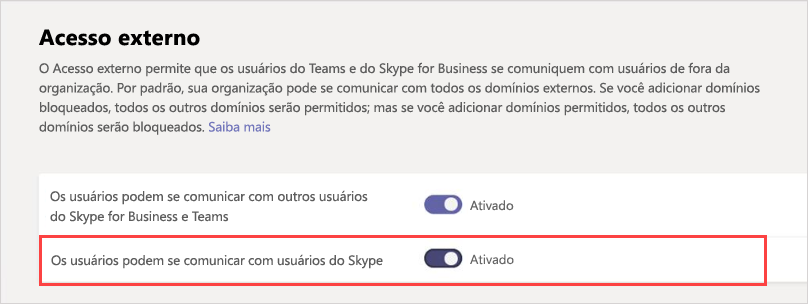

Gerenciar o acesso externo no Microsoft TeamsManage external access in Microsoft Teams
======================================================

O acesso externo é uma maneira para os usuários do teams de um domínio externo inteiro para localizar, chamar, bater papo e configurar reuniões com você no Teams.External access is a way for Teams users from an entire external domain to find, call, chat, and set up meetings with you in Teams. Você também pode usar o acesso externo para se comunicar com usuários externos que ainda estão usando o Skype for Business (online e local) e o Skype (na versão prévia).You can also use external access to communicate with external users who are still using Skype for Business (online and on-premises) and Skype (in preview).

Se desejar que usuários externos tenham acesso a equipes e canais, o acesso para convidado será a melhor opção.If you want external users to have access to teams and channels, guest access might be a better way to go. Para obter mais informações sobre as diferenças entre o acesso externo e o acesso para convidado, confira [Comparar o acesso externo e o acesso para convidado](communicate-with-users-from-other-organizations.md#compare-external-and-guest-access).For more information about the differences between external access and guest access, see [Compare external and guest access](communicate-with-users-from-other-organizations.md#compare-external-and-guest-access). 

Usar o acesso externo quando:Use external access when:
  
- Você tem usuários em domínios diferentes que precisam colaborar.You have users in different domains who need to collaborate. Por exemplo, pedro@contoso.com e eduarda@northwindtraders.com estão trabalhando em um projeto junto com outros nos domínios contoso.com e northwindtraders.com.For example, Rob@contoso.com and Ann@northwindtraders.com are working on a project together along with some others in the contoso.com and northwindtraders.com domains.

- Você desejar que as pessoas em sua organização usem o Teams para entrar em contato com pessoas em empresas específicas de fora de sua organização.You want the people in your organization to use Teams to contact people in specific businesses outside of your organization.

- Você desejar que todas as pessoas que usam o Teams sejam capazes de localizar e entrar em contato com você usando seu endereço de email.You want anyone else in the world who uses Teams to be able to find and contact you, using your email address. 

> [!IMPORTANT]
> Atualmente, para executar a federação dentro do aplicativo Microsoft Teams a um usuário externo à sua organização que não seja um convidado do Azure AD (Azure Active Directory) ou locatário, a sua configuração como híbrido deve estar correta e você deve ter migrado para o Skype for Business Online.Currently, to federate within the Microsoft Teams app to an external user outside of your organization who's not currently a guest of your Azure Active Directory (Azure AD) or tenant, you must be correctly set up for hybrid and moved to Skype for Business Online. A partir de 25 de fevereiro de 2019, o Teams não terá mais suporte à federação nativa sem o usuário do perfil SIP estar hospedado no Skype for Business Online.As of February 25, 2019, Teams doesn't support native federation without the user of the SIP profile being homed in Skype for Business Online. Para saber mais sobre como configurar sua conta como híbrida e depois migrar o Teams, confira [Atualizar de uma implantação híbrida do Skype for Business para o Teams](https://docs.microsoft.com/microsoftteams/upgrade-to-teams-execute-skypeforbusinesshybrid).For more on setting up your account for hybrid and then moving to Teams, see [Upgrade Skype for Business hybrid deployment to Teams](https://docs.microsoft.com/microsoftteams/upgrade-to-teams-execute-skypeforbusinesshybrid).

## Planejar o acesso externoPlan for external access

O acesso externo é ativado por padrão no Teams, o que significa que sua organização pode se comunicar com todos os domínios externos.By default, external access is turned on in Teams, which means that your organization can communicate with all external domains. Se adicionar domínios bloqueados, todos os outros domínios serão permitidos; mas se adicionar domínios permitidos, todos os outros domínios serão bloqueados.If you add blocked domains, all other domains will be allowed; and if you add allowed domains, all other domains will be blocked. Há três casos para configurar o acesso externo no centro de administração do Teams (**Configurações de toda a organização** > **Acesso externo**):There are three scenarios for setting up external access in the Teams admin center (**Org-wide settings** > **External access**):

- **Federação aberta**: essa é a configuração padrão no Teams. Ela permite que as pessoas em sua organização localizem, façam chamadas e enviem mensagens instantâneas, conversem e configurem reuniões com pessoas de fora da sua organização, em qualquer domínio.**Open federation**: This is the default setting in Teams, and it lets people in your organization find, call, chat, and set up meetings with people external to your organization in any domain.

    Neste caso, os usuários podem se comunicar com todos os domínios externos que estejam executando o Teams ou o Skype for Business e estejam usando a Federação Aberta ou tenham adicionado seu domínio à lista de permissões.In this scenario, your users can communicate with all external domains that are running Teams or Skype for Business AND are using open federation OR have added your domain to their allow list.

- **Permitir domínios específicos**: ao adicionar domínios a uma lista de **permissões**, você limita o acesso externo somente aos domínios permitidos.**Allow specific domains**: By adding domains to an **Allow** list, you limit external access to only the allowed domains. Depois de configurar uma lista de domínios permitidos, todos os outros domínios serão bloqueados.Once you set up a list of allowed domains, all other domains will be blocked. Para permitir domínios específicos, clique em **Adicionar um domínio**, adicione o nome do domínio, clique em **Ação a ser executada neste domínio** e depois selecione **Permitido**.To allow specific domains, click **Add a domain**, add the domain name, click **Action to take on this domain**, and then select **Allowed**.

- **Bloquear domínios específicos**: ao adicionar domínios a uma lista de **bloqueados**, você pode se comunicar com todos os domínios externos, *exceto* os bloqueados.**Block specific domains** - By adding domains to a **Block** list, you can communicate with all external domains *except* the ones you've blocked. Para bloquear domínios específicos, clique em **Adicionar um domínio**, adicione o nome do domínio, clique em **Ação a ser executada neste domínio** e depois selecione **Bloqueado**.To block specific domains, click **Add a domain**, add the domain name, click **Action to take on this domain**, and then select **Blocked**. Depois de configurar uma lista de domínios bloqueados, todos os outros domínios serão bloqueados.Once you set up a list of blocked domains, all other domains will be allowed.

## Permitir ou bloquear domíniosAllow or block domains

### Etapa 1: habilitar sua organização a se comunicar com outras organizações do TeamsStep 1 - Enable your organization to communicate with another Teams organization

  **Usando centro de administração Microsoft Teams**  **Using the Microsoft Teams admin center**

1. Na navegação à esquerda, acesse **Configurações em toda a organização** > **Acesso externo**.In the left navigation, go to **Org-wide settings** > **External access**.

2. Ative a configuração **Os usuários podem se comunicar com usuários do Skype for Business e do Teams**.Turn on the **Users can communicate with other Skype for Business and Teams users** setting.

     ..

3. Se você deseja permitir que todas as organizações do Teams se comuniquem com os usuários em sua organização, pule para a Etapa 5.If you want to allow all Teams organizations to communicate with users in your organization, skip to step 5.

4. Se você deseja limitar as organizações que podem se comunicar com os usuários em sua organização, é possível dar permissão a todos os domínios com exceção de alguns ou permitir apenas domínios específicos.If you want to limit the organizations that can communicate with users in your organization, you can either allow all except some domains, or you can allow only specific domains. 

    - Para permitir todos os domínios com exceção de alguns, clique em **Adicionar domínio** para adicionar os domínios que deseja bloquear.To allow all except some domains, add the domains you want to block by clicking **Add domain**. No painel **Adicionar um domínio**, digite o nome do domínio, clique em **Bloqueado** e depois em **Concluído**.In the **Add a domain** pane, type the domain name, click **Blocked**, and then click **Done**. 
    - Para limitar as comunicações a organizações específicas, adicione esses domínios à lista com um status de **Permitido**.To limit communications to specific organizations, add those domains to the list with a status of **Allowed**. Depois de ter adicionado um domínio à lista de Permissões, as comunicações com outras organizações estarão limitadas apenas às organizações cujos domínios estiverem na lista de Permissões.Once you have added any domain to the Allow list, communications with other organizations will be limited to only those organizations whose domains are in the Allow list. 

5. Clique em **Salvar**.Click **Save**.

6. Verifique se o administrador do Teams da outra organização concluiu as mesmas etapas.Make sure the admin in the other Teams organization completes these same steps. Por exemplo, na lista de **domínios permitidos**, o administrador precisará inserir o domínio da sua empresa caso ele limite as organizações que podem se comunicar com seus usuários.For example, in their **allowed domains** list, their admin needs to enter the domain for your business if they limit the organizations that can communicate with their users.

### Etapa 2: testarStep 2 - Test it

Para testar sua configuração, você precisa de um usuário do Teams que não seja protegido pelo seu firewall.To test your setup, you need a Teams user who's not behind your firewall.
  
1. Depois de você e o administrador da organização terem alterado as configurações de **Acesso externo**, tudo deve estar pronto.After you and the admin from the organization have changed the **External access** settings, you should be good to go.

2. No aplicativo do Teams, pesquise um endereço de email e envie uma solicitação de chat.In the Teams app, search for the person by email address, and send a request to chat.

3. Peça ao seu contato do Teams para lhe enviar uma solicitação de chat.Ask your Teams contact to send you a request to chat. Se você não receber a solicitação, é porque o problema está nas suas configurações de firewall (pressupondo que seu contato já confirmou que as configurações de firewall dele estão corretas).If you don't receive their request, the problem is your firewall settings (assuming they've already confirmed their firewall settings are correct).

4. Outra maneira de testar se o problema está no seu firewall é acessar um local com WiFi não protegido pelo seu firewall,Another way to test whether the problem is your firewall is to go to a WiFi location not behind your firewall. como uma cafeteria, e usar o Teams para enviar uma solicitação de chat ao seu contato.such as a coffee shop, and use Teams to send a request to your contact to chat. Se conseguir enviar a mensagem usando o WiFi do local e não conseguir fazer o mesmo no seu trabalho, isso quer dizer que o problema está no seu firewall.If the message goes through at the WiFi location, but does not when you're at work, then you know the problem is your firewall.

> [!NOTE]
> Isso funcionará se você e outro usuário habilitarem o acesso externo e permitirem domínios um do outro.If you and another user both turn on external access and allow one another's domains, this will work. Se não funcionar, o outro usuário deve verificar se a configuração que ele está usando está bloqueando o seu domínio.If it doesn't work, the other user should make sure their configuration isn't blocking your domain.

## Comunicação com usuários em uma organização do Skype for Business OnlineCommunicate with users in a Skype for Business Online organization

Se estiver configurando o acesso externo para permitir que os usuários do Teams localizem e entrem em contato com os usuários de uma organização do Skype for Business que limitam quem pode entrar em contato com seus usuários, siga as etapas para configurar o acesso externo do seu domínio com o domínio da outra organização.If you're setting up external access to let your Teams users find and contact users in a Skype for Business organization that limits who can contact their users, follow the steps to set up external access from your domain to the other organization's domain. Depois, peça ao administrador da outra organização para seguir as etapas abaixo para configurar o acesso externo ao Skype for Business Online.Then ask the admin in the other organization to follow the steps below to configure external access for Skype for Business Online.

Para obter orientação específica sobre casos comuns do Skype for Business Online, confira [Casos de acesso externo comuns](#common-external-access-scenarios) abaixo.For specific guidance on common Skype for Business Online scenarios, see [Common external access scenarios](#common-external-access-scenarios) below.

 **Usando o centro de administração do Skype for Business** **Using the Skype for Business admin center**

Solicite que o administrador da organização siga estas etapas:Have the admin in that organization do these steps:

1. No centro de administração Microsoft 365, acesse **Centros de administração** > **Teams e Skype** > **Portal herdado**.In the Microsoft 365 admin center, go to **Admin Centers** > **Teams & Skype** > **Legacy portal**.
  
2. No **Centro de administração Skype for Business**, escolha **Organização** > **Comunicações externas**.In the **Skype for Business admin center**, choose **Organization** > **External communications**.

3. Para configurar a comunicação com uma empresa específica ou com usuários em outro domínio, na caixa suspensa, escolha **Ativado somente para os domínios permitidos**.To set up communication with a specific business or with users in another domain, in the drop-down box, choose **On only for allowed domains**.

    OU, se o administrador desejar habilitar a comunicação com todos que tiverem as políticas do Skype for Business, escolha **Ativado exceto para domínios bloqueados**.OR, if they want to enable communication with everyone else in the world who has open Skype for Business policies, choose **On except for blocked domains**. Esta é a configuração padrão.This is the default setting.

4. Em **Domínios bloqueados ou permitidos**, escolha **+** e adicione o nome do domínio que você deseja permitir.Under **Blocked or allowed domains**, choose **+**, and then add the name of the domain you want to allow.

## Comunicação com usuários do Skype (na visualização)Communicate with Skype users (in preview)

Siga estas etapas para permitir que os usuários do Teams em sua organização conversem com usuários do Skype.Follow these steps to let Teams users in your organization chat with and call Skype users. Os usuários do Teams podem pesquisar e iniciar uma conversa de somente texto ou uma chamada de áudio/vídeo com usuários do Skype e vice-versa.Teams users can then search for and start a one-on-one text-only conversation or an audio/video call with Skype users and vice versa.

  **Usando centro de administração Microsoft Teams**  **Using the Microsoft Teams admin center**

1. Na navegação à esquerda, acesse **Configurações em toda a organização** > **Acesso externo**.In the left navigation, go to **Org-wide settings** > **External access**.

2. Ative a configuração **Os usuários podem se comunicar com os usuários do Skype**.Turn on the **Users can communicate with Skype users** setting.

    ..

Para saber mais sobre as formas pelas quais os usuários do Teams e do Skype podem se comunicar, incluindo as limitações que se aplicam, confira [Teams e a interoperabilidade do Skype](teams-skype-interop.md).To learn more about the ways that Teams users and Skype users can communicate, including limitations that apply, see [Teams and Skype interoperability](teams-skype-interop.md).

## Casos comuns de acesso externoCommon external access scenarios

|**Se você quiser...****If you want to....**  |**Faça isto****Do this**  |
|---------|-----------------------|
|Permita que **usuários do Teams** da sua organização se comuniquem com **usuários do Teams** de outra organização (externa).Let **Teams users** in your organization communicate with **Teams users** in another (external) organization.|No Acesso externo, adicione o domínio externo à lista permitida ou use a federação aberta.In External Access, add the external domain to the Allowed list or use open federation. Depois, o administrador da outra organização do Teams deve fazer o mesmo.Then have the administrator in the other Teams organization do the same thing.      |
|Permita que **usuários do Teams** da sua organização se comuniquem com **usuários do Skype for Business Online** da mesma organização.Let **Teams users**  in your organization  communicate with **Skype for Business Online users**  in the same organization.  |Habilite o modo de Coexistência ou escolha o modo de Atualização das ilhas para oferecer suporte aos usuários do Skype for Business em sua organização.Enable Coexistence mode or choose the Islands upgrade mode to support Skype for Business users in your organization.   |
|Permita que **usuários do Teams** da sua organização se comuniquem com **usuários do Skype for Business Online** de outra organização (externa).Let **Teams users** in your organization communicate with **Skype for Business Online users** in another (external) organization.      |No Acesso externo, adicione o domínio externo à lista de permissões ou use a federação aberta.In External Access, add the external domain to the Allowed list or use open federation.   No Acesso Externo, ative a configuração **Os usuários podem se comunicar com usuários do Skype for Business e do Teams**.Turn on **Users can communicate with other Skype for Business and Teams users** setting in External Access. Depois, o administrador da outra organização do Teams deve fazer o mesmo.Then have the administrator in the other Teams organization do the same thing.   **OBSERVAÇÃO**: o domínio externo com usuários do Skype for Business deve habilitar o modo de Coexistência ou escolher o modo de Atualização das ilhas para oferecer suporte aos usuários do Skype for Business na organização.**NOTE**: The external domain with Skype for Business users must enable Coexistence mode or choose the Islands upgrade mode to support Skype for Business users in that organization.|
|Permita que **usuários do Teams** em sua organização se comuniquem com usuários do **Skype**.Let **Teams users** in your organization communicate with **Skype** users.  (em visualização)(in preview)  |No Acesso Externo, ative a configuração **Os usuários podem se comunicar com usuários do Skype**.Turn on the **Users can communicate with Skype users** setting in External Access. |
|Permita que seus **usuários do Skype for Business online** se comuniquem com **usuários do teams** em outro 365 ou o Office 365.Let your **Skype for Business Online users** communicate with **Teams users** in another Microsoft 365 or Office 365.| Os usuários do Skype for Business Online podem se comunicar com usuários do Teams em outra organização se os usuários estiverem em um dos seguintes modos de atualização: Ilhas, SfBOnly, SfBWIthTeamsCollab, SfBWithTeamsCollabAndMeetings, e se os usuários do Teams de outra organização estiverem no modo TeamsOnly.Your Skype for Business Online users can communicate with Teams users in another organization if your users are in one of the following upgrade modes: Islands, SfBOnly, SfBWIthTeamsCollab, SfBWithTeamsCollabAndMeetings; and the other organization's Teams users are in TeamsOnly mode.   No Acesso Externo, ative a configuração **Os usuários podem se comunicar com outros usuários do Skype for Business e do Teams**.Turn on the **Users can communicate with other Skype for Business and Teams users** setting in External Access. Depois, o administrador de outra organização com o Teams deve fazer o mesmo.Then have the administrator in the other Teams organization do the same things.|
|Permita que seus **usuários do Skype for Business online** se comuniquem com **usuários do Skype for Business online** de outro Microsoft 365 ou do Office 365.Let your **Skype for Business Online users** communicate with **Skype for Business Online users** from another Microsoft 365 or Office 365.    | Os usuários do Skype for Business Online podem se comunicar com usuários do Skype for Business Online em outra organização se os usuários estiverem em um dos seguintes modos de atualização: Ilhas, SfBOnly, SfBWIthTeamsCollab, SfBWithTeamsCollabAndMeetings; e se os usuários do Skype for Business Online de outra organização estiverem nos seguintes modos de atualização: Ilhas, SfBOnly, SfBWIthTeamsCollab, SfBWithTeamsCollabAndMeetings.Your Skype for Business Online users can communicate with Skype for Business Online users in another organization if your users are in one of the following upgrade modes: Islands, SfBOnly, SfBWIthTeamsCollab, SfBWithTeamsCollabAndMeetings; and the other organization's Skype for Business Online users are in one of the following upgrade modes: Islands, SfBOnly, SfBWIthTeamsCollab, SfBWithTeamsCollabAndMeetings.  No Acesso Externo, ative a configuração **Os usuários podem se comunicar com outros usuários do Skype for Business e do Teams**.Turn on the **Users can communicate with other Skype for Business and Teams users** setting in External Access. Depois, o administrador de outra organização com o Teams deve fazer o mesmo.Then have the administrator in the other Teams organization do the same things.|
|Permita que **usuários do Skype for Business Online** se comuniquem com **usuários do Skype for Business Online** de outra organização local.Let your **Skype for Business Online users** communicate with **Skype for Business users** from an on-premises organization.     |Os usuários do Skype for Business Online podem se comunicar com usuários do Skype for Business Online de uma organização local se os usuários estiverem em um dos seguintes modos de atualização: Ilhas, SfBOnly, SfBWIthTeamsCollab, SfBWithTeamsCollabAndMeetings; e se os usuários do Skype for Business Online de outra organização estiverem nos seguintes modos de atualização: Ilhas, SfBOnly, SfBWIthTeamsCollab, SfBWithTeamsCollabAndMeetings.Your Skype for Business Online users can communicate with Skype for Business users from an on-premises organization if your users are in one of the following upgrade modes: Islands, SfBOnly, SfBWIthTeamsCollab, SfBWithTeamsCollabAndMeetings; and the other organization's Skype for Business Online users are in one of the following upgrade modes: Islands, SfBOnly, SfBWIthTeamsCollab, SfBWithTeamsCollabAndMeetings.  No Acesso Externo, ative a configuração **Os usuários podem se comunicar com outros usuários do Skype for Business e do Teams**.Turn on the **Users can communicate with other Skype for Business and Teams users** setting in External Access. Depois, o administrador de outra organização com o Teams deve fazer o mesmo.Then have the administrator in the other Teams organization do the same things.|
|Permita que **usuários do Skype for Business Online** se comuniquem com **usuários do Skype** (de dentro ou de fora da sua organização).Let your **Skype for Business Online users** communicate with **Skype users** (inside or outside your organization).   |No Acesso Externo, ative a configuração **Os usuários podem se comunicar com usuários do Skype**.Turn on the **Users can communicate with Skype users** setting in External Access.|

> [!IMPORTANT]
> Não é necessário adicionar nenhum **domínio do Skype** como domínio permitido para permitir que os usuários do Teams ou do Skype for Business Online se comuniquem com usuários do Skype de dentro ou de fora da sua organização.You don't have to add any **Skype domains** as allowed domains in order to enable Teams or Skype for Business Online users to communicate with Skype users inside or outside your organization. Todos os **domínios Skype** estão na lista de permissões, o que significa que todos esses domínios são considerados PERMITIDOS.All **Skype domains** are whitelisted, which means all of these domains are considered ALLOWED.

## Como o acesso externo se compara ao acesso para convidado?How does external access compare with guest access?

Para saber mais sobre a diferença entre o acesso externo e o acesso para convidado, confira[Comunicar-se com usuários de outras organizações](communicate-with-users-from-other-organizations.md).To learn about the difference between external access and guest access, read [Communicate with users from other organizations](communicate-with-users-from-other-organizations.md).

## Tópicos relacionadosRelated topics

- [Experiência de chat nativo para usuários externos (federados)Native chat experience for external (federated) users](native-chat-for-external-users.md)
