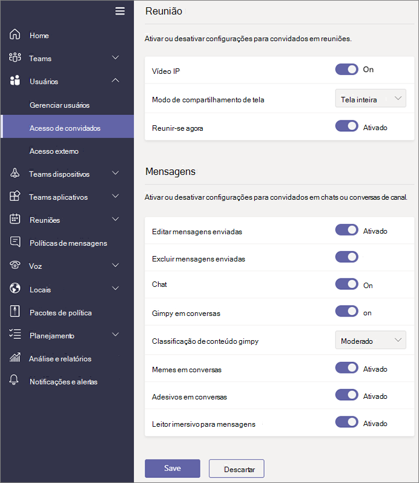

Gerenciar o acesso de convidados no Microsoft TeamsManage guest access in Microsoft Teams
======================================

**Convidado** é um tipo de licença de usuário/na Microsoft Teams que está incluído com todas as inscrições de educação do Office 365, Office 365 Enterprise e Business Premium do Office 365.**Guest** is a user/license type in Microsoft Teams that is included with all Office 365 Business Premium, Office 365 Enterprise, and Office 365 Education subscriptions. Não é necessária nenhuma licença adicional do Office 365.No additional Office 365 license is necessary. O acesso de convidados no Teams é uma configuração em nível de locatário e está desabilitado por padrão.Teams guest access is a tenant-level setting and is turned off by default. Para obter detalhes sobre como habilitar o acesso de convidado, consulte [Ativar ou desativar o acesso de convidado para equipes da Microsoft](set-up-guests.md).For details about how to enable guest access, see [Turn on or off guest access to Microsoft Teams](set-up-guests.md).

Depois que o tipo de licença de **usuário/Convidado** está ativado, você pode definir configurações para convidados por meio dos controles descritas nas [configurações de gerenciar equipes da Microsoft para a sua organização](enable-features-office-365.md) e [gerenciar equipes durante a transição para o novo Teams da Microsoft Centro de administração](manage-teams-skypeforbusiness-admin-center.md).After the **Guest** user/license type is turned on, you can configure settings for guests via the controls described in [Manage Microsoft Teams settings for your organization](enable-features-office-365.md) and [Manage Teams during the transition to the new Microsoft Teams admin center](manage-teams-skypeforbusiness-admin-center.md).     
    
Administradores de TI podem adicionar convidados a nível de locatário, definir e gerenciar permissões e as diretivas de usuário convidado e recepção relatórios sobre as atividades do usuário convidado.IT admins can add guests at the tenant level, set and manage guest user policies and permissions, and pull reports on guest user activity. Esses controles estão disponíveis por meio do Centro de administração do Microsoft Teams.These controls are available through the Microsoft Teams admin center. O conteúdo e as atividades dos usuários convidados estão sob a mesma proteção de conformidade e auditoria que o restante do Office 365.Guest user content and activities are under the same compliance and auditing protection as the rest of Office 365.

Os proprietários de equipe podem convidar novos convidados e adicionar usuários existentes do diretório convidado a suas equipes.Team owners can invite new guests and add existing directory guest users to their teams. Os proprietários de equipe podem identificar usuários convidados por meio de **equipes** > **gerenciar equipes**e recursos relacionados à canal de conjunto de convidados por meio de **configurações de toda a organização** > **acesso como convidado**, incluindo permitir que os convidados criar, atualizar, e Exclua canais, conforme mostrado na seguinte imagem.Team owners can identify guest users via **Teams** > **Manage teams**, and set channel-related capabilities for guests via **Org-wide settings** > **Guest access**, including allowing guests to create, update, and delete channels, as shown in the following screenshot.

  
Você pode usar o portal do Azure Active Directory para gerenciar seu acesso ao Office 365 e recursos de equipes e convidados.You can use the Azure Active Directory portal to manage guests and their access to Office 365 and Teams resources. O acesso de convidados das equipes faz uso dos recursos de colaboração entre empresas (B2B) do Azure Active Directory como a infraestrutura subjacente para armazenar informações de princípios de segurança, como propriedades de identidade, assinaturas e configurações de autenticação multifator.Teams guest access makes use of Azure Active Directory business-to-business (B2B) collaboration capabilities as the underlying infrastructure to store security principles information such as identity properties, memberships, and multi-factor authentication settings. Para saber mais sobre o Azure Active Directory B2B, consulte [O que é a colaboração do Azure AD B2B?](https://go.microsoft.com/fwlink/p/?linkid=853011) e [Perguntas frequentes de colaboração do Azure Active Directory B2B](https://go.microsoft.com/fwlink/p/?linkid=853020).To learn more about Azure Active Directory B2B, see [What is Azure AD B2B collaboration?](https://go.microsoft.com/fwlink/p/?linkid=853011) and [Azure Active Directory B2B collaboration FAQs](https://go.microsoft.com/fwlink/p/?linkid=853020).

> [!NOTE]
> Microsoft Teams sempre respeita configurações externas do Azure Active Directory para permitir ou impedir adições de usuário convidado para o inquilino.Microsoft Teams always honors Azure Active Directory external settings to allow or prevent guest user additions to the tenant. Para obter mais detalhes, consulte [autorizar o acesso de convidado em equipes da Microsoft](Teams-dependencies.md).For more details, see [Authorize guest access in Microsoft Teams](Teams-dependencies.md).
  
## Acesso de convidado vs. acesso externo (federação)Guest access vs. external access (federation)

[!INCLUDE [guest-vs-external-access](includes/guest-vs-external-access.md)]

## Revise periodicamente o acesso de convidadoReview guest access periodically

Em equipes, você pode adicionar 5 convidados para cada usuário licenciado.In Teams, you can add 5 guests for each licensed user. Devido a essa limitação, ou porque você deseja manter seu locatário atualizado, você deve revisar o acesso de convidado periodicamente para identificar usuários que têm acesso eles não são mais necessitam.Because of this limitation, or because you want to keep your tenant up to date, you should review guest access periodically to identify users who have access that they don't need anymore. Você pode usar o Windows Azure Active Directory (AD Azure) para criar uma revisão de acesso para os usuários atribuídos a um aplicativo ou de membros do grupo.You can use Azure Active Directory (Azure AD) to create an access review for group members or users assigned to an application. Criando recorrente acesso revisões pode economizar tempo para você.Creating recurring access reviews can save you time. Se você precisar rotineiramente, revise os usuários que têm acesso a um aplicativo ou são membros de um grupo, você pode definir a frequência das revisões.If you need to routinely review users who have access to an application or are members of a group, you can define the frequency of those reviews. 

Você pode realizar uma análise de acesso de convidado sozinho, peça convidados para examinar suas próprias associações ou pedir um proprietário do aplicativo ou o tomador de decisões de negócios para realizar a análise de acesso.You can perform a guest access review yourself, ask guests to review their own membership, or ask an application owner or business decision maker to perform the access review. Você pode usar o portal do Windows Azure para a realização de análises de acesso de convidado.You use the Azure portal to perform guest access reviews. Para obter mais informações, consulte [Gerenciar o acesso de convidado com acesso do Azure AD analisa](https://docs.microsoft.com/en-us/azure/active-directory/governance/manage-guest-access-with-access-reviews).For more information, see [Manage guest access with Azure AD access reviews](https://docs.microsoft.com/en-us/azure/active-directory/governance/manage-guest-access-with-access-reviews).

###  Pré-requisitosPrerequisites

Avaliações de acesso estão disponíveis com a edição Premium P2 do Azure AD, que está incluído no Microsoft Enterprise mobilidade + segurança, E5.Access reviews are available with the Premium P2 edition of Azure AD, which is included in Microsoft Enterprise Mobility + Security, E5. Para obter mais informações, consulte "Escolher uma edição" nas [edições do Azure Active Directory](https://docs.microsoft.com/en-us/azure/active-directory/fundamentals/active-directory-whatis).For more information, see "Choose an edition" in [Azure Active Directory editions](https://docs.microsoft.com/en-us/azure/active-directory/fundamentals/active-directory-whatis). Cada usuário que interage com esse recurso Criando uma revisão, preenchendo uma revisão ou confirmando seu acesso, deve ter uma licença.Each user who interacts with this feature by creating a review, filling out a review, or confirming their access, must have a license. 

As equipes não restringe o número de convidados que você pode adicionar.Teams doesn't restrict the number of guests you can add. No entanto, o número total de convidados que podem ser adicionados ao seu locatário baseia-se nos quais licenciamento sua AAD permite.However, the total number of guests that can be added to your tenant is based on what your AAD licensing allows. Para obter mais informações, consulte [Licenciamento de colaboração do Windows Azure AD B2B](https://docs.microsoft.com/en-us/azure/active-directory/b2b/licensing-guidance).For more information, see [Azure AD B2B collaboration licensing](https://docs.microsoft.com/en-us/azure/active-directory/b2b/licensing-guidance).

## Latências de acesso de convidadoGuest access latencies

As configurações do convidado são definidas no Azure Active Directory.The guest settings are set in Azure Active Directory. Leva entre 2 e 24 horas para que as alterações entrem em vigor na sua organização do Office 365.It takes 2 hours to 24 hours for the changes to be effective across your Office 365 organization. Se um usuário vê a mensagem "Contate o administrador" ao tentar adicionar um convidado para sua equipe, é provável que o recurso de convidado ainda não foi ativado ou as configurações ainda não estejam efetivas.If a user sees the message "Contact your administrator" when they try to add a guest to their team, it's likely that either the guest feature hasn't been enabled or the settings aren't effective yet.

## Mais informaçõesMore information

Para obter informações sobre como usar o PowerShell para gerenciar o acesso de convidado, consulte [Usar o PowerShell para controlar o acesso de convidado para uma equipe](guest-access-powershell.md).For information about using PowerShell to manage guest access, see [Use PowerShell to control guest access to a team](guest-access-powershell.md).

