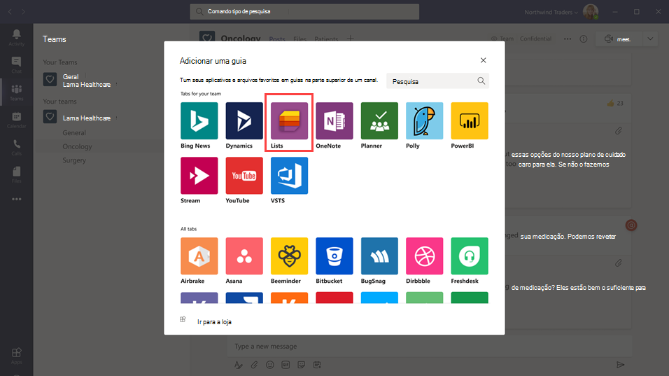
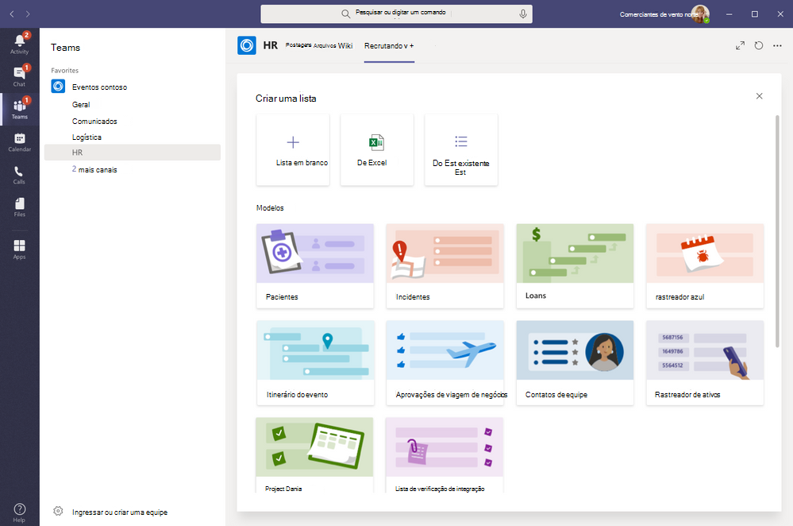

# Gerencie o aplicativo Listas para sua organização no Microsoft Teams

## Visão geral do Listas

O aplicativo Listas no Microsoft Teams ajuda os usuários da sua organização a controlar informações, organizar o trabalho e gerenciar fluxos de trabalho. Com o Listas, os usuários podem acompanhar dados como problemas, ativos, rotinas, contatos, estoque, incidentes, empréstimos, pacientes e muito mais usando exibições, regras e alertas personalizáveis para manter todos na equipe em sincronia.

No Teams, os usuários acessam o Listas como uma guia em um canal. Selecione **+** para abrir a galeria de guias e adicionar uma nova instância de guia de aplicativo Listas a um canal para começar.

Os usuários podem criar novas listas ou fixar listas existentes da mesma equipe ou de um site diferente do SharePoint ao qual tenham acesso. Novas listas podem ser criadas do zero, a partir de modelos integrados, com base na estrutura de uma lista existente ou importando dados de uma pasta de trabalho do Excel. O Listas está disponível em clientes Teams para desktop, web e dispositivos móveis.

## Modelos

Os modelos em Listas são adaptados para cenários comuns de acompanhamento de informações para os usuários. Cada modelo vem com uma estrutura de lista predefinida, layouts de formulário e opções de formatação em uma exibição de lista e um nível de exibição de detalhes para ajudar os usuários a começar rapidamente. Depois de selecionar um modelo, os usuários terão uma visualização da aparência da lista, juntamente com alguns dados de exemplo. Veja alguns exemplos de como as equipes da organização podem usar modelos predefinidos em Listas:

- Controle problemas e acompanhe o encerramento deles usando o modelo Rastreamento de problemas.
- Organize todos os detalhes do evento com o modelo Itinerário do evento.
- Use o modelo Pacientes para registrar as necessidades e o status dos pacientes das equipes de saúde em sua organização de saúde para monitorar e coordenar os atendimentos.
- Controle o status dos aplicativos de empréstimo com o modelo Empréstimo.

## Exemplo de cenário

Uma agência local dos correios é responsável por classificar e entregar correspondência em sua área. Todas as manhãs, os correios têm uma equipe sempre reunida para revisar metas diárias, compartilhar comunicados e discutir incidentes conhecidos.

Após a reunião, os entregadores retiram a correspondência e iniciam a rota de entrega. Incidentes podem ocorrer ao longo de uma rota, por exemplo, um acidente de veículo, um problema relacionado a um cachorro ou distúrbios sociais. Quando os entregadores encontram um incidente, elas usam o Teams em seus dispositivos móveis para registrar os detalhes do incidente, que são acompanhados em uma lista no canal de equipe. Todos na equipe, incluindo os entregadores em campo, podem ver essas informações e manter-se informados.

Antes de mudar para Teams, as operadoras de email tiveram que voltar para os correios para concluir um formulário de cópia impressa para relatar um incidente, que foi inserido em uma planilha de Excel. O Teams dá aos entregadores de correspondência uma experiência móvel em que podem usar Listas para relatar incidentes em campo assim que acontecerem, compartilhar detalhes de incidentes com os membros da equipe, ter conversas sobre eles no canal e encaminhar incidentes para resolução.

## O que você precisa saber sobre o Listas

### O Listas está disponível em todas as equipes e canais

O Lists é pré-instalado para todos os usuários do Teams e está disponível diretamente na galeria de guias de cada equipe e canal. Isso significa que os usuários não têm que ir até a loja de aplicativos do Teams para instalá-lo.

### Lists e SharePoint

Dados do Lists são armazenados no site de equipe do SharePoint Online. Para obter detalhes sobre como o SharePoint e o Teams interagem, confira [Como o SharePoint Online e o OneDrive for Business interagem com o Microsoft Teams](SharePoint-OneDrive-interact.md).

As permissões definidas no SharePoint se aplicam a listas criadas no aplicativo Listas. Por padrão, as listas herdam permissões do site a que pertencem. Essas permissões regem os tipos de ações que os usuários podem fazer, por exemplo, se podem criar ou editar listas. Para saber mais, confira [Níveis de permissão no SharePoint](/sharepoint/understanding-permission-levels) e [Permissões de usuário e níveis de permissão no SharePoint Server](/sharepoint/sites/user-permissions-and-permission-levels).

Em determinados cenários, talvez você queira restringir quais ações os usuários podem fazer em listas. Por exemplo, uma pessoa de uma equipe edita um modo de exibição de lista, o que o altera para todos os membros da equipe e você deseja permitir que somente o proprietário da equipe ou determinados membros da equipe editem exibições de lista. Para saber mais, confira [Personalizar permissões para uma lista ou biblioteca do SharePoint](https://support.microsoft.com/office/customize-permissions-for-a-sharepoint-list-or-library-02d770f3-59eb-4910-a608-5f84cc297782#ID0EAACAAA=Online,_2019,_2016,_2013).

> [!NOTE]
> Neste ponto, as permissões de proprietário e membro em uma equipe não estão vinculadas de nenhuma maneira a permissões no site de equipe que regem o comportamento de listas ou do aplicativo Listas. No entanto, com base nos comentários e no uso do cliente, isso será considerado para uma iteração futura do produto.  

### Limitações

Com o Listas, os usuários obtêm uma experiência de desktop, web e celular. É importante saber que os usuários não podem criar novas listas ou fixar listas existentes usando o Listas no cliente móvel do Teams. Para exibir ou editar uma lista no cliente móvel do Teams, uma lista deve primeiro ser criada ou adicionada usando o Listas no Teams para desktop ou Web.

Os convidados não podem criar ou excluir uma lista. Eles podem adicionar itens de lista a listas existentes, iniciar novas conversas sobre itens de lista e responder a conversas existentes sobre itens de lista.

### Listas e o aplicativo do SharePoint

Se os usuários em sua organização criaram listas usando o aplicativo SharePoint, essas listas serão movidas automaticamente para o Listas sem a necessidade de nenhuma ação do usuário. Para obter a melhor e mais rica experiência de integração de listas no Teams, use o aplicativo Listas e fixe suas listas existentes.

## Configurar o Listas

### Habilitar ou desabilitar o Listas em sua organização

O Listas é habilitado por padrão para todos os usuários do Teams em sua organização. Você pode desativar ou ativar o aplicativo no nível da organização na página [Gerenciar aplicativos](manage-apps.md) no centro de administração do Microsoft Teams.

1. Na navegação à esquerda do centro de administração do Microsoft Teams, vá para **Aplicativos do Teams** > **Gerenciar aplicativos**.
2. Siga um destes procedimentos:

    - Para desativar Listas para sua organização, procure o aplicativo Listas, selecione-o e selecione **Bloquear**.
    - Para ativar Listas para sua organização, pesquise o aplicativo Listas, selecione-o e selecione **Permitir**.

### Habilite ou desabilite o Listas para usuários específicos em sua organização

Para permitir ou bloquear usuários específicos de usarem o Listas em sua organização, certifique-se de que o Listas esteja ativado para sua organização na página [Gerenciar aplicativos](manage-apps.md) e, em seguida, crie uma política de permissão de aplicativo personalizada e atribua a esses usuários. Para saber mais, confira [Gerenciar políticas de permissão de aplicativos no Teams](teams-app-permission-policies.md).

## Pesquisar o registro de auditoria de eventos listados

As listas são habilitadas com a auditoria de nível empresarial para que você possa pesquisar listas e eventos de item de lista no log de auditoria no Centro de Conformidade & Segurança. Para saber mais, confira [Pesquisar no log de auditoria no Centro de Conformidade e Segurança](/microsoft-365/compliance/search-the-audit-log-in-security-and-compliance).

Para ver uma lista de eventos de auditoria relevantes para o aplicativo Listas no Teams, consulte [Atividades de lista do SharePoint](/microsoft-365/compliance/search-the-audit-log-in-security-and-compliance#sharepoint-list-activities).

Para examinar o log de auditoria, você precisa ativar a auditoria no [Centro de Conformidade e Segurança](https://protection.office.com). Tenha em mente que os dados de auditoria só estão disponíveis a partir do ponto em que você ativou a auditoria.

## Power Automate, Power Apps e Graph API

O Listas apoia o [Power Automate](/power-automate/flow-types) para fluxos de trabalho e o [Power Apps](/powerapps/maker/canvas-apps/customize-list-form) para formulários de lista. Os desenvolvedores podem usar a [API do Listas](/sharepoint/dev/sp-add-ins/working-with-lists-and-list-items-with-rest) para conectar dados da lista como uma fonte por meio do Microsoft Graph.

## Fornecer comentários ou relatar problemas
  
Para nos enviar comentários ou relatar um problema, selecione **Ajuda** na parte inferior da navegação esquerda no Teams e selecione **Relatar um problema**. Selecione **Listas** e, em seguida, insira seus comentários ou detalhes sobre o problema que você está enfrentando.

## Artigos relacionados

- [Documentação da ajuda do Listas](https://support.microsoft.com/office/apps-and-services-cc1fba57-9900-4634-8306-2360a40c665b#PickTab=Lists)