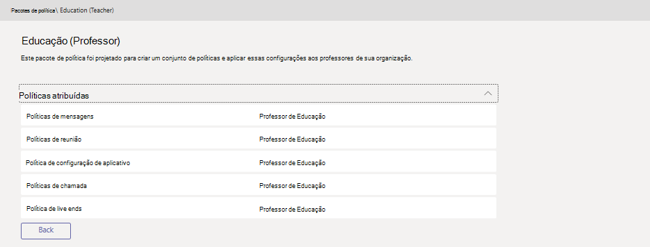

# Gerenciar pacotes de política no Microsoft Teams

Um pacote de política no Microsoft Teams é uma coleção de políticas predefinidas e configurações de política que você pode atribuir aos usuários que têm funções semelhantes em sua organização. Nós criamos pacotes de políticas para simplificar, simplificar e ajudar a fornecer consistência ao gerenciar políticas para grupos de usuários em toda a sua organização.  

Quando você atribui um pacote de política aos usuários, as políticas no pacote são criadas e você pode personalizar as configurações das políticas do pacote para atender às necessidades da sua organização.

Os pacotes de política não estão disponíveis para organizações da comunidade de nuvens (GCC) do governo dos EUA.

## O que é um pacote de política?

Os pacotes de política permitem controlar os recursos da equipe que você deseja permitir ou restringir para conjuntos específicos de pessoas em toda a organização. Cada pacote de política no Teams é projetado em torno de uma função de usuário e inclui políticas predefinidas e configurações de política que dão suporte a atividades de colaboração e comunicação que são típicas para essa função.

Atualmente, o Microsoft Teams inclui os seguintes pacotes de política.

|**Nome do pacote**  |**Descrição** |
|---------|---------|
|Educação (aluno de ensino superior)    |Cria um conjunto de políticas e configurações de política que se aplicam a alunos de ensino superior.|
|Educação (aluno da escola principal)   |Cria um conjunto de políticas e configurações de política que se aplicam a alunos principais.|
|Educação (aluno escolar secundário)    |Cria um conjunto de políticas e configurações de política que se aplicam a alunos secundários.         |
|Educação (professor)    |Cria um conjunto de políticas e configurações de política que se aplicam a professores.      |
|Trabalhador clínico da assistência médica  |Cria um conjunto de políticas e configurações de política que dão a funcionários clínicos, como as mensagens de mão registradas, recarga de mão, médicos e funcionários sociais acesso total a chats, chamadas, gerenciamento de turnos e reuniões. |
|Operador de informações da assistência médica  |Cria um conjunto de políticas e configurações de política que fornecem aos operadores de informações, como pessoal de ti, pessoal de informática, pessoal de finanças e órgãos de conformidade, acesso total a chats, chamadas e reuniões.|
|Usuário para empresas de pequeno e médio porte (Business Voice) |Cria uma política de configuração de aplicativo que inclui os aplicativos para uma experiência de voz empresarial.|
|Usuário para empresas de pequeno e médio porte (sem Business Voice) |Cria um conjunto de políticas e configurações de política que se aplicam a usuários de empresas de pequeno e médio porte sem nenhum recurso de voz comercial.|
|Diretor de segurança pública   |Cria um conjunto de políticas e configurações de política que se aplicam a órgãos públicos de segurança em sua organização.|

> [!NOTE]
> Vamos adicionar mais pacotes de política em lançamentos futuros do Teams, portanto verifique as informações mais atualizadas.  

Cada política individual recebe o nome do pacote de política para que você possa facilmente identificar as políticas que estão vinculadas a um pacote de política.
Por exemplo, quando você atribui o pacote de política de formação educacional (professor) a professores em sua escola, uma política nomeada Education_Teacher é criada para cada política do pacote.

## Como usar pacotes de política

O seguinte descreve como usar pacotes de política em sua organização.

- **[Exibir](#view-the-settings-of-a-policy-in-a-policy-package)**: exibir as configurações de cada política em um pacote de política antes de atribuir um pacote. Certifique-se de que você compreende cada configuração e, em seguida, decida se os valores predefinidos são adequados para a sua organização ou se é necessário alterá-los para serem mais restritivos ou lenient com base nas necessidades da sua organização.

    Se uma política for excluída, ainda será possível exibir as configurações, mas você não poderá alterar as configurações. Uma política excluída é recriada com as configurações predefinidas ao atribuir o pacote de política.

- **[Atribuir](#assign-a-policy-package)**: atribuir o pacote de política aos usuários. Lembre-se de que as políticas em um pacote de política não são criadas até você atribuir o pacote, após o qual você pode alterar as configurações de políticas individuais no pacote.  

- **[Personalizar](#customize-policies-in-a-policy-package)**: personalizar as configurações das políticas no pacote de políticas para atender às necessidades da sua organização. Todas as alterações feitas nas configurações de política são automaticamente aplicadas a usuários atribuídos ao pacote.

Veja a seguir as etapas sobre como exibir, atribuir e personalizar pacotes de política no centro de administração do Microsoft Teams.

### Exibir as configurações de uma política em um pacote de política

1. Na navegação à esquerda do centro de administração do Microsoft Teams, clique em **pacotes de política**e selecione um pacote de política clicando à esquerda do nome do pacote.
2. Clique na política que você deseja exibir.

### Atribuir um pacote de política

#### Atribuir um pacote de política a um usuário

1. Na barra de navegação à esquerda do centro de administração do Microsoft Teams, vá para **Usuários** e clique no usuário.
2. Na página do usuário, clique em **políticas**e, em seguida, ao lado de **pacote de política**, clique em **Editar**.
3. No painel **atribuir pacote de política** , selecione o pacote que você deseja atribuir e clique em **salvar**.

#### Atribuir um pacote de política a vários usuários

1. Na navegação à esquerda do centro de administração do Microsoft Teams, vá para **pacotes de política**e, em seguida, selecione o pacote de política que você deseja atribuir clicando à esquerda do nome do pacote.
2. Clique em **gerenciar usuários**.
3. No painel **Gerenciar usuários**, procure o usuário pelo nome de exibição ou pelo nome de usuário, escolha o nome e clique em **Adicionar**. Repita esta etapa para cada usuário que você deseja adicionar.
4. Quando tiver terminado de adicionar usuários, clique em **salvar**.

### Personalizar políticas em um pacote de política

Você pode editar as configurações de uma política por meio da página **pacotes de política** ou indo diretamente para a página política no centro de administração do Microsoft Teams.

1. Na navegação à esquerda do centro de administração do Microsoft Teams, siga um destes procedimentos:
    - Clique em **pacotes de política**e selecione o pacote de política clicando à esquerda do nome do pacote.
    - Clique no tipo de política.  Por exemplo, clique em **políticas de mensagens**.
2. Clique na política que você deseja editar. As políticas vinculadas a um pacote de política têm o mesmo nome que o pacote de política.
3. Faça as alterações desejadas e clique em **salvar**.

## Solução de problemas

**Você recebe um erro ao atribuir um pacote de política**

Isso pode ocorrer se uma ou mais políticas do pacote não foram criadas ou aplicadas com sucesso. Reatribuir o pacote de política para seus usuários. Repetir a operação normalmente corrige esse problema.

## Tópicos relacionados

[Pacotes de política do Microsoft Teams para administradores EDU](policy-packages-edu.md)
