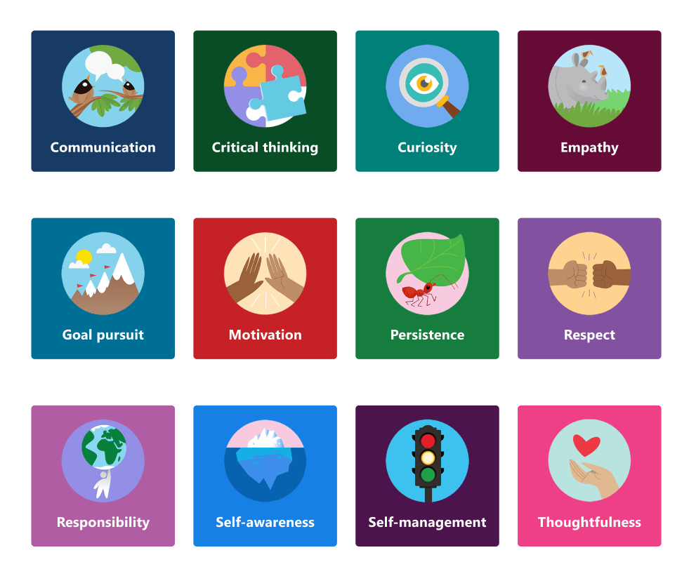

# Gerenciar o Elogio no centro Microsoft Teams administrador

> [!NOTE]
> Os administradores devem ter uma Teams para acessar esse recurso. Se você tentar acessar esse recurso sem uma Teams de Teams, você obterá uma mensagem de erro.

O Elogio aplicativo no Microsoft Teams ajuda os usuários a mostrar apreço aos membros de sua organização ou sala de aula. Com uma seleção de conjuntos de selos a escolher e a opção de criar seus próprios selos, o Elogio foi projetado para ajudar a reconhecer o esforço que se dá na ampla gama de trabalho que os usuários Teams fazem, de educadores a Trabalhadores de Linha de Frente. Para saber mais, confira [Enviar Elogio para pessoas](https://support.microsoft.com/office/send-praise-to-people-50f26b47-565f-40fe-8642-5ca2a5ed261e).

Os administradores podem controlar quais selos estão disponíveis para sua organização Microsoft Teams centro de administração. Na navegação à esquerda, acesse Teams **aplicativos > Gerenciar aplicativos**. Na lista de aplicativos, clique **em Elogio** e selecione **Configurações**.  A partir daqui, você pode optar por habilitar conjuntos de selos padrão e integrados e criar selos personalizados.

> [!NOTE]
> O Elogio de aplicativo não está disponível para nuvens do governo dos EUA.

## Usar conjuntos de selos integrados

Conjuntos integrados são conjuntos de selos projetados pela Microsoft para o Elogio app. Esses conjuntos não podem ser editáveis pelos administradores. O conjunto de selos padrão já está habilitado e disponível no Elogio app. Para alterar a disponibilidade do conjunto padrão ou de qualquer conjunto de selos, alterne a alternância correspondente para Ligar ou Desligar. 

<a name="default-badges"> </a>

### Selos padrão

O conjunto de selos padrão foi projetado para ajudar Teams os usuários reconhecerem seus pares para ir além e acima com seu trabalho.

<a name="sel-edu-badges"> </a>

### Selos de aprendizagem social e afetiva para educação

Os educadores podem reconhecer alunos individuais para conquistas e comportamentos de aprendizagem social e afetiva (SEL) com selos que ilustram esses conceitos.

<a name="create-your-own-badges"> </a>

## Criar seus próprios selos

Selecione **Criar um selo personalizado.** A partir daqui, você pode projetar um selo personalizado no painel lateral. Você pode criar até 25 selos personalizados. 

1. Insira um nome de selo. Esse é o nome que aparecerá no selo quando os usuários enviarem elogios.

2. De definir as cores do selo. Para definir as cores de texto e plano de fundo do selo, você precisa inserir as cores como valores hexadecimais (hexadecimais).

   > [!TIP]
   > Se você for novo nos valores de hexaxa, este artigo inclui uma introdução rápida [para](#hex-colors-intro) mostrar como usá-los.

3. Upload imagem de selo. O tipo de arquivo aceito é .PNG. O arquivo de imagem deve ter menos de 40 KB com dimensões máximas de 216 X 216 pixels.

4. Localize seu nome de selo: em **Nomes de selo localizados,** selecione **Adicionar**. Selecione a localidade desejada na listada. Em seguida, insira o nome do selo no idioma designado.

5. Exclua seu selo de localidades específicas: Em Excluir **selo dessas localidades,** selecione **Adicionar**. Selecione as localidades que você deseja excluir da listada.

6. Selecione **Aplicar**. Seu novo selo agora aparecerá na tabela de selos personalizados.

> [!NOTE]
> Se as etapas 4 e 5 são ignoradas, o selo estará no idioma padrão para todas as localidades.
>
> Quando terminar de fazer alterações na seleção do selo, selecione **Enviar**. Pode levar algumas horas até que essas alterações sejam disponibilizadas para sua organização.

<a name="hex-colors-intro"> </a>

## Especificar cores com valores de hexaxa

Os valores de cores hexadecimais são cadeias de caracteres de seis dígitos hexadecimais que representam a intensidade de vermelho (RR), verde (GG) e azul (BB) em uma cor específica em uma escala de 00 a FF. Quando você junta os valores de todas as três cores, você tem um valor de hexaxa: #RRGGBB

Por exemplo, o valor hexaxa para a cor vermelha é #FF0000 porque vermelho é definido com o maior valor possível, FF e verde e azul são definidos no menor valor possível, 00.

Para explorar cores diferentes e seus valores de hexaxa, confira [Bing selador de cores](https://www.bing.com/search?q=color+picker).

Abaixo está uma lista de cores de exemplo para começar:

|Cor  |Valor de hexaxa|
|-------|---------|
||  #FF6666   |
||  #7FFFD4   |
||  #FF75F0   |
||  #00BFFF   |
||  #800080   |
||  #000000   |

<a name="best-practices"> </a>

## Práticas recomendadas para criar selos personalizados

**Envie todos os seus selos de uma só vez.** Como leva algum tempo para que novos selos sejam processados, é melhor adicionar todos os seus selos personalizados à tabela antes de encaminhá-los.

**Ao escolher cores, tenha em mente a acessibilidade.** Algumas cores se juntam melhor do que outras.  Crie contraste entre as cores de texto e plano de fundo para facilitar a leitura do nome do selo. Por exemplo, se você escolher uma cor de plano de fundo escura, escolha uma cor de texto claro.

**Ao selecionar uma imagem, lembre-se das dimensões do selo.** Para a melhor qualidade, recomendamos carregar um arquivo de imagem de 216 x 216 pixels (que são as dimensões máximas). Evite alongar ou distorcer a imagem para se ajustar a essas dimensões.

**Se a imagem do selo não for retangular, faça a imagem transparente.** Você precisará fazer isso antes de carregar o arquivo de imagem para Elogio.

## Ativos de conjunto de selos

Os conjuntos de selos integrados não podem ser modificados, portanto, quando um conjunto integrado está habilitado, todos os selos no conjunto são adicionados ao aplicativo Elogio. Se você quiser adicionar selos específicos de um conjunto integrado e deixar outras pessoas de fora, re-crie os selos que deseja usar como selos personalizados. Você pode baixar a imagem do selo e encontrar as cores de texto e plano de fundo dos selos de conjuntos integrados nas tabelas abaixo.

### Ativos de selos padrão

 

|Nome do selo     |Arquivo de imagem  |Cor do texto | Cor de plano de fundo |
|---------------|------------|---------- |--------|
|Achiever       |[PNG do alcançador](https://github.com/MicrosoftDocs/OfficeDocs-SkypeForBusiness/raw/live/Teams/downloads/praise-app/default-set/achiever-badge.png)|#D36E70    |#E3F4FC|
|Incrível        |[PNG incrível](https://github.com/MicrosoftDocs/OfficeDocs-SkypeForBusiness/raw/live/Teams/downloads/praise-app/default-set/awesome-badge.png)</a>|#8283B2    |#D1EFF2|
|Coach          |[Coach PNG](https://github.com/MicrosoftDocs/OfficeDocs-SkypeForBusiness/raw/live/Teams/downloads/praise-app/default-set/coach-badge.png)</a>|#6AA55A    |#DBF1D6|
|Valor        |[PNG Desanimo](https://github.com/MicrosoftDocs/OfficeDocs-SkypeForBusiness/raw/live/Teams/downloads/praise-app/default-set/courage-badge.png)</a>|#DC5041    |#FCF6C8|
|Criativo       |[PNG criativo](https://github.com/MicrosoftDocs/OfficeDocs-SkypeForBusiness/raw/live/Teams/downloads/praise-app/default-set/creative-badge.png) |#CF9D50    |#FCF6C8|
|Inclusive      |[PNG inclusivo](https://github.com/MicrosoftDocs/OfficeDocs-SkypeForBusiness/raw/live/Teams/downloads/praise-app/default-set/inclusive-badge.png)</a>|#3C77BB    |#E2F4FC|
|Kind Heart     |[Kind Heart PNG](https://github.com/MicrosoftDocs/OfficeDocs-SkypeForBusiness/raw/live/Teams/downloads/praise-app/default-set/kind-heart-badge.png)</a>|#D36D6E    |#F4DEDE|
|Liderança     |[PNG de liderança](https://github.com/MicrosoftDocs/OfficeDocs-SkypeForBusiness/raw/live/Teams/downloads/praise-app/default-set/leadership-badge.png)|#419098    |#D2EAEC|
|Desesbancar       |[PNG Desestomado](https://github.com/MicrosoftDocs/OfficeDocs-SkypeForBusiness/raw/live/Teams/downloads/praise-app/default-set/optimism-badge.png)</a>|#D8338C    |#F4DDDE|
|Solucionador de problemas |[PNG do solucionador de problemas](https://github.com/MicrosoftDocs/OfficeDocs-SkypeForBusiness/raw/live/Teams/downloads/praise-app/default-set/problem-solver-badge.png)|#B8916E    |#CBDADF|
|Jogador de equipe    |[PNG do jogador de equipe](https://github.com/MicrosoftDocs/OfficeDocs-SkypeForBusiness/raw/live/Teams/downloads/praise-app/default-set/team-player-badge.png)|#8B8DC0    |#F4EEC0|
|Obrigado      |[Obrigado PNG](https://github.com/MicrosoftDocs/OfficeDocs-SkypeForBusiness/raw/live/Teams/downloads/praise-app/default-set/thank-you-badge.png)|#469CA4    |#BACCB6|

 

### Selos de aprendizagem social e afetiva para ativos de educação

 

|Nome do selo        |Arquivo de imagem  |Cor do texto | Cor de plano de fundo |
|------------------|------------|---------- |--------|
|Comunicação     |[PNG de comunicação](https://github.com/MicrosoftDocs/OfficeDocs-SkypeForBusiness/raw/live/Teams/downloads/praise-app/sel-edu-set/communication-badge.png)|#FFFFFF    |#173B65|
|Pensamento crítico |[PNG de pensamento crítico](https://github.com/MicrosoftDocs/OfficeDocs-SkypeForBusiness/raw/live/Teams/downloads/praise-app/sel-edu-set/critical-thinking-badge.png)|#FFFFFF    |#084D26|
|Curiosidade         |[PNG de curiosidade](https://github.com/MicrosoftDocs/OfficeDocs-SkypeForBusiness/raw/live/Teams/downloads/praise-app/sel-edu-set/curiosity-badge.png)|#FFFFFF    |#008078|
|Empatia           |[PNG de empatia](https://github.com/MicrosoftDocs/OfficeDocs-SkypeForBusiness/raw/live/Teams/downloads/praise-app/sel-edu-set/empathy-badge.png)|#FFFFFF    |#650B35|
|Busca de meta      |[PNG de busca de meta](https://github.com/MicrosoftDocs/OfficeDocs-SkypeForBusiness/raw/live/Teams/downloads/praise-app/sel-edu-set/goal-pursuit-badge.png)|#FFFFFF    |#006F95|
|Motivação        |[PNG de motivação](https://github.com/MicrosoftDocs/OfficeDocs-SkypeForBusiness/raw/live/Teams/downloads/praise-app/sel-edu-set/motivation-badge.png)|#FFFFFF    |#C52127|
|Persistência       |[PNG de persistência](https://github.com/MicrosoftDocs/OfficeDocs-SkypeForBusiness/raw/live/Teams/downloads/praise-app/sel-edu-set/persistence-badge.png)|#FFFFFF    |#167D3E|
|Respeito           |[Respeitar PNG](https://github.com/MicrosoftDocs/OfficeDocs-SkypeForBusiness/raw/live/Teams/downloads/praise-app/sel-edu-set/respect-badge.png)|#FFFFFF    |#8251A0|
|Responsabilidade    |[Responsabilidade PNG](https://github.com/MicrosoftDocs/OfficeDocs-SkypeForBusiness/raw/live/Teams/downloads/praise-app/sel-edu-set/responsibility-badge.png)|#FFFFFF    |#B05DA3|
|Autoconhecimento    |[PNG de autoconhecimento](https://github.com/MicrosoftDocs/OfficeDocs-SkypeForBusiness/raw/live/Teams/downloads/praise-app/sel-edu-set/self-awareness-badge.png)|#FFFFFF    |#1680E5|
|Auto-gerenciamento   |[PNG de auto-gerenciamento](https://github.com/MicrosoftDocs/OfficeDocs-SkypeForBusiness/raw/live/Teams/downloads/praise-app/sel-edu-set/self-management-badge.png)|#FFFFFF    |#4C144D|
|Consideração    |[PNG de consideração](https://github.com/MicrosoftDocs/OfficeDocs-SkypeForBusiness/raw/live/Teams/downloads/praise-app/sel-edu-set/thoughtfulness-badge.png)|#FFFFFF    |#EE4086|
