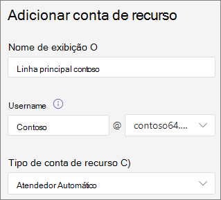
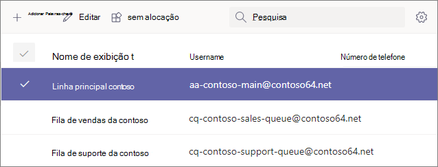
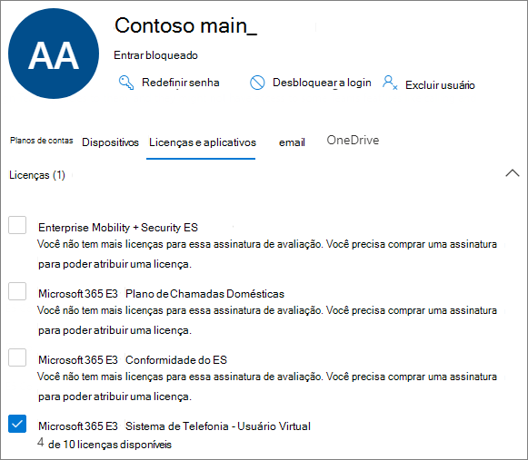
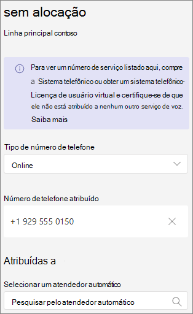

# <a name="manage-resource-accounts-in-microsoft-teams"></a>Gerenciar contas de recursos no Microsoft Teams

Uma conta de recurso é um objeto de usuário desabilitado no Azure AD e pode ser usada para representar recursos em geral. Por exemplo, uma conta de recurso pode ser usada Exchange para representar salas de conferência e permitir que elas tenham um número de telefone e um calendário. Uma conta de recurso pode ser Microsoft 365 ou local usando o Skype for Business Server 2019.

Em Microsoft Teams, uma conta de recurso é necessária para cada atendimento automático ou fila de chamada. Contas de recursos também podem ser atribuídas a números de telefone de serviço. É assim que você atribui números de telefone a atendimentos automáticos e filas de chamadas permitindo que os chamadores de fora Teams para alcançar o atendimento automático ou fila de chamadas.

Este artigo aborda como criar contas de recursos e a preparar para uso com atendedores automáticos e filas de chamada.

Antes de iniciar os procedimentos neste artigo, verifique se você fez o seguinte:

- [Obter licenças de usuário virtual](#obtain-virtual-user-licenses)
- [Obter números de serviço](#obtain-service-numbers)

### <a name="obtain-virtual-user-licenses"></a>Obter licenças de usuário virtual

Cada conta de recurso requer uma licença para trabalhar com atendimentos automáticos e filas de chamada. Você pode usar uma licença de *Microsoft 365 Sistema de Telefonia - Usuário Virtual.* Para obter essas licenças, consulte [Licença de usuário virtual](teams-add-on-licensing/virtual-user.md).

Abrangemos como atribuir a licença a uma conta de recurso posteriormente neste artigo.

Para obter a licença de Usuário Virtual, no Centro de administração do Microsoft 365, vá para Cobrança Assinaturas de complemento de serviços de Compra e role até o final - você verá Sistema de Telefonia - Licença de  >    >   *Usuário Virtual.* Selecione **Comprar agora**. Há um custo zero, mas você ainda precisa seguir estas etapas para adquirir a licença.

### <a name="obtain-service-numbers"></a>Obter números de serviço

Os números de serviço são opcionais para os atendimentos automáticos e filas de chamada, no entanto, você precisará de pelo menos um número de serviço para que os chamadores cheguem ao seu atendimento automático e à configuração da fila de chamada. Para qualquer atendente automático ou fila de chamada que você deseja acessar diretamente por um número de serviço, você deve ter uma conta de recurso com um número de serviço associado.

As contas de recursos podem usar números de serviço de tarifação gratuita ou gratuita. Você pode solicitar novos números ou portar números existentes de outra operadora.

Para obter novos números de serviço, consulte [Obter números de telefone de serviço](getting-service-phone-numbers.md).

Para por um número de outra operadora, consulte [Transfer phone numbers to Teams](phone-number-calling-plans/transfer-phone-numbers-to-teams.md).

## <a name="create-a-resource-account"></a>Criar uma conta de recurso

Você pode criar uma conta de recurso no Teams de administração.



1. No centro Teams de administração, **expanda Voz** e clique em **Contas de recursos.**

2. Clique em **Adicionar**.

3. No painel **Adicionar conta de** recurso, preencha **Nome** de exibição, Nome de **usuário** e tipo de conta **de recurso**. O tipo de conta de recurso pode ser **o Atendimento Automático** ou Fila de Chamada, dependendo de como você pretende usar essa conta de recurso. 

4. Clique em **Salvar**.



## <a name="assign-a-license"></a>Atribuir uma licença

Para cada conta de recurso, você deve atribuir uma Microsoft 365 Sistema de Telefonia *- licença* de usuário virtual *ou Sistema de Telefonia.*



1. Na Centro de administração do Microsoft 365, clique na conta de recurso à qual deseja atribuir uma licença.

2. Na guia **Licenças e Aplicativos,** em **Licenças,** selecione **Microsoft 365 Sistema de Telefonia - Usuário Virtual**.

3. Clique em **Salvar alterações**.

## <a name="assign-a-service-number"></a>Atribuir um número de serviço

Se você estiver planejando usar a conta de recurso com um atendimento automático ou fila de chamada que exija um número de serviço, atribua um número à conta de recurso.



1. No centro Teams de administração,  na página Contas de recursos, selecione a conta de recurso à qual você deseja atribuir um número de serviço e clique em **Atribuir/desatribuição.**

2. Na lista Telefone de tipo **de** número, escolha o tipo de número que você deseja usar.

3. Na caixa **Número de telefone atribuído,** pesquise o número que deseja usar e clique em **Adicionar**.

4. Clique em **Salvar**.


Para atribuir um roteamento direto ou número híbrido a uma conta de recurso, você precisa usar o PowerShell:

`Set-CsPhoneNumberAssignment -Identity aa-contoso_main@contoso64.net -PhoneNumber +19295550150 -PhoneNumberType DirectRouting`

## <a name="next-steps"></a>Próximas etapas

Depois de concluir a configuração da conta de recurso e atribuir um número de serviço, se necessário, você estará pronto para usar a conta de recurso com um atendimento automático ou fila de chamada.

Consulte as seguintes referências:

 - [Atendimento automático na nuvem](create-a-phone-system-auto-attendant.md)

 - [Fila de chamada na nuvem](create-a-phone-system-call-queue.md)

Você pode editar a conta de recurso **Nome de exibição** e **tipo de** conta de recurso usando a **opção** Editar. Clique **em Salvar** quando terminar.

## <a name="change-an-existing-resource-account-to-use-a-virtual-user-license"></a>Alterar uma conta de recurso existente para usar uma licença de usuário virtual

Se você decidir alternar as licenças em sua conta de recurso existente de uma licença de Sistema de Telefonia para uma licença de Usuário Virtual, você precisará adquirir **a** licença de Usuário Virtual gratuita e, em seguida, seguir as etapas no Centro de administração do Microsoft 365 para Mover usuários para uma assinatura [diferente](/microsoft-365/admin/manage/assign-licenses-to-users#move-users-to-a-different-subscription).

> [!WARNING]
> Sempre remova uma licença de Sistema de Telefonia e atribua a licença de Usuário Virtual na mesma atividade de licença. Se você remover a licença antiga, salvar as alterações da conta, adicionar a nova licença e salvar as configurações da conta novamente, a conta de recurso poderá não funcionar mais conforme esperado. Se isso acontecer, recomendamos que você crie uma nova conta de recurso para a licença de Usuário Virtual e remova a conta de recurso quebrada.

## <a name="skype-for-business-server-2019"></a>Skype For Business Server 2019

Para contas de recursos ativas no Skype For Business Server 2019 que podem ser usadas com filas de chamada na nuvem e atendimentos automáticos na nuvem, consulte [Plan Cloud call queues](/SkypeforBusiness/hybrid/plan-call-queue) or [Plan Cloud auto attendants](/SkypeForBusiness/hybrid/plan-cloud-auto-attendant). Implementações híbridas (números em roteamento direto) são configuradas usando o cmdlet [New-CsHybridApplicationEndpoint](/powershell/module/skype/new-cshybridapplicationendpoint) em um servidor local Skype for Business Server 2019.

As IDs do aplicativo que você precisa usar ao criar as instâncias do aplicativo são:

- **Atendedor Automático:** ce933385-9390-45d1-9512-c8d228074e07
- **Fila de Chamada:** 11cd3e2e-fccb-42ad-ad00-878b93575e07

> [!NOTE]
> Se você deseja que a fila de chamada ou o atendimento automático sejam pesquisáveis pelos usuários do Skype For Business Server 2019, crie suas contas de recursos no Skype For Business Server 2019, pois as contas de recursos online não são sincronizadas com o Active Directory. Quando os registros SRV DNS para sipfederationtls resolvem para Skype for Business Server  2019, as contas de recurso devem ser criadas no Skype For Business Server 2019 usando o shell de Gerenciamento SfB e sincronizadas com o Azure AD.

Para implementações híbridas com Skype for Business Server:

   [Atendedores automáticos do plano da nuvem](/SkypeForBusiness/hybrid/plan-cloud-auto-attendant)
  
   [Planejar filas de chamadas da nuvem](/SkypeforBusiness/hybrid/plan-call-queue)
   
   [Configurar contas de recursos no prem](/SkypeForBusiness/hybrid/configure-onprem-ra)


## <a name="delete-a-resource-account"></a>Excluir uma conta de recurso

Certifique-se de dissociar o número de telefone da conta de recurso antes de excluí-lo, para evitar que seu número de serviço seja travado no modo pendente.

Depois de fazer isso, você pode excluir a conta de recurso no Centro de administração do Microsoft 365, na guia Usuários.

Para desassociar um número de telefone de roteamento direto da conta de recurso, use o seguinte cmdlet:

```powershell
Remove-CsPhoneNumberAssignment -Identity  <Resource Account oid> -PhoneNumber <assigned phone number> -PhoneNumberType DirectRouting
```
