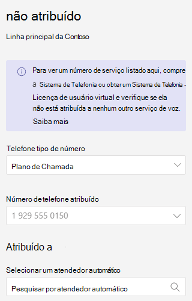

# <a name="manage-resource-accounts-in-microsoft-teams"></a>Gerenciar contas de recursos no Microsoft Teams

Uma conta de recurso é um objeto de usuário desabilitado no Azure AD e pode ser usada para representar recursos em geral. Por exemplo, uma conta de recurso pode ser usada no Exchange para representar salas de conferência e permitir que elas tenham um número de telefone e um calendário. Uma conta de recurso pode ser usada no Microsoft 365 ou local usando o Skype for Business Server 2019.

No Microsoft Teams, uma conta de recurso é necessária para cada atendimento automático ou fila de chamada. Contas de recursos também podem ter números de telefone de serviço atribuídos. É assim que você atribui números de telefone a atender automaticamente e filas de chamadas, permitindo que chamadores de fora do Teams alcancem o atendimento automático ou fila de chamadas.

Este artigo aborda como criar contas de recursos e ready-them para uso com atendedores automáticos e filas de chamada.

Antes de iniciar os procedimentos neste artigo, verifique se você fez o seguinte:

- [Obter licenças de usuário virtual](#obtain-virtual-user-licenses)
- [Obter números de serviço](#obtain-service-numbers)

### <a name="obtain-virtual-user-licenses"></a>Obter licenças de usuário virtual

Cada conta de recurso requer uma licença para trabalhar com os atenderes automáticos e filas de chamada. Você pode usar uma licença gratuita *do Microsoft 365 Phone System - Usuário Virtual.* Para obter essas licenças, consulte a [licença do Usuário Virtual.](teams-add-on-licensing/virtual-user.md)

Tratamos sobre como atribuir a licença a uma conta de recurso mais adiante neste artigo.

Para obter a licença de Usuário Virtual, no Centro de administração do Microsoft 365, vá para  >    >  **assinaturas** de complemento de serviços de compra de cobrança e role até o final , você verá Sistema de Telefone – licença de Usuário *Virtual.* Selecione **Comprar agora.** Há um custo zero, mas você ainda precisa seguir estas etapas para adquirir a licença.

### <a name="obtain-service-numbers"></a>Obter números de serviço

Os números de serviço são opcionais para atender automaticamente e filas de chamada, no entanto, você precisará de pelo menos um número de serviço para que os chamadores cheguem ao seu atender automático e configuração da fila de chamada. Para qualquer atendimento automático ou fila de chamada que você deseja que seja acessível diretamente por um número de serviço, você deve ter uma conta de recurso com um número de serviço associado.

As contas de recursos podem usar números de serviço de tarifa tarifada ou gratuita. Você pode solicitar novos números ou portar números existentes de outra operadora.

Para obter novos números de serviço, consulte [Obter números de telefone de serviço.](getting-service-phone-numbers.md)

Para transferir um número de outra operadora, consulte [Transferir números de telefone para o Teams.](phone-number-calling-plans/transfer-phone-numbers-to-teams.md)

## <a name="create-a-resource-account"></a>Criar uma conta de recurso

Você pode criar uma conta de recurso no Centro de administração do Teams.


1. No Centro de administração do Teams, expanda **as configurações de** toda a organização e clique em **Contas de recursos.**

2. Clique em **Adicionar**.

3. No painel **Adicionar conta de recurso,** preencha **o nome** de exibição, nome de **usuário** e o tipo de conta **De recurso.** O tipo de conta de recurso pode ser **o Atendimento Automático** ou a fila chamada, dependendo de como você pretende usar essa conta de recurso. 

4. Clique em **Salvar**.


## <a name="assign-a-license"></a>Atribuir uma licença

Para cada conta de recurso, você deve atribuir uma licença do *Microsoft 365 Phone System - Licença* de Usuário Virtual ou Sistema de *Telefonia.*


1. No Centro de administração do Microsoft 365, clique na conta de recurso à qual você deseja atribuir uma licença.

2. Na guia **Licenças e Aplicativos,** em **Licenças,** selecione **Microsoft 365 Phone System - Usuário Virtual.**

3. Clique **em Salvar alterações.**

## <a name="assign-a-service-number"></a>Atribuir um número de serviço

Se você pretende usar a conta de recurso com um atendimento automático ou fila de chamada que exija um número de serviço, atribua um número à conta de recurso.



1. No Centro de administração  do Teams, na página Contas de recursos, selecione a conta de recurso à qual você deseja atribuir um número de serviço e clique em **Atribuir/desatribuição.**

2. Na lista de menu suspenso **de tipo** de número de telefone, escolha o tipo de número que você deseja usar.

3. Na caixa **Número de telefone Atribuído,** procure o número que você deseja usar e clique em **Adicionar.**

4. Clique em **Salvar**.


Para atribuir um roteamento direto ou um número híbrido a uma conta de recurso, você precisa usar o PowerShell:

`Set-CsOnlineApplicationInstance -Identity aa-contoso_main@contoso64.net -OnpremPhoneNumber +19295550150`

## <a name="next-steps"></a>Próximas etapas

Depois de concluir a configuração da conta de recurso e atribuir um número de serviço, se necessário, você estará pronto para usar a conta de recurso com um atendimento automático ou fila de chamada.

Veja as seguintes referências:

 - [Assistente automático na nuvem](create-a-phone-system-auto-attendant.md)

 - [Fila de chamada na nuvem](create-a-phone-system-call-queue.md)

Você pode editar o nome de **exibição** da conta de recurso e **o tipo de** conta recurso usando a **opção** Editar. Clique **em Salvar** quando terminar.

## <a name="change-an-existing-resource-account-to-use-a-virtual-user-license"></a>Alterar uma conta de recurso existente para usar uma licença de Usuário Virtual

Se você decidir mudar as licenças de sua  conta de recurso existente de uma licença do Sistema de Telefonia para uma licença de Usuário Virtual, precisará adquirir a licença de Usuário Virtual gratuita e seguir as etapas no Centro de administração do Microsoft 365 para mover os usuários para uma assinatura [diferente.](https://docs.microsoft.com/microsoft-365/admin/manage/assign-licenses-to-users#move-users-to-a-different-subscription)

> [!WARNING]
> Sempre remova uma Licença completa do Sistema de Telefone e atribua a licença de Usuário Virtual na mesma atividade de licença. Se você remover a licença antiga, salvar as alterações da conta, adicionar a nova licença e salvar as configurações da conta novamente, a conta de recurso poderá não funcionar mais conforme o esperado. Se isso acontecer, recomendamos que você crie uma nova conta de recurso para a licença de Usuário Virtual e remova a conta de recurso quebrada.

## <a name="skype-for-business-server-2019"></a>Skype for Business Server 2019

Para contas de recursos do Skype for Business Server 2019 que podem ser usadas com filas de chamadas na nuvem e com os assistentes automáticos na nuvem, consulte Filas de chamadas na nuvem de planos ou [assistentes automáticos](/SkypeforBusiness/hybrid/plan-call-queue) de Nuvem de [Planos.](/SkypeForBusiness/hybrid/plan-cloud-auto-attendant) As implementações híbridas (números instalados no Roteamento Direto) são configuradas usando o cmdlet [New-CsHybridApplicationEndpoint](https://docs.microsoft.com/powershell/module/skype/new-cshybridapplicationendpoint) em um servidor local do Skype for Business Server 2019.

As IDs de aplicativo que você precisa usar ao criar as instâncias do aplicativo são:

- **Auto Attendant:** ce933385-9390-45d1-9512-c8d228074e07
- **Fila de Chamada:** 11cd3e2e-gemb-42ad-ad00-878b93575e07

> [!NOTE]
> Se quiser que a fila de chamadas ou o atendimento automático seja pesquisável pelos usuários do Skype For Business Server 2019, crie suas contas de recurso no Skype For Business Server 2019, pois as contas de recursos online não estão sincronizadas com o Active Directory. Quando os registros SRV DNS para sipfederationtls resolverem para o  Skype for Business Server 2019, as contas de recursos deverão ser criadas no Skype For Business Server 2019 usando o shell de Gerenciamento de SfB e sincronizadas com o Azure AD.

Para implementações híbridas com o Skype for Business Server:

   [Atendedores automáticos do plano da nuvem](/SkypeForBusiness/hybrid/plan-cloud-auto-attendant)
  
   [Planejar filas de chamadas da nuvem](/SkypeforBusiness/hybrid/plan-call-queue)
   
   [Configurar contas de recursos no mesmo estado](/SkypeForBusiness/hybrid/configure-onprem-ra)


## <a name="delete-a-resource-account"></a>Excluir uma conta de recurso

Certifique-se de desligar o número de telefone da conta do recurso antes de excluí-lo, para evitar que o número do serviço seja preso no modo pendente.

Depois de fazer isso, você pode excluir a conta de recurso no Centro de administração do Microsoft 365, na guia Usuários.

Para desassociar um número de telefone de roteamento direto da conta de recurso, use o seguinte cmdlet:

```powershell
Set-CsOnlineApplicationInstance -Identity  <Resource Account oid> -OnpremPhoneNumber ""
```
