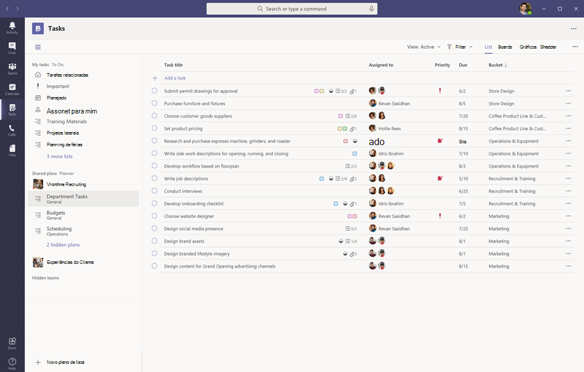
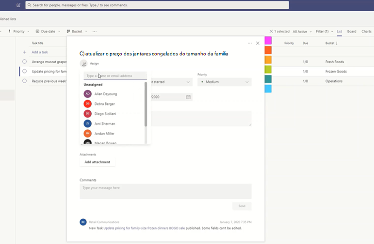
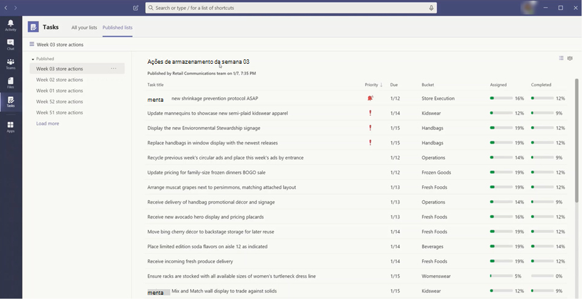

# Gerenciar o aplicativo tarefas para sua organização no Microsoft TeamsManage the Tasks app for your organization in Microsoft Teams

> **No momento, este recurso está em visualização particular.****This feature is currently in private preview.**

## Visão geral das tarefasOverview of Tasks

O aplicativo tarefas traz uma experiência coesa de gerenciamento de tarefas para o Microsoft Teams, integrando tarefas individuais da [Microsoft a fazer](https://todo.microsoft.com/tasks/) e tarefas da equipe com o Planner em um só lugar.The Tasks app brings a cohesive task management experience to Microsoft Teams, integrating individual tasks powered by [Microsoft To Do](https://todo.microsoft.com/tasks/) and team tasks powered by Planner in one place. Os usuários podem acessar as tarefas como um aplicativo no lado esquerdo do Teams e como uma guia em um canal dentro de equipes individuais.Users can access Tasks as an app on the left side of Teams and as a tab in a channel within individual teams. **Minhas tarefas** e **planos compartilhados** em tarefas permitem aos usuários exibir e gerenciar todas as tarefas individuais e da equipe e priorizar o trabalho delas.**My tasks** and **Shared plans** in Tasks let users view and manage all their individual and team tasks and prioritize their work. Tarefas está disponível em Teams desktop, Web e clientes móveis.Tasks is available in Teams desktop, web, and mobile clients. 

> [!NOTE]
> Ao implantar a experiência de tarefas em clientes da área de trabalho do Teams, o nome do aplicativo aparecerá inicialmente como **planejador** para os usuários.As we roll out the Tasks experience on Teams desktop clients, the app name will initially appear as **Planner** to users. O nome então mudará temporariamente para **tarefas pelo Planner e para fazer**e, posteriormente, será renomeado para **tarefas**.The name will then temporarily change to **Tasks by Planner and To Do**, and later on, it will be renamed to **Tasks**. Em clientes móveis do Teams, os usuários sempre verão o nome do aplicativo como **tarefas**.On Teams mobile clients, users will always see the app name as **Tasks**. Pode haver um pequeno atraso na disponibilidade da experiência móvel depois que a experiência da área de trabalho estiver disponível.There may be a short delay in the availability of the mobile experience after the desktop experience is available.

   

Para as organizações que desejam simplificar o gerenciamento de tarefas para trabalhadores de primeira mão, as tarefas também incluem recursos que permitem direcionar, publicar e acompanhar tarefas em escala em toda a sua força de trabalho inicial.For organizations who want to streamline task management for Firstline Workers, Tasks also includes capabilities that enable you to target, publish, and track tasks at scale across your Firstline Workforce. Por exemplo, a liderança corporativa e regional pode criar e publicar listas de tarefas direcionadas para locais relevantes, como lojas de varejo específicas e controlar o progresso por meio de relatórios em tempo real.For example, corporate and regional leadership can create and publish task lists targeted to relevant locations, such as specific retail stores, and track progress through real-time reports. Os gerentes podem atribuir tarefas a seus funcionários e fazer atividades diretas em seus locais e os funcionários de primeira mão têm uma lista priorizada de suas tarefas atribuídas no celular ou na área de trabalho.Managers can assign tasks to their staff and direct activities within their locations, and Firstline Workers have a prioritized list of their assigned tasks on mobile or desktop. Para habilitar a [publicação de tarefas](#task-publishing), primeiro você precisará configurar uma hierarquia de direcionamento de equipe para sua organização, que define como todas as equipes da hierarquia estão relacionadas umas às outras.To enable [task publishing](#task-publishing), you'll first need to set up a team targeting hierarchy for your organization, which defines how all teams in the hierarchy are related to each other.

## O que você precisa saber sobre tarefasWhat you need to know about Tasks

Tarefas está disponível como um aplicativo e uma guia em um canal.Tasks is available as an app and as a tab in a channel. Lembre-se de que o aplicativo inclui tarefas individuais de tarefas pendentes e tarefas da equipe no Planner, enquanto a guia mostra somente tarefas da equipe.Keep in mind that the app comprises both individual tasks from To Do and team tasks from Planner whereas the tab shows only team tasks.

Com as tarefas, os usuários obtêm uma experiência na área de trabalho, Web e celular.With Tasks, users get a desktop, web, and mobile experience. Se as tarefas estiverem instaladas no cliente da área de trabalho do Teams, os usuários também o verão em seus clientes Web e móveis do Microsoft Teams.If Tasks is installed on the Teams desktop client, users will also see it on their Teams web and mobile clients. A exceção são usuários convidados.The exception is guest users. É importante saber que os convidados só podem acessar as tarefas como um aplicativo no cliente móvel do teams.It's important to know that guests can only access Tasks as an app from the Teams mobile client. Os convidados verão as guias de tarefas nos clientes da área de trabalho da equipe e na Web.Guests will see Tasks tabs on both Teams desktop and web clients.

**Minhas tarefas** mostra as tarefas individuais de um usuário.**My tasks** shows a user's individual tasks. Os **planos compartilhados** mostram as tarefas em que a equipe inteira está trabalhando e inclui qualquer lista de tarefas adicionada como uma guia tarefas a um canal.**Shared plans** show tasks that the whole team is working on and includes any task list that's added as a Tasks tab to a channel. Observe o seguinte:Note the following:

- Listas de tarefas que um usuário cria no aplicativo tarefas também aparecerá em clientes para fazer isso para o usuário.Task lists that a user creates in the Tasks app will also appear in To Do clients for that user. Da mesma forma, as listas de tarefas que um usuário cria em tarefas pendentes serão exibidas em **minhas tarefas** em tarefas desse usuário.Similarly, task lists that a user creates in To Do will appear in **My tasks** in Tasks for that user. O mesmo se aplica às tarefas individuais.The same is true for individual tasks.

- Qualquer guia tarefas que é adicionada a um canal também será exibida em clientes do Planner.Any Tasks tab that's added to a channel will also appear in Planner clients. Quando um usuário cria um plano no Planner, o plano não é mostrado no aplicativo tarefas ou Planner, a menos que seja adicionado como uma guia a um canal.When a user creates a plan in Planner, the plan won't show in the Tasks or Planner app unless it's added as a tab to a channel. Quando um usuário adiciona uma nova guia tarefas, ele pode criar uma nova lista ou plano ou escolher uma existente.When a user adds a new Tasks tab, they can create a new list or plan or choose an existing one.

## Configurar tarefasSet up Tasks

> [!IMPORTANT]
> As configurações e políticas que você configurou para o Planner também serão aplicadas às tarefas.Settings and policies that you configured for Planner will also apply to Tasks.

### Habilitar ou desabilitar tarefas em sua organizaçãoEnable or disable Tasks in your organization

Tarefas é habilitada por padrão para todos os usuários do teams em sua organização.Tasks is enabled by default for all Teams users in your organization. Você pode desativar ou ativar o aplicativo no nível da organização na página [gerenciar aplicativos](manage-apps.md) no centro de administração do Microsoft Teams.You can turn off or turn on the app at the org level on the [Manage apps](manage-apps.md) page in the Microsoft Teams admin center.

1. Na navegação à esquerda do centro de administração do Microsoft Teams, vá até **Team apps**  >  **gerenciar aplicativos** .In the left navigation of the Microsoft Teams admin center, go to **Teams apps** > **Manage apps** .
2. Na lista de aplicativos, siga um destes procedimentos:In the list of apps, do one of the following:

    - Para desativar as tarefas da sua organização, procure o aplicativo tarefas, selecione-a e clique em **Bloquear**.To turn off Tasks for your organization, search for the Tasks app, select it, and then click **Block**.
    - Para ativar as tarefas da sua organização, procure o aplicativo tarefas, selecione-a e clique em **permitir**.To turn on Tasks for your organization, search for the Tasks app, select it, and then click **Allow**.

### Habilitar ou desabilitar tarefas para usuários específicos em sua organizaçãoEnable or disable Tasks for specific users in your organization

Para permitir ou bloquear usuários específicos em sua organização usando tarefas, verifique se a opção tarefas está ativada para sua organização na página [gerenciar aplicativos](manage-apps.md) e crie uma política de permissão de aplicativo personalizada e atribua-a a esses usuários.To allow or block specific users in your organization from using Tasks, make sure Tasks is turned on for your organization on the [Manage apps](manage-apps.md) page, and then create a custom app permission policy and assign it to those users. Para saber mais, consulte [gerenciar políticas de permissão do aplicativo no Microsoft Teams](teams-app-permission-policies.md).To learn more, see [Manage app permission policies in Teams](teams-app-permission-policies.md).

### Usar uma política de configuração do aplicativo para fixar tarefas em equipesUse an app setup policy to pin Tasks to Teams

As políticas de configuração do aplicativo permitem que você personalize o Microsoft Teams para realçar os aplicativos que são mais importantes para os usuários da sua organização.App setup policies let you customize Teams to highlight the apps that are most important for users in your organization. Os aplicativos que você define em uma política são fixados na barra do aplicativo &mdash; na barra do cliente da área de trabalho do Teams e na parte inferior dos clientes móveis do Teams, &mdash; onde os usuários podem acessá-los de forma rápida e fácil.The apps you set in a policy are pinned to the app bar&mdash;the bar on the side of the Teams desktop client and at the bottom of the Teams mobile clients&mdash;where users can quickly and easily access them.

Para fixar o aplicativo tarefas para seus usuários, você pode editar a política global (padrão para toda a organização) ou criar e atribuir uma política de configuração de aplicativo personalizada.To pin the Tasks app for your users, you can edit the global (Org-wide default) policy or create and assign a custom app setup policy. Para saber mais, consulte [gerenciar políticas de configuração de aplicativos no Microsoft Teams](teams-app-setup-policies.md).To learn more, see [Manage app setup policies in Teams](teams-app-setup-policies.md).

### As minhas tarefas de um usuário ficam visíveis se o usuário estiver licenciado para o Exchange OnlineA user's My tasks is visible if the user is licensed for Exchange Online

Se não quiser que um usuário veja **minhas tarefas**, você pode ocultá-la.If you don't want a user to see **My tasks**, you can hide it. Para fazer isso, [remova a licença do Exchange Online do usuário](https://docs.microsoft.com/microsoft-365/admin/manage/remove-licenses-from-users).To do this, [remove the user's Exchange Online license](https://docs.microsoft.com/microsoft-365/admin/manage/remove-licenses-from-users). É importante saber que, após remover uma licença do Exchange Online, o usuário não tem mais acesso à sua caixa de correio.It's important to know that after you remove an Exchange Online license, the user no longer has access to their mailbox.  Os dados de caixa de correio são mantidos por 30 dias, após o qual os dados serão removidos e não poderão ser recuperados, a menos que a caixa de correio seja colocada em [retenção in-loco ou em retenção de litígio](https://docs.microsoft.com/exchange/security-and-compliance/in-place-and-litigation-holds).Mailbox data is held for 30 days, after which the data will be removed and can't be recovered unless the mailbox is placed on [In-Place Hold or Litigation Hold](https://docs.microsoft.com/exchange/security-and-compliance/in-place-and-litigation-holds).

Não recomendamos isso para os operadores de informações, mas pode haver alguns cenários nos quais isso pode ser aplicado, como para os funcionários iniciantes que não dependem do e-mail.We don't recommend this for information workers, but there may be some scenarios where this could apply, such as for Firstline Workers who don't depend on email.

## Publicação de tarefasTask publishing

Com a publicação de tarefas, sua organização pode publicar listas de tarefas direcionadas para locais específicos (equipes) em sua organização para definir e compartilhar um plano de trabalho para ser concluído nesses locais.With task publishing, your organization can publish task lists targeted to specific locations (teams) across your organization to define and share a work plan to be completed at those locations.

- As pessoas na equipe de publicação, como a liderança corporativa ou regional, podem criar listas de tarefas e publicá-las em equipes específicas.People on the publishing team, such as corporate or regional leadership, can create task lists and publish them to specific teams. 
    
- Os gerentes nas equipes do destinatário podem revisar as listas de tarefas publicadas e atribuir tarefas individuais a membros da equipe.Managers on the recipient teams can review the published task lists and assign individual tasks to team members. 
    
- Os funcionários de primeira mão têm uma experiência móvel simples para ver as tarefas atribuídas a eles.Firstline Workers have a simple mobile experience to see tasks assigned to them. Eles podem anexar fotos para mostrar seu trabalho quando apropriado e marcar suas tarefas como concluídas.They can attach photos to show their work when appropriate and mark their tasks as completed.
- Editores e gerentes podem exibir relatórios para ver o status de atribuição e conclusão de tarefas em cada nível, incluindo por local (equipe), lista de tarefas e tarefa individual.Publishers and managers can view reports to see assignment and completion status of tasks at each level, including by location (team), task list, and individual task. 
    

Os usuários criam, gerenciam e publicam listas de tarefas na guia **listas publicadas** do aplicativo tarefas.Users create, manage, and publish task lists on the **Published lists** tab in the Tasks app. Essa guia só será mostrada para um usuário se a sua organização [Configurar uma hierarquia de direcionamento de equipe](#set-up-your-team-targeting-hierarchy) e o usuário estiver em uma equipe incluída na hierarquia.This tab only shows for a user if your organization [set up a team targeting hierarchy](#set-up-your-team-targeting-hierarchy) and the user is on a team that's included in the hierarchy. A hierarquia determina se o usuário pode publicar ou receber listas de tarefas e exibir relatórios para listas recebidas.The hierarchy determines whether the user can publish or receive task lists and view reporting for received lists.

### Cenário de exemploExample scenario

Aqui está um exemplo de como funciona a publicação de tarefas.Here's an example of how task publishing works.

A Contoso está lançando um novo takeout de alimentos e uma promoção de entrega.Contoso is rolling out a new food takeout and delivery promotion. Para manter uma experiência de marca consistente, é preciso coordenar a execução consistente da distribuição em mais de 300 locais da loja.To maintain a consistent brand experience, they need to coordinate consistent execution of the rollout across over 300 store locations.

A equipe de marketing compartilha os detalhes da promoção e a lista de tarefas correspondente com o Retail Communications Manager.The Marketing team shares the promotion details and the corresponding list of tasks with the Retail Communications Manager. O Gerenciador de comunicações de revenda, que serve como o gatekeeper para lojas, revisa as informações, cria uma lista de tarefas para a promoção e, em seguida, cria uma tarefa para cada unidade de trabalho que precisa ser executada por cada um dos repositórios afetados.The Retail Communications Manager, who serves as the gatekeeper for stores, reviews the information, creates a task list for the promotion, and then creates a task for each unit of work that needs to be performed by each of the affected stores. Quando a lista de tarefas é concluída, ela precisa selecionar as lojas que devem concluir o trabalho.When the task list is complete, she needs to select the stores that must complete the work. Nesse caso, a promoção só se aplica às lojas nos Estados Unidos que têm um restaurante na loja.In this case, the promotion only applies to stores in the United States that have an in-store restaurant. Em tarefas, ela filtra a lista da loja com base no atributo de restaurante na loja, seleciona os locais correspondentes nos Estados Unidos na hierarquia e, em seguida, publica a lista de tarefas para essas lojas.In Tasks, she filters the store list based on the in-store restaurant attribute, selects the matching United States locations in the hierarchy, and then publishes the task list to those stores.

Os gerentes da loja em cada local recebem uma cópia das tarefas publicadas e atribui essas tarefas aos membros da equipe.Store managers at each location receive a copy of the published tasks and assign those tasks to their team members. Os gerentes podem usar a experiência de tarefas para compreender todo o trabalho necessário em sua loja.Managers can use the Tasks experience to understand all the work required across their store. Eles também podem usar os filtros disponíveis para se concentrar em um conjunto específico de trabalho, como o trabalho devido hoje ou trabalhar em uma determinada área.They can also use the available filters to focus on a specific set of work, such as work due today or work in a particular area.

Os funcionários de primeira mão em cada local da loja agora têm uma lista priorizada do trabalho delas nas tarefas em seu dispositivo móvel.Firstline Workers at each store location now have a prioritized list of their work in Tasks on their mobile device. Quando eles terminarem uma tarefa, eles o marcarão como concluídos.When they finish a task, they mark it complete. Alguns podem até mesmo optar por carregar e anexar uma foto à tarefa para mostrar seus trabalhos.Some may even choose to upload and attach a photo to the task to show their work.

Matrizes da Contoso e gerentes intermediários podem exibir relatórios para ver o status de atribuição e conclusão de tarefas em cada loja e em lojas.Contoso headquarters and intermediate managers can view reporting to see the assignment and completion status of tasks at each store and across stores. Eles também podem fazer uma busca detalhada em uma tarefa específica para ver o status dentro de diferentes lojas.They can also drill down to a specific task to see the status within different stores. À medida que a data de lançamento fica mais próxima, elas podem detectar anormalidades e fazer check-in com suas equipes, conforme necessário.As the launch date gets closer, they can spot any abnormalities and check in with their teams as needed. Essa visibilidade permite que a contoso aprimore a eficiência da distribuição e ofereça uma experiência mais consistente entre suas lojas.This visibility allows Contoso to improve the efficiency of the rollout and provide a more consistent experience across their stores.

### Configurar sua hierarquia de direcionamento de equipeSet up your team targeting hierarchy

Para habilitar a publicação de tarefas em sua organização, você precisa primeiro configurar o esquema de direcionamento da equipe em um. Arquivo CSV.To enable task publishing in your organization, you have to first set up your team targeting schema in a .CSV file. O esquema define como todas as equipes em sua hierarquia estão relacionadas umas às outras e os atributos usados para filtrar e selecionar equipes.The schema defines how all the teams in your hierarchy are related to each other and the attributes used to filter and select teams. Depois de criar o esquema, carregue-o no Teams para aplicá-lo à sua organização.After you create the schema, upload it to Teams to apply it to your organization. Os membros da equipe de publicação, como o Gerenciador de comunicações de revenda no cenário de exemplo, podem, em seguida, filtrar equipes por hierarquia, atributos ou uma combinação de ambos para selecionar as equipes relevantes que devem receber as listas de tarefas e, em seguida, publicar as listas de tarefas nessas equipes.Members of the publishing team, such as the Retail Communications Manager in the example scenario, can then filter teams by hierarchy, attributes, or a combination of both to select the relevant teams that should receive the task lists, and then publish the task lists to those teams.

Para ver as etapas sobre como configurar sua hierarquia de direcionamento de equipe, consulte [configurar sua hierarquia de direcionamento de equipe](set-up-your-team-hierarchy.md).For steps on how to set up your team targeting hierarchy, see [Set up your team targeting hierarchy](set-up-your-team-hierarchy.md).

## API do gráfico e automatização de energiaPower Automate and Graph API

As tarefas dão suporte à automatização de energia para APIs do to do e do Graph para Planner.Tasks supports Power Automate for To Do and Graph APIs for Planner. Para saber mais, veja:To learn more, see:

- [Visão geral da API de planos e tarefas do PlannerPlanner tasks and plans API overview](https://docs.microsoft.com/graph/planner-concept-overview)
- [Usar o Microsoft para fazer com o Power AutomateUsing Microsoft To Do with Power Automate](https://support.office.com/article/using-microsoft-to-do-with-power-automate-526e8f75-217b-46e0-9e06-44780b72c295)
