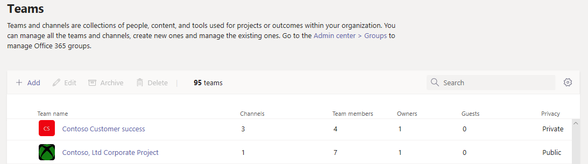

# Gerenciar equipes no centro de administração do Microsoft Teams

## Visão geral

Este artigo fornece uma visão geral das ferramentas de gerenciamento para Teams no centro de administração do Microsoft Teams.

Como administrador, você pode precisar exibir ou atualizar as equipes que sua organização configurou para colaboração ou pode precisar executar ações de correção, como atribuir proprietários para equipes sem proprietário. Você pode gerenciar as equipes usadas em sua organização por meio do módulo Microsoft Teams PowerShell e do centro de administração do Microsoft Teams. Você pode acessar o centro de administração em <a href="https://go.microsoft.com/fwlink/p/?linkid=2024339" target="_blank"> https://admin.microsoft.com </a>. Para obter recursos de administração completos usando esses dois conjuntos de ferramentas, você deve se certificar de que recebeu uma das seguintes funções:

- Administrador Global
- Administrador do Teams

Você pode aprender mais sobre as funções administrativas do Teams em [Usar funções administrativas do Microsoft Teams para gerenciar Equipes](using-admin-roles.md) e pode ler mais sobre como usar os cmdlets do PowerShell para gerenciar equipes na [referência de cmdlets do Microsoft Teams](/powershell/teams/).

## Grade de visão geral do Teams

As ferramentas de gerenciamento para equipes estão no nó do **Teams** do centro de administração do Microsoft Teams. (No centro de administração, selecione **Teams** > **Gerenciar equipes**.) Cada equipe é apoiada por um Grupo Microsoft 365 e este nó fornece uma visão dos grupos que foram Microsoft Teams -ativado em sua organização.

  

A grade exibe as seguintes propriedades:

- **Nome da equipe**
- **Canais** - uma contagem de todos os canais da equipe, incluindo o canal Geral padrão.
- **Membros da equipe** - uma contagem do total de usuários, incluindo proprietários, convidados e membros de seu locatário.
- **Proprietários** - uma contagem dos proprietários desta equipe.
- **Convidados** - uma contagem de usuários convidados B2B do Azure Active Directory que são membros desta equipe.
- **Privacidade** - o Visibility/AccessType do grupo de apoio do Microsoft 365.
- **Status** - o status Arquivado ou Ativo desta equipe. Saiba mais sobre como arquivar equipes em [Arquivar ou restaurar uma equipe](https://support.office.com/article/archive-or-restore-a-team-dc161cfd-b328-440f-974b-5da5bd98b5a7).
- **Descrição** - a descrição do grupo de backup do Microsoft 365.
- **Classificação** - a classificação (se usada em sua organização) atribuída ao grupo de apoio do Microsoft 365. Saiba mais sobre as classificações em [Criar classificações para grupos do Office em sua organização](/office365/enterprise/powershell/manage-office-365-groups-with-powershell#create-classifications-for-office-groups-in-your-organization).
- **GroupID** - o GroupID exclusivo do grupo de backup do Microsoft 365.

> [!NOTE]
> Se você não vir todas essas propriedades na grade, clique no ícone **Editar colunas**. No painel **​​Editar colunas**, você pode usar os botões de alternância para habilitar ou desabilitar colunas na grade. Quando terminar, clique em **Aplicar**.

### Adicionar

Para adicionar uma nova equipe, clique em **Adicionar**. No painel **​Adicionar uma nova equipe**, dê um nome e uma descrição à equipe, defina se deseja torná-la pública ou privada e defina a classificação.

> [!NOTE]
> As equipes recém-criadas podem ser gerenciadas imediatamente no Centro de Administração do Teams, ao contrário da experiência em outros clientes como o Outlook.

### Editar

Para editar configurações específicas de grupo e equipe, selecione a equipe clicando em à esquerda do nome da equipe e selecione **Editar**.

### Arquivar

Você pode arquivar uma equipe. Arquivar uma equipe coloca a equipe em modo somente leitura dentro do Teams. Como administrador, você pode arquivar e desarquivar equipes em nome de sua organização no centro de administração. 

### Excluir

A exclusão de uma equipe é uma exclusão reversível da equipe e do grupo do Microsoft 365 correspondente. Para restaurar uma equipe excluída por engano, siga as instruções em [Restaurar um grupo excluído](/microsoft-365/admin/create-groups/restore-deleted-group).

### Pesquisar

A pesquisa atualmente suporta a cadeia de caracteres "Começa com" e pesquisa o campo **Nome da equipe**.

## Perfil da equipe

Você pode navegar até a página de perfil da equipe de qualquer equipe a partir da grade de visão geral das equipes principais, clicando no nome da equipe. A página de perfil da equipe mostra os membros, proprietários e convidados que pertencem à equipe (e seu grupo de apoio do Microsoft 365), bem como os canais e configurações. Na página de perfil da equipe, você pode:

- Adicione ou remova membros e proprietários.
- Adicionar ou remover canais (observe que você não pode remover o canal Geral).
- Altere as configurações de equipe e grupo.
 

## Fazendo alterações nas equipes

Na página de perfil do contrato, você pode alterar os seguintes elementos de uma equipe:

- **Membros** - adicione ou remova membros e promova ou rebaixe proprietários.
- **Canais** - adicione novos canais e edite ou remova canais existentes. Lembre-se de que você não pode excluir o canal geral padrão.
- **Nome da equipe**
- **Descrição**
- **Privacidade** - defina se a equipe é pública ou privada.
- **Classificação** - é apoiada por suas classificações de grupo do Microsoft 365. Escolha **Confidencial**, **Altamente confidencial** ou **Geral**.
- **Configurações de conversa** - defina se os membros podem editar e excluir mensagens enviadas.
- **Configurações de canais** - defina se os membros podem criar novos canais e editar os existentes e adicionar, editar e remover guias, conectores e aplicativos.

As alterações feitas em uma equipe são registradas. Se você estiver modificando as configurações do grupo (alterando o nome, a descrição, a foto, a privacidade, a classificação ou os membros da equipe), as alterações serão atribuídas a você por meio do pipeline de auditoria. Se você estiver executando ações em configurações específicas do Teams, suas alterações são rastreadas e atribuídas a você no canal Geral da equipe.

## Solução de problemas

**Problema: equipes ausentes na grade de visão geral do Teams**

Algumas de suas equipes estão faltando na lista de equipes na grade de visão geral do Teams.

**Causa**: Esse problema ocorre quando o perfil da equipe foi incorretamente (ou ainda não foi) definido pelo sistema, o que pode levar à falta de uma propriedade para que ela seja reconhecida.

**Resolução: defina manualmente a propriedade com o valor correto por meio do MS Graph**

Substitua **{groupid}** na Consulta para o GroupId atual em questão, que você pode obter por meio do Exchange Online PowerShell, com o cmdlet **"[Get-UnifiedGroup](/powershell/module/exchange/users-and-groups/get-unifiedgroup)"**, como o atributo "**ExternalDirectoryObjectId**".

1. Acesse o [Explorador do Graph](https://developer.microsoft.com/graph/graph-explorer).

2. Entre no Graph Explorer no menu à esquerda.

3. Altere a linha de consulta para: PATCH> v1.0> https://graph.microsoft.com/v1.0/groups/{groupid}.

4. Adicione o seguinte valor no corpo da solicitação: {"resourceProvisioningOptions": ["Team"]}.

5. Execute a consulta no canto superior direito.

6. Confirme se a equipe aparece corretamente no centro de administração do Microsoft Teams - Visão geral da equipe.

## Saber mais

- [Referência de cmdlet Teams](/powershell/teams/)  
- [Use funções de administrador do Teams para gerenciar Equipes](using-admin-roles.md)
- [Planejar o gerenciamento do ciclo de vida no Teams](plan-teams-lifecycle.md)
