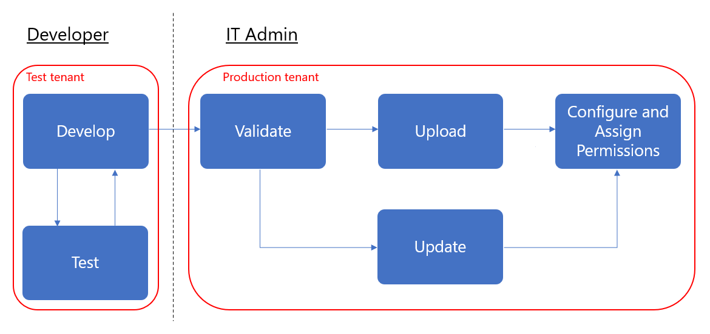

# Gerenciar seus aplicativos de linha de negócios no Microsoft Teams

Este artigo fornece uma orientação de ponta a ponta para como levar o aplicativo Teams do desenvolvimento para a implantação. Esta orientação se concentra nos aspectos da equipe do aplicativo e destina-se aos profissionais de ti. Para obter mais informações sobre o desenvolvimento de aplicativos do Teams, consulte [aqui](https://docs.microsoft.com/microsoftteams/platform).

## Introdução

Para criar e gerenciar aplicativos de linha de negócios (LOB) no Teams, você precisará de dois locatários: um locatário de teste para desenvolvimento e um locatário de produção.

> [!NOTE]
> Se ainda não tiver um locatário de teste, você pode criar rapidamente um e preenchê-lo com dados de teste usando o programa para desenvolvedores do Office 365. [Saiba mais aqui](https://developer.microsoft.com/office/dev-program).

## Etapa 1: desenvolver e testar

### Criar usuários de teste

Certifique-se de que os desenvolvedores, internos ou externos, tenham contas em seu locatário de teste. [Saiba mais sobre como adicionar usuários](https://docs.microsoft.com/office365/admin/add-users/add-users).

### Permitir aplicativos personalizados no locatário de teste

Para dar aos desenvolvedores o acesso necessário para o teste, permita que todos os usuários no locatário de teste carreguem aplicativos personalizados (também conhecidos como Sideload). Isso permite que os desenvolvedores carreguem um aplicativo personalizado para serem usados pessoalmente ou em todo o locatário de teste sem precisar enviar o aplicativo para a loja de aplicativos do teams. Carregar um aplicativo personalizado permite aos desenvolvedores testar um aplicativo antes de distribuí-lo mais amplamente.

Para permitir que os usuários carreguem aplicativos personalizados, siga estas etapas:

1. Ative a configuração **permitir interação com aplicativos personalizados** de toda a organização. Para fazer isso:
    1. Na navegação à esquerda do [centro de administração do Microsoft Teams](https://admin.teams.microsoft.com/), vá para**políticas de permissão**de **aplicativos** > do Teams e clique em **configurações de toda a organização**.
    2. Em **aplicativos personalizados**, ative **permitir interação com aplicativos personalizados**e, em seguida, clique em **salvar**.

    

2. Ative a configuração **carregar aplicativos personalizados** na política de configuração do aplicativo global. Para fazer isso:
    1. Na navegação à esquerda do [centro de administração do Microsoft Teams](https://admin.teams.microsoft.com/), vá para**políticas de configuração**de aplicativos > do **Teams**e clique na política **global (padrão para toda a organização)** .
    2. Ative **carregar aplicativos personalizados**e, em seguida, clique em **salvar**.

    

> [!NOTE]
> Também há uma configuração de aplicativo de carregamento personalizado no nível da equipe. Por padrão, essa configuração está ativada. No entanto, se os desenvolvedores não conseguirem carregar um aplicativo personalizado para uma equipe, verifique a configuração seguindo as etapas descritas [aqui](teams-custom-app-policies-and-settings.md#configure-the-team-custom-app-setting).

### Criar seu aplicativo

Os desenvolvedores agora devem ter o que precisam para criar seu aplicativo. Veja [aqui](https://docs.microsoft.commicrosoftteams/platform) as diretrizes sobre isso.

## Etapa 2: validar na produção

### Obter o pacote do aplicativo

Quando o aplicativo está pronto para ser usado na produção, o desenvolvedor deve produzir um pacote de aplicativo. Eles podem usar o [app Studio](https://docs.microsoft.com/microsoftteams/platform/get-started/get-started-app-studio) para isso. Eles enviarão o arquivo no formato. zip.

A Microsoft usa [essas diretrizes](https://docs.microsoft.com/microsoftteams/platform/publishing/office-store-approval) para garantir que os aplicativos estejam em conformidade com os padrões de qualidade e segurança da loja de aplicativos global do teams.

### Permitir que usuários confiáveis carreguem aplicativos personalizados no locatário de produção

Para validar que o aplicativo está funcionando corretamente no seu locatário de produção, você precisa permitir que os usuários de si mesmo e/ou confiáveis em sua organização carreguem aplicativos personalizados.  Assim como na etapa anterior [permitir aplicativos personalizados na etapa testar locatário](#allow-custom-apps-in-the-test-tenant) , você usa políticas de configuração do aplicativo para fazer isso.

> [!NOTE]
> Se você não se sentir à vontade para fazer o upload do aplicativo em seu locatário de produção para validação, mesmo para usuários confiáveis ou para usuários confiáveis, pode ignorar esta etapa e seguir as etapas 3 e 4 para carregar o aplicativo não validado para a loja de aplicativos do locatário. Em seguida, restrinja o acesso a esse aplicativo apenas para você e os usuários confiáveis. Esses usuários podem, então, obter o aplicativo a partir da loja de aplicativos do locatário para executar a validação. Depois que o aplicativo for validado, use as mesmas políticas de permissão para abrir o Access e faça o lançamento do aplicativo para uso em produção.

Para permitir que usuários confiáveis carreguem aplicativos personalizados, siga estas etapas:

1. Ative a configuração **permitir interação com aplicativos personalizados** de toda a organização. Para fazer isso:
    1. Na navegação à esquerda do [centro de administração do Microsoft Teams](https://admin.teams.microsoft.com/), vá para**políticas de permissão**de **aplicativos** > do Teams e clique em **configurações de toda a organização**.
    2. Em **aplicativos personalizados**, ative **permitir interação com aplicativos personalizados**e, em seguida, clique em **salvar**.
2. Desative a configuração **carregar aplicativos personalizados** na política de configuração do aplicativo global. Para fazer isso:
    1. Na navegação à esquerda do [centro de administração do Microsoft Teams](https://admin.teams.microsoft.com/), vá para**políticas de configuração**de aplicativos > do **Teams**e clique na política **global (padrão para toda a organização)** .
    2. Desative **carregar aplicativos personalizados**e, em seguida, clique em **salvar**.
3. Crie uma nova política de configuração de aplicativo que permita carregar aplicativos personalizados e atribuí-lo ao conjunto de usuários confiáveis. Para fazer isso:
    1. Na navegação à esquerda do [centro de administração do Microsoft Teams](https://admin.teams.microsoft.com/), vá para**políticas de configuração**de aplicativos > do **Teams**e, em seguida, clique em **Adicionar**. Dê um nome e uma descrição para a nova política, ative **carregar aplicativos personalizados**e, em seguida, clique em **salvar**.
    2. Selecione a nova política que você criou e clique em **gerenciar usuários**. Procure um usuário, clique em **Adicionar**e, em seguida, clique em **aplicar**. Repita esta etapa para atribuir a política a todos os usuários confiáveis.

        

    Esses usuários agora podem carregar o manifesto do aplicativo para validar que o aplicativo está funcionando corretamente no locatário de produção.

## Etapa 3: carregar para o catálogo de aplicativos do locatário

Para disponibilizar o aplicativo para os usuários no repositório de aplicativos do locatário, carregue o aplicativo. Você pode fazer isso usando o cliente da área de trabalho do teams. Siga as etapas [aqui](tenant-apps-catalog-teams.md#go-to-the-tenant-apps-catalog).

## Etapa 4: configurar e atribuir permissões

### Controlar o acesso ao aplicativo

Por padrão, todos os usuários têm acesso a este aplicativo na loja de aplicativos do teams. Para restringir e controlar quem tem permissão para usar o aplicativo, você pode criar e atribuir uma nova política de permissão de aplicativo. Siga as etapas [aqui](teams-app-permission-policies.md#create-a-custom-app-permission-policy).

### Fixar o aplicativo para que os usuários descubram

Por padrão, para os usuários encontrarem esse aplicativo, eles precisarão ir para a loja de aplicativos do Teams e procurá-lo ou procurá-lo. Para facilitar para os usuários acessar o aplicativo, você pode fixar o aplicativo à barra de aplicativos no Microsoft Teams. Para fazer isso, crie uma nova política de configuração de aplicativo e atribua-a a usuários. Siga as etapas [aqui](teams-app-setup-policies.md#create-a-custom-app-setup-policy).

## Etapa 5: atualizar o aplicativo

Para atualizar um aplicativo, os desenvolvedores devem continuar a seguir a [etapa 1](#step-1-develop-and-test) e a [etapa 2](#step-2-validate-in-production).

Você pode atualizar o aplicativo por meio do catálogo de aplicativos do locatário. Para fazer isso, no cliente da área de trabalho do Teams, vá para **aplicativos** > ** &lt;criados&gt;para o nome do locatário**, clique em **...** no canto superior direito do aplicativo e, em seguida, clique em **Atualizar**. Isso substitui o aplicativo existente no catálogo de aplicativos do locatário, e todas as políticas de permissão e políticas de configuração permanecem impostas para o aplicativo atualizado. 

