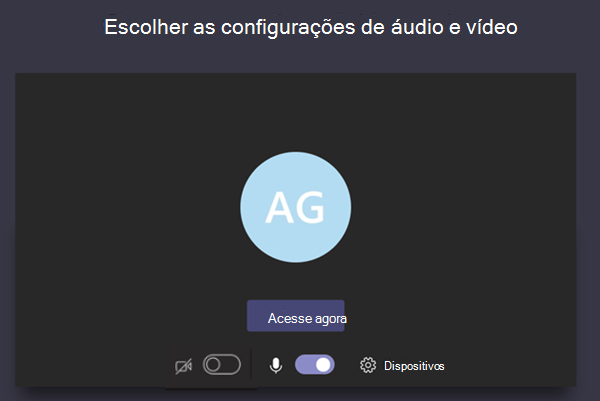
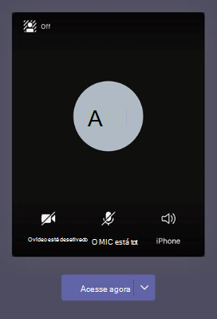

# Configurações de política de reunião para áudio & vídeo

Este artigo descreve as configurações de política de reunião específicas para áudio e vídeo. Isso inclui o seguinte:

- [Modo de áudio IP](#mode-for-ip-audio)
- [Modo de vídeo IP](#mode-for-ip-video)
- [Vídeo de IP](#ip-video)
- [Taxa de bits de mídia (Kbs)](#media-bit-rate-kbs)
- [Modo de filtros de vídeo](#video-filters-mode)
- [Permitir configurações de plano de fundo personalizadas](#allow-custom-background-settings)
- [FECC (controle de câmera de extremidade distante) para câmeras PTZ (zoom de inclinação de ponto)](#far-end-camera-control-fecc-for-point-tilt-zoom-ptz-cameras)

### Modo de áudio IP

Esta é uma política por usuário. Essa configuração controla se o áudio pode ser habilitado em reuniões e chamadas em grupo. Esses são os valores dessa configuração.

|Valor de configuração |Comportamento  |
|---------|---------|
|**Áudio de saída e entrada habilitado**    |O vídeo de saída e entrada, que é permitido na reunião, é a configuração padrão. |
|**Não habilitado**     |O áudio de entrada e saída não é permitido na reunião.     |

Se definido como **Não habilitado para** um usuário, esse usuário ainda poderá agendar e organizar reuniões, mas não poderá usar o áudio. Para participar de uma reunião, eles devem discar por meio da PSTN (Rede Telefônica Pública Comutada) ou fazer com que a reunião seja chamada e ingressar por telefone. Os participantes da reunião que não têm políticas atribuídas (por exemplo, participantes anônimos) têm essa configuração para **Áudio de saída e de entrada habilitado** por padrão. Em Teams clientes móveis, se essa configuração não estiver habilitada, o usuário terá que discar para a reunião por meio do PSTN.

Essa configuração não se aplica à chamadas 1:1. Para restringir chamadas 1:1, configure uma [política de chamada](teams-calling-policy.md) e desabilite a configuração **Fazer chamadas privadas**. Essa configuração também não se aplica aos dispositivos da sala de conferência, como dispositivos de Surface Hub e Salas do Microsoft Teams. 

Essa configuração ainda não está disponível para ambientes de Nuvem da Comunidade Governamental (GCC) da Microsoft 365, GCC Altos ou para o Departamento de Defesa (DoD).

Para saber mais, confira [Gerenciar áudio/vídeo para participantes da reunião](#manage-audiovideo-for-meeting-participants).

### Modo de vídeo IP

Essa é uma política por usuário. Essa configuração controla se o vídeo pode ser habilitado em reuniões e chamadas em grupo. Esses são os valores dessa configuração.

|Valor de configuração |Comportamento  |
|---------|---------|
|**Vídeo de saída e entrada habilitado**    | O vídeo de entrada e saída é permitido na reunião. Essa é a configuração padrão. |
|**Não habilitado**     | O vídeo de entrada e saída não é permitido na reunião. Em clientes móveis do Teams, os usuários não podem compartilhar vídeos ou fotos na reunião.   Observe que, **se o modo de áudio IP** não estiver habilitado, o modo de vídeo **IP** também permanecerá não habilitado.  |

Se definido como **Não habilitado para** um usuário, esse usuário não poderá ativar vídeo ou exibir vídeos compartilhados por outros participantes da reunião. Os participantes da reunião que não têm políticas atribuídas (por exemplo, participantes anônimos) têm essa configuração para **Vídeo de saída e de entrada habilitado** por padrão.

Essa configuração não se aplica aos dispositivos da sala de conferência, como dispositivos de Surface Hub e Salas do Microsoft Teams. 

Essa configuração ainda não está disponível para ambientes de Nuvem da Comunidade Governamental (GCC) da Microsoft 365, GCC Altos ou para o Departamento de Defesa (DoD).

> [!NOTE]
> Tenha em mente que essa configuração controla o vídeo de saída e de entrada, enquanto a configuração de **vídeo IP** controla o vídeo de saída. Para saber mais, confira [Qual configuração de política de vídeo IP tem prioridade?](#which-ip-video-policy-setting-takes-precedence) e [Gerenciar áudio/vídeo para os participantes da reunião](#manage-audiovideo-for-meeting-participants).

Para saber mais, confira [Gerenciar áudio/vídeo para participantes da reunião](#manage-audiovideo-for-meeting-participants).

### Vídeo de IP

Esta é uma combinação de uma política por usuário e por organizador. O vídeo é um componente fundamental para reuniões. Em algumas organizações, os administradores podem querer ter mais controle sobre quais reuniões têm vídeo. Essa configuração controla se o vídeo pode ser habilitado em reuniões hospedadas por um usuário e em chamadas 1:1 e de grupo iniciadas por um usuário. Em Teams clientes móveis, essa configuração controla se os usuários podem compartilhar fotos e vídeos em uma reunião.

As reuniões organizadas por um usuário que possui essa configuração de política habilitada permitem o compartilhamento de vídeo na reunião pelos participantes da reunião, caso os participantes também tenham a configuração de política habilitada. Os participantes da reunião que não possuem políticas atribuídas (por exemplo, participantes anônimos e federados) herdam a política do organizador da reunião.

> [!NOTE]
> Lembre-se de que essa configuração controla o vídeo de saída, enquanto a configuração **Modo de vídeo IP** controla o vídeo de entrada e saída. Para saber mais, confira [Qual configuração de política de vídeo IP tem prioridade?](#which-ip-video-policy-setting-takes-precedence) e [Gerenciar áudio/vídeo para os participantes da reunião](#manage-audiovideo-for-meeting-participants).

| Cliente Teams da Web e da área de trabalho |Cliente de dispositivo móvel do Teams  |
|:-------:|:-------:|
|    |          |

Observe o exemplo a seguir.

|Usuário |Políticas de reunião  |Vídeo de IP |
|---------|---------|---------|
|Daniela   | Global   | Habilitado       |
|Amanda    | Location1MeetingPolicy        | Desabilitado      |

Reuniões hospedadas pela Daniela permitem que o vídeo seja habilitado. A Daniela pode entrar na reunião e ativar o vídeo. A Amanda não pode ativar o vídeo na reunião da Daniela porque a política da Amanda está definida para não permitir o vídeo. A Amanda pode ver os vídeos compartilhados por outros participantes da reunião.

Nas reuniões hospedadas por Amanda, ninguém poderá ativar o vídeo, independentemente da política de vídeo atribuída a eles. Isso significa que a Daniela não pode ativar o vídeo nas reuniões da Amanda.  

Se Daniela liga para a Amanda com o vídeo habilitado, a Amanda poderá atender à chamada somente com o áudio.  Quando a chamada estiver conectada, a Amanda poderá ver o vídeo da Daniela, mas não poderá ativar o vídeo. Se a Amanda liga para a Daniela, Daniela poderá atender à chamada com vídeo e áudio. Quando a chamada estiver conectada, a Daniela poderá ativar ou desativar o vídeo, se necessário.

Para saber mais, confira [Gerenciar áudio/vídeo para participantes da reunião](#manage-audiovideo-for-meeting-participants).

#### Qual configuração de política de vídeo IP tem precedência?

Para um usuário, a configuração de política mais restritiva para o vídeo tem prioridade. Veja alguns exemplos.

|Vídeo de IP|Modo de vídeo IP|Experiência de compartilhamento|
|---------|---------|---------|
|Organizador: **Habilitado**  Participante: **Habilitado** |Participante: **Desabilitado**        |A configuração **Modo para vídeo IP** tem prioridade. O participante atribuído a essa política não poderá ativar nem exibir vídeos compartilhados por outras pessoas.|
|Organizador: **Habilitado**  Participante: **Habilitado** |Participante: **Vídeo de saída e de entrada habilitado**          |O participante atribuído a essa política poderá ativar e exibir vídeos compartilhados por outras pessoas.         |
|Organizador: **Habilitado**  Participante: **Desabilitado** |Participante: **Vídeo de saída e de entrada habilitado**         |A **configuração de vídeo** IP tem precedência. Os participantes só poderão ver os vídeos recebidos e não poderão enviar vídeo de saída.         |
|Organizador: **Habilitado**  Participante: **Desabilitado** |Participante: **Desabilitado**         |A configuração **Modo para vídeo IP** tem prioridade. O participante não consegue ver o vídeo de entrada ou de saída.|
|Organizador: **Desabilitado**    |       |A **configuração de** vídeo IP tem precedência porque está desativada para o organizador. Ninguém pode ativar o vídeo em reuniões organizadas pelo usuário que recebeu essa política.         |

### Gerenciar áudio/vídeo para participantes da reunião

|Se desejar...  |Definir as seguintes configurações de política  |
|---------|---------|
|Desabilitar áudio e vídeo para os participantes das reuniões  |Modo de áudio IP: **Desabilitado**  Modo de vídeo IP: **Desabilitado** Vídeo ip: N/A       |
|Habilitar apenas vídeo e áudio de entrada para os participantes nas reuniões  |Modo de áudio IP: **Áudio de entrada e saída habilitado**  Modo de vídeo IP: **Vídeo de entrada e saída habilitado** Vídeo de IP: **Desativado**       |
|Desabilitar o vídeo para os participantes nas reuniões (os participantes só têm áudio)|  Modo de áudio IP: **Habilitar o áudio de entrada e saída**  Modo de vídeo IP: **Desabilitado** Vídeo ip: N/A
|Habilitar áudio e vídeo para os participantes das reuniões    |Modo de áudio IP: **Áudio de entrada e saída habilitado** (padrão)  Modo de vídeo IP: **Vídeo de entrada e saída habilitado** (padrão) Vídeo ip: **Ativado** (padrão)    |

A política mais restritiva entre a política do organizador da reunião e a política do usuário será aplicada. Por exemplo, se um organizador tiver uma política que restringe vídeo e a política de um usuário não restringe vídeo, os participantes da reunião herdam a política do organizador da reunião e não têm acesso ao vídeo em reuniões. Isso significa que eles podem ingressar à reunião apenas com o áudio.

> [!NOTE]
> Quando um usuário iniciar uma chamada de grupo para entrar por telefone, a tela **Usar telefone para áudio** não será exibida. Esse é um problema conhecido que estamos trabalhando para resolver. Para evitar esse problema, selecione **Áudio do telefone** em **Outras opções de ingresso**.

#### Cliente de dispositivo móvel do Teams

Para usuários em Teams móveis, a capacidade de compartilhar fotos e vídeos durante uma reunião também é determinada pela configuração do modo de  vídeo **IP ou vídeo IP**. Dependendo da configuração da política, a capacidade de compartilhar vídeos e fotos não estará disponível. Isso não afeta o compartilhamento de tela, que você configura usando um modo separado de [Compartilhamento de tela](meeting-policies-content-sharing.md#screen-sharing-mode). Além disso, você pode definir uma [Política de mobilidade do Teams](/powershell/module/skype/new-csteamsmobilitypolicy) para impedir que os usuários móveis usem o vídeo por meio de uma conexão de rede celular, o que significa que devem usar uma conexão WiFi.

### Taxa de bits de mídia (Kbs)

Essa é uma política por usuário. Essa configuração determina a taxa de bits de mídia para as transmissões de compartilhamento de áudio, vídeo e aplicativos baseados em vídeo em chamadas e reuniões do usuário. Ela é aplicada à travessia da mídia de uplink e de downlink para os usuários da chamada ou da reunião. Essa configuração oferece controle meticuloso sobre o gerenciamento de largura de banda na sua organização. Dependendo dos cenários de reuniões necessários para os usuários, recomendamos o uso de largura de banda suficiente para ter uma boa experiência de qualidade. O valor mínimo é de 30 kbps e o valor máximo depende do cenário da reunião. Para saber mais sobre a largura de banda mínima recomendável para reuniões em boas-qualidade, chamadas e eventos ao vivo no Teams, confira [Requisitos de largura de banda](prepare-network.md#bandwidth-requirements).

Se não houver largura de banda suficiente para uma reunião, os participantes verão uma mensagem que indica uma qualidade de rede ruim.

Para reuniões que precisem da experiência de qualidade de vídeo mais alta, como as reuniões da diretoria e eventos ao vivo do Teams, recomendamos que você defina a largura de banda como 10 Mbps. Mesmo quando a experiência máxima é definida, a pilha das mídias da do Teams se adapta às condições de baixa largura de banda quando determinadas condições de rede são detectadas, dependendo do cenário.

## Modo de filtros de vídeo

Essa é uma política por usuário. Essa configuração controla se os usuários podem personalizar o plano de fundo do vídeo em uma reunião.

Você pode usar o Teams de administração e o PowerShell para definir essa política. Você pode editar uma política de reunião do Teams existente usando o cmdlet [Set-CsTeamsMeetingPolicy](/powershell/module/skype/set-csteamsmeetingpolicy). Ou crie uma nova política de reunião do Teams usando o cmdlet [New-CsTeamsMeetingPolicy](/powershell/module/skype/new-csteamsmeetingpolicy) e atribua essa política aos usuários.

Para especificar se os usuários podem personalizar a tela de fundo do vídeo em uma reunião, defina o parâmetro **VideoFiltersMode** **(selecione** a configuração de filtros de vídeo no Teams de administração) da seguinte maneira:

|Valor de configuração no PowerShell|Definindo o valor Teams centro de administração |Comportamento  |
|---------|---------|---------|
|**NoFilters** |**Nenhum filtro**    |O usuário não pode personalizar o plano de fundo do vídeo.|
|**BlurOnly**     |**Somente desfoque de plano de fundo**|O usuário tem a opção de borrar o plano de fundo do vídeo. |
|**BlurandDefaultBackgrounds**|**Desfoque de plano de fundo e imagens padrão**     |O usuário tem a opção de borrar o plano de fundo do vídeo ou escolher entre o conjunto padrão de imagens a ser usado como plano de fundo. |
|**AllFilters**|**Todos os filtros**     |O usuário tem a opção de borrar o plano de fundo do vídeo, escolher entre o conjunto padrão de imagens, ou fazer o upload de imagens personalizadas para usá-las como plano de fundo. |

> [!NOTE]
> As imagens carregadas pelos usuários não são filtradas pelo Teams. Quando você usa a configuração **AllFilters**, você deve ter políticas internas da organização para impedir que os usuários façam o upload de imagens ofensivas ou inadequadas, ou imagens que sua organização não tem direitos de uso para os planos de fundo de reunião do Teams.

### Permitir configurações de plano de fundo personalizadas

Você pode adicionar imagens de plano de fundo personalizadas a serem usadas por locatário. Esse recurso permite que as empresas apliquem a identidade visual corporativa a Teams reuniões.

1. Entre no Centro de administração do Teams.

2. Selecione **MeetingsMeeting** >  **PoliciesCustomize** >  imagens de reunião.

   

3. Selecione **Ativado em** imagens **de plano de fundo de toda a organização**.

4. Selecione **+ Adicionar imagens**.

5. No painel Gerenciar planos de fundo, selecione **Adicionar imagem**.

6. Verifique se as imagens atendem a estes requisitos:
  
   - Tamanho mínimo de 360 px
   - Tamanho máximo de 2048 px
   - Tipo de arquivo PNG, JPG ou BMP
   - Máximo de 50 imagens podem ser carregadas

7. Visualize as imagens selecionadas e selecione **Fechar**.

8. Examine as imagens e adicione mais conforme necessário.

9. Selecione **Salvar**.

Os participantes da reunião verão uma seleção de imagens de plano de fundo que podem ser usadas quando participam de uma reunião.

> [!NOTE]
> Pode levar até 24 horas para que as alterações entre em vigor.

> [!NOTE]
> Esse recurso está temporariamente disponível em versão prévia pública para todos os Microsoft Teams clientes. Para obter esse recurso após a versão prévia, cada usuário precisará da licença de complemento comunicações avançadas. Para obter mais informações, consulte [Complemento de Comunicações Avançadas para o Microsoft Teams ](/microsoftteams/teams-add-on-licensing/advanced-communications).

### FECC (controle de câmera de extremidade distante) para câmeras PTZ (zoom de inclinação de ponto)

O controle de câmera de extremidade distante é uma política que pode ser atribuída Salas do Teams em Windows de recursos. Ele permite que as câmeras PTZ conectadas a uma sala Teams sejam controladas por participantes da reunião no aplicativo cliente Teams durante as reuniões.

Para usar o controle de câmera de ponta, os participantes da reunião precisarão obter o aplicativo Controles de **Câmera PTZ** .  Consulte [Permitir e bloquear aplicativos](manage-apps.md#allow-and-block-apps) para saber como disponibilizar o aplicativo na loja de aplicativos da sua organização.

Para especificar quem pode usar o controle de câmera de ponta em uma reunião, crie e atribua uma nova política a uma conta de recurso do Salas do Teams usando o cmdlet [New-CsTeamsMeetingPolicy](/powershell/module/skype/new-csteamsmeetingpolicy?view=skype-ps) ou use [Set-CsTeamsMeetingPolicy](/powershell/module/skype/set-csteamsmeetingpolicy) para modificar um existente. Defina `TeamsCameraFarEndPTZMode` o parâmetro como um dos seguintes valores:

| Valor de configuração | Comportamento |
|---------------|----------|
|Desabilitado | Essa é a configuração padrão. Quando definido como 'desabilitado', ninguém pode usar controles de câmera PTZ. |
|AutoAcceptAll | Os controles de câmera PTZ estão automaticamente disponíveis para qualquer participante da reunião. |
|AutoAcceptInTenant | Os controles de câmera PTZ estão disponíveis automaticamente somente para participantes na mesma organização que a Teams Sala. |

Quando `TeamsCameraFarEndPTZMode` definido como ou `AutoAcceptAll` `AutoAcceptInTenant`, o controle de câmera ainda pode ser desativado manualmente da sala Teams a qualquer momento durante uma reunião. O controle da câmera também não está disponível quando a câmera está desligada.

Há suporte para qualquer câmera com controles PTZ e UVC mecânicos. Para obter uma lista de câmeras certificadas para Teams, incluindo câmeras PTZ e não PTZ, consulte versões de firmware certificadas para [periféricos de áudio e vídeo USB](rooms/requirements.md#certified-firmware-versions-for-usb-audio-and-video-peripherals). Esse recurso ainda não tem suporte em câmeras com controles PTZ digitais ou em Salas do Teams no Android.  

> [!NOTE]
> Atualize o firmware da câmera antes de testar os controles PTZ. Consulte a documentação original do fabricante do equipamento (OEM) para atualizar o firmware.

## Tópicos relacionados

- [Visão Geral do PowerShell do Teams](teams-powershell-overview.md)
- [Atribuir políticas aos usuários no Microsoft Teams](policy-assignment-overview.md)
