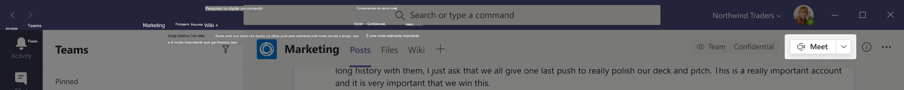
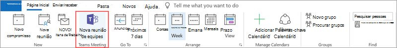
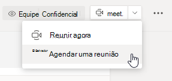
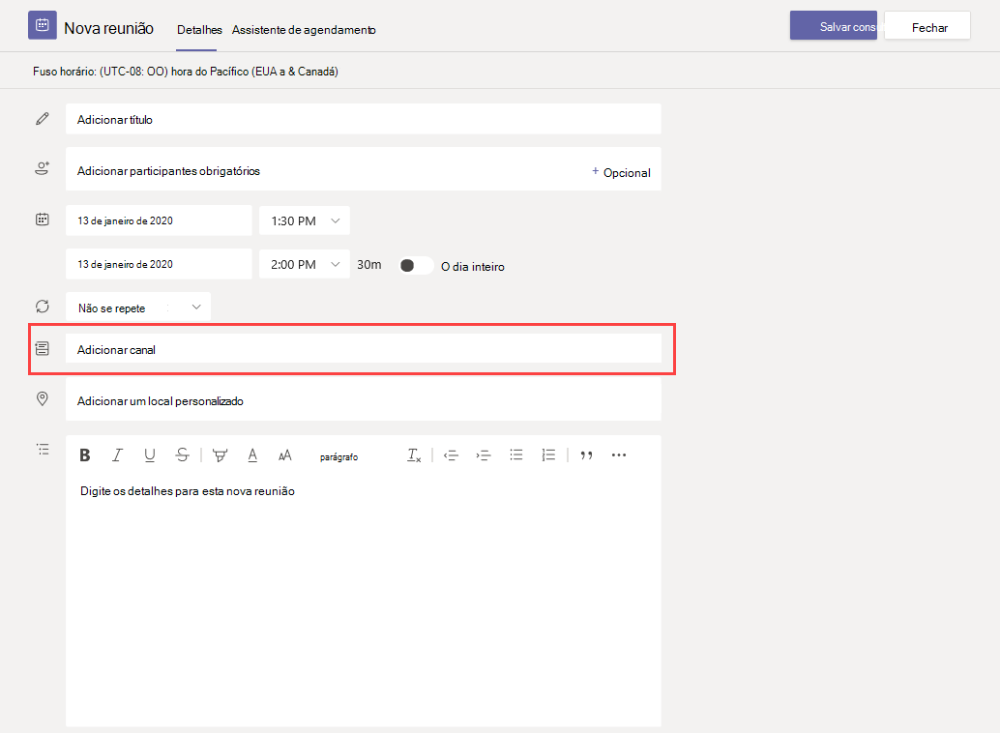
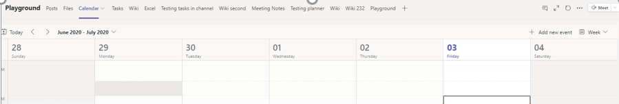
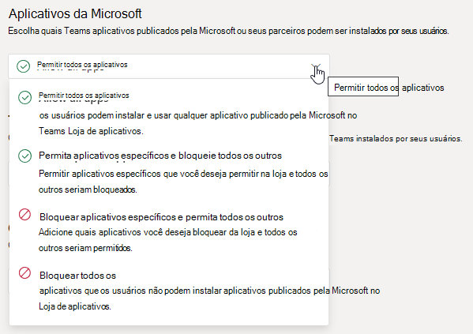
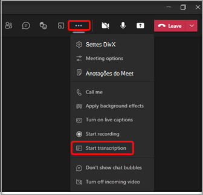
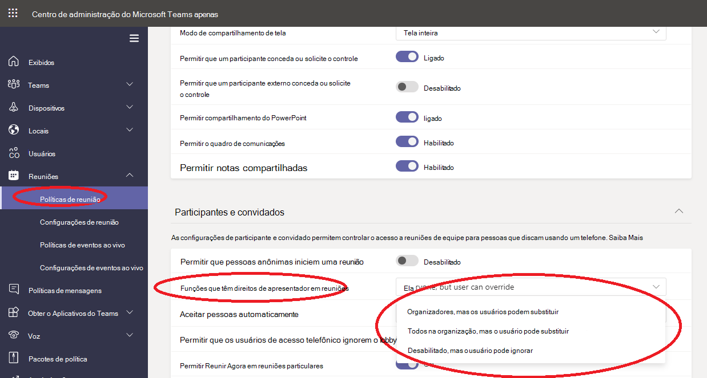

# Gerenciar políticas de reunião no Teams

::: zone target="docs"
Use as políticas de reunião para controlar os recursos disponíveis para os participantes de reuniões agendadas por usuários em sua organização. Você pode usar a política global (padrão em toda a organização) criada automaticamente ou criar e atribuir políticas personalizadas.  Você gerencia as políticas de reunião no Centro de Administração do Microsoft Teams ou usando o [PowerShell](teams-powershell-overview.md).

> [!NOTE]
> Para obter informações sobre como usar as funções para gerenciar as permissões de apresentadores e participantes da reunião, confira [funções em uma reunião no Teams](https://support.microsoft.com/office/roles-in-a-teams-meeting-c16fa7d0-1666-4dde-8686-0a0bfe16e019?ui=en-us&rs=en-us&ad=us).

Você pode implementar políticas das seguintes maneiras, o que afeta a experiência da reunião para os usuários antes, durante, ou depois de uma reunião.

|Tipo de implementação  |Descrição  |
|---------|---------|
|Por organizador    |Ao implementar uma política por organizador, todos os participantes da reunião herdam a política do organizador. Por exemplo, **Admitir pessoas automaticamente** é uma política por organizador. Isso controla se os usuários entram na reunião diretamente ou se esperam o lobby de reuniões agendadas pelo usuário que atribuiu a política.          |
|Por usuário    |Ao implementar uma política por usuário, somente a política por usuário se aplica à restrições de certos recursos para o organizador e/ou os participantes da reunião. Por exemplo, **Permitir Reunir agora nos canais** é uma política por usuário.     |
|Por organizador e por usuário     |Ao implementar uma combinação de uma política por organizador e por usuário, alguns recursos são restritos para os participantes da reunião com base em sua política e a política do organizador. Por exemplo, **Permitir gravação na nuvem** é uma política por organizador e por usuário. Ative essa configuração para permitir que os usuários iniciem e parem uma gravação.

Você pode editar as configurações na política global ou criar e atribuir uma ou mais políticas personalizadas. Os usuários terão a política global, a menos que você crie e atribua uma política personalizada.

> [!NOTE]
> O botão detalhes da reunião estará disponível se um usuário tiver as licenças de conferência de áudio habilitadas ou se o usuário permitir a conferência de áudio, caso contrário, os detalhes da reunião não estarão disponíveis.

## Criar uma política de reunião personalizada

1. Na barra de navegação à esquerda do Centro de Administração do Microsoft Teams, vá para **Reuniões** > **Políticas de Reunião**.
2. Selecione **Adicionar**.
3. Insira um nome e uma descrição para a política. O nome não pode conter caracteres especiais ou ter mais de 64 caracteres.
4. Escolha as configurações que deseja.
5. Selecione **Salvar**.

Por exemplo, digamos que você tenha um grupo de usuários e queira limitar a quantidade de largura de banda que a reunião exigiria. Você criaria uma nova política personalizada chamada "Largura de banda limitada" e desativaria as seguintes configurações:

Em **Áudio e vídeo**:

- Desative a opção Permitir gravação na nuvem.
- Desative a opção Permitir vídeo IP.

Em **Compartilhamento de conteúdo**:

- Desative o modo de compartilhamento de tela.
- Desative a opção Permitir quadro de comunicações.
- Desative a opção Permitir anotações compartilhadas.

Em seguida, atribua a política aos usuários.

## Editar uma política de retenção

Você pode editar a política global e as políticas personalizadas que criar.

1. Na barra de navegação à esquerda do Centro de Administração do Microsoft Teams, vá para **Reuniões** > **Políticas de Reunião**.
2. Escolha a política clicando à esquerda do nome da política e selecionando **Editar**.
3. A partir daqui, faça as alterações desejadas.
4. Selecione **Salvar**.

> [!NOTE]
> Um usuário pode receber apenas uma política de reunião por vez.

## Atribuir uma política de reunião aos usuários

[!INCLUDE [assign-policy](includes/assign-policy.md)]

> [!NOTE]
> Você não pode excluir uma política se usuários estiverem atribuídos a ela. Primeiro, você deve atribuir uma política diferente a todos os usuários afetados. em seguida, é possível excluir a política original.

## Configurações de política de reunião

Selecione uma política existente na página **Políticas de reunião** ou selecione **Adicionar** para adicionar uma nova política. Defina as configurações para os seguintes.

- [Geral](#meeting-policy-settings---general)
- [Áudio e vídeo](#meeting-policy-settings---audio--video)
- [Compartilhamento de conteúdo](#meeting-policy-settings---content-sharing)
- [Participantes e convidados](#meeting-policy-settings---participants--guests)

::: zone-end

## Configurações de política de reunião - Geral

- [Permitir Reunir Agora em canais](#allow-meet-now-in-channels)
- [Permitir o suplemento do Outlook](#allow-the-outlook-add-in)
- [Permitir o agendamento de reunião do canal](#allow-channel-meeting-scheduling)
- [Permitir o agendamento de reuniões privadas](#allow-scheduling-private-meetings)
- [Permitir Reunir Agora em reuniões privadas](#allow-meet-now-in-private-meetings)

### Permitir Reunir agora nos canais

Permitir que o **Reunir Agora** seja uma política por usuário e se aplicar antes de começar uma reunião. Essa configuração controla se um usuário pode iniciar uma reunião não planejada em um canal do Teams. Se você ativar essa configuração, os usuários poderão selecionar o botão **Reunir** para iniciar uma reunião não planejada ou agendar uma reunião no canal. O valor padrão é True.

### Permitir o suplemento do Outlook

Permite que o suplemento do Outlook seja uma política por usuário e se aplica antes do início de uma reunião. Essa configuração controla se as reuniões do Teams podem ser agendadas a partir do Outlook (Windows, Mac, Web e dispositivo móvel).

Se você desabilitar esse recurso, os usuários não conseguirão agendar. As reuniões do Teams ao criar uma nova reunião no Outlook. Por exemplo, no Outlook no Windows, a opção **Nova reunião do Teams** não será exibida na faixa de opções.

### Permitir o agendamento de reunião do canal

Use a política existente AllowChannelMeetingScheduling para controlar os tipos de eventos que podem ser criados nos calendários do canal de equipe. Essa é uma política por usuário e se aplica antes de começar uma reunião. Essa configuração controla se os usuários podem agendar uma reunião em um canal do Teams. Por padrão, essa configuração é ativada.

Se essa política estiver desativada, os usuários não conseguirão criar novas reuniões de canal. No entanto, as reuniões existentes no canal podem ser editadas pelo organizador do evento.

Agendar uma reunião será desabilitada.

 

A seleção de canal está desabilitada.

Na página dos posts de canal, os seguintes recursos serão desabilitados:

- Botão **Agendar uma reunião** na caixa de texto responder ao canal.
  
  
- Botão **Agendar uma reunião** no cabeçalho do canal.
  

No calendário do canal:

- Botão **Adicionar novo evento** no cabeçalho do calendário do canal será desabilitado.
  

- Os usuários não podem arrastar e selecionar um bloco de tempo no calendário do canal para criar uma reunião de canal.

- Os usuários não podem usar atalhos de teclado para criar uma reunião no calendário do canal.

No Centro de Administração:

O aplicativo de calendário de canal será mostrado na seção **Aplicativos da Microsoft** na página de políticas de permissão do aplicativo.

 

### Permitir o agendamento de reuniões particulares

O agendamento de reuniões privadas é uma política por usuário e se aplica antes do início de uma reunião. Essa configuração controla se os usuários podem agendar reuniões particulares no Teams. Uma reunião é particular quando não é publicada em um canal de uma equipe.

Se você desabilitar **Permitir agendamento de reuniões** privadas e **Permitir agendamento de reunião** de canal, as opções **Adicionar participantes necessários** e **Adicionar canal** serão desabilitadas para usuários no Teams. Por padrão, essa configuração é ativada.

### Permitir Reunir Agora em reuniões particulares

Essa é uma política por usuário e se aplica antes de começar uma reunião. Essa configuração controla se um usuário pode iniciar uma reunião privada não planejada. Por padrão, essa configuração é ativada.

## Configurações de política de reunião - Áudio e vídeo

- [Permitir transcrição](#allow-transcription)
- [Permitir gravação em nuvem](#allow-cloud-recording)
- [Modo de áudio IP](#mode-for-ip-audio)
- [Modo de vídeo IP](#mode-for-ip-video)
- [Permitir vídeo IP](#allow-ip-video)
- [Taxa de bits de mídia (Kbs)](#media-bit-rate-kbs)

### Permitir transcrição

Essa política ativa a Transcrição ao vivo. Permitir transcrição é uma política por usuário. Essa configuração controla se essa específica reunião do Teams pode ser transcrita.

A transcrição ao vivo mostra a conversão de fala em texto do conteúdo falado durante uma reunião do Teams em tempo real. O texto aparece junto com o vídeo da reunião, incluindo o nome do locutor e um carimbo de data/hora. Para saber mais, confira [Exibir transcrição ao vivo em uma reunião do Teams](https://support.microsoft.com/office/view-live-transcription-in-a-teams-meeting-dc1a8f23-2e20-4684-885e-2152e06a4a8b).

Atualmente, a transcrição ao vivo tem suporte para o cliente de área de trabalho do Teams. A transcrição tem suporte para o inglês falado dos EUA. A transcrição fica disponível após a reunião na área de trabalho ou na Web do Teams.

Veja como as configurações de política **Permitir transcrição** e **Permitir gravação na nuvem** funcionam juntas. A tabela a seguir descreve os valores para essas configurações e o comportamento da reunião.

|Permitir transcrição|Permitir gravação na nuvem|Comportamento|
|---------|---------|---------|
|**Ativado**|**Ativado**|A opção **Iniciar transcrição** está disponível nas reuniões do Teams. O organizador ou os participantes da reunião podem iniciar e parar a transcrição. A opção **Iniciar gravação** está disponível nas reuniões do Teams. O organizador ou os participantes da reunião podem iniciar e parar a gravação. |
|**Ativado**|**Desativado**|A opção **Iniciar transcrição** está disponível nas reuniões do Teams. A opção **Iniciar gravação** não está disponível nas reuniões do Teams. |
|**Desativado**|**Ativado**|A opção **Iniciar gravação** está disponível nas reuniões do Teams. A opção **Iniciar transcrição** não está disponível nas reuniões do Teams.|
|**Desativado**|**Desativado**|A gravação e a transcrição não estão disponíveis nas reuniões do Teams.  |

### Permitir gravação na nuvem

A opção Permitir gravação na nuvem é controlada através de uma política por usuário. Essa configuração controla se um usuário pode gravar. A gravação poderá ser iniciada pelo organizador da reunião ou por outro participante da reunião se sua configuração de política específica for ativada, e se for um usuário autenticado da mesma organização que o organizador.

Pessoas de fora da sua organização, como usuários federados e anônimos, não conseguem iniciar a gravação. Os usuários convidados não podem iniciar ou interromper a gravação.

Para saber mais sobre a gravação de reunião na nuvem, confira [Gravação de reunião na nuvem do Teams](cloud-recording.md).

### Modo de áudio IP

O modo de áudio IP é uma política por usuário. Essa configuração controla se o áudio pode ser habilitado em reuniões e chamadas em grupo. Esses são os valores dessa configuração.

|Valor de configuração |Comportamento  |
|---------|---------|
|**Áudio de saída e entrada habilitado**    |O vídeo de saída e entrada, que é permitido na reunião, é a configuração padrão. |
|**Desabilitado**     |O áudio de entrada e saída não é permitido na reunião.     |

Se definido como **Desabilitado** para um usuário, esse usuário ainda poderá agendar e organizar reuniões, mas não poderá usar o áudio. Para participar de uma reunião, o usuário deve discar por meio da PSTN (Rede Telefônica Pública Comutada) ou fazer com que a reunião seja chamada e ingressar o usuário por telefone. Os participantes da reunião que não têm políticas atribuídas (por exemplo, participantes anônimos) têm essa configuração para **Áudio de saída e de entrada habilitado** por padrão. Em clientes móveis do Teams, se essa configuração estiver desabilitada, o usuário precisará discar para a reunião por meio da PSTN.

Essa configuração não se aplica à chamadas 1:1. Para restringir chamadas 1:1, configure uma [política de chamada](teams-calling-policy.md) e desabilite a configuração **Fazer chamadas privadas**. Essa configuração também não se aplica aos dispositivos da sala de conferência, como dispositivos de Surface Hub e Salas do Microsoft Teams. 

Essa configuração ainda não está disponível para ambientes de Nuvem da Comunidade Governamental (GCC) da Microsoft 365, GCC Altos ou para o Departamento de Defesa (DoD).

Para saber mais, confira [Gerenciar áudio/vídeo para participantes da reunião](#manage-audiovideo-for-meeting-participants).

### Modo de vídeo IP

O modo de vídeo IP é uma política por usuário. Essa configuração controla se o vídeo pode ser habilitado em reuniões e chamadas em grupo. Esses são os valores dessa configuração.

|Valor de configuração |Comportamento  |
|---------|---------|
|**Vídeo de saída e entrada habilitado**    | O vídeo de saída e entrada, que é permitido na reunião, é a configuração padrão. |
|**Desabilitado**     | O vídeo de entrada e saída não é permitido na reunião. Em clientes móveis do Teams, os usuários não podem compartilhar vídeos ou fotos na reunião.   Se o **Modo de áudio IP** estiver desabilitado, o **Modo de vídeo IP** também permanecerá desabilitado.  |

Se definido como **Desabilitado** para um usuário, esse usuário não poderá ativar o vídeo ou exibir vídeos compartilhados por outros participantes da reunião. Os participantes da reunião que não têm políticas atribuídas (por exemplo, participantes anônimos) têm essa configuração para **Vídeo de saída e de entrada habilitado** por padrão.

Essa configuração não se aplica aos dispositivos da sala de conferência, como dispositivos de Surface Hub e Salas do Microsoft Teams. 

Essa configuração ainda não está disponível para ambientes de Nuvem da Comunidade Governamental (GCC) da Microsoft 365, GCC Altos ou para o Departamento de Defesa (DoD).

> [!NOTE]
> Lembre-se de que essa configuração controla o vídeo de saída e de entrada, enquanto a configuração **Permitir vídeo IP** controla o vídeo de saída. Para saber mais, confira [Qual configuração de política de vídeo IP tem prioridade?](#which-ip-video-policy-setting-takes-precedence) e [Gerenciar áudio/vídeo para os participantes da reunião](#manage-audiovideo-for-meeting-participants).

Para saber mais, confira [Gerenciar áudio/vídeo para participantes da reunião](#manage-audiovideo-for-meeting-participants).

### Permitir vídeo IP

Permitir vídeo IP é uma combinação de política por usuário e por organizador. O vídeo é um componente fundamental para reuniões. Em algumas organizações, os administradores podem querer ter mais controle sobre quais reuniões têm vídeo. Essa configuração controla se o vídeo pode ser habilitado em reuniões hospedadas por um usuário e em chamadas 1:1 e de grupo iniciadas por um usuário. Em clientes móveis do Teams, essa configuração controla se os usuários podem compartilhar fotos e vídeos em uma reunião.

As reuniões organizadas por um usuário que possui essa configuração de política habilitada permitem o compartilhamento de vídeo na reunião pelos participantes da reunião, caso os participantes também tenham a configuração de política habilitada. Os participantes da reunião que não possuem políticas atribuídas (por exemplo, participantes anônimos e federados) herdam a política do organizador da reunião.

> [!NOTE]
> Lembre-se de que essa configuração controla o vídeo de saída, enquanto a configuração **Modo de vídeo IP** controla o vídeo de entrada e saída. Para saber mais, confira [Qual configuração de política de vídeo IP tem prioridade?](#which-ip-video-policy-setting-takes-precedence) e [Gerenciar áudio/vídeo para os participantes da reunião](#manage-audiovideo-for-meeting-participants).

| Cliente Teams da Web e da área de trabalho |Cliente de dispositivo móvel do Teams  |
|:-------:|:-------:|
|    |          |

Observe o exemplo a seguir.

|Usuário |Políticas de reunião  |Permitir vídeo IP |
|---------|---------|---------|
|Daniela   | Global   | Habilitado       |
|Amanda    | Location1MeetingPolicy        | Desabilitado      |

Reuniões hospedadas pela Daniela permitem que o vídeo seja habilitado. A Daniela pode entrar na reunião e ativar o vídeo. A Amanda não pode ativar o vídeo na reunião da Daniela, pois a política da Amanda está definida para não permitir vídeo. A Amanda pode ver os vídeos compartilhados por outros participantes da reunião.

Nas reuniões hospedadas por Amanda, ninguém poderá ativar o vídeo, independentemente da política de vídeo atribuída a eles. Isso significa que a Daniela não pode ativar o vídeo nas reuniões da Amanda.  

Se Daniela liga para a Amanda com o vídeo habilitado, a Amanda poderá atender à chamada somente com o áudio. Quando a chamada estiver conectada, a Amanda poderá ver o vídeo da Daniela, mas não poderá ativar o vídeo. Se a Amanda liga para a Daniela, Daniela poderá atender à chamada com vídeo e áudio. Quando a chamada estiver conectada, a Daniela poderá ativar ou desativar o vídeo, se necessário.

Para saber mais, confira [Gerenciar áudio/vídeo para participantes da reunião](#manage-audiovideo-for-meeting-participants).

#### Qual configuração de política de vídeo IP tem prioridade

Para um usuário, a configuração de política mais restritiva para o vídeo tem prioridade. Veja alguns exemplos.

|Permitir vídeo IP|Modo de vídeo IP|Experiência de compartilhamento|
|---------|---------|---------|
|Organizador: **Habilitado**  Participante: **Habilitado** |Participante: **Desabilitado**        |A configuração **Modo para vídeo IP** tem prioridade. O participante atribuído a essa política não poderá ativar nem exibir vídeos compartilhados por outras pessoas.|
|Organizador: **Habilitado**  Participante: **Habilitado** |Participante: **Vídeo de saída e de entrada habilitado**          |O participante atribuído a essa política poderá ativar e exibir vídeos compartilhados por outras pessoas.         |
|Organizador: **Habilitado**  Participante: **Desabilitado** |Participante: **Vídeo de saída e de entrada habilitado**         |A configuração **Permitir modo de vídeo IP** tem prioridade. Os participantes só poderão ver os vídeos recebidos e não poderão enviar vídeo de saída.         |
|Organizador: **Habilitado**  Participante: **Desabilitado** |Participante: **Desabilitado**         |A configuração **Modo de vídeo IP** tem prioridade. O participante não consegue ver o vídeo de entrada ou de saída.|
|Organizador: **Desabilitado**    |       |A configuração **Permitir vídeo IP** tem prioridade porque está desativada para o organizador. Ninguém pode ativar o vídeo em reuniões organizadas pelo usuário que recebeu essa política.         |

### Gerenciar áudio/vídeo para participantes da reunião

|Se desejar...  |Definir as seguintes configurações de política  |
|---------|---------|
|Desabilitar áudio e vídeo para os participantes das reuniões  |Modo de áudio IP: **Desabilitado**  Modo de vídeo IP: **Desabilitado** Permitir vídeo IP: N/A       |
|Habilitar apenas vídeo e áudio de entrada para os participantes nas reuniões  |Modo de áudio IP: **Áudio de entrada e saída habilitado**  Modo de vídeo IP: **Vídeo de entrada e saída habilitado** Permitir vídeo IP: **Desativado**       |
|Desabilitar o vídeo para os participantes nas reuniões (os participantes só têm áudio)|  Modo de áudio IP: **Habilitar o áudio de entrada e saída**  Modo de vídeo IP: **Desabilitado** Permitir vídeo IP: N/A
|Habilitar áudio e vídeo para os participantes das reuniões    |Modo de áudio IP: **Áudio de entrada e saída habilitado** (padrão)  Modo de vídeo IP: **Vídeo de entrada e saída habilitado** (padrão) Permitir vídeo IP: **Habilitado** (padrão)    |

A política mais restritiva entre a política do organizador da reunião e a política do usuário será aplicada. Por exemplo, se um organizador tiver uma política que restringe vídeo e a política de um usuário não restringe vídeo, os participantes da reunião herdam a política do organizador da reunião e não têm acesso ao vídeo em reuniões. Isso significa que eles podem ingressar à reunião apenas com o áudio.

> [!NOTE]
> Quando um usuário iniciar uma chamada de grupo para entrar por telefone, a tela **Usar telefone para áudio** não será exibida. Esse é um problema conhecido que estamos trabalhando para resolver. Para evitar esse problema, selecione **Áudio do telefone** em **Outras opções de ingresso**.  

#### Cliente de dispositivo móvel do Teams

Para os usuários do Teams em dispositivo móvel, a capacidade de compartilhar fotos e vídeos durante uma reunião também é determinada pela configuração **Permitir vídeo IP** ou **Modo de vídeo de IP**. Dependendo da configuração da política, a capacidade de compartilhar vídeos e fotos não estará disponível. Isso não afeta o compartilhamento de tela, que você configura usando um modo separado de [Compartilhamento de tela](#screen-sharing-mode). Além disso, você pode definir uma [Política de mobilidade do Teams](/powershell/module/skype/new-csteamsmobilitypolicy) para impedir que os usuários móveis usem o vídeo por meio de uma conexão de rede celular, o que significa que devem usar uma conexão WiFi.

### Taxa de bits de mídia (Kbs)

Essa é uma política por usuário. Esta configuração determina a taxa média total de bits da mídia para as transmissões de compartilhamento de áudio, vídeo e aplicativos baseados em vídeo em chamadas e reuniões do usuário. Ela é aplicada à travessia da mídia de uplink e de downlink para os usuários da chamada ou da reunião. Essa configuração oferece controle meticuloso sobre o gerenciamento de largura de banda na sua organização. Dependendo dos cenários de reuniões necessários para os usuários, recomendamos o uso de largura de banda suficiente para ter uma boa experiência de qualidade. O valor mínimo é de 30 kbps e o valor máximo depende do cenário da reunião. Para saber mais sobre a largura de banda mínima recomendável para reuniões em boas-qualidade, chamadas e eventos ao vivo no Teams, confira [Requisitos de largura de banda](prepare-network.md#bandwidth-requirements).

Se não houver largura de banda suficiente para uma reunião, os participantes verão uma mensagem que indica uma qualidade de rede ruim.

Para reuniões que precisem da experiência de qualidade de vídeo mais alta, como as reuniões da diretoria e eventos ao vivo do Teams, recomendamos que você defina a largura de banda como 10 Mbps. Mesmo quando a experiência máxima é definida, a pilha das mídias da do Teams se adapta às condições de baixa largura de banda quando determinadas condições de rede são detectadas, dependendo do cenário.

## Configurações de política de reunião - Compartilhamento de conteúdo

- [Modo de compartilhamento de tela](#screen-sharing-mode)
- [Permitir que um participante conceda ou solicite o controle](#allow-a-participant-to-give-or-request-control)
- [Permitir que um participante externo conceda ou solicite o controle](#allow-an-external-participant-to-give-or-request-control)
- [Permitir o compartilhamento do PowerPoint](#allow-powerpoint-sharing)
- [Permitir quadro de comunicações](#allow-whiteboard)
- [Permitir anotações compartilhadas](#allow-shared-notes)

### Modo de compartilhamento de tela

> [!NOTE]
> Esse recurso ainda está em desenvolvimento. O compartilhamento de tela é uma política por participante, no entanto, pode ser afetado pelas configurações de compartilhamento de tela do organizador, conforme descrito nesta seção.

Essa configuração controla se a área de trabalho e/ou o compartilhamento de janela é permitido na reunião do usuário. Os participantes da reunião que não possuem políticas atribuídas (por exemplo, participantes anônimos e federados, convidado, B2B) herdam a política do organizador da reunião.

|Valor de configuração |Comportamento  |
|---------|---------|
|**Tela inteira**    | Compartilhamento completo de área de trabalho e compartilhamento de aplicativos são permitidos na reunião |
|**Único aplicativo**   | O compartilhamento de aplicativos é permitido na reunião        |
|**Desabilitado**     |Compartilhamento de tela e compartilhamento de aplicativos desativados na reunião.       |

Observe o exemplo a seguir.

|Usuário |Políticas de reunião |Modo de compartilhamento de tela |
|---------|---------|---------|
|Daniela  | Global   | Tela inteira |
|Amanda   | Location1MeetingPolicy  | Desabilitado |

As reuniões hospedadas pela Daniela permitem que os participantes da reunião compartilhem toda a tela ou um aplicativo específico. Se a Amanda ingressar na reunião da Daniela, a Amanda não poderá compartilhar sua tela ou um determinado aplicativo, pois a configuração de política está desabilitada. Nas reuniões hospedadas por Amanda, ninguém tem permissão para compartilhar a tela ou um único aplicativo, independentemente da política de modo de compartilhamento de tela atribuída a eles. Isso significa que a Daniela não pode compartilhar sua tela ou um único aplicativo nas reuniões da Amanda.  

No momento, os usuários não podem reproduzir vídeo ou compartilhar a tela em uma reunião do Teams se estiverem usando o Google Chrome.

### Permitir que um participante conceda ou solicite o controle

Essa é uma política por usuário. Essa configuração controla se o usuário pode conceder o controle da área de trabalho ou da janela para outros participantes da reunião. Para dar controle, passe o mouse sobre a parte superior da tela.

Se essa configuração estiver ativada para o usuário, a opção **Atribuir controle** será exibida na barra superior de uma sessão de compartilhamento.

Se as configurações estiverem desativadas para o usuário, a opção **Conceder controle** não estará disponível.

Observe o exemplo a seguir.

|Usuário |Políticas de reunião  |Permitir que o participante conceda ou solicite o controle |
|---------|---------|---------|
|Daniela   | Global   | Habilitado       |
|Babek    | Location1MeetingPolicy        | Desabilitado   |

A Daniela pode dar o controle da área de trabalho compartilhada ou da janela a outros participantes de uma reunião organizada por Babek, enquanto Babek não pode conceder o controle para outros participantes.

Para usar o PowerShell para controlar quem pode conceder controle ou aceitar solicitações de controle, use o cmdlet AllowParticipantGiveRequestControl.

> [!NOTE]
> Para conceder e assumir o controle do conteúdo compartilhado durante o compartilhamento, as duas partes devem usar o cliente da área de trabalho do Teams. Não há suporte para controle quando ambas as partes estiverem executando o Teams em um navegador. Isso ocorre devido a uma limitação técnica de que estamos planejando corrigir.

### Permitir que um participante externo conceda ou solicite o controle

Essa é uma política por usuário. Se uma organização tiver esse conjunto para um usuário, não controla o que os participantes externos podem fazer, independentemente do que o organizador da reunião definiu. Esse parâmetro controla se os participantes externos podem receber ou solicitar controle da tela de compartilhamento do participante, dependendo do que o participante do compartilhamento definiu dentro das políticas da sua organização. Os participantes externos nas reuniões das Teams podem ser categorizados da seguinte maneira:  

- Usuário anônimo
- Usuários convidados  
- Usuário B2B
- Usuário federado  

Se os usuários federados podem conceder controle aos usuários externos enquanto o compartilhamento é controlado pela configuração **Permitir que um participante externo conceda ou solicite o controle** na organização.

Para usar o PowerShell para controlar se os participantes externos podem conceder controle ou aceitar solicitações de controle, use o cmdlet AllowExternalParticipantGiveRequestControl.

### Permitir compartilhamento do PowerPoint

Essa é uma política por usuário. Essa configuração controla se o usuário pode compartilhar os decks de slides do PowerPoint em uma reunião. Os usuários externos, incluindo usuários anônimos, convidados e federados, herdam a política do organizador da reunião.

Observe o exemplo a seguir.

|Usuário |Políticas de reunião  |Permitir compartilhamento do PowerPoint |
|---------|---------|---------|
|Daniela   | Global   | Habilitado       |
|Amanda   | Location1MeetingPolicy        | Desabilitado   |

Amanda não pode compartilhar os conjunto de slides do PowerPoint nas reuniões, mesmo que ela seja a organizadora da reunião. Daniela pode compartilhar os conjunto de slides do PowerPoint mesmo se a reunião for organizada pela Amanda. Amanda pode exibir os conjunto de slides do PowerPoint compartilhados por outras pessoas na reunião, apesar de não poder compartilhar os conjunto de slides do PowerPoint.

### Permitir o quadro de comunicações

Essa é uma política por usuário. Essa configuração controla se um usuário pode compartilhar o quadro de comunicações em uma reunião. Os usuários externos, incluindo usuários anônimos, B2B e federados, herdam a política do organizador da reunião.

Observe o exemplo a seguir.

|Usuário |Políticas de reunião  |Permitir o quadro de comunicações|
|---------|---------|---------|
|Daniela   | Global   | Habilitado       |
|Amanda   | Location1MeetingPolicy        | Desabilitado   |

Amanda não pode compartilhar o quadro de comunicações em uma reunião, mesmo que ela seja a organizadora da reunião. Daniela pode compartilhar o quadro de comunicações mesmo se uma reunião for organizada por Amanda.  

### Permitir notas compartilhadas

Essa é uma política por usuário. Essa configuração controla se um usuário pode criar e compartilhar anotações em uma reunião. Os usuários externos, incluindo usuários anônimos, B2B e federados, herdam a política do organizador da reunião. A guia **Anotações da Reunião** tem suporte em reuniões com até 100 participantes.

Observe o exemplo a seguir.

|Usuário |Políticas de reunião  |Permitir notas compartilhadas |
|---------|---------|---------|
|Daniela   | Global   | Habilitado       |
|Amanda   | Location1MeetingPolicy | Desabilitado |

Daniela pode fazer anotações nas reuniões da Amanda e a Amanda não pode fazer anotações em qualquer reunião.

<!-- Bookmark used by Context Sensitive Help (CSH). Do not delete. -->

<!-- Do not remove the bookmark link above. -->

## Configurações de política de reunião - Participantes e convidados

Essas configurações controlam quais participantes da reunião devem aguardar no lobby, antes que eles sejam admitidos na reunião e o nível de participação deles permitidos em uma reunião.

- [Permitir que pessoas anônimas iniciem uma reunião](#let-anonymous-people-start-a-meeting)
- [Admitir pessoas automaticamente](#automatically-admit-people)
- [Permitir que os usuários de acesso telefônico ignorem o lobby](#allow-dial-in-users-to-bypass-the-lobby)
- [Permitir que os membros da equipe ignorem o lobby](#allow-team-members-to-bypass-the-lobby)
- [Habilitar legendas ao vivo](#enable-live-captions)
- [Permitir chat em reuniões](#allow-chat-in-meetings)

> [!NOTE]
>As opções para ingressar em uma reunião variam, dependendo das configurações de cada grupo do Teams e do método de conexão. Se o seu grupo tiver audioconferência e a usar para se conectar, confira [Audioconferência](./audio-conferencing-in-office-365.md). Se o seu grupo do Teams não tiver audioconferência, confira [Participar de uma reunião do Teams](https://support.office.com/article/join-a-meeting-in-teams-1613bb53-f3fa-431e-85a9-d6a91e3468c9).

### Permitir que pessoas anônimas iniciem uma reunião

Essa é uma política por organizador que permite reuniões de conferência sem liderança. Essa configuração controla se usuários anônimos podem participar da reunião sem a presença de um usuário autenticado da organização. Por padrão, essa configuração está desativada, o que significa que usuários anônimos aguardam no lobby até que um usuário autenticado da organização ingresse na reunião.

> [!NOTE]
> Se essa configuração estiver desativada e um usuário anônimo ingressar da reunião primeiro e for colocado no lobby, um usuário da organização deverá ingressar na reunião com um cliente do Teams para admitir o usuário do lobby. Não há controles de lobby disponíveis para usuários de acesso telefônico.

### Aceitar pessoas automaticamente

Esta é uma política por organizador. Essa configuração controla se as pessoas participam de uma reunião ou esperam no lobby até que sejam admitidas por um usuário autenticado. Essa configuração não se aplica aos usuários de acesso telefônico.

 Os organizadores de reuniões podem selecionar **Opções de reunião** no convite da reunião para alterar essa configuração para cada reunião agendada.

> [!NOTE]
> Nas opções da reunião, a configuração é rotulada "Quem pode ignorar o lobby". Se você alterar a configuração padrão para qualquer usuário, ela será aplicada a todas as novas reuniões organizadas por esse usuário e a qualquer reunião anterior em que o usuário não tiver modificado as Opções de reunião.
  
|Valor de configuração  |Comportamento de ingresso |
|---------|---------|
|**Todos**   |Todos os participantes da reunião participam da reunião diretamente, sem aguardar no lobby. Isso inclui usuários autenticados, usuários externos de organizações confiáveis (federado), convidados e usuários anônimos.     |
|**Pessoas da minha organização e organizações confiáveis**     |Usuários autenticados dentro da organização, incluindo usuários convidados e os usuários de organizações confiáveis, entram na reunião diretamente sem aguardar no lobby. Os usuários anônimos esperam no lobby.   |
|**Pessoas na minha organização e convidados**    |Usuários autenticados dentro da organização, incluindo usuários convidados, ingressam na reunião diretamente sem aguardar no lobby. Os usuários de organizações confiáveis e usuários anônimos aguardam no lobby. Essa é a configuração padrão.           |
|**Organizador somente**    |Somente os organizadores da reunião participam da reunião diretamente, sem aguardar no lobby. Todas as outras pessoas, incluindo os usuários autenticados dentro da organização, os usuários convidados, os usuários de organizações confiáveis e usuários anônimos devem aguardar no lobby.           |
|**Pessoas na minha organização**  |Usuários autenticados dentro da organização, excluindo usuários convidados, ingressam na reunião diretamente sem aguardar no lobby. Convidados e usuários de organizações confiáveis e usuários anônimos aguardam no lobby.|

### Permitir que os usuários de acesso telefônico ignorem o lobby

Esta é uma política por organizador. Essa configuração controla se as pessoas que se conectam por telefone ingressam diretamente na reunião ou esperam o lobby, independentemente da configuração **Aceitar pessoas automaticamente**. Por padrão, essa configuração é desabilitada. Quando essa configuração estiver desativada, os usuários de acesso telefônico aguardarão no lobby até que um usuário da organização ingresse na reunião com um cliente do Teams e os admita. Quando essa configuração é ativada, os usuários de acesso telefônico ingressam automaticamente na reunião.

> [!NOTE]
> Se você alterar a configuração padrão para qualquer usuário, ela será aplicada a todas as novas reuniões organizadas por esse usuário e a qualquer reunião anterior em que o usuário não tiver modificado as Opções de reunião.

### Permitir que os membros da equipe ignorem o lobby

As políticas de reunião têm uma configuração que permite aos membros da equipe ignorar o lobby da reunião. Adicionamos a opção EveryoneInCompanyExcludingGuests para que as pessoas na organização ignorem o lobby, mas excluam os usuários convidados de ignorar o lobby.

### Habilitar legendas ao vivo

Essa é uma política por usuário e se aplica durante uma reunião. Essa configuração controla se a opção **Ativar legendas ao vivo** está disponível para que o usuário ative e desative as legendas ao vivo nas reuniões que o usuário faz.  

|Valor de configuração |Comportamento  |
|---------|---------|
|**Desabilitado, mas o usuário pode ignorar**     | As legendas ao vivo não são automaticamente ativadas para o usuário durante uma reunião. O usuário verá a opção **Ativar legendas ao vivo** no menu flutuante (**...**) para ativá-las. Essa é a configuração padrão. |
|**Desabilitado**     | As legendas ao vivo estão desabilitadas para o usuário durante uma reunião. O usuário não tem a opção para ativá-las.          |

### Permitir chat em reuniões

Essa é uma configuração por participante. Essa configuração controla se o chat de reunião é permitido na reunião do usuário.

## Configurações de política de reunião- Modo função de apresentador designado

Essa é uma política por usuário. Essa configuração permite alterar o valor padrão da configuração **Quem pode apresentar?** nas **Opções de reunião** no cliente Teams. Essa configuração de política afeta todas as reuniões, incluindo reuniões Reunir Agora.

A configuração **Quem pode apresentar?** permite que os organizadores de reunião escolham quem pode apresentar na reunião. Para saber mais, confira [Alterar as configurações de participante de uma reunião do Teams](https://support.microsoft.com/article/change-participant-settings-for-a-teams-meeting-53261366-dbd5-45f9-aae9-a70e6354f88e) e [Funções em uma reunião do Teams](https://support.microsoft.com/article/roles-in-a-teams-meeting-c16fa7d0-1666-4dde-8686-0a0bfe16e019).

Você pode editar uma política de reunião do Teams existente usando o cmdlet [Set-CsTeamsMeetingPolicy](/powershell/module/skype/set-csteamsmeetingpolicy). Ou crie uma nova política de reunião do Teams usando o cmdlet [New-CsTeamsMeetingPolicy](/powershell/module/skype/new-csteamsmeetingpolicy) e atribua-a aos usuários.

Para especificar o valor padrão de **Quem pode apresentar?** configuração no Teams, defina o parâmetro **DesignatedPresenterRoleMode** para uma das seguintes configurações:

- **EveryoneUserOverride**: todos os participantes da reunião podem ser apresentadores. Esse é o valor padrão. Esse parâmetro corresponde à configuração **Todos** no Teams.
- **EveryoneInCompanyUserOverride**: os usuários autenticados na organização, incluindo os usuários convidados, podem ser apresentadores. Esse parâmetro corresponde à configuração **Pessoas na minha organização** no Teams.
- **OrganizerOnlyUserOverride**: somente o organizador da reunião pode ser um apresentador e todos os participantes da reunião são designados como participantes. Esse parâmetro corresponde à configuração **Somente eu** no Teams.

Além disso, você pode editar essa política no Centro de administração do Teams.

Lembre-se de que, depois de definir o valor padrão, os organizadores de reunião ainda poderão alterar essa configuração no Teams e escolher quem poderá apresentar nas reuniões agendadas por eles.

## Configurações de política de reunião - relatório de participação da reunião

Essa é uma política por usuário. Essa configuração controla se o organizador da reunião pode baixar o relatório de participação da [Reunião](teams-analytics-and-reports/meeting-attendance-report.md).

No momento, você só pode usar o PowerShell para definir essa configuração de política. Você pode editar uma política de reunião do Teams existente usando o cmdlet [Set-CsTeamsMeetingPolicy](/powershell/module/skype/set-csteamsmeetingpolicy). Ou crie uma nova política de reunião do Teams usando o cmdlet [New-CsTeamsMeetingPolicy](/powershell/module/skype/new-csteamsmeetingpolicy) e atribua-a aos usuários.

Para permitir que o organizador de uma reunião baixe o relatório de participação da reunião, defina o parâmetro **AllowEngagementReport** para **Habilitado**. Quando habilitada, a opção para baixar o relatório é exibida no painel **Participantes**.

Para impedir que o organizador da reunião baixe o relatório, defina o parâmetro como **Desabilitado**. Por padrão, essa configuração está desabilitada e a opção de baixar o relatório não está disponível.

## Configurações de política de reunião - provedor de reunião para o modo Uso Paralelo

Essa é uma política por usuário. Essa configuração controla qual suplemento de reunião do Outlook é usado para os *usuários que estão no modo Uso Paralelo*. Você pode especificar se os usuários podem usar apenas o suplemento de reunião do Teams ou os suplementos de reunião do Teams e de reunião do Skype for Business para agendar reuniões no Outlook.

Você só pode aplicar esta política aos usuários que estão no modo Uso Paralelo e possuem o parâmetro **AllowOutlookAddIn** definido como **Verdadeiro** na política de reunião do Teams.

No momento, você só pode usar o PowerShell para definir essa política. Você pode editar uma política de reunião do Teams existente usando o cmdlet [Set-CsTeamsMeetingPolicy](/powershell/module/skype/set-csteamsmeetingpolicy). Ou crie uma nova política de reunião do Teams usando o cmdlet [New-CsTeamsMeetingPolicy](/powershell/module/skype/new-csteamsmeetingpolicy) e atribua-a aos usuários.

Para especificar o suplemento de reunião que você deseja disponibilizar para os usuários, defina o parâmetro **PreferredMeetingProviderForIslandsMode** da seguinte maneira:

- Defina o parâmetro como **TeamsAndSfB** para habilitar o suplemento de reunião do Teams e o suplemento Skype for Business no Outlook. Esse é o valor padrão.
- Defina o parâmetro como **Teams** para habilitar somente o suplemento de reunião do Teams no Outlook. Essa configuração de política garante que todas as reuniões futuras possuam um link de ingresso na reunião do Teams. Ela não migra links de ingresso existentes do Skype for Business para o Teams. Essa configuração de política não afeta a presença, o chat, a chamada PSTN ou qualquer outro recurso no Skype for Business, o que significa que os usuários continuarão a usar o Skype for Business para esses recursos.

Se você definir o parâmetro para **Teams** e, em seguida, retornar para **TeamsAndSfB**, os suplementos para ambas reuniões serão habilitados. Links de ingresso existentes de reunião do Teams **não** serão migradas para o Skype for Business. Somente as reuniões do Skype for Business agendadas depois da alteração terão um link de ingresso na reunião do Skype for Business.

## Configurações de política de reunião - modo de filtros de vídeo

Essa é uma política por usuário. Essa configuração controla se os usuários podem personalizar o plano de fundo do vídeo em uma reunião.

No momento, você só pode usar o PowerShell para definir essa política. Você pode editar uma política de reunião do Teams existente usando o cmdlet [Set-CsTeamsMeetingPolicy](/powershell/module/skype/set-csteamsmeetingpolicy). Ou crie uma nova política de reunião do Teams usando o cmdlet [New-CsTeamsMeetingPolicy](/powershell/module/skype/new-csteamsmeetingpolicy) e atribua essa política aos usuários.

Para especificar se os usuários podem personalizar o plano de fundo do vídeo em uma reunião, defina o parâmetro **VideoFiltersMode** da seguinte maneira:

|Valor de configuração no PowerShell |Comportamento  |
|---------|---------|
|**NoFilters**     |O usuário não pode personalizar o plano de fundo do vídeo.|
|**BlurOnly**     |Os usuários podem desfocar o plano de fundo do vídeo. |
|**BlurandDefaultBackgrounds**     |O usuário tem a opção de borrar o plano de fundo do vídeo ou escolher entre o conjunto padrão de imagens a ser usado como plano de fundo. |
|**AllFilters**     |O usuário tem a opção de borrar o plano de fundo do vídeo, escolher entre o conjunto padrão de imagens, ou fazer o upload de imagens personalizadas para usá-las como plano de fundo. |

> [!IMPORTANT]
> As imagens carregadas pelos usuários não são filtradas pelo Teams. Quando você usa a configuração **AllFilters**, você deve ter políticas internas da organização para impedir que os usuários façam o upload de imagens ofensivas ou inadequadas, ou imagens que sua organização não tem direitos de uso para os planos de fundo de reunião do Teams.

> [!NOTE]
> Esses recursos não estão disponíveis para todos os clientes do Teams. Para saber mais, confira o título _Vídeo e planos de fundo_ em [Reuniões e eventos ao vivo](https://support.microsoft.com/office/meetings-and-live-events-5c3e0646-dc37-45ad-84a4-1666fac62d4e).

## Configurações de política de reunião – Reações de reunião

A configuração AllowMeetingReactions só pode ser aplicada usando o PowerShell. Não há nenhuma opção para ativar ou desativar AllowMeetingReactions no Centro de administração do Teams.

As reações de reunião estão ativadas por padrão. Desativar as reações para um usuário não significa que ele não possa usar as reações nas reuniões agendadas por ele. O organizador da reunião ainda pode ativar as reações na página de opção da reunião, independentemente da configuração padrão.

## Tópicos relacionados

- [Visão Geral do PowerShell do Teams](teams-powershell-overview.md)
- [Atribuir políticas aos usuários no Microsoft Teams](assign-policies.md)
- [Remover a política de reunião do Teams RestrictedAnonymousAccess dos usuários](meeting-policies-restricted-anonymous-access.md)
- [Preparar-se para webinars no Microsoft Teams](set-up-webinars.md)
